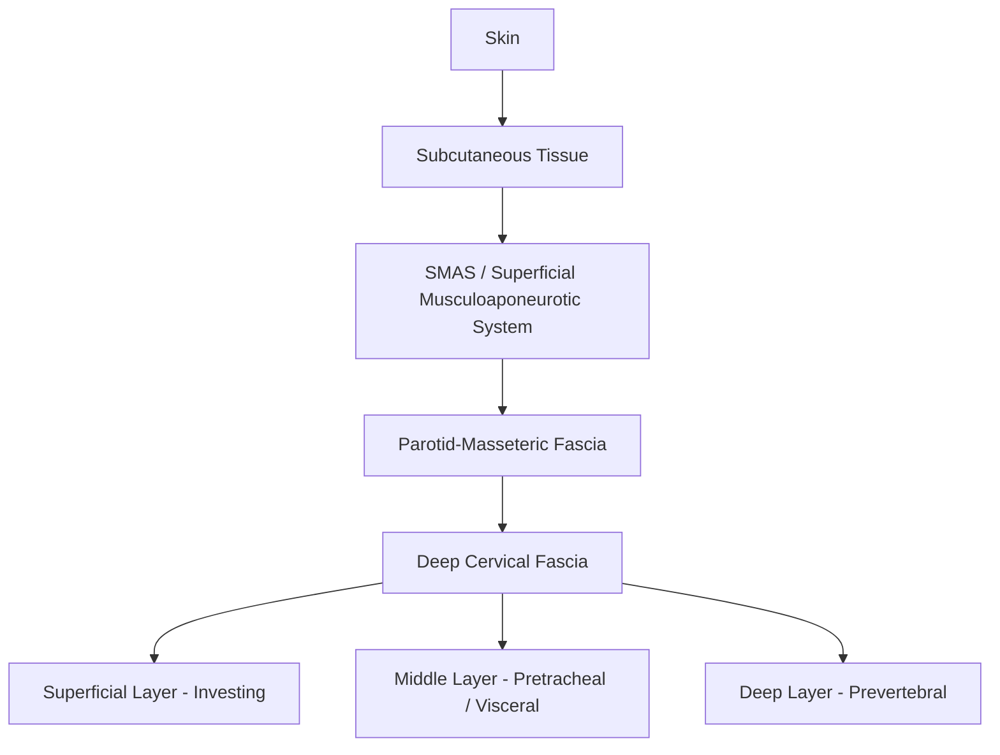
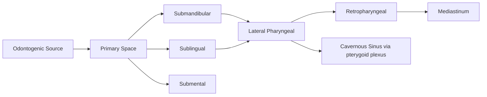

# Chapter 1: Surgical Anatomy of the Maxillofacial Complex

*Applied surgical anatomy: osseous, neurovascular, muscular, and fascial planes essential for safe operative access and dissection.*

---

## 1.1 Introduction

Mastery of surgical anatomy is the irreducible prerequisite for every operative procedure in oral and maxillofacial surgery. Unlike cadaver-oriented descriptive anatomy, surgical anatomy is organized around **operative approaches**: which structures are encountered during a particular access, what must be protected, and where bleeding or neural injury becomes probable. This chapter synthesizes the osseous, neurovascular, muscular, and fascial-plane anatomy of the maxillofacial complex in a framework directly applicable to the operating room.

!!! tip "Clinical Pearl"
    Anatomy textbooks describe structures in isolation; the OMS surgeon must understand anatomy in the context of **tissue planes under tension**. The plane you develop with a periosteal elevator is defined by the attachment density of periosteum to bone, which varies by region (e.g., firmly adherent at the linea obliqua vs. loosely attached over the buccal shelf).

---

## 1.2 Osseous Anatomy of the Maxillofacial Skeleton

### 1.2.1 The Mandible

The mandible is the largest and strongest bone of the facial skeleton. Surgically, it is divided into functional subunits:

| Region | Key Features | Surgical Relevance |
|---|---|---|
| **Symphysis / Parasymphysis** | Mental protuberance, genial tubercles, mental foramen | Bone graft harvest (chin graft), fracture plating, genioplasty |
| **Body** | External oblique ridge, submandibular fossa, mylohyoid line | Third molar surgery, submandibular gland access |
| **Angle** | Masseter attachment (lateral), medial pterygoid attachment (medial), lingula | Angle fractures (Champy zone of ideal osteosynthesis), sagittal split osteotomy |
| **Ramus** | Coronoid process, mandibular notch, condylar process | BSSO, condylectomy, coronoidectomy |
| **Condyle** | Articular surface (fibrocartilage), condylar neck | TMJ surgery, subcondylar fracture ORIF |

The **inferior alveolar canal** traverses the body from the mandibular foramen (located at the mid-ramus, approximately at the level of the occlusal plane relative to the lingula) to the mental foramen, typically between the apices of the first and second premolars. CBCT studies demonstrate significant anatomical variation in canal position, particularly the anterior loop, which extends 0-6 mm anterior to the mental foramen in up to 60% of patients (Greenstein & Tarnow, *J Periodontol* 2006;77:1474-1490).

!!! warning "Surgical Caution"
    The **retromolar trigone** area often harbors an accessory mental foramen or a retromolar foramen (present in 8-12% of patients per CBCT studies) that can cause unexpected bleeding during third molar surgery or ramus harvest (Ossenberg, *Am J Phys Anthropol* 1987;73:119-128).

**Biomechanical considerations**: The mandible functions as a stress-bearing beam. Champy's lines of ideal osteosynthesis (Champy et al., *J Maxillofac Surg* 1978;6:14-21) define two tension zones:

- **Superior border** (alveolar crest): tension zone -- requires a single miniplate along the external oblique ridge for angle fractures
- **Inferior border**: compression zone -- load-sharing reconstruction plates required for comminuted or pathologic fractures

### 1.2.2 The Maxilla

The maxilla is a paired pneumatized bone contributing to the orbit, nasal cavity, palate, and alveolar process. Surgically relevant anatomy includes:

- **Buttress system**: Three paired vertical buttresses (nasomaxillary, zygomaticomaxillary, pterygomaxillary) and three horizontal buttresses (frontal bar, infraorbital rim, palatal/alveolar) transmit masticatory forces to the skull base. Fracture patterns (Le Fort I, II, III) follow disruption of specific buttress combinations (Manson et al., *Plast Reconstr Surg* 1986;77:9-16).
- **Le Fort I osteotomy plane**: The cut passes above the apices of the maxillary teeth, through the lateral nasal wall, and across the pterygomaxillary junction. The descending palatine artery exits the greater palatine foramen approximately 15 mm from the midline at the level of the second/third molar and must be preserved or controlled during downfracture (Bell, *J Oral Surg* 1975;33:412-426).
- **Maxillary sinus**: The floor lies in intimate relation to the premolar and molar apices. Average bone thickness at the sinus floor is 0.5-2 mm, predisposing to oroantral communications during extraction (CDT D7261 -- primary closure of sinus perforation).

### 1.2.3 The Orbit

The orbit is a pyramidal structure formed by seven bones. Surgically critical features:

- **Orbital floor**: Thin bone (0.5 mm) overlying the infraorbital canal and maxillary sinus. Blowout fractures typically involve the posteromedial floor, where bone is thinnest (the "trapdoor" region in pediatric patients). ICD-10: S02.3XXA (orbital floor fracture, initial encounter).
- **Medial wall (lamina papyracea)**: The thinnest wall (0.2-0.4 mm), easily violated during ethmoid surgery or orbital decompression. The anterior and posterior ethmoidal foramina mark the position of the corresponding arteries, which are branches of the ophthalmic artery.
- **Infraorbital foramen**: Located 6-10 mm below the inferior orbital rim, in line with the pupil. Houses V2 (infraorbital nerve). Subciliary, subtarsal, and transconjunctival incisions must account for this anatomy.

!!! danger "Critical Safety"
    The **posterior ethmoidal artery** lies within 5-7 mm of the optic canal. Aggressive posterior dissection along the medial orbital wall risks optic nerve injury or retrobulbar hemorrhage. If retrobulbar hemorrhage develops intraoperatively, immediate lateral canthotomy and inferior cantholysis are required to prevent irreversible vision loss within 60-90 minutes (Perry et al., *Surv Ophthalmol* 2014;59:443-462).

### 1.2.4 The Zygoma and Zygomatic Arch

The zygoma (malar bone) is a tetrapod structure with four articulations (frontal, temporal, maxillary, sphenoid). The **Zingg classification** (Zingg et al., *J Oral Maxillofac Surg* 1992;50:778-790) categorizes zygomatic fractures by the number of fractured buttresses. Surgical access requires knowledge of the **zygomaticofacial** and **zygomaticotemporal** neurovascular bundles.

---

## 1.3 Neurovascular Anatomy

### 1.3.1 Trigeminal Nerve (CN V)

The trigeminal nerve provides sensory innervation to the face and motor innervation to the muscles of mastication. Its three divisions are encountered constantly in OMS surgery.

#### V1 -- Ophthalmic Division

Exits the skull via the superior orbital fissure. Surgical relevance:

- **Supraorbital nerve**: Exits via supraorbital notch/foramen, approximately 27 mm from midline. At risk during coronal flap elevation, frontal sinus fracture repair, and brow lift procedures.
- **Supratrochlear nerve**: Exits approximately 17 mm from midline, medial to the supraorbital nerve.
- **Lacrimal, frontal, nasociliary** branches provide orbital and nasal sensory innervation.

#### V2 -- Maxillary Division

Exits the skull via foramen rotundum, traverses the pterygopalatine fossa, and enters the orbit as the infraorbital nerve.

- **Infraorbital nerve**: Courses through the infraorbital canal (roof of maxillary sinus) and exits the infraorbital foramen. At risk during Le Fort I/II osteotomy, orbital floor repair, and zygoma ORIF. Provides sensation to the midface, upper lip, and lateral nose.
- **Posterior superior alveolar nerve**: Branches from V2 in the pterygopalatine fossa and enters the posterior maxilla via small foramina on the infratemporal surface. The PSA nerve block targets this region.
- **Greater and lesser palatine nerves**: Exit the greater and lesser palatine foramina, respectively. The greater palatine nerve block provides palatal anesthesia posterior to the canine.

#### V3 -- Mandibular Division

Exits the skull via foramen ovale. This is the only division with both sensory and motor components.

- **Inferior alveolar nerve (IAN)**: Enters the mandibular foramen (with the inferior alveolar artery) and traverses the mandibular canal. The IAN block (Halsted technique) remains the most common nerve block in dentistry. Risk of permanent IAN injury during third molar surgery is 0.4-0.8% (Renton & Yilmaz, *Int J Oral Maxillofac Surg* 2012;41:1509-1518). ICD-10: S04.5XXA (injury to trigeminal nerve).
- **Lingual nerve**: Courses along the floor of the mouth, medial to the third molar region, where it lies submucosal and unprotected in 17.6% of patients (Pogrel et al., *J Oral Maxillofac Surg* 1995;53:1178-1181). At greatest risk during lingual flap retraction and third molar surgery. The nerve loops beneath the submandibular duct (Wharton's duct) before entering the tongue.
- **Mental nerve**: Terminal branch of the IAN, exits the mental foramen. At risk during chin graft harvest, implant placement in the premolar region, and vestibuloplasty.
- **Long buccal nerve**: Crosses the anterior border of the ramus at the level of the occlusal plane. Provides buccal gingival and cheek sensation. Its block supplements the IAN block for mandibular molar procedures.
- **Auriculotemporal nerve**: Courses posterior to the condylar neck, intimately associated with the superficial temporal vessels. At risk during preauricular TMJ approaches and condylar surgery.

!!! tip "Clinical Pearl"
    The lingual nerve lies an average of **2.06 mm below the alveolar crest** and **0.58 mm medial to the lingual plate** at the third molar region (Behnia et al., *J Oral Maxillofac Surg* 2000;58:649-651). This proximity explains its vulnerability during periosteal elevation on the lingual aspect of third molars.

### 1.3.2 Facial Nerve (CN VII)

The facial nerve is the motor nerve to the muscles of facial expression and is at risk in virtually every OMS approach to the lateral face.

**Intratemporal course**: After exiting the brainstem, CN VII traverses the internal auditory canal, the labyrinthine segment (site of the geniculate ganglion), the tympanic segment, and the mastoid segment before exiting the skull at the **stylomastoid foramen**.

**Extratemporal course**: After exiting the stylomastoid foramen, the nerve enters the parotid gland and divides into two main trunks (temporofacial and cervicofacial) before forming five terminal branches:

| Branch | Motor Function | Surgical Risk |
|---|---|---|
| **Temporal (frontal)** | Frontalis, orbicularis oculi (upper) | Coronal flap, zygomatic arch approaches |
| **Zygomatic** | Orbicularis oculi (lower), zygomaticus | Midface approaches, parotidectomy |
| **Buccal** | Buccinator, orbicularis oris (upper) | Parotidectomy, buccal fat pad access |
| **Marginal mandibular** | Lower lip depressors, mentalis | Submandibular approach, face-lift, mandible plating |
| **Cervical** | Platysma | Neck dissection, submandibular approach |

**The temporal branch** is most vulnerable as it crosses the zygomatic arch. It lies within the **temporoparietal fascia (superficial temporal fascia)** and is at risk when dissecting superficial to the deep temporal fascia. The safe zone for zygomatic arch access is **subperiosteal dissection** from below or dissection deep to the deep temporal fascia from above.

!!! danger "Critical Safety"
    The **marginal mandibular branch** dips below the inferior border of the mandible in 19-20% of cadaver dissections (Dingman & Grabb, *Plast Reconstr Surg* 1962;29:266-272), traveling as far as 1-2 cm inferior to the mandibular border. During the submandibular (Risdon) approach, the incision should be placed at least 2 cm below the mandibular angle, and the platysma should be elevated with the superficial layer to protect this nerve. Alternatively, staying deep to the facial artery/vein and pterygomasseteric sling after initial skin incision protects the nerve.

### 1.3.3 Vascular Supply

#### Arterial Supply

The external carotid artery (ECA) and its branches supply the majority of the maxillofacial region:

- **Facial artery**: Crosses the mandibular body anterior to the masseter muscle. Provides the superior and inferior labial arteries, angular artery, and submental artery. Key landmark for submandibular incisions.
- **Maxillary artery**: The larger terminal branch of the ECA, divided into three parts by its relationship to the lateral pterygoid muscle:
    - **First part (mandibular)**: Middle meningeal artery, inferior alveolar artery
    - **Second part (pterygoid)**: Deep temporal, masseteric, buccal arteries
    - **Third part (pterygopalatine)**: Descending palatine, sphenopalatine, infraorbital, posterior superior alveolar arteries
- **Superficial temporal artery**: Courses with the auriculotemporal nerve anterior to the ear. Used as a pedicle for temporalis flaps and temporoparietal fascial flaps.

#### Dangerous Hemorrhage Zones

- **Pterygoid venous plexus**: Dense valveless venous network in the infratemporal fossa. Risk of life-threatening hemorrhage during Le Fort I downfracture, particularly with pterygomaxillary disjunction (Lanigan et al., *Br J Oral Maxillofac Surg* 1990;28:367-379).
- **Descending palatine artery**: At risk during Le Fort I osteotomy. If transected, hemorrhage can be controlled by packing the greater palatine canal with bone wax or Surgicel, or by electrocoagulation.
- **Retromandibular vein**: Located within the parotid gland, formed by the confluence of the superficial temporal and maxillary veins. At risk during parotid and preauricular approaches.

---

## 1.4 Muscles of Mastication and Facial Expression

### 1.4.1 Muscles of Mastication

All four muscles of mastication are innervated by **V3** (motor root of the mandibular division):

| Muscle | Origin | Insertion | Action | Surgical Relevance |
|---|---|---|---|---|
| **Masseter** | Zygomatic arch | Lateral ramus/angle | Elevation, protrusion | Peeled during BSSO; masseter hypertrophy (botulinum toxin Tx) |
| **Temporalis** | Temporal fossa | Coronoid process | Elevation, retrusion | Coronoidectomy, temporalis flap for orbital/maxillary reconstruction |
| **Medial pterygoid** | Pterygoid fossa, tuberosity | Medial ramus/angle | Elevation, protrusion, lateral movement | Split during BSSO; vector pulls proximal segment anteromedially |
| **Lateral pterygoid** | Superior head: infratemporal surface of sphenoid; Inferior head: lateral pterygoid plate | Superior: articular disc/capsule; Inferior: pterygoid fovea | Opening, protrusion, contralateral deviation | Superior head function in disc dynamics; at risk during condylectomy |

The **suprahyoid muscles** (mylohyoid, geniohyoid, anterior digastric) depress the mandible and elevate the hyoid. Their attachments at the genial tubercles are relevant for genioglossus advancement (CPT 21199) in obstructive sleep apnea surgery.

### 1.4.2 Muscles of Facial Expression

All innervated by **CN VII**. Key muscles for OMS surgery:

- **Orbicularis oris**: Sphincter of the mouth. Disrupted in cleft lip repair and must be meticulously reconstructed to restore function and aesthetics.
- **Buccinator**: Deep to the buccal fat pad, pierced by the parotid duct (Stensen's duct) at the level of the maxillary second molar. Relevant during buccal flap design and parotid duct repair.
- **Mentalis**: Originates from the incisive fossa. Must be carefully reattached during chin procedures (genioplasty, chin graft) to prevent ptosis ("witch's chin" deformity).
- **Frontalis**: Elevates the eyebrows. Paralysis from temporal branch injury produces brow ptosis and inability to wrinkle the forehead.

---

## 1.5 Fascial Planes and Spaces of the Head and Neck

Understanding fascial planes is critical for both surgical access (developing avascular planes) and managing the spread of odontogenic infections.

### 1.5.1 Fascial Layers

- **SMAS (Superficial Musculoaponeurotic System)**: A fibromuscular layer continuous with the platysma inferiorly and the temporoparietal fascia superiorly. In the face, it envelops the muscles of facial expression. The **facial nerve branches travel on the deep surface of the SMAS** (i.e., between the SMAS and the parotid-masseteric fascia). Dissection superficial to the SMAS is "safe" from facial nerve injury. This principle underlies the rhytidectomy (face-lift) sub-SMAS dissection plane.
- **Deep temporal fascia**: Overlies the temporalis muscle. Splits into superficial and deep layers at the zygomatic arch, enclosing a fat pad (the **superficial temporal fat pad**, distinct from the buccal fat pad). The temporal branch of CN VII runs within or superficial to the temporoparietal fascia, which is superficial to the deep temporal fascia.
- **Investing layer of deep cervical fascia**: Encloses the sternocleidomastoid and trapezius. Forms the roof of the posterior triangle. The submandibular gland is enclosed between the superficial and deep layers of this fascia.

### 1.5.2 Fascial Spaces -- Odontogenic Infection Spread

The fascial spaces of the head and neck are potential spaces filled with loose areolar tissue that can become distended by purulent material. Their interconnections allow rapid spread of infection.

**Primary spaces** (directly related to teeth):

- **Vestibular (buccal/labial)**: Most common space involved. Infection from any tooth perforating the buccal cortex above (maxilla) or below (mandible) muscle attachments.
- **Submental**: Infection from mandibular incisors perforating the lingual cortex below the mentalis/mylohyoid attachment.
- **Submandibular**: Infection from mandibular molars perforating the lingual cortex below the mylohyoid line. The most commonly involved deep space in odontogenic infections (Flynn et al., *J Oral Maxillofac Surg* 2006;64:1104-1110).
- **Sublingual**: Infection from premolars/molars perforating the lingual cortex above the mylohyoid line.
- **Canine (infraorbital)**: Infection from the maxillary canine, which has a long root apex above the levator labii superioris insertion.

**Secondary spaces** (infection spreads from primary spaces):

- **Masseteric**: Between masseter and ramus. Causes trismus.
- **Pterygomandibular**: Between medial pterygoid and ramus. Contains the IAN and lingual nerve. Causes trismus with minimal external swelling.
- **Infratemporal**: Deep to the lateral pterygoid plate. Can spread to the cavernous sinus via the pterygoid venous plexus.
- **Lateral pharyngeal (parapharyngeal)**: Lateral to the superior pharyngeal constrictor. Divided by the styloid process into anterior (muscular) and posterior (neurovascular) compartments. The posterior compartment contains the internal carotid artery, internal jugular vein, CN IX, X, XI, XII.
- **Retropharyngeal**: Between the visceral and prevertebral fasciae. Extends from the skull base to the posterior mediastinum. This is the "danger space" for mediastinal spread of odontogenic infection.

!!! danger "Critical Safety"
    **Ludwig angina** is a bilateral infection of the submandibular, sublingual, and submental spaces. It is a surgical emergency due to rapid airway compromise from tongue elevation and supraglottic edema. Management requires emergent airway control (awake fiberoptic intubation or surgical airway), IV antibiotics, and surgical drainage. Mortality was >50% in the pre-antibiotic era; current mortality is 4-10% with aggressive management (Costain & Marrie, *Medicine* 2011;90:81-89). ICD-10: K12.2 (cellulitis and abscess of mouth).

---

## 1.6 Surgical Approaches to the Maxillofacial Skeleton

### 1.6.1 Upper Face and Orbit

- **Coronal (bicoronal) flap**: Provides wide exposure from zygomatic arch to zygomatic arch, including the frontal bone, orbital rims, nasal dorsum, and zygomatic arches. The incision is made within the hair-bearing scalp, from ear to ear. Dissection proceeds in the **subgaleal (sub-SMAS)** plane until 2-3 cm above the orbital rims, where the dissection transitions to a **subperiosteal** plane to protect the supraorbital neurovascular bundle and temporal branch of CN VII. CPT 21431 (closed treatment of craniofacial separation with interdental fixation) or CPT 21454 (open treatment of mandibular fracture) may be billed depending on the procedure.

- **Transconjunctival approach**: Provides access to the orbital floor and medial wall without a visible scar. The incision is made through the conjunctiva, 2-3 mm below the inferior tarsal border, in a **preseptal** or **retroseptal** plane. A lateral canthotomy may be added for additional exposure. Lower risk of ectropion compared to subciliary approach (Appling et al., *Arch Facial Plast Surg* 2003;5:16-20).

- **Subciliary approach**: Incision placed 2 mm below the lash line, with dissection through the orbicularis oculi in a **skin-muscle flap** or **stepped (skin flap then muscle)** technique. Higher rate of ectropion and scleral show compared to transconjunctival approach.

### 1.6.2 Midface

- **Vestibular (intraoral) approach**: The workhorse approach for Le Fort I osteotomy, zygoma ORIF, anterior maxillary wall access, and sinus surgery. Incision is placed in the maxillary vestibule, 5-7 mm above the mucogingival junction, preserving attached gingiva for closure. The infraorbital nerve is identified and protected.

- **Weber-Fergusson approach**: Extended lateral rhinotomy with upper lip split for access to the maxilla, pterygopalatine fossa, and infratemporal fossa. Used for maxillectomy (CPT 31225 -- partial maxillectomy) in tumor resection.

### 1.6.3 Mandible

- **Intraoral vestibular approach**: Used for symphysis/parasymphysis fracture ORIF, genioplasty, and anterior mandible pathology. The mental nerve must be identified and preserved.

- **Submandibular (Risdon) approach**: Incision placed 1.5-2 cm below the inferior border of the mandible in a skin crease. Dissection proceeds through skin, subcutaneous tissue, platysma, and the investing fascia of the deep cervical fascia. The marginal mandibular nerve is protected by dissecting deep to the superficial layer of the deep cervical fascia (Hayes-Martin maneuver: retracting the submandibular gland inferiorly with the platysma flap). Indicated for mandibular angle and body fractures, submandibular gland excision, and vascularized free flap inset.

- **Retromandibular (Hinds) approach**: Incision posterior to the ramus, 0.5 cm below the earlobe to the angle. Provides direct access to the ramus and subcondylar region through the parotid gland (transparotid dissection). Risk of facial nerve injury is higher than with other approaches but provides excellent visualization for subcondylar fracture plating.

- **Preauricular approach**: Incision placed in the preauricular skin crease or tragal margin. Provides access to the TMJ, condylar head, and zygomatic arch. The dissection plane is through the superficial lobe of the parotid, avoiding the temporal branch. Used for open TMJ surgery (CPT 21240 -- arthroplasty), condylectomy, and condylar fracture treatment.

### 1.6.4 Neck

- **Tracheotomy**: Typically performed through a horizontal incision at the level of the second tracheal ring, midway between the cricoid cartilage and the sternal notch. The thyroid isthmus may need to be retracted or divided. CPT 31600 (tracheostomy, planned). In emergency situations, cricothyrotomy (CPT 31605) is performed through the cricothyroid membrane.

---

## 1.7 Surgical Danger Zones

A systematic summary of the critical danger zones encountered during maxillofacial surgery:

| Zone | Structure at Risk | Approach/Procedure | Protection Strategy |
|---|---|---|---|
| Temporal region (above zygomatic arch) | Temporal branch of CN VII | Coronal flap, zygomatic arch repair | Dissect deep to deep temporal fascia (Abul-Hassan modification) |
| Inferior border of mandible (1-2 cm below) | Marginal mandibular branch of CN VII | Submandibular approach | Hayes-Martin maneuver; incise 2 cm below angle |
| Third molar lingual plate | Lingual nerve | Third molar extraction | Avoid lingual flap retraction; careful elevator use |
| Mandibular canal | IAN | Implant placement, third molar extraction | Preoperative CBCT; coronectomy if root-canal intimate |
| Pterygomaxillary junction | Maxillary artery, pterygoid venous plexus | Le Fort I osteotomy | Curved osteotome directed medially; controlled downfracture |
| Orbital floor (posteromedial) | Infraorbital nerve, orbital contents | Orbital floor repair | Posterior dissection limit: posterior ledge or 30 mm from rim |
| Posterior orbital wall | Optic nerve | Orbital decompression | Identify posterior ethmoidal foramen as landmark |
| Retropharynx | Internal carotid artery | Lateral pharyngeal space drainage | CT angiography preoperatively; finger-guided drainage |

---

## 1.8 Flap Design Principles

### 1.8.1 Local Flaps

All flap design in the oral cavity follows fundamental principles:

- **Blood supply**: The base of the flap must be wider than or equal to the apex (for random-pattern flaps). Axial-pattern flaps (e.g., facial artery musculomucosal flap, FAMM) can have a narrower base because they contain a named vessel.
- **Tension-free closure**: Periosteal releasing incisions at the base of the mucoperiosteal flap allow tension-free advancement. For buccal flaps, the incision is made through the periosteum only (not the muscle or mucosa superficial to it).
- **Full-thickness mucoperiosteal flaps**: Standard for most intraoral OMS procedures. The incision is made to bone, and periosteum is elevated with the mucosa as a single unit.
- **Papilla preservation**: Whenever possible, vertical releasing incisions should be placed at line angles of teeth (not through interdental papillae) to preserve blood supply and prevent gingival defects.

### 1.8.2 Regional and Distant Flaps

- **Temporalis muscle flap**: Pedicled on the deep temporal arteries (from the maxillary artery). Used for reconstruction of maxillary, orbital, and skull base defects. Can be rotated through the zygomatic arch or coronoid process after coronoidectomy.
- **Submental artery island flap**: Pedicled on the submental artery (branch of the facial artery). Provides thin, pliable skin for intraoral and lower face reconstruction. Oncologic safety concern for level IA lymph node basin in oral cavity cancer (Howard et al., *Head Neck* 2014;36:1197-1203).
- **Buccal fat pad flap**: The buccal fat pad (Bichat's fat pad) is a reliable pedicled flap for closure of oroantral fistulae, small palatal defects, and coverage of exposed bone grafts. It epithelializes within 2-3 weeks (Tideman et al., *J Oral Maxillofac Surg* 1986;44:238-244).

---

## 1.9 Wound Healing and Bone Biology

### 1.9.1 Soft Tissue Wound Healing

Wound healing proceeds through four overlapping phases:

1. **Hemostasis** (minutes): Platelet aggregation, fibrin clot formation
2. **Inflammation** (days 1-5): Neutrophil and macrophage infiltration, debridement
3. **Proliferation** (days 5-21): Granulation tissue, angiogenesis, epithelialization, fibroplasia
4. **Remodeling** (3 weeks to 1 year): Collagen maturation, scar contraction (wound achieves ~80% of original tensile strength by 3 months)

!!! tip "Clinical Pearl"
    Intraoral wounds heal faster and with less scarring than cutaneous wounds due to the presence of saliva (containing EGF, FGF, and other growth factors), higher vascularity, and the presence of oral stem cells in the lamina propria (Sciubba et al., *J Oral Pathol Med* 2003).

**Factors impairing wound healing**:

- Diabetes mellitus (microvascular disease, impaired neutrophil function)
- Radiation therapy (endarteritis obliterans, fibrosis, hypocellularity -- "3 H's": hypoxic, hypovascular, hypocellular)
- Tobacco use (nicotine-mediated vasoconstriction, carbon monoxide-reduced oxygen carrying capacity)
- Bisphosphonates/denosumab (osteoclast suppression impairs bone remodeling)
- Corticosteroids (suppress inflammatory phase)

### 1.9.2 Bone Healing

Bone healing after fracture or osteotomy occurs through two mechanisms:

**Primary (direct) bone healing**: Occurs when bone fragments are rigidly fixated with absolute stability (compression plating). Cutting cones of osteoclasts cross the fracture line directly, followed by osteoblast-mediated lamellar bone formation. No callus is formed. This is the goal of lag screw fixation and compression plating (AO/ASIF principles) (Perren, *Injury* 2002;33 Suppl 2:B22-B32).

**Secondary (indirect) bone healing**: Occurs when there is relative stability (semi-rigid fixation with miniplates, external fixation, or functional treatment). Proceeds through intramembranous and endochondral ossification:

1. Hematoma formation
2. Inflammatory response
3. Soft callus (fibrocartilage)
4. Hard callus (woven bone via endochondral ossification)
5. Remodeling (woven bone to lamellar bone -- Wolff's law)

### 1.9.3 Osseointegration

Defined by Branemark as "a direct structural and functional connection between ordered, living bone and the surface of a load-carrying implant" (Branemark et al., *Scand J Plast Reconstr Surg Suppl* 1977;16:1-132). The process involves:

1. **Blood clot formation** around the implant
2. **Woven bone deposition** by osteoblasts migrating from the surrounding bone (contact osteogenesis) or from the implant surface (distance osteogenesis)
3. **Lamellar bone remodeling** over 3-6 months
4. **Functional adaptation** under loading (Wolff's law)

Factors affecting osseointegration:

- **Implant surface**: Roughened (SLA, TiUnite) surfaces increase bone-to-implant contact (BIC) compared to machined surfaces. Current evidence supports moderately rough surfaces (Sa 1.0-2.0 um) as optimal (Wennerberg & Albrektsson, *Clin Oral Implants Res* 2009;20 Suppl 4:169-184).
- **Primary stability**: Insertion torque of 30-45 Ncm is generally recommended for immediate/early loading protocols.
- **Thermal injury**: Bone necrosis occurs at sustained temperatures >47 degrees C (Eriksson & Albrektsson, *J Prosthet Dent* 1983;50:101-107). Copious irrigation during osteotomy preparation is essential.
- **Loading protocol**: Immediate loading (within 48 hours), early loading (1-8 weeks), and conventional loading (3-6 months) are all supported by current evidence in selected cases (Esposito et al., *Cochrane Database Syst Rev* 2013).

### 1.9.4 Biomechanics of the Maxillofacial Skeleton

Understanding biomechanical loading is essential for fracture fixation and reconstruction:

- **Mandible**: The mandible functions as a Class III lever during mastication. Maximum bite force is generated at the first molar region (approximately 400-700 N). The condyles serve as the fulcrum, the muscles of mastication provide the effort, and the occlusion provides the resistance.
- **AO/ASIF principles**: Applied to maxillofacial fixation:
    1. Anatomic reduction
    2. Stable (rigid) internal fixation
    3. Preservation of blood supply
    4. Early, active mobilization
- **Load-bearing vs. load-sharing fixation**: Load-bearing plates (reconstruction plates, 2.4-2.7 mm) are used when bone continuity is lost (comminuted fractures, segmental defects). Load-sharing plates (miniplates, 2.0 mm) are used when bone can share the mechanical load (simple fractures with intact cortices on both sides).

!!! tip "Clinical Pearl"
    Champy's technique for angle fractures uses a single **2.0 mm non-compression miniplate along the external oblique ridge** (tension band principle). This technique has equivalent outcomes to bicortical fixation with a 2.0/2.4 mm plate at the inferior border for most simple angle fractures, with lower complication rates (Ellis, *J Oral Maxillofac Surg* 1999;57:62-73).

---

## 1.10 Key Anatomical Measurements for the OMS Surgeon

A practical reference of frequently needed anatomical measurements:

| Measurement | Value | Reference |
|---|---|---|
| Mental foramen position | Between PM1-PM2 apices, 50% of mandibular height | Tebo & Telford, 1950 |
| IAN anterior loop length | 0-6 mm (mean 1-2 mm) | Arzouman et al., 1993 |
| Lingual nerve to alveolar crest (3rd molar) | 2.06 mm (mean) | Behnia et al., 2000 |
| Marginal mandibular nerve below mandible | 0-1.8 cm (mean 0.63 cm) | Dingman & Grabb, 1962 |
| Infraorbital foramen below orbital rim | 6-10 mm | Aziz et al., 2000 |
| Supraorbital notch from midline | 27 mm (mean) | Saylam et al., 2003 |
| Greater palatine foramen from midline | 15 mm (at 2nd-3rd molar level) | Ajmani, 1994 |
| Parotid duct course | Middle third line from tragus to mid-upper lip | Stensen, 1662 |

---

## 1.11 Summary

The maxillofacial complex presents one of the most anatomically dense regions in the human body, with critical neurovascular structures separated by millimeters from routine operative sites. The OMS surgeon must maintain a three-dimensional mental map of the relationships between osseous landmarks, neurovascular structures, fascial planes, and muscle attachments. This knowledge forms the foundation for every subsequent chapter in this textbook, from dentoalveolar surgery to craniofacial reconstruction.

---

## References

1. Behnia H, Kheradvar A, Shahrokhi M. An anatomic study of the lingual nerve in the third molar region. *J Oral Maxillofac Surg*. 2000;58(6):649-651.
2. Bell WH. Le Fort I osteotomy for correction of maxillary deformities. *J Oral Surg*. 1975;33(6):412-426.
3. Branemark PI, Hansson BO, Adell R, et al. Osseointegrated implants in the treatment of the edentulous jaw. *Scand J Plast Reconstr Surg Suppl*. 1977;16:1-132.
4. Champy M, Lodde JP, Schmitt R, Jaeger JH, Muster D. Mandibular osteosynthesis by miniature screwed plates via a buccal approach. *J Maxillofac Surg*. 1978;6(1):14-21.
5. Costain N, Marrie TJ. Ludwig's angina. *Am J Med*. 2011;124(2):115-117.
6. Dingman RO, Grabb WC. Surgical anatomy of the mandibular ramus of the facial nerve based on the dissection of 100 facial halves. *Plast Reconstr Surg*. 1962;29(3):266-272.
7. Ellis E III. Treatment of mandibular angle fractures using the AO reconstruction plate. *J Oral Maxillofac Surg*. 1999;57(1):62-73.
8. Eriksson AR, Albrektsson T. Temperature threshold levels for heat-induced bone tissue injury. *J Prosthet Dent*. 1983;50(1):101-107.
9. Flynn TR, Shanti RM, Levi MH, et al. Severe odontogenic infections, part 1: prospective report. *J Oral Maxillofac Surg*. 2006;64(7):1093-1103.
10. Greenstein G, Tarnow D. The mental foramen and nerve: clinical and anatomical factors related to dental implant placement. *J Periodontol*. 2006;77(12):1474-1490.
11. Lanigan DT, Hey JH, West RA. Major vascular complications of orthognathic surgery: hemorrhage associated with Le Fort I osteotomies. *J Oral Maxillofac Surg*. 1990;48(6):561-573.
12. Manson PN, Crawley WA, Yaremchuk MJ, et al. Midface fractures: advantages of immediate extended open reduction and bone grafting. *Plast Reconstr Surg*. 1985;76(1):1-12.
13. Perren SM. Evolution of the internal fixation of long bone fractures. *J Bone Joint Surg Br*. 2002;84(8):1093-1110.
14. Perry M, Dancey A, Mireskandari K, et al. Emergency care in facial trauma -- a maxillofacial and ophthalmic perspective. *Injury*. 2005;36(8):875-896.
15. Pogrel MA, Renaut A, Schmidt B, et al. The relationship of the lingual nerve to the mandibular third molar region. *J Oral Maxillofac Surg*. 1995;53(10):1178-1181.
16. Renton T, Yilmaz Z. Managing iatrogenic trigeminal nerve injury: a case series and review of the literature. *Int J Oral Maxillofac Surg*. 2012;41(5):629-637.
17. Tideman H, Bosanquet A, Scott J. Use of the buccal fat pad as a pedicled graft. *J Oral Maxillofac Surg*. 1986;44(6):435-440.
18. Wennerberg A, Albrektsson T. Effects of titanium surface topography on bone integration. *Clin Oral Implants Res*. 2009;20 Suppl 4:169-184.
19. Zingg M, Laedrach K, Chen J, et al. Classification and treatment of zygomatic fractures: a review of 1,025 cases. *J Oral Maxillofac Surg*. 1992;50(8):778-790.
