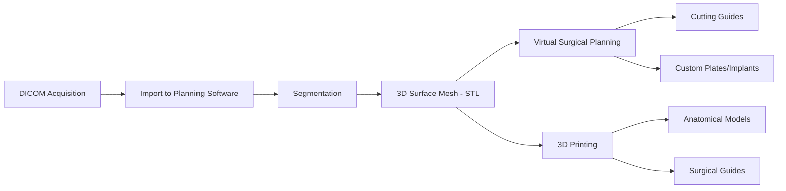

# Chapter 2: Radiographic Imaging and Diagnosis

*CBCT principles and interpretation, medical CT protocols, MRI indications, panoramic radiography, cephalometric analysis, AI-assisted image segmentation, and radiation safety for the OMS surgeon.*

---

## 2.1 Introduction

Diagnostic imaging is the second pillar of surgical practice after clinical examination. The OMS surgeon must be competent in ordering, interpreting, and integrating multiple imaging modalities -- from conventional panoramic radiographs through cone-beam computed tomography (CBCT), medical CT, and MRI. This chapter covers the physics, indications, interpretation, and emerging technologies (including AI-based analysis) that define modern maxillofacial imaging.

!!! tip "Clinical Pearl"
    The choice of imaging modality should follow the ALARA principle (As Low As Reasonably Achievable) and the **selection criteria** guidelines published by the ADA/FDA (2012) and AAOMS ParCare. A panoramic radiograph remains the screening standard for most dentoalveolar pathology; CBCT is reserved for cases where three-dimensional information will change the treatment plan.

---

## 2.2 Panoramic Radiography

### 2.2.1 Physics and Image Formation

The panoramic radiograph (orthopantomogram, OPG) uses **rotational tomography** to produce a single two-dimensional image of both jaws, the TMJs, and portions of the maxillary sinuses. The X-ray source and detector rotate synchronously around the patient's head along a programmed trajectory. The resultant image represents a curved **focal trough** -- a three-dimensional zone (typically 15-20 mm wide in the molar region) within which structures are reasonably sharp.

**Effective dose**: 14-24 microSv (approximately equivalent to 1-2 days of background radiation).

### 2.2.2 Interpretation Pearls

| Structure | Normal Finding | Pathological Variants |
|---|---|---|
| **Mandibular canal** | Well-corticated radiolucent band from lingula to mental foramen | Loss of cortication suggests pathology (ameloblastoma, keratocyst invasion) |
| **Maxillary sinus** | Bilateral pneumatized with thin mucosal lining (not visible on panoramic) | Mucosal thickening, air-fluid level (sinusitis), dome-shaped opacity (mucous retention cyst vs. polyp), radiopacity (odontogenic sinusitis, fungal ball) |
| **Condyles** | Smooth cortical outline, symmetric | Flattening (degenerative joint disease), erosion (rheumatoid, psoriatic arthritis), osteophytes, resorption (idiopathic condylar resorption) |
| **Inferior alveolar canal** | Smooth, bilateral, symmetric | Deviation/displacement by lesion, widening (perineural spread of malignancy) |

### 2.2.3 Limitations

- **Geometric distortion**: Magnification (approximately 20-30%) and unequal magnification between left and right sides
- **Superimposition**: The cervical spine superimposes on the anterior region; the contralateral ramus ghosts into the opposite side
- **Focal trough**: Structures outside the focal trough are blurred and distorted
- **Soft tissue**: No soft tissue detail
- **3D information**: No cross-sectional data -- buccal-lingual dimension is collapsed

!!! warning "Surgical Caution"
    Never rely solely on a panoramic radiograph for implant planning. The magnification factor varies by location and machine, and the buccal-lingual bone dimension -- critical for implant diameter selection -- cannot be assessed. CBCT is the standard of care for pre-implant imaging when clinical examination suggests limited bone width or proximity to vital structures (Tyndall et al., *Oral Surg Oral Med Oral Pathol Oral Radiol* 2012;113:817-826).

---

## 2.3 Cone-Beam Computed Tomography (CBCT)

### 2.3.1 Principles

CBCT uses a **cone-shaped X-ray beam** (rather than the fan-shaped beam of medical CT) and a flat-panel detector to acquire volumetric data in a single rotation (typically 8-40 seconds). The raw data is reconstructed into a three-dimensional volume that can be viewed in axial, coronal, sagittal, and reformatted (panoramic, cross-sectional) planes.

**Key technical parameters**:

- **Voxel size**: Isotropic, ranging from 0.076 mm to 0.4 mm. Smaller voxels provide higher spatial resolution but increase dose and scan time. For most OMS applications, 0.2-0.3 mm voxel size is adequate; endodontic applications may require 0.076-0.15 mm.
- **Field of view (FOV)**:
    - Small (5x5 cm): Dentoalveolar region (single tooth/implant site)
    - Medium (10x10 cm): Single jaw
    - Large (16x13 cm or greater): Both jaws, TMJs, sinuses, airway
- **Effective dose**: 20-200 microSv depending on FOV and technical parameters (Ludlow et al., *Dentomaxillofac Radiol* 2015;44:20140197). A large-FOV CBCT delivers approximately 30-80% of the dose of a comparable medical CT, but 5-10x more than a panoramic.

### 2.3.2 Indications in OMS

The AAOMS position paper on CBCT (AAOMS, *J Oral Maxillofac Surg* 2012;70:959-968) and the joint AAE/AAOMR position statement provide guidance:

| Indication | Specific Use |
|---|---|
| **Implant planning** | Assess bone height, width, density; relationship to IAN canal, maxillary sinus, adjacent roots |
| **Third molar evaluation** | When panoramic shows signs of IAN proximity (darkening of root, narrowing of canal, deflection of canal, loss of canal cortication) -- CBCT clarifies the 3D relationship (AAOMS ParCare Section 1) |
| **Pathology** | Extent of cysts, tumors; cortical perforation; internal structure (unilocular vs. multilocular) |
| **Trauma** | Condylar fractures, orbital wall fractures (when medical CT not indicated), dentoalveolar fractures |
| **TMJ** | Osseous morphology, degenerative changes, ankylosis, condylar hyperplasia |
| **Orthognathic surgery** | 3D cephalometric analysis, virtual surgical planning (VSP), airway analysis |
| **Airway** | Cross-sectional area and volume measurements for sleep apnea evaluation |

### 2.3.3 CBCT Interpretation -- Systematic Approach

A structured reading protocol ensures no pathology is missed:

1. **Scout / orientation**: Confirm patient positioning, scan completeness, absence of motion artifact
2. **Hard tissue survey**: Evaluate all osseous structures within the FOV systematically:
    - Mandible: symphysis to condyles, bilateral
    - Maxilla: alveolar process, palate, anterior wall, sinuses
    - TMJ: condylar morphology, joint space, articular eminence
    - Adjacent structures: cervical spine, skull base, temporal bones
3. **Dental survey**: Evaluate each tooth and its periapical region
4. **Sinus evaluation**: Mucosal thickening, ostiomeatal complex patency, sinus floor integrity
5. **Soft tissue evaluation**: Although limited in CBCT, calcifications (carotid, tonsilloliths), airway patency, and lymph nodes may be visible
6. **Incidental findings**: Carotid artery calcifications (associated with increased stroke risk, prevalence 2-5% on CBCT; Friedlander & Gratt, *J Am Dent Assoc* 2006;137:1613-1619), Eagle syndrome (elongated styloid process >30 mm), intracranial calcifications

!!! danger "Critical Safety"
    The OMS surgeon reading a CBCT is **legally responsible for interpreting the entire volume**, not just the region of interest. Incidental findings such as carotid artery calcifications, intracranial lesions, or cervical spine pathology must be documented and the patient referred for appropriate evaluation. Failure to report incidental findings constitutes a medicolegal liability (Carter et al., *J Am Dent Assoc* 2008;139:1657-1672).

### 2.3.4 CBCT Artifacts

| Artifact | Cause | Mitigation |
|---|---|---|
| **Beam hardening** | Preferential absorption of low-energy photons by dense structures (metal restorations, implants) | Artifact reduction algorithms; scan with arms down if including cervical region |
| **Scatter** | Photon deflection by dense objects | Smaller FOV; collimation |
| **Motion** | Patient movement during scan | Shorter acquisition time; head stabilization |
| **Metal artifact** | Streak artifacts from metallic restorations | MAR algorithms; remove removable metal prostheses before scan |
| **Ring artifact** | Defective detector elements | Detector calibration |

---

## 2.4 Medical CT (Multidetector Computed Tomography)

### 2.4.1 Principles

Medical CT (MDCT) uses a **fan-shaped X-ray beam** rotating continuously around the patient, with a multi-row detector array acquiring helical data. Current scanners have 64-320 detector rows, enabling sub-second acquisition of the entire maxillofacial skeleton.

**Key differences from CBCT**:

| Parameter | CBCT | Medical CT |
|---|---|---|
| Beam geometry | Cone beam | Fan beam |
| Detector | Flat panel | Curved multi-row |
| Hounsfield calibration | No (relative gray values) | Yes (absolute HU) |
| Soft tissue contrast | Poor | Excellent (with IV contrast) |
| Dose | Lower (20-200 microSv) | Higher (300-1500 microSv) |
| Acquisition time | 8-40 sec | 2-10 sec |
| Metal artifact | Significant | Less (dual-energy CT further reduces) |
| Availability | Dental/OMS office | Hospital/imaging center |

### 2.4.2 CT Protocols for Maxillofacial Surgery

**Standard maxillofacial trauma CT**: Axial acquisition with coronal and sagittal reformats. Slice thickness 0.5-1.0 mm. No contrast for osseous evaluation. 3D volume rendering for fracture pattern visualization.

**CT angiography (CTA)**: Indicated when vascular injury is suspected (e.g., penetrating trauma, fractures involving the carotid canal, internal carotid artery dissection). Requires IV iodinated contrast with arterial-phase timing. ICD-10: S15.0 -- injury to carotid artery.

**CT with IV contrast**: Indicated for:

- Odontogenic infections with deep space involvement (to assess abscess extent, airway compromise, and vascular involvement)
- Tumor staging (squamous cell carcinoma, salivary gland tumors)
- Vascular malformations

**CT for virtual surgical planning (VSP)**: Thin-slice (0.5-0.625 mm) axial acquisition with DICOM export. Used for orthognathic surgery planning, fibula free flap reconstruction, and custom implant design. The surgeon or planning engineer segments the anatomy in software (e.g., Materialise ProPlan CMF, Stryker VSP) to create cutting guides and patient-specific plates.

### 2.4.3 Hounsfield Units (HU) and Bone Density

Unlike CBCT, medical CT provides calibrated Hounsfield unit values:

| Tissue | HU Range |
|---|---|
| Air | -1000 |
| Fat | -120 to -80 |
| Water | 0 |
| Soft tissue / muscle | 40-80 |
| Cancellous bone | 100-400 |
| Cortical bone | 400-1800+ |
| Metal | 2000+ |

!!! tip "Clinical Pearl"
    Bone density at implant sites can be estimated from CT HU values and correlated with the **Misch bone density classification** (D1-D4). D1 bone (dense cortical, >1250 HU) is found in the anterior mandible; D4 bone (thin cortex, sparse trabeculation, <350 HU) is found in the posterior maxilla. Implant primary stability, insertion torque, and loading protocols should be adjusted based on bone density (Misch, *Contemporary Implant Dentistry*, 3rd ed., 2008).

---

## 2.5 Magnetic Resonance Imaging (MRI)

### 2.5.1 Physics Overview

MRI generates images based on the **radiofrequency signal emitted by hydrogen protons** (abundant in water and fat) when they are placed in a strong magnetic field and excited by RF pulses. Different pulse sequences (T1-weighted, T2-weighted, proton density, STIR) emphasize different tissue characteristics.

**No ionizing radiation** is used, making MRI the preferred modality for soft tissue evaluation, pediatric imaging (when possible), and serial follow-up of neoplastic lesions.

### 2.5.2 Key Sequences for OMS

| Sequence | Tissue Appearance | OMS Application |
|---|---|---|
| **T1-weighted** | Fat: bright; Fluid: dark; Muscle: intermediate | Anatomy, marrow assessment, post-gadolinium enhancement |
| **T2-weighted** | Fluid: bright; Fat: intermediate; Muscle: dark | Edema, inflammation, cyst fluid, joint effusion |
| **Proton density** | Good contrast between soft tissue structures | TMJ disc morphology (gold standard) |
| **STIR** (Short Tau Inversion Recovery) | Fat-suppressed; Fluid/edema: very bright | Bone marrow edema, inflammation, early osteonecrosis |
| **T1 with gadolinium** | Enhancing tissue: bright | Tumor vascularity, abscess wall enhancement, perineural spread |
| **DWI/ADC** (Diffusion-Weighted Imaging) | Restricted diffusion: bright on DWI, dark on ADC | Distinguish abscess (restricted diffusion) from cellulitis/phlegmon |

### 2.5.3 Indications in OMS

- **TMJ internal derangement**: MRI is the gold standard for evaluating disc position (normal, anterior displacement with reduction, anterior displacement without reduction), disc morphology, joint effusion, and marrow edema. Proton density sagittal images in open and closed mouth positions are the key sequences (Tasaki et al., *J Oral Maxillofac Surg* 1996;54:147-153).
- **Soft tissue tumors**: MRI provides superior soft tissue contrast for staging oral cavity, oropharyngeal, and salivary gland malignancies. T1 gadolinium-enhanced sequences delineate tumor extent; perineural spread along V3 is best seen on MRI (Curtin, *Head Neck* 1998;20:119-126).
- **Osteonecrosis of the jaw**: STIR sequences detect marrow edema before radiographic changes are apparent, useful in early MRONJ staging.
- **Vascular malformations**: Flow voids (high-flow AVM) and bright T2 signal (low-flow venous/lymphatic malformations) distinguish types and guide treatment planning.
- **Pediatric imaging**: Preferred over CT when ionizing radiation is a concern and the clinical question can be answered by MRI (e.g., condylar growth disturbance, soft tissue masses).

### 2.5.4 Contraindications

- **Absolute**: Non-MRI-conditional cardiac pacemakers/defibrillators, certain cochlear implants, metallic foreign bodies (especially intraocular), ferromagnetic intracranial aneurysm clips
- **Relative**: MRI-conditional implants (requires verification of conditions), claustrophobia, pregnancy (gadolinium contraindicated)
- **Dental considerations**: Titanium implants and most orthodontic appliances are MRI-safe but cause local signal void/artifact. Magnetic denture attachments must be removed.

---

## 2.6 Cephalometric Analysis

### 2.6.1 Conventional (2D) Cephalometrics

The lateral cephalometric radiograph remains a standard tool for orthognathic surgery planning. Key analyses include:

**Skeletal relationships**:

- **SNA** (Sella-Nasion-A point): Anteroposterior position of maxilla (norm: 82 +/- 2 degrees)
- **SNB** (Sella-Nasion-B point): Anteroposterior position of mandible (norm: 80 +/- 2 degrees)
- **ANB** (A point-Nasion-B point): Skeletal class (Class I: 2 +/- 2 degrees; Class II: >4; Class III: <0)
- **Wits appraisal**: AO-BO distance on the functional occlusal plane (Class I: 0 +/- 2 mm for males, -1 +/- 2 mm for females)
- **Mandibular plane angle** (SN-GoGn or FH-MP): Vertical pattern (norm: 32 +/- 5 degrees)
- **Y-axis**: SGn to FH (norm: 59.4 degrees)

**Dental relationships**:

- **Upper incisor to SN**: 104 +/- 6 degrees
- **Lower incisor to mandibular plane (IMPA)**: 90 +/- 5 degrees
- **Interincisal angle**: 130 +/- 6 degrees

**Soft tissue analysis** (Arnett & Bergman, Legan & Burstone):

- **Nasolabial angle**: 90-115 degrees
- **Mentolabial angle**: 120-130 degrees
- **Lower lip to E-line (Ricketts)**: -2 +/- 2 mm

### 2.6.2 3D Cephalometrics

With the availability of CBCT, three-dimensional cephalometric analysis overcomes limitations of 2D projection (superimposition of bilateral structures, magnification error, head position dependency). Software platforms (Dolphin 3D, InVivo, CMFx) allow landmark identification on the 3D volume with automated measurements.

3D cephalometrics is particularly valuable for:

- Quantifying **asymmetry** (yaw, roll, pitch of the maxilla and mandible)
- **Serial superimposition** using voxel-based registration (e.g., cranial base superimposition) to assess growth or surgical outcomes
- **Airway volumetric analysis** for sleep apnea evaluation (Hatcher, *Am J Orthod Dentofacial Orthop* 2010;137 Suppl:S15-S28)

---

## 2.7 DICOM Workflow and 3D Reconstruction

### 2.7.1 DICOM Standard

All modern imaging modalities export data in the **DICOM (Digital Imaging and Communications in Medicine)** format. Each DICOM file contains:

- **Header**: Patient demographics, scan parameters, modality information
- **Image data**: Pixel/voxel values

DICOM files are the input for all downstream analysis: 3D reconstruction, virtual surgical planning, and 3D printing.

!!! warning "Surgical Caution"
    DICOM data contains protected health information (PHI). Transfer and storage must comply with HIPAA regulations. When sharing DICOM files with planning services (e.g., VSP companies), a Business Associate Agreement (BAA) must be in place. De-identification should be performed when using data for research or education.

### 2.7.2 Segmentation and 3D Reconstruction

**Segmentation** is the process of labeling voxels in a CT/CBCT volume as belonging to specific anatomical structures (mandible, maxilla, airway, nerves, etc.). Segmentation methods:

- **Threshold-based**: Assigns all voxels above a given HU value to "bone." Fast but imprecise, especially in thin bone areas and near metal artifacts.
- **Region growing**: Starts from a seed point and grows to include connected voxels within a threshold range. More accurate for individual bone segmentation.
- **Manual**: Slice-by-slice delineation by the operator. Most accurate but extremely time-consuming (hours per case).
- **AI/Deep learning**: Automated segmentation using convolutional neural networks (CNNs) trained on labeled datasets. Dramatically reduces segmentation time while approaching expert-level accuracy (see Section 2.10).

The segmented volume is converted to a **surface mesh** (STL format) for 3D visualization, virtual surgery simulation, and 3D printing.

---

## 2.8 Radiation Safety

### 2.8.1 ALARA Principle

The guiding principle for all diagnostic imaging involving ionizing radiation is ALARA -- As Low As Reasonably Achievable. Every exposure must be justified by a clinical indication, and the lowest dose that provides diagnostic-quality images must be used.

### 2.8.2 Dose Comparison

| Modality | Effective Dose (microSv) | Equivalent Background Radiation |
|---|---|---|
| Periapical (digital) | 1-5 | <1 day |
| Bitewing (4 films) | 5-8 | 1 day |
| Panoramic | 14-24 | 2-3 days |
| Cephalometric | 2-6 | <1 day |
| CBCT (small FOV) | 20-60 | 3-7 days |
| CBCT (large FOV) | 70-200 | 10-25 days |
| Medical CT (maxillofacial) | 300-1500 | 1-6 months |
| Medical CT (abdomen) | 6000-10000 | 2-3 years |

### 2.8.3 Dose Reduction Strategies

- **Appropriate modality selection**: Use the lowest-dose modality that answers the clinical question
- **Smallest FOV**: Use the smallest CBCT field of view that includes the region of interest
- **Dose reduction protocols**: Reduce mA and/or kVp when maximum resolution is not needed (e.g., orthodontic CBCT for airway analysis can use lower-dose protocols)
- **Shielding**: Thyroid collar (reduces thyroid dose by 40-60% for CBCT), lead apron
- **Pregnant patients**: Avoid elective imaging. If essential, use the lowest-dose modality with appropriate shielding. The fetal dose from maxillofacial imaging is negligible (<0.01 mGy), but prudent practice dictates minimizing any exposure.

!!! danger "Critical Safety"
    **Pediatric patients** are 2-5x more radiosensitive than adults due to rapidly dividing cells. Always use pediatric exposure protocols (reduced mA/kVp) and the smallest possible FOV. The SEDENTEXCT guidelines recommend that CBCT should not be used as a routine screening tool in children (European Commission, *SEDENTEXCT Guidelines*, 2012).

---

## 2.9 Pathology on Imaging

### 2.9.1 Odontogenic Cysts and Tumors

Imaging characteristics that aid differential diagnosis:

| Lesion | Radiographic Appearance | Key Features |
|---|---|---|
| **Dentigerous cyst** | Well-defined unilocular radiolucency attached to CEJ of unerupted tooth | Smooth corticated border; may displace tooth significantly |
| **OKC (keratocyst)** | Unilocular or multilocular radiolucency, often in posterior mandible/ramus | Scalloped borders; tends to grow along the medullary cavity without significant expansion; high recurrence rate (ICD-10: D16.5) |
| **Ameloblastoma** | Multilocular radiolucency ("soap bubble" or "honeycomb"), typically posterior mandible | Cortical expansion and thinning; root resorption; may have unilocular variant |
| **Radicular cyst** | Well-defined periapical radiolucency associated with non-vital tooth | Corticated border; round/ovoid shape |
| **CGCG (central giant cell granuloma)** | Multilocular radiolucency, anterior to first molars, crosses midline | May cause root resorption and displacement; distinguish from brown tumor of hyperparathyroidism |

### 2.9.2 Fracture Classification on Imaging

**Mandibular fractures** are classified by:

- **Location**: Symphysis, parasymphysis, body, angle, ramus, condylar (subcondylar, condylar neck, intracapsular)
- **Favorability**: Favorable (muscle pull reduces the fracture) vs. unfavorable (muscle pull distracts the fracture)
- **Severity**: Simple (two fragments), comminuted (multiple fragments), compound (communicating with skin or mucosa)

**Midface fractures** (Le Fort classification):

| Le Fort Level | Fracture Pattern | Key Imaging Findings |
|---|---|---|
| **Le Fort I** | Horizontal maxillary fracture above apices, through lateral nasal wall, pterygoid plates | Pterygoid plate fractures on axial CT; fluid in maxillary sinuses |
| **Le Fort II** | Pyramidal fracture through nasofrontal suture, orbital floor, inferior orbital rim, pterygoid plates | Orbital floor disruption; infraorbital rim fracture |
| **Le Fort III** | Craniofacial disjunction through nasofrontal suture, medial and lateral orbital walls, zygomatic arch | Complete separation of facial skeleton from cranial base |

!!! tip "Clinical Pearl"
    In clinical practice, Le Fort fractures are rarely symmetric or isolated. Most patients present with combinations (e.g., Le Fort II on one side, Le Fort III on the other) or with additional fractures (zygomatic, NOE, palatal). Axial CT with coronal and sagittal reformats is the standard for classification and surgical planning.

### 2.9.3 Tumor Staging Imaging

For oral cavity squamous cell carcinoma (the most common malignancy managed by OMS), the AJCC 8th edition staging system (2018) incorporates:

- **T stage**: Tumor size and depth of invasion (DOI). MRI with gadolinium is best for assessing DOI. CT with contrast assesses cortical bone invasion.
- **N stage**: Nodal metastasis. CT with contrast or MRI evaluates cervical lymph nodes. Criteria for pathological nodes: short axis >10 mm (level II), >8 mm (other levels), central necrosis, extranodal extension.
- **M stage**: Distant metastasis. PET-CT (FDG-PET/CT) is the modality of choice for detecting distant metastases and synchronous second primary tumors.

---

## 2.10 AI-Assisted Image Analysis

### 2.10.1 Current Applications

Artificial intelligence, particularly deep learning (convolutional neural networks -- CNNs), is transforming maxillofacial imaging:

**Automated segmentation**: AI models (e.g., U-Net architecture) can segment the mandible, maxilla, IAN canal, maxillary sinuses, and airway from CBCT/CT volumes with Dice similarity coefficients >0.95 compared to manual segmentation, reducing segmentation time from hours to minutes (Liang et al., *J Dent Res* 2020;99:1373-1381).

**Automated landmark detection**: AI-driven cephalometric landmark identification on lateral cephalograms achieves <2 mm mean error for most landmarks, comparable to inter-examiner variability among orthodontists (Park et al., *Angle Orthod* 2019;89:903-909).

**Pathology detection**: AI models have been developed for:

- Detection of periapical lesions on panoramic radiographs
- Detection of mandibular canal proximity to third molar roots
- Classification of odontogenic cysts and tumors
- Osteoporosis screening from panoramic radiographs (mandibular cortical index)
- Detection of maxillary sinusitis on CBCT

### 2.10.2 Clinical Integration Considerations

- **Regulatory status**: Most AI imaging tools are FDA-cleared as Class II medical devices (510(k) pathway). The surgeon remains responsible for the final interpretation.
- **Validation**: AI models should be validated on diverse patient populations. Performance may degrade with imaging protocols, scanner types, or patient demographics different from the training data (domain shift).
- **Workflow**: AI-generated segmentations and measurements should be reviewed and edited by the surgeon before use in surgical planning.
- **Liability**: The AI tool is a clinical decision support system; the treating surgeon bears ultimate responsibility for diagnostic and treatment decisions.

!!! tip "Clinical Pearl"
    AI-assisted IAN canal tracing on CBCT can significantly reduce the time required for pre-implant and pre-third molar surgery planning. However, always verify the AI-generated canal trace manually, particularly in the anterior loop region and in cases with extensive pathology or artifact that may confuse the algorithm.

---

## 2.11 Imaging Protocols by Clinical Scenario

A practical reference for imaging selection:

| Clinical Scenario | First-Line Imaging | Second-Line (if needed) |
|---|---|---|
| Third molar evaluation | Panoramic | CBCT (if IAN proximity signs present) |
| Implant planning (single tooth) | CBCT (small FOV) | -- |
| Implant planning (full arch) | CBCT (large FOV) | Medical CT (if dual-energy needed for metal artifact) |
| Mandible fracture | Panoramic + PA mandible (or CT) | Medical CT (condylar, comminuted, or panfacial) |
| Midface fracture | Medical CT (axial, 0.5-1 mm slices, coronal/sagittal reformats, 3D) | -- |
| Orbital fracture | Medical CT (0.5-1 mm, coronal reformats critical) | MRI (if extraocular muscle entrapment suspected, especially pediatric) |
| TMJ evaluation (osseous) | CBCT or panoramic | -- |
| TMJ evaluation (disc/soft tissue) | MRI (PD-weighted, open/closed mouth) | Arthrography (rarely used now) |
| Odontogenic cyst/tumor | Panoramic + CBCT | MRI (if soft tissue extent needed, ameloblastoma staging) |
| Oral cavity SCC staging | Medical CT with contrast (or MRI) | PET-CT (for N staging, distant metastasis) |
| Orthognathic surgery planning | CBCT (large FOV) + lateral cephalogram (or 3D ceph from CBCT) | Medical CT (if VSP service requires specific protocol) |
| Odontogenic infection (deep space) | Medical CT with contrast | MRI (if DWI needed to distinguish abscess vs. phlegmon) |
| Sleep apnea evaluation | CBCT with airway protocol (upright or supine) | MRI (dynamic airway, research) |
| Salivary gland pathology | Ultrasound (superficial) | MRI or CT with contrast (deep/malignant) |

---

## 2.12 Quality Assurance and Medicolegal Considerations

### 2.12.1 CBCT Quality Assurance

- **Daily/weekly QA**: Phantom scans to verify spatial resolution, contrast resolution, and geometric accuracy
- **Calibration**: Per manufacturer specifications, typically annually or after service
- **Registration**: Some states require CBCT registration with the state radiation control program. The OMS surgeon should verify state-specific requirements.

### 2.12.2 Documentation

Every imaging study should have a **written interpretation** (radiographic report) in the patient record that includes:

1. Type of study and date
2. Clinical indication
3. Findings (systematic description)
4. Incidental findings
5. Impression/conclusion
6. Recommendations (if any)

For CBCT volumes, the entire volume must be reviewed and reported, not just the region of clinical interest. Medicolegal cases have established that the ordering clinician who has the CBCT data is responsible for identifying pathology within the entire field of view, even if it falls outside the primary indication.

---

## 2.13 Summary

The modern OMS surgeon commands a sophisticated imaging armamentarium, from the panoramic radiograph (the screening workhorse) through CBCT (the three-dimensional standard for dentoalveolar and implant surgery), medical CT (the gold standard for trauma and oncology), and MRI (the definitive modality for soft tissue, TMJ disc, and tumor evaluation). Mastery of imaging physics, systematic interpretation, and appropriate modality selection -- guided by the ALARA principle and informed by emerging AI tools -- is essential for diagnostic accuracy and surgical precision.

---

## References

1. AAOMS. Position paper: Clinical recommendations regarding use of cone beam computed tomography in orthodontic treatment. *J Oral Maxillofac Surg*. 2012;70:959-968.
2. American Dental Association Council on Scientific Affairs. The use of cone-beam computed tomography in dentistry. *J Am Dent Assoc*. 2012;143(8):899-902.
3. Carter L, Farman AG, Geist J, et al. American Academy of Oral and Maxillofacial Radiology executive opinion statement on performing and interpreting diagnostic cone beam computed tomography. *Oral Surg Oral Med Oral Pathol Oral Radiol Endod*. 2008;106(4):561-562.
4. Curtin HD. Detection of perineural spread: fat suppression versus no fat suppression. *AJNR Am J Neuroradiol*. 1998;19(8):1419-1420.
5. European Commission. Radiation protection No 172: Cone beam CT for dental and maxillofacial radiology (SEDENTEXCT Guidelines). 2012.
6. Friedlander AH, Gratt BM. Panoramic dental radiography as an aid in detecting patients at risk for stroke. *J Oral Maxillofac Surg*. 2006;52:1257-1262.
7. Hatcher DC. Operational principles for cone-beam computed tomography. *J Am Dent Assoc*. 2010;141(Suppl):3S-6S.
8. Liang X, Jacobs R, Hassan B, et al. A comparative evaluation of cone beam computed tomography (CBCT) and multi-slice CT (MSCT). *Eur J Radiol*. 2010;75(2):265-269.
9. Ludlow JB, Timothy R, Walker C, et al. Effective dose of dental CBCT -- a meta analysis of published data and additional data for nine CBCT units. *Dentomaxillofac Radiol*. 2015;44:20140197.
10. Misch CE. *Contemporary Implant Dentistry*. 3rd ed. St. Louis: Mosby Elsevier; 2008.
11. Park JH, Hwang HW, Moon JH, et al. Automated identification of cephalometric landmarks. *Angle Orthod*. 2019;89(6):903-909.
12. Tasaki MM, Westesson PL, Isberg AM, et al. Classification and prevalence of temporomandibular joint disk displacement in patients and symptom-free volunteers. *Am J Orthod Dentofacial Orthop*. 1996;109(3):249-262.
13. Tyndall DA, Price JB, Tetradis S, et al. Position statement of the American Academy of Oral and Maxillofacial Radiology on selection criteria for the use of radiology in dental implantology. *Oral Surg Oral Med Oral Pathol Oral Radiol*. 2012;113(6):817-826.
14. AJCC Cancer Staging Manual. 8th ed. New York: Springer; 2017.
