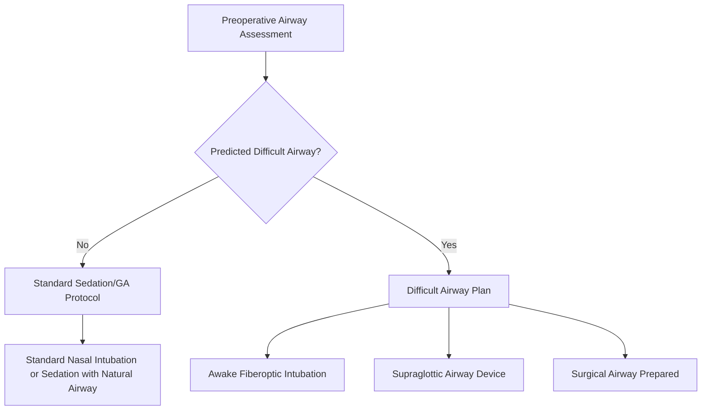

# Chapter 3: Anesthesia and Sedation in OMS

*Office-based anesthesia, local anesthesia techniques, IV sedation, general anesthesia, airway management, monitoring standards, and emergency protocols for the oral and maxillofacial surgeon.*

---

## 3.1 Introduction

Oral and maxillofacial surgeons occupy a unique position in medicine: they are one of the few specialties that administer their own anesthesia while simultaneously performing surgery. This dual-provider model, with a dedicated anesthesia team member (typically a surgical assistant trained in anesthesia monitoring), has an outstanding safety record. The AAOMS Office Anesthesia Evaluation (OAE) program has documented a mortality rate of approximately 1:365,000 for office-based anesthesia in OMS practices (Perrott et al., *J Oral Maxillofac Surg* 2003;61:983-995), which compares favorably with hospital-based general anesthesia.

This chapter covers the full spectrum of anesthesia and sedation techniques employed in OMS practice, from local anesthesia through deep sedation/general anesthesia, with emphasis on airway management, monitoring standards, and emergency preparedness.

---

## 3.2 Local Anesthesia

### 3.2.1 Pharmacology of Local Anesthetics

Local anesthetics block voltage-gated sodium channels, preventing action potential propagation along nerve fibers. They consist of three components: an aromatic lipophilic group, an intermediate chain (ester or amide linkage), and a hydrophilic amino group.

**Classification**:

| Property | Amides | Esters |
|---|---|---|
| Examples | Lidocaine, mepivacaine, bupivacaine, articaine, prilocaine | Procaine, tetracaine, benzocaine |
| Metabolism | Hepatic (CYP enzymes) | Plasma cholinesterase (pseudocholinesterase) |
| Allergy | Extremely rare | More common (PABA metabolite) |
| Clinical use in OMS | Primary agents for all procedures | Topical (benzocaine); rarely injected |

**Agent profiles**:

| Agent | Onset | Duration (with epi) | Max Dose | Notes |
|---|---|---|---|---|
| **Lidocaine 2%** (1:100,000 epi) | 2-3 min | 60-90 min (pulpal) / 3-5 hr (soft tissue) | 7.0 mg/kg (with epi) | Gold standard; most widely used |
| **Articaine 4%** (1:100,000 or 1:200,000 epi) | 1-2 min | 60-90 min (pulpal) | 7.0 mg/kg | Superior bone penetration (thiophene ring); higher paresthesia risk with IAN block (see below) |
| **Mepivacaine 3%** (no vasoconstrictor) | 1.5-2 min | 20-40 min (pulpal) | 6.6 mg/kg | Useful when vasoconstrictor is contraindicated or short procedures |
| **Bupivacaine 0.5%** (1:200,000 epi) | 6-10 min | 4-8 hr (pulpal) / 8-12 hr (soft tissue) | 1.3 mg/kg | Long-duration; excellent for postoperative pain control; cardiotoxic at high doses |

!!! danger "Critical Safety"
    **Local anesthetic systemic toxicity (LAST)** occurs when plasma levels exceed the toxic threshold (CNS symptoms: tinnitus, circumoral numbness, seizures; cardiovascular: arrhythmias, cardiovascular collapse). The ASRA (American Society of Regional Anesthesia) guidelines recommend having **20% intralipid (lipid emulsion)** available in every office that administers local anesthetics. Dosing for LAST: 1.5 mL/kg bolus IV, followed by 0.25 mL/kg/min infusion. Maximum total dose: 12 mL/kg (Neal et al., *Reg Anesth Pain Med* 2018;43:113-123).

### 3.2.2 Nerve Block Techniques

#### Inferior Alveolar Nerve Block (IANB)

The most common injection in OMS practice. **Technique** (Halsted approach):

1. Palpate the coronoid notch and pterygomandibular raphe
2. Identify the injection target: the medial aspect of the ramus at the level of the mandibular foramen, approximately 1 cm above the occlusal plane
3. Insert the needle from the contralateral premolar region, with the barrel over the contralateral premolars
4. Advance to bone (approximately 20-25 mm depth), withdraw 1-2 mm, aspirate (positive aspiration rate: 10-15% -- highest of any dental injection)
5. Deposit 1.5-1.8 mL of anesthetic solution

**Success rate**: 80-85% for the standard Halsted technique. Failure is commonly due to anatomical variation (bifid mandibular canals, accessory foramina) or infection (pH shift reduces un-ionized base).

**Alternative techniques for IANB failure**:

- **Gow-Gates technique**: Higher injection site targeting the condylar neck; 97% success rate; lower positive aspiration rate (2%) (Gow-Gates, *Anesth Prog* 1973;20:36-39)
- **Vazirani-Akinosi (closed-mouth) technique**: Indicated for patients with limited opening (trismus); needle inserted medial to the ramus at the level of the mucogingival junction of the maxillary third molar region, parallel to the occlusal plane

#### Long Buccal Nerve Block

Supplements the IANB for mandibular molar procedures. The needle is inserted distal and buccal to the most posterior molar, targeting the buccal mucosa overlying the external oblique ridge.

#### Posterior Superior Alveolar (PSA) Nerve Block

Targets V2 branches on the posterior maxilla. The needle is inserted at the height of the mucobuccal fold above the maxillary second molar, directed posteriorly, superiorly, and medially (45 degrees to the occlusal plane in each direction). Depth: approximately 16 mm. Risk: pterygoid venous plexus hematoma if the needle is advanced too far posteriorly.

#### Infraorbital Nerve Block (Extraoral and Intraoral)

Blocks V2 as it exits the infraorbital foramen, providing anesthesia to the ipsilateral upper lip, lateral nose, and lower eyelid. **Intraoral approach**: Needle inserted at the mucobuccal fold above the maxillary first premolar, directed toward the infraorbital foramen (palpated extraorally). **Extraoral approach**: Direct injection at the foramen.

#### Greater Palatine Nerve Block

Blocks the greater palatine nerve at the greater palatine foramen (approximately 1 cm palatal to the second/third molar, at the junction of the hard palate and alveolar process). Provides palatal anesthesia from the third molar to the canine region.

#### Mental/Incisive Nerve Block

Blocks the mental nerve at the mental foramen (below and between the premolar apices). Provides anesthesia to the lower lip, chin, and labial mucosa/gingiva of the premolars, canine, and incisors.

!!! warning "Surgical Caution"
    **Articaine and IAN blocks**: A meta-analysis by Yapp et al. (*J Am Dent Assoc* 2011;142:531-539) and Garisto et al. (*J Am Dent Assoc* 2010;141:836-844) demonstrated a statistically higher incidence of paresthesia with articaine 4% IAN blocks compared to lidocaine 2% (approximately 3.6x relative risk). While the absolute risk remains low, many practitioners restrict articaine to infiltration techniques and use lidocaine or mepivacaine for IAN blocks. Articaine's superiority for buccal infiltration in the mandible (even for molars) may reduce the need for IAN blocks in many cases (Robertson et al., *J Endod* 2007;33:11-14).

### 3.2.3 Vasoconstrictors

Epinephrine (1:100,000 or 1:200,000) is the most common vasoconstrictor added to local anesthetics. Benefits include:

- Prolonged duration of anesthesia
- Reduced bleeding at the surgical site
- Decreased systemic absorption (slower onset of peak plasma levels)
- Increased maximum safe dose

**Cardiovascular considerations**: The maximum recommended dose of epinephrine in healthy patients is 0.2 mg (equivalent to approximately 11 cartridges of 1:100,000 epinephrine). In patients with significant cardiovascular disease, the AAOMS and AHA recommend limiting epinephrine to 0.04 mg (approximately 2 cartridges of 1:100,000). However, the endogenous catecholamine release from pain and anxiety typically far exceeds this amount, making adequate anesthesia more important than strict epinephrine limitation (Becker & Reed, *Anesth Prog* 2006;53:98-108).

---

## 3.3 Sedation Continuum

The ASA defines four levels of sedation:

| Level | Definition | Airway | Response | Cardiovascular |
|---|---|---|---|---|
| **Minimal sedation (anxiolysis)** | Drug-induced state; patient responds normally to verbal commands | Unaffected | Normal | Unaffected |
| **Moderate sedation (conscious sedation)** | Depressed consciousness; purposeful response to verbal or light tactile stimulation | No intervention required | Purposeful | Usually maintained |
| **Deep sedation** | Depressed consciousness; purposeful response to repeated or painful stimulation | Intervention may be required | Purposeful after repeated/painful stimulation | Usually maintained |
| **General anesthesia** | Drug-induced loss of consciousness; not arousable | Intervention often required | No response | May be impaired |

!!! tip "Clinical Pearl"
    The OMS office-based anesthesia model typically targets **deep sedation** rather than true general anesthesia, maintaining spontaneous ventilation while achieving surgical-depth amnesia and analgesia. The key advantage of the OMS-administered anesthesia model is the surgeon's ability to titrate to the exact level needed, adjusting depth in real time during the procedure.

---

## 3.4 Intravenous Sedation

### 3.4.1 Agents

#### Benzodiazepines

| Agent | Onset (IV) | Duration | Dose | Notes |
|---|---|---|---|---|
| **Midazolam** | 1-2 min | 45-60 min | 0.5-2 mg titrated; max 5-10 mg | Most common benzodiazepine in OMS; excellent amnesia; water-soluble (less painful on injection) |
| **Diazepam** | 1-3 min | 60-90 min | 2.5-5 mg titrated | Longer duration; active metabolite (desmethyldiazepam, t1/2 ~100 hr) |
| **Triazolam** (oral) | 15-30 min | 60-90 min | 0.125-0.5 mg PO | Oral anxiolysis preoperatively |

**Reversal**: Flumazenil (Romazicon) 0.2 mg IV q1min, max 1 mg. Re-sedation can occur because flumazenil's duration (45-60 min) may be shorter than the benzodiazepine's.

#### Opioids

| Agent | Onset (IV) | Duration | Dose | Notes |
|---|---|---|---|---|
| **Fentanyl** | 1-2 min | 30-45 min | 25-100 mcg titrated | Most common opioid in OMS sedation; minimal histamine release; potent respiratory depressant |
| **Alfentanil** | 1 min | 15-20 min | 5-20 mcg/kg | Ultrashort-acting; useful for brief procedures |
| **Remifentanil** | 30-60 sec | 3-5 min | 0.05-0.1 mcg/kg/min infusion | Context-sensitive half-life of 3-4 min regardless of infusion duration; requires infusion pump |

**Reversal**: Naloxone (Narcan) 0.04-0.4 mg IV q2-3min. Duration of naloxone may be shorter than the opioid (particularly for fentanyl), requiring re-dosing.

!!! danger "Critical Safety"
    **Opioid-benzodiazepine synergy**: The combination of fentanyl and midazolam produces synergistic respiratory depression that is far greater than either agent alone. This synergy is the most common cause of respiratory depression events in OMS sedation. Doses of each agent must be reduced by 30-50% when used in combination, and the opioid should typically be administered before the benzodiazepine to allow assessment of the opioid effect before adding the sedative component.

#### Propofol

- **Classification**: Alkylphenol hypnotic-sedative (not an analgesic)
- **Onset**: 15-30 seconds
- **Duration**: 5-10 minutes (redistribution)
- **Dose**: 0.5-1 mg/kg induction; 25-100 mcg/kg/min infusion for maintenance
- **Advantages**: Rapid onset and recovery; antiemetic properties; easily titratable infusion
- **Risks**: Dose-dependent respiratory depression and apnea; hypotension (vasodilation, negative inotropy); no reversal agent; painful on injection (mitigated by co-administration of lidocaine)
- **Use in OMS**: Propofol has become a cornerstone of office-based deep sedation/GA in OMS. Its use requires training in airway management and the ability to rescue from general anesthesia. CDT D9223 (deep sedation/general anesthesia -- each subsequent 15-minute increment).

#### Ketamine

- **Classification**: NMDA receptor antagonist (dissociative anesthetic)
- **Dose**: 0.5-2 mg/kg IV (anesthetic dose); 0.1-0.5 mg/kg IV (sub-dissociative analgesic dose)
- **Advantages**: Preserves airway reflexes and spontaneous ventilation (at analgesic doses); bronchodilator; provides analgesia and amnesia; positive hemodynamic effects (sympathomimetic)
- **Risks**: Emergence reactions (dysphoria, hallucinations -- mitigated by co-administration of midazolam); increased salivation (mitigated by glycopyrrolate); laryngospasm (rare); increased intracranial pressure (relative contraindication in head injury)
- **Use in OMS**: Increasingly used as an adjunct for multimodal analgesia and as a primary agent for pediatric sedation

#### Dexmedetomidine

- **Classification**: Alpha-2 adrenergic agonist
- **Dose**: 0.5-1 mcg/kg loading over 10 min, then 0.2-0.7 mcg/kg/hr infusion
- **Advantages**: Sedation without respiratory depression; anxiolysis; analgesia; reduced opioid requirements; cooperative sedation (patient arousable)
- **Risks**: Bradycardia (may be profound); hypotension; slow onset
- **Use in OMS**: Growing role as an adjunct to reduce propofol and opioid requirements; useful in patients with OSA

### 3.4.2 Standard Sedation Protocols

**Protocol 1: Moderate Sedation (most common for third molar surgery)**

1. Preoperative assessment: ASA classification, Mallampati score, NPO status (2 hr clear liquids, 6 hr light meal, 8 hr full meal per ASA guidelines)
2. Establish IV access
3. Apply monitors (see Section 3.6)
4. Administer O2 via nasal cannula/hood (4-6 L/min)
5. Midazolam 1-2 mg IV
6. Fentanyl 50-100 mcg IV (titrate to effect)
7. +/- Propofol 20-40 mg boluses or low-dose infusion (25-50 mcg/kg/min) for deeper sedation
8. Local anesthesia administered after adequate sedation
9. Monitor and titrate throughout procedure
10. Recovery: patient meets discharge criteria (modified Aldrete score >= 9)

**Protocol 2: Deep Sedation/General Anesthesia (complex cases)**

1. Steps 1-4 above
2. Midazolam 1-2 mg IV (anxiolysis)
3. Fentanyl 50-100 mcg IV
4. Propofol 1-2 mg/kg IV bolus (to loss of consciousness)
5. Propofol infusion 75-150 mcg/kg/min
6. Nasal intubation or nasal airway/LMA if needed
7. Local anesthesia for surgical analgesia and hemostasis
8. Supplemental fentanyl or ketorolac for analgesia
9. Discontinue propofol 5-10 min before end of procedure
10. Recovery and discharge as above

### 3.4.3 CDT and CPT Codes for Anesthesia

| Code | Description |
|---|---|
| **D9222** | Deep sedation/general anesthesia -- first 15 minutes |
| **D9223** | Deep sedation/general anesthesia -- each subsequent 15-minute increment |
| **D9239** | IV moderate sedation/analgesia -- first 15 minutes |
| **D9243** | IV moderate sedation/analgesia -- each subsequent 15-minute increment |
| **D9248** | Non-intravenous conscious sedation |
| **CPT 00170** | Anesthesia for intraoral procedures (including biopsy) |
| **CPT 00100** | Anesthesia for procedures on salivary glands, with biopsy |

---

## 3.5 General Anesthesia

### 3.5.1 Office-Based vs. Hospital-Based GA

OMS surgeons are uniquely trained (during a 4-6 year residency that includes 4-6 months of medical anesthesia rotations) to administer GA in the office setting. The AAOMS Parameters of Care (ParCare) and state dental board regulations govern office-based GA.

**Requirements for office-based GA (varies by state)**:

- Current ACLS (Advanced Cardiovascular Life Support) certification
- PALS (Pediatric Advanced Life Support) certification (if treating pediatric patients)
- State anesthesia permit (most states require a separate permit for deep sedation/GA beyond the dental license)
- Office inspection and equipment standards (AAOMS OAE or state equivalent)
- Trained and certified anesthesia assistants
- Emergency drugs, equipment, and defibrillator available
- Transfer agreement with a hospital or ambulatory surgery center (required in some states)

### 3.5.2 Inhalation Agents

**Nitrous oxide (N2O)**:

- Provides anxiolysis and mild analgesia at concentrations of 30-50%
- Rapid onset and offset (virtually no metabolism)
- Must be delivered with at least 30% O2 (never below 30%)
- CDT D9230 (inhalation of nitrous oxide/anxiolysis)
- Scavenging system required (occupational exposure limit: 25 ppm per NIOSH)
- Contraindications: middle ear surgery, pneumothorax, bowel obstruction, first trimester of pregnancy (relative)

**Sevoflurane** (less commonly used in OMS office setting):

- Provides smooth mask induction, particularly in pediatric patients
- MAC: 2.0% (adults), 2.5% (children)
- Minimal airway irritation
- Requires calibrated vaporizer and scavenging system
- Rarely used in OMS offices due to equipment requirements; more common in ambulatory surgery centers and ORs

---

## 3.6 Monitoring Standards

The AAOMS monitoring standards (aligned with ASA standards) require the following for moderate and deep sedation/GA:

### 3.6.1 Required Monitoring

| Parameter | Device | Frequency |
|---|---|---|
| **Oxygenation** | Pulse oximetry (SpO2) | Continuous |
| **Ventilation** | Capnography (ETCO2) -- pretracheal or nasal | Continuous |
| **Circulation** | ECG (at least 3-lead) | Continuous |
| **Blood pressure** | NIBP (non-invasive blood pressure) | Every 5 minutes |
| **Heart rate** | From SpO2 or ECG | Continuous |
| **Temperature** | If GA >30 min | Intermittent/continuous |
| **Level of consciousness** | Clinical assessment (response to command) | Continuous |

!!! tip "Clinical Pearl"
    **Capnography (ETCO2)** is the single most important monitor for detecting respiratory depression during sedation. It detects hypoventilation (rising ETCO2), apnea (absent waveform), and airway obstruction (abnormal waveform morphology) before SpO2 desaturation occurs (typically 30-60 seconds earlier), providing a critical early warning. The ASA mandated capnography for moderate sedation in 2011, and the AAOMS has adopted this standard. CDT code D9222/D9223 documentation should include ETCO2 values.

### 3.6.2 Documentation

A time-based anesthesia record documenting the following at 5-minute intervals is the standard of care:

- Vital signs (HR, BP, SpO2, ETCO2, RR)
- Medications administered (drug, dose, time, route)
- IV fluids (type, volume)
- Airway management interventions
- Level of sedation/consciousness
- Significant events

---

## 3.7 Airway Management

### 3.7.1 Preoperative Airway Assessment

Every patient receiving sedation or anesthesia must undergo a focused airway assessment:

- **Mallampati classification**: Class I (full visibility of tonsils, uvula, soft palate) to Class IV (hard palate only). Class III/IV predicts difficult intubation.
- **Thyromental distance**: <6 cm suggests potential difficulty
- **Mouth opening**: <3 cm (inter-incisor distance) limits laryngoscopy access
- **Neck mobility**: Limited extension (cervical disease, prior fusion) complicates intubation
- **Body habitus**: BMI >35, short thick neck, OSA increase difficulty
- **Dentition**: Prominent upper incisors, loose teeth, dental prostheses

### 3.7.2 Airway Management Techniques

**Basic maneuvers**:

- **Head tilt-chin lift**: Extends the neck and lifts the mandible, opening the airway
- **Jaw thrust**: Forward displacement of the mandible -- particularly useful when cervical spine injury is suspected (avoids neck extension)
- **Nasal airway (nasopharyngeal airway, NPA)**: Soft rubber tube inserted through the naris. Maintains airway patency during sedation. Well-tolerated in sedated patients. The most commonly used airway adjunct in OMS sedation.
- **Oral airway (oropharyngeal airway, OPA)**: Rigid device inserted into the mouth. Not tolerated in conscious/lightly sedated patients (gag reflex). Less useful in OMS due to oral surgical field.

**Advanced airways**:

- **Nasal intubation**: The standard for OMS procedures requiring GA with controlled airway. Nasotracheal intubation provides oral access while securing the airway. Performed via direct laryngoscopy, video laryngoscopy (GlideScope, McGrath), or fiberoptic guidance.

!!! warning "Surgical Caution"
    **Nasal intubation contraindications**: Basal skull fracture (risk of intracranial placement), coagulopathy, nasal obstruction/polyps, and severe midface fractures. In these situations, oral intubation with a retromolar tube or submental intubation should be considered.

- **Supraglottic airway devices (SGAs)**: Laryngeal mask airway (LMA) and similar devices. Useful as a rescue airway and increasingly for elective OMS cases where nasal intubation is not needed (e.g., biopsy, I&D). Flexible LMAs allow sharing the airway with the surgical field.

- **Surgical airway (cricothyrotomy)**: The emergency "can't intubate, can't ventilate" (CICV) rescue. The cricothyroid membrane (between the thyroid and cricoid cartilages) is incised and a small (5.0-6.0 mm) tracheostomy or endotracheal tube is inserted. CPT 31605 (emergency tracheostomy). Every OMS office must have a surgical airway kit immediately available.

### 3.7.3 The Difficult Airway Algorithm

The ASA Difficult Airway Algorithm (2022 update) and the AAOMS adaptation should be posted in every operatory:

1. **Assess** the airway preoperatively
2. **Plan** for difficulty (have backup devices available)
3. If unable to intubate: attempt SGA (LMA)
4. If unable to ventilate with SGA: return to bag-mask ventilation
5. If "can't intubate, can't oxygenate" (CICO): **surgical airway immediately**

!!! danger "Critical Safety"
    The OMS surgeon must practice the CICO scenario regularly. Simulation training (mannequin-based or cadaveric) at least annually is recommended. The time from recognition of CICO to knife-on-skin for cricothyrotomy should be under 30 seconds. Delay in surgical airway is the leading cause of anesthesia-related death in the CICO scenario (Cook et al., *NAP4 Report*, Royal College of Anaesthetists, 2011).

---

## 3.8 Emergency Protocols

### 3.8.1 Office Emergency Drugs

The following medications should be immediately available in every OMS office performing sedation or GA:

| Drug | Indication | Dose (Adult) |
|---|---|---|
| **Epinephrine** (1:1000) | Anaphylaxis, severe bronchospasm | 0.3-0.5 mg IM (anterolateral thigh) |
| **Epinephrine** (1:10,000) | Cardiac arrest (ACLS) | 1 mg IV q3-5 min |
| **Atropine** | Symptomatic bradycardia | 0.5 mg IV q3-5 min (max 3 mg) |
| **Flumazenil** | Benzodiazepine reversal | 0.2 mg IV q1 min (max 1 mg) |
| **Naloxone** | Opioid reversal | 0.04-0.4 mg IV q2-3 min |
| **Succinylcholine** | Laryngospasm, CICO requiring paralysis for intubation | 0.5-1 mg/kg IV; 4 mg/kg IM if no IV |
| **Diphenhydramine** | Allergic reaction (adjunct) | 25-50 mg IV/IM |
| **Hydrocortisone** | Anaphylaxis (adjunct), adrenal crisis | 100-200 mg IV |
| **Dextrose 50%** | Hypoglycemia | 25-50 mL IV (12.5-25 g) |
| **Nitroglycerin** | Acute coronary syndrome | 0.4 mg sublingual q5 min x 3 |
| **Albuterol** | Bronchospasm | 2.5 mg nebulized or 2 puffs MDI |
| **20% Intralipid** | LAST (local anesthetic systemic toxicity) | 1.5 mL/kg bolus IV |
| **Amiodarone** | Ventricular fibrillation/pulseless VT (ACLS) | 300 mg IV bolus |
| **Aspirin** | Acute coronary syndrome | 325 mg PO (chewed) |

### 3.8.2 Common Emergencies in OMS Sedation

#### Laryngospasm

**Definition**: Involuntary reflex closure of the vocal cords, preventing ventilation.

**Triggers**: Airway irritation (secretions, blood, surgical debris), light anesthesia plane, painful stimulus during light sedation.

**Management**:

1. Remove the stimulus (suction, stop surgery)
2. Apply continuous positive airway pressure (CPAP) with jaw thrust and 100% O2
3. If not resolving: deepening anesthesia with propofol 0.5 mg/kg IV
4. If persistent: succinylcholine 0.5-1 mg/kg IV (or 4 mg/kg IM if no IV access) -- provides rapid neuromuscular blockade to break the spasm
5. Prepare for intubation after succinylcholine administration

#### Bronchospasm

**Triggers**: Reactive airway disease (asthma), airway manipulation, allergic reaction, aspiration.

**Management**:

1. 100% O2
2. Albuterol 2.5 mg nebulized (or MDI via circuit)
3. Deepening anesthesia (propofol, sevoflurane)
4. Epinephrine 0.01 mg IV (10 mcg) for severe bronchospasm
5. Hydrocortisone 100 mg IV (delayed effect)

#### Anaphylaxis

**Triggers**: Latex, antibiotics, NSAIDs, chlorhexidine, muscle relaxants.

**Management (immediate)**:

1. Remove the offending agent
2. **Epinephrine 0.3-0.5 mg IM** (anterolateral thigh) -- THE definitive treatment. Repeat q5-15 min as needed
3. 100% O2, airway management
4. IV fluid bolus (1-2 L NS)
5. Diphenhydramine 50 mg IV, ranitidine 50 mg IV
6. Hydrocortisone 200 mg IV
7. Prepare for intubation/surgical airway if airway edema progresses
8. Activate EMS if in office setting

#### Malignant Hyperthermia

A rare but life-threatening hypermetabolic crisis triggered by volatile anesthetic agents (sevoflurane, desflurane) and succinylcholine in genetically susceptible individuals (RYR1 mutation).

**Signs**: Rising ETCO2, tachycardia, muscle rigidity, hyperthermia (late sign), dark blood in surgical field.

**Management**:

1. Stop all triggering agents immediately
2. Hyperventilate with 100% O2 (non-rebreathing circuit)
3. **Dantrolene 2.5 mg/kg IV** (mix with sterile water), repeat q5 min until response (max 10 mg/kg)
4. Active cooling (ice packs to axillae, groin; cold IV fluids)
5. Treat hyperkalemia (calcium chloride, insulin/dextrose, bicarbonate)
6. Monitor urine output (>2 mL/kg/hr to prevent myoglobin nephropathy)
7. Transfer to ICU

!!! warning "Surgical Caution"
    While malignant hyperthermia is rare in OMS office practice (succinylcholine is the most common trigger in the OMS setting, as volatile agents are infrequently used), **dantrolene must be available** in any office that stocks succinylcholine. The AAOMS OAE inspection verifies dantrolene availability. Some OMS practices have elected to remove succinylcholine from their offices entirely, using rocuronium (with sugammadex for reversal) as an alternative for emergency neuromuscular blockade.

---

## 3.9 Pediatric Sedation

### 3.9.1 Unique Considerations

Pediatric patients present specific anesthesia challenges:

- **Airway**: Relatively large tongue, anterior/cephalad larynx, narrow subglottic space (cricoid ring is the narrowest point in children <8 years)
- **Physiology**: Higher metabolic rate, lower FRC (faster desaturation), higher vagal tone (bradycardia is the most common arrhythmia)
- **Pharmacology**: Higher volume of distribution for water-soluble drugs; immature hepatic metabolism in neonates/infants
- **Psychology**: Separation anxiety, inability to cooperate, need for premedication or parental presence during induction

### 3.9.2 Sedation Options for Pediatric OMS

| Technique | Age Range | Indication | Notes |
|---|---|---|---|
| **Oral midazolam** (0.5 mg/kg PO, max 20 mg) | 2-12 years | Anxiolysis for minor procedures or pre-sedation | Bitter taste; mix with acetaminophen elixir or clear juice |
| **Intranasal midazolam** (0.2-0.3 mg/kg) | 1-6 years | Rapid anxiolysis when oral route refused | Stinging; use mucosal atomization device |
| **Ketamine** (1-2 mg/kg IV or 4-6 mg/kg IM) | Any age | Dissociative sedation for brief procedures | Co-administer glycopyrrolate (5 mcg/kg) and midazolam (0.05 mg/kg) |
| **Propofol + fentanyl IV** | >3 years (typically) | Deep sedation/GA for longer procedures | Standard OMS office protocol adapted for weight-based dosing |
| **Sevoflurane mask induction** | Any age | Inhalation induction when IV access is difficult | Requires OR or ASC with vaporizer; smooth induction; IV started after induction |

### 3.9.3 PALS Considerations

- **Bradycardia algorithm**: If HR <60 with poor perfusion despite oxygenation and ventilation: epinephrine 0.01 mg/kg IV (0.1 mL/kg of 1:10,000)
- **Weight-based dosing**: Use Broselow tape or pre-calculated weight-based drug doses posted in operatory
- **NPO guidelines for children**: Same as adults (2/4/6/8 rule): clear liquids 2 hr, breast milk 4 hr, formula/light meal 6 hr, full meal 8 hr

---

## 3.10 State Permit Requirements

OMS anesthesia practice is governed by state dental board regulations, which vary significantly:

- **Most states**: Require a separate anesthesia permit for moderate sedation, deep sedation, and/or general anesthesia, beyond the dental license
- **Permit levels** (typical state classification):
    - Level 1: Local anesthesia and nitrous oxide only
    - Level 2: Moderate (conscious) sedation
    - Level 3: Deep sedation/general anesthesia
- **Inspection requirements**: Most states require periodic (annual or biennial) office inspection by the state dental board or a board-approved entity (AAOMS OAE program satisfies this requirement in most states)
- **ACLS/BLS/PALS**: Current certification is universally required
- **Team training**: Some states require documented training and certification of all anesthesia assistants (e.g., DAANCE -- Dental Anesthesia Assistant National Certification Examination)
- **Morbidity/mortality reporting**: Several states require reporting of anesthesia-related adverse events to the dental board

!!! tip "Clinical Pearl"
    The AAOMS Office Anesthesia Evaluation (OAE) program is accepted by most state dental boards as fulfilling office inspection requirements. The OAE evaluator (an OMS peer) inspects equipment, drugs, monitoring, emergency preparedness, staff training, and documentation. Participating in the OAE program also provides peer review feedback that is invaluable for quality improvement.

---

## 3.11 Risk Management and Quality Improvement

### 3.11.1 Simulation Training

The AAOMS recommends regular (at least annual) simulation-based training for OMS teams covering:

- Airway emergencies (laryngospasm, CICO, difficult intubation)
- Cardiovascular emergencies (cardiac arrest, anaphylaxis, acute coronary syndrome)
- Respiratory emergencies (bronchospasm, aspiration, pneumothorax)
- Malignant hyperthermia
- Pediatric emergencies
- Team communication and crisis resource management (CRM)

### 3.11.2 Closed Claims Analysis

The OMS anesthesia closed claims literature identifies the most common adverse events:

- **Respiratory depression/hypoxia** (most common cause of morbidity/mortality)
- **Difficult airway/failed intubation**
- **Drug errors** (wrong drug, wrong dose, wrong route)
- **Inadequate monitoring** (particularly failure to use capnography)
- **Aspiration**

---

## 3.12 Summary

The OMS surgeon's ability to safely administer a full spectrum of anesthesia -- from local anesthesia through office-based general anesthesia -- is a defining competency of the specialty. This capability rests on rigorous training in pharmacology, airway management, physiologic monitoring, and emergency preparedness. Adherence to AAOMS monitoring standards, participation in the OAE program, and regular simulation training form the pillars of safe anesthesia practice in oral and maxillofacial surgery.

---

## References

1. AAOMS. Parameters of Care: Clinical Practice Guidelines for Oral and Maxillofacial Surgery (AAOMS ParCare 6th Edition). 2017.
2. AAOMS. Office Anesthesia Evaluation Manual. Updated 2023.
3. ASA. Practice guidelines for moderate procedural sedation and analgesia. *Anesthesiology*. 2018;128(3):72-104.
4. ASA. 2022 American Society of Anesthesiologists practice guidelines for management of the difficult airway. *Anesthesiology*. 2022;136(1):31-81.
5. Becker DE, Reed KL. Essentials of local anesthetic pharmacology. *Anesth Prog*. 2006;53(3):98-108.
6. Cook TM, Woodall N, Frerk C, eds. 4th National Audit Project of the Royal College of Anaesthetists and Difficult Airway Society: Major complications of airway management in the United Kingdom. London: Royal College of Anaesthetists; 2011.
7. Garisto GA, Gaffen AS, Lawrence HP, et al. Occurrence of paresthesia after dental local anesthetic administration in the United States. *J Am Dent Assoc*. 2010;141(7):836-844.
8. Gow-Gates GA. Mandibular conduction anesthesia: a new technique using extraoral landmarks. *Oral Surg Oral Med Oral Pathol*. 1973;36(3):321-328.
9. Neal JM, Barrington MJ, Fettiplace MR, et al. The Third American Society of Regional Anesthesia and Pain Medicine Practice Advisory on Local Anesthetic Systemic Toxicity. *Reg Anesth Pain Med*. 2018;43(2):113-123.
10. Perrott DH, Yuen JP, Andresen RV, Dodson TB. Office-based ambulatory anesthesia: outcomes of clinical practice of oral and maxillofacial surgeons. *J Oral Maxillofac Surg*. 2003;61(9):983-995.
11. Robertson D, Nusstein J, Reader A, et al. The anesthetic efficacy of articaine in buccal infiltration of mandibular posterior teeth. *J Am Dent Assoc*. 2007;138(8):1104-1112.
12. Rosenberg M. Oral and maxillofacial surgery and anesthesia: the evolution of the model. *Anesth Prog*. 2020;67(4):190-193.
13. Yapp KE, Hopcraft MS, Parashos P. Articaine: a review of the literature. *Br Dent J*. 2011;210(7):323-329.
