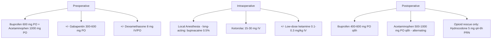

# Chapter 4: Pharmacology and Pain Management

*Multimodal analgesia, opioid stewardship, antibiotic prophylaxis and therapy, corticosteroids, hemostatic agents, anticoagulant management, ERAS protocols, and pharmacogenomics for the OMS surgeon.*

---

## 4.1 Introduction

Pharmacologic management in oral and maxillofacial surgery extends far beyond writing a prescription for postoperative pain. The modern OMS surgeon must integrate evidence-based multimodal analgesia, responsible opioid prescribing, targeted antibiotic therapy, perioperative corticosteroid protocols, hemostatic agent selection, and management of patients on complex anticoagulant and antiplatelet regimens. The shift toward Enhanced Recovery After Surgery (ERAS) protocols demands a systems-based approach to pharmacology that begins before the incision and continues through complete recovery.

---

## 4.2 Analgesic Pharmacology

### 4.2.1 Non-Opioid Analgesics

#### NSAIDs (Non-Steroidal Anti-Inflammatory Drugs)

NSAIDs inhibit cyclooxygenase (COX-1 and COX-2), blocking prostaglandin synthesis and reducing inflammation, pain, and fever. They are the cornerstone of multimodal analgesia in OMS.

| Agent | Dose | Route | COX Selectivity | Key Notes |
|---|---|---|---|---|
| **Ibuprofen** | 400-600 mg q6h | PO | Non-selective | Maximum 2400 mg/day; most evidence in dental pain |
| **Naproxen** | 250-500 mg q12h | PO | Non-selective | Longer duration; BID dosing improves compliance |
| **Ketorolac** | 15-30 mg q6h (max 5 days) | IV/IM/PO | Non-selective | Most potent injectable NSAID; 30 mg IV equivalent to ~10 mg morphine; limit to 5 days due to GI/renal risk |
| **Celecoxib** | 200 mg q12h or 400 mg load then 200 mg q12h | PO | COX-2 selective | Reduced GI bleeding risk; no platelet effect; contraindicated in sulfonamide allergy; FDA black box for CV risk |
| **Meloxicam** | 7.5-15 mg daily | PO | Preferential COX-2 | Once-daily dosing; lower GI risk than non-selective NSAIDs |

!!! tip "Clinical Pearl"
    The combination of **ibuprofen 400 mg + acetaminophen 1000 mg** has been shown to provide superior analgesia to opioid-containing combinations for acute dental pain, with an NNT (number needed to treat) of 1.5 for at least 50% pain relief over 6 hours (Moore et al., *J Am Dent Assoc* 2018;149:202-211). This combination should be the first-line analgesic for most OMS procedures.

#### Acetaminophen (Paracetamol)

- **Mechanism**: Central inhibition of COX (possibly COX-3), serotonergic pathways, and endocannabinoid reuptake inhibition
- **Dose**: 650-1000 mg q6h (max 3000 mg/day in healthy adults; 2000 mg/day in patients with liver disease or chronic alcohol use)
- **IV formulation** (Ofirmev): 1000 mg IV q6h. Provides rapid onset (5-10 min) and reliable plasma levels. Increasingly used perioperatively as part of multimodal protocols. CPT 96374 (IV push of therapeutic substance).
- **Advantages**: No platelet effect, no GI risk, no renal risk, safe in pregnancy
- **Hepatotoxicity**: Dose-dependent; risk increases with alcohol use, malnutrition, CYP2E1 inducers. N-acetylcysteine (NAC) is the antidote for acetaminophen overdose.

#### Gabapentinoids

- **Gabapentin**: 300-600 mg preoperatively, then 300 mg q8h postoperatively. Reduces postoperative opioid consumption by 20-35% when used as part of multimodal analgesia (Tiippana et al., *Anesth Analg* 2007;104:1545-1556). Also effective for neuropathic pain (post-nerve injury).
- **Pregabalin**: 75-150 mg preoperatively. More predictable bioavailability than gabapentin. Similar opioid-sparing effect.
- **Side effects**: Sedation, dizziness. Dose reduction required in renal impairment.

### 4.2.2 Opioid Analgesics

#### Agent Profiles

| Agent | Dose | Equianalgesic (PO) | Duration | Key Notes |
|---|---|---|---|---|
| **Hydrocodone** (with APAP) | 5-10 mg q4-6h | 30 mg | 4-6 hr | Schedule II (since 2014); most commonly prescribed opioid in OMS |
| **Oxycodone** (with or without APAP) | 5-10 mg q4-6h | 20 mg | 4-6 hr | Schedule II; higher abuse potential |
| **Codeine** (with APAP) | 30-60 mg q4-6h | 200 mg | 4-6 hr | Prodrug (requires CYP2D6 for conversion to morphine); 10% of Caucasians are poor metabolizers; FDA contraindication in children <12 years post-tonsillectomy |
| **Tramadol** | 50-100 mg q4-6h | 120 mg | 4-6 hr | Dual mechanism (weak mu-opioid agonist + SNRI); lowers seizure threshold; serotonin syndrome risk with SSRIs/SNRIs |
| **Morphine** | 15-30 mg q4h (PO) | 30 mg | 4-6 hr | Reference standard for equianalgesic comparisons; rarely used in OMS office practice |

!!! danger "Critical Safety"
    **Codeine in children**: The FDA issued a black box warning (2017) contraindicating codeine in children <12 years and warning against use in 12-18 year olds with obesity, OSA, or severe pulmonary disease due to reports of fatal respiratory depression in CYP2D6 ultra-rapid metabolizers. OMS surgeons should avoid codeine in pediatric patients and use ibuprofen/acetaminophen as the primary analgesic.

### 4.2.3 Opioid Stewardship

The CDC Clinical Practice Guideline for Prescribing Opioids (2022 update) and AAOMS White Paper on Opioid Prescribing provide the framework for responsible opioid prescribing in OMS:

**Key principles**:

1. **Non-opioid first**: NSAIDs + acetaminophen should be the default first-line analgesic for all dentoalveolar procedures. Opioids are reserved for breakthrough pain or procedures with expected moderate-to-severe pain.
2. **Lowest effective dose**: When opioids are prescribed, use the lowest dose for the shortest duration. For third molar surgery, 12-16 tablets of hydrocodone/APAP is typically sufficient; many patients require 0-4 tablets (Maughan et al., *JAMA* 2016;315:1653-1654).
3. **Duration limits**: 3-5 day supply for acute surgical pain. Do not prescribe refills for opioids after routine dentoalveolar surgery.
4. **PDMP check**: Check the state Prescription Drug Monitoring Program (PDMP) before prescribing opioids. Required by law in most states.
5. **Patient education**: Counsel patients on safe storage, disposal (drug take-back programs, FDA flush list), and the risk of dependence.
6. **Documentation**: Document the pain assessment, analgesic plan, and rationale for opioid prescribing in the patient record.

!!! warning "Surgical Caution"
    OMS surgeons prescribe approximately **37.5 opioid prescriptions per 100 procedures** -- the highest rate among dental specialties (Denisco et al., *J Am Dent Assoc* 2011;142:800-810). Evidence consistently shows that the ibuprofen-acetaminophen combination provides equivalent or superior analgesia to opioid-APAP combinations for most OMS procedures, with fewer adverse effects. The specialty has made significant progress in reducing opioid prescribing, but continued vigilance is essential.

### 4.2.4 Multimodal Analgesia Protocol

A structured multimodal analgesia protocol for OMS procedures:

---

## 4.3 Antibiotic Pharmacology

### 4.3.1 Antibiotic Prophylaxis

**Surgical Site Infection (SSI) prophylaxis** principles:

- Antibiotic should be administered **within 60 minutes before incision** (within 120 minutes for vancomycin or fluoroquinolones) to achieve adequate tissue levels at the time of surgical contamination (Bratzler et al., *Clin Infect Dis* 2013;56:e1-e48).
- Redose intraoperatively if the procedure exceeds **two half-lives** of the antibiotic (e.g., redose amoxicillin at 4 hours).
- Postoperative prophylaxis beyond 24 hours does not reduce SSI rates for clean or clean-contaminated procedures and increases antibiotic resistance.

**Indications for antibiotic prophylaxis in OMS**:

| Procedure | Prophylaxis Recommended? | Agent | Evidence |
|---|---|---|---|
| **Third molar extraction** (simple) | Not routinely | -- | Cochrane Review: antibiotics reduce infection by ~70% but NNT = 12-25; benefits must be weighed against adverse effects and resistance (Lodi et al., *Cochrane Database Syst Rev* 2021) |
| **Third molar extraction** (surgical, impacted) | Consider in high-risk patients | Amoxicillin 2 g PO 1 hr preop or Clindamycin 600 mg if PCN-allergic | AAOMS ParCare Section 1 |
| **Dental implant placement** | Single dose preop | Amoxicillin 2 g PO 1 hr preop | Meta-analysis: reduces implant failure by ~2% (Esposito et al., *Cochrane* 2013) |
| **Orthognathic surgery** | Yes | Ampicillin/sulbactam 3 g IV preop, then q6h x 24 hr | Clean-contaminated (intraoral approach) |
| **Open fracture reduction** | Yes | Cefazolin 2 g IV preop + 24 hr postop | AO principles; contaminated wound |
| **Bone grafting** | Yes (single dose preop minimum) | Amoxicillin/clavulanate 875 mg PO or Ampicillin/sulbactam 3 g IV | Standard practice |
| **Prosthetic joint prophylaxis** | No longer routine | -- | ADA/AAOS 2012 guidelines: antibiotic prophylaxis not recommended for most patients with prosthetic joints undergoing dental procedures |

#### Infective Endocarditis Prophylaxis

The AHA 2021 updated guidelines recommend prophylaxis only for patients at highest risk:

- Prosthetic cardiac valves (mechanical, bioprosthetic, or homograft)
- Previous infective endocarditis
- Certain congenital heart diseases (unrepaired cyanotic CHD, repaired with prosthetic material within 6 months, repaired with residual defects)
- Cardiac transplant with valvulopathy

**Regimen**: Amoxicillin 2 g PO 30-60 min before procedure. If unable to take oral medications: Ampicillin 2 g IV/IM. PCN-allergic: Clindamycin 600 mg PO or Azithromycin 500 mg PO.

### 4.3.2 Antibiotic Therapy for Odontogenic Infections

**Microbiology**: Odontogenic infections are polymicrobial, involving a mixture of facultative and obligate anaerobes. Common organisms:

- **Facultative aerobes**: Viridans group streptococci (S. anginosus group most pathogenic), Staphylococcus spp.
- **Obligate anaerobes**: Prevotella spp., Fusobacterium spp., Peptostreptococcus spp., Porphyromonas spp.

**Empiric antibiotic selection**:

| Severity | First-Line | Alternative (PCN-Allergic) | Route | Duration |
|---|---|---|---|---|
| **Mild** (localized vestibular abscess) | Amoxicillin 500 mg q8h | Clindamycin 300 mg q6h | PO | 5-7 days (or until 3 days after clinical resolution) |
| **Moderate** (fascial space involvement) | Amoxicillin/clavulanate 875/125 mg q12h | Clindamycin 600 mg q8h | PO (consider IV start) | 7-10 days |
| **Severe** (multiple spaces, Ludwig angina, airway compromise) | Ampicillin/sulbactam 3 g q6h IV **or** Penicillin G 2-4 MU q4-6h IV + Metronidazole 500 mg q8h IV | Clindamycin 600-900 mg q8h IV **or** Meropenem 1 g q8h IV (if resistant) | IV | Until clinical improvement, then step-down to PO |

!!! tip "Clinical Pearl"
    **Penicillin allergy**: True IgE-mediated penicillin allergy is present in <5% of patients who report "penicillin allergy." In patients with a remote history of rash (not urticaria/anaphylaxis), penicillin allergy testing (skin test or oral challenge) should be considered. De-labeling penicillin allergy allows use of the most effective empiric antibiotics for odontogenic infections and reduces reliance on clindamycin (which has a higher risk of C. difficile colitis). The AAOMS supports penicillin allergy assessment and de-labeling (Shenoy et al., *JAMA* 2019;321:188-199).

### 4.3.3 Antibiotic Resistance and Stewardship

- **Clindamycin resistance**: Increasing among oral anaerobes (up to 20-25% in some studies; Flynn, *J Oral Maxillofac Surg* 2011;69:2917-2918). When clindamycin failure is suspected, culture and sensitivity should guide therapy.
- **Extended-spectrum beta-lactamase (ESBL) organisms**: Rare in odontogenic infections but increasing in hospitalized patients. Carbapenems (meropenem, ertapenem) are the treatment of choice for ESBL-producing organisms.
- **MRSA**: Uncommon as a primary pathogen in odontogenic infections but may be encountered in post-surgical wound infections, especially in hospitalized patients. Treat with vancomycin, linezolid, or TMP-SMX based on sensitivity.

**Stewardship principles**:

- Use the narrowest-spectrum antibiotic effective for the identified pathogen
- De-escalate from broad-spectrum IV to narrow-spectrum PO as soon as clinically appropriate
- Limit duration to the minimum effective period
- Obtain cultures for severe infections before starting antibiotics (blood cultures, aspiration of abscess)
- Avoid antibiotics for non-indicated conditions (e.g., viral URI, non-infected fractures)

---

## 4.4 Corticosteroids

### 4.4.1 Perioperative Use

Corticosteroids reduce postoperative edema, trismus, and pain through inhibition of phospholipase A2 (blocking both COX and LOX pathways) and suppression of inflammatory cytokines.

**Common regimens in OMS**:

| Procedure | Agent | Dose | Timing | Evidence |
|---|---|---|---|---|
| **Third molar surgery** | Dexamethasone | 4-8 mg IV/PO preop | Single dose preoperatively | Significantly reduces edema (peak at 48-72 hr) and trismus; modest pain reduction (Markiewicz et al., *J Oral Maxillofac Surg* 2008;66:1881-1894) |
| **Orthognathic surgery** | Dexamethasone | 8-10 mg IV preop, then 4-8 mg q8h x 24-48 hr | Perioperative | Reduces facial edema; may reduce nausea |
| **Major facial trauma** | Dexamethasone | 8-10 mg IV x 1-3 doses | Perioperative | Controversial; may reduce edema but risks include impaired wound healing, immunosuppression |

**Dexamethasone pharmacology**:

- Potency: 25x hydrocortisone (no mineralocorticoid activity)
- Half-life: 36-72 hours (biological)
- No significant wound healing impairment at standard perioperative doses (short course)
- Antiemetic effect: 4 mg IV is standard prophylaxis for PONV (postoperative nausea and vomiting)

### 4.4.2 Stress Dose Steroids

Patients on chronic corticosteroid therapy (equivalent to prednisone >= 5 mg/day for >= 3 weeks within the past year) may have hypothalamic-pituitary-adrenal (HPA) axis suppression and require supplemental steroids to prevent adrenal crisis during surgical stress.

**Current consensus** (Liu et al., *J Oral Maxillofac Surg* 2014;72:1923-1929):

| Surgical Stress Level | Example | Supplemental Dose |
|---|---|---|
| **Minor** | Simple extraction, minor soft tissue surgery | No supplementation needed; take usual daily dose |
| **Moderate** | Third molar surgery, implants, minor ORIF | Hydrocortisone 50 mg IV preop + usual daily dose |
| **Major** | Orthognathic surgery, major ORIF, free flap | Hydrocortisone 100 mg IV preop, then 50 mg q8h x 24 hr, taper to usual dose |

!!! warning "Surgical Caution"
    **Adrenal crisis** presents with hypotension, tachycardia, nausea/vomiting, and altered consciousness. It can mimic anaphylaxis or sepsis. Treatment: Hydrocortisone 100-200 mg IV bolus + aggressive IV fluid resuscitation + vasopressors if needed. High clinical suspicion is required in any steroid-dependent patient who develops unexplained hypotension perioperatively.

---

## 4.5 Hemostatic Agents

### 4.5.1 Local Hemostatic Agents

| Agent | Mechanism | Application | Notes |
|---|---|---|---|
| **Oxidized regenerated cellulose** (Surgicel) | Contact activation of clotting cascade; low pH bacteriostatic | Pack into extraction socket or bleeding site | Resorbs in 7-14 days; do not use with thrombin (inactivated by low pH) |
| **Absorbable gelatin sponge** (Gelfoam) | Provides scaffold for clot formation | Socket packing; can be combined with topical thrombin | Resorbs in 4-6 weeks |
| **Microfibrillar collagen** (Avitene, Helistat) | Platelet aggregation on collagen surface | Surgical site hemostasis | Very adherent; effective on oozing surfaces |
| **Topical thrombin** (bovine, human recombinant) | Converts fibrinogen to fibrin directly | Applied to bleeding surface; often combined with gelatin sponge | Bovine thrombin can cause antibody formation; human recombinant preferred |
| **Tranexamic acid** (TXA) | Inhibits plasminogen activation (antifibrinolytic) | 10 mL of 5% solution as mouth rinse q6h x 5-7 days; or 4.8% TXA-soaked gauze applied locally | Effective in patients on anticoagulants (Sindet-Pedersen, *Int J Oral Surg* 1985;14:29-32); also used systemically (1 g IV) for major hemorrhage |
| **Bone wax** | Mechanical occlusion of bleeding bone channels | Applied to bleeding bone surfaces (e.g., greater palatine canal, osteotomy sites) | Non-resorbable; foreign body reaction; use sparingly |
| **Electrocautery** | Thermal coagulation | Soft tissue hemostasis | Monopolar: avoid near IAN and pacemakers; Bipolar: safer near neural structures |

### 4.5.2 Systemic Hemostatic Considerations

- **Desmopressin (DDAVP)**: 0.3 mcg/kg IV/SQ. Increases von Willebrand factor and factor VIII release from endothelial cells. Indicated for mild hemophilia A, von Willebrand disease (type 1), and uremic platelet dysfunction. Tachyphylaxis occurs after 2-3 doses.
- **Aminocaproic acid (Amicar)**: Antifibrinolytic; 5 g loading dose IV then 1 g/hr infusion. Alternative to tranexamic acid.
- **Factor replacement**: For patients with hemophilia A (factor VIII) or B (factor IX), perioperative factor replacement is planned in coordination with hematology. Target trough factor levels of 50-80% for major OMS procedures.

---

## 4.6 Drug Interactions and Medically Complex Patients

### 4.6.1 Anticoagulant and Antiplatelet Management

This is one of the most common pharmacologic challenges in OMS practice. The decision to continue, reduce, or hold anticoagulation requires balancing **bleeding risk** against **thrombotic risk**.

#### Warfarin

- **Mechanism**: Vitamin K antagonist (inhibits factors II, VII, IX, X)
- **Monitoring**: INR (International Normalized Ratio)
- **OMS guidelines**: For dentoalveolar surgery (extractions, implants, biopsies), most evidence supports **continuing warfarin** if INR is in therapeutic range (typically 2.0-3.0) with local hemostatic measures. Holding warfarin increases thrombotic risk without meaningful improvement in bleeding outcomes for minor procedures (Wahl, *Arch Intern Med* 1998;158:1610-1616).
- **INR threshold**: INR <= 3.5 for most dentoalveolar procedures; check INR within 24-72 hours preoperatively
- **Major surgery** (orthognathic, major ORIF): Consider bridging with LMWH (enoxaparin) in consultation with the patient's cardiologist/hematologist

#### Direct Oral Anticoagulants (DOACs)

| Agent | Target | Half-Life | OMS Management |
|---|---|---|---|
| **Apixaban** (Eliquis) | Factor Xa | 12 hr | Hold 24-48 hr preop for major surgery; may continue for simple extraction with local hemostasis |
| **Rivaroxaban** (Xarelto) | Factor Xa | 5-9 hr | Similar to apixaban |
| **Dabigatran** (Pradaxa) | Thrombin (IIa) | 12-17 hr | Hold 24-48 hr preop; specific reversal agent: idarucizumab (Praxbind) |
| **Edoxaban** (Savaysa) | Factor Xa | 10-14 hr | Similar to apixaban |

!!! tip "Clinical Pearl"
    For **dentoalveolar surgery** in patients on DOACs, a practical approach is to schedule surgery at the **trough level** of the anticoagulant (i.e., just before the next dose is due). Skip the morning dose, perform surgery, achieve hemostasis with local measures (Surgicel, TXA rinse, sutures), and resume the DOAC that evening or the next morning. This minimizes both bleeding and thrombotic risk. For major surgery, consult with the prescribing physician (Elad et al., *JADA* 2016;147:271-277).

#### Antiplatelet Agents

| Agent | Mechanism | Platelet Recovery | OMS Management |
|---|---|---|---|
| **Aspirin** | Irreversible COX-1 inhibition | 7-10 days (platelet lifespan) | **Continue for all OMS procedures** including dentoalveolar surgery; discontinuation increases MI/stroke risk without meaningful hemostatic benefit for minor surgery |
| **Clopidogrel** (Plavix) | Irreversible P2Y12 ADP receptor blockade | 5-7 days | **Continue for simple extractions** with local hemostasis. For major surgery, consult cardiology; may hold 5-7 days if stent thrombosis risk is low |
| **Dual antiplatelet therapy** (Aspirin + Clopidogrel) | Combined | Variable | **Do not discontinue both agents** within 6 months of DES (drug-eluting stent) or 1 month of BMS (bare metal stent). Coordinate with cardiology for any planned disruption. |

### 4.6.2 Bisphosphonates and Denosumab -- MRONJ Considerations

Medication-related osteonecrosis of the jaw (MRONJ) is a recognized complication of antiresorptive therapy. Pharmacologic considerations:

- **Bisphosphonates** (alendronate, zoledronic acid, pamidronate): Bind to hydroxyapatite and are released during bone remodeling, inhibiting osteoclasts. Half-life in bone: **10+ years** for some agents. ICD-10: M87.180 (osteonecrosis of jaw, unspecified).
- **Denosumab** (Prolia, Xgeva): RANKL monoclonal antibody. Unlike bisphosphonates, effect is reversible upon discontinuation (half-life ~26 days). However, rebound bone loss and vertebral fractures can occur on discontinuation.
- **AAOMS Position Paper (2022)**: Staging and management guidelines for MRONJ. Risk is dose-dependent: IV bisphosphonates for oncology (zoledronic acid monthly) carry much higher risk (1-15%) than oral bisphosphonates for osteoporosis (0.02-0.1%). Drug holidays before dentoalveolar surgery are controversial and should be decided in consultation with the prescribing physician.

### 4.6.3 Methotrexate

- Low-dose methotrexate (7.5-25 mg/week) for rheumatoid arthritis does not need to be discontinued for routine dentoalveolar surgery. Withholding methotrexate increases disease flare risk without proven benefit in wound healing for minor procedures (Goodman et al., *Rheumatology* 2020;59:3461-3468).
- Ensure adequate folate supplementation (folic acid 1 mg daily) and check CBC/renal function preoperatively.

### 4.6.4 Diabetes Medications

- **Metformin**: No need to hold for office-based procedures. Hold for 48 hours before procedures requiring IV contrast (lactic acidosis risk, though this concern has been downgraded in recent guidelines).
- **SGLT-2 inhibitors** (empagliflozin, dapagliflozin): Hold 3-4 days before major surgery due to risk of euglycemic diabetic ketoacidosis (DKA). Not relevant for routine office-based OMS.
- **Insulin**: Patients on insulin should take half their usual long-acting dose the morning of surgery. Monitor blood glucose perioperatively. Target 140-180 mg/dL during surgery.

---

## 4.7 Enhanced Recovery After Surgery (ERAS) Protocols

### 4.7.1 Principles

ERAS protocols are multimodal, evidence-based perioperative care pathways designed to accelerate recovery by reducing surgical stress, maintaining physiologic function, and minimizing complications. Originally developed for colorectal surgery, ERAS has been adapted for OMS, particularly orthognathic surgery and major reconstructive procedures.

### 4.7.2 ERAS Components for OMS

| Phase | Intervention | Evidence |
|---|---|---|
| **Preoperative** | Patient education and expectation setting | Reduces anxiety, improves compliance |
| | Carbohydrate loading (clear liquid with carbohydrate up to 2 hr preop) | Reduces insulin resistance and catabolism |
| | Preoperative multimodal analgesia (ibuprofen, acetaminophen, gabapentin) | Reduces postoperative pain and opioid consumption |
| | Preemptive antiemetic (ondansetron, dexamethasone) | Reduces PONV (critical for wired jaws) |
| **Intraoperative** | Goal-directed fluid therapy (avoid over/under-hydration) | Reduces edema and organ dysfunction |
| | Normothermia maintenance (forced-air warming) | Reduces SSI, coagulopathy, and shivering |
| | Long-acting local anesthesia (bupivacaine nerve blocks) | Reduces immediate postoperative pain |
| | Minimally invasive technique when possible | Reduces tissue trauma and inflammation |
| **Postoperative** | Early mobilization (day of surgery) | Reduces DVT, pulmonary complications |
| | Early enteral nutrition (liquid diet day of surgery) | Maintains gut function, reduces catabolism |
| | Multimodal analgesia (scheduled NSAIDs + acetaminophen; opioid rescue only) | Reduces opioid consumption and side effects |
| | VTE prophylaxis for hospitalized major surgery patients | SCD, +/- LMWH per risk stratification |

!!! tip "Clinical Pearl"
    ERAS for orthognathic surgery has been shown to reduce hospital length of stay by 1-2 days, decrease opioid consumption by 40-60%, and improve patient satisfaction without increasing complication rates (Dort et al., *Can J Surg* 2017;60:71-79). The cornerstone is **preemptive multimodal analgesia** -- administering NSAIDs, acetaminophen, gabapentin, and dexamethasone preoperatively so that tissue levels are therapeutic before the surgical insult occurs.

---

## 4.8 Pharmacogenomics

### 4.8.1 Clinical Relevance in OMS

Pharmacogenomics studies how genetic variation affects drug response. Several genetic polymorphisms are directly relevant to OMS pharmacology:

#### CYP2D6 Polymorphisms

CYP2D6 metabolizes codeine (to morphine), tramadol (to O-desmethyltramadol), and hydrocodone (to hydromorphone). Phenotypes:

| Phenotype | Prevalence (Caucasian) | Clinical Impact |
|---|---|---|
| **Poor metabolizer (PM)** | 5-10% | Codeine and tramadol are ineffective (no active metabolite produced); use alternative analgesics |
| **Intermediate metabolizer (IM)** | 10-17% | Reduced analgesic effect of prodrug opioids; may need higher doses or alternative agents |
| **Extensive metabolizer (EM)** | 65-80% | Normal response (the majority of the population) |
| **Ultra-rapid metabolizer (UM)** | 1-10% (up to 29% in some populations) | Rapid conversion of codeine to morphine; risk of toxicity, respiratory depression, death (especially in children) |

#### CYP2C19 Polymorphisms

- Metabolizes clopidogrel (prodrug requiring activation). Poor metabolizers (2-15% of population) have reduced clopidogrel activation and higher risk of stent thrombosis. Alternative P2Y12 inhibitors (prasugrel, ticagrelor) are not affected by CYP2C19 status.

#### VKORC1 Polymorphisms

- Affects warfarin sensitivity. Patients with VKORC1 variants may require significantly lower warfarin doses. Pharmacogenomic-guided warfarin dosing is recommended by the CPIC (Clinical Pharmacogenetics Implementation Consortium).

### 4.8.2 Clinical Implementation

- Pre-emptive pharmacogenomic testing is not yet standard of care in OMS but is increasingly available and reimbursed (CPT 81225 -- CYP2C19 genotyping; CPT 81226 -- CYP2D6 genotyping).
- When pharmacogenomic results are available (e.g., from a patient's primary care pharmacogenomics panel), the OMS surgeon should review CYP2D6 status before prescribing codeine or tramadol.
- The CPIC provides evidence-based guidelines for dose adjustments based on genotype (cpicpgx.org).

---

## 4.9 Special Populations

### 4.9.1 Pregnant and Lactating Patients

| Drug | FDA Category (Historical) | Use in Pregnancy | Use in Lactation |
|---|---|---|---|
| **Acetaminophen** | B | Safe throughout pregnancy (first-line analgesic) | Safe |
| **Ibuprofen** | C (1st/2nd trimester); D (3rd trimester) | Avoid after 20 weeks (premature ductus arteriosus closure, oligohydramnios -- FDA warning 2020) | Safe in lactation |
| **Opioids** | C | Short course acceptable; avoid prolonged use (neonatal withdrawal) | Short course acceptable; codeine contraindicated in breastfeeding (UM risk to infant) |
| **Amoxicillin** | B | Safe | Safe |
| **Clindamycin** | B | Safe | Safe |
| **Metronidazole** | B | Avoid 1st trimester (historical concern, though teratogenicity not confirmed in human data) | Express and discard for 12-24 hr after dose (some guidelines) |
| **Lidocaine** | B | Safe with standard dosing | Safe |
| **Articaine** | C | Limited data; use lidocaine preferentially | Likely safe |
| **Dexamethasone** | C | Short course acceptable; avoid prolonged use (fetal adrenal suppression) | Safe for single dose |

### 4.9.2 Pediatric Patients

- **Acetaminophen**: 15 mg/kg q4-6h PO (max 75 mg/kg/day)
- **Ibuprofen**: 10 mg/kg q6-8h PO (max 40 mg/kg/day). Approved for children >= 6 months.
- **Codeine**: **Contraindicated** in children <12 years (FDA 2017). Avoid in adolescents with risk factors.
- **Weight-based dosing** for all medications. Use pediatric-specific formulations (liquid, chewable).

### 4.9.3 Elderly Patients

- **Reduced renal function**: Dose-adjust NSAIDs (avoid if GFR <30), gabapentin, and renally-excreted drugs. Check creatinine/GFR preoperatively.
- **Hepatic function**: Reduce acetaminophen dose (max 2000 mg/day). Avoid codeine/tramadol (unpredictable metabolism).
- **Polypharmacy**: Increased drug interaction risk. Review medication list carefully. Beers Criteria (AGS 2023) identifies potentially inappropriate medications in older adults.
- **Fall risk**: Opioids, benzodiazepines, and gabapentinoids increase fall risk. Minimize use and counsel regarding fall prevention.

---

## 4.10 Prescribing Considerations: Codes and Regulations

### 4.10.1 E-Prescribing for Controlled Substances (EPCS)

- Federal law (DEA) and most state laws now require electronic prescribing of Schedule II-V controlled substances
- OMS practices must have DEA-certified EPCS software with identity proofing and two-factor authentication

### 4.10.2 DEA Registration and State Requirements

- All OMS surgeons prescribing controlled substances must maintain a current DEA registration
- State-specific requirements may include:
    - PDMP query before prescribing opioids (mandatory in most states)
    - Continuing education in opioid prescribing (mandatory in many states)
    - Prescription limits (e.g., 7-day limit for initial opioid prescriptions in some states)
    - Patient counseling documentation requirements

---

## 4.11 Summary

Pharmacologic management in OMS is a sophisticated, evidence-based discipline that extends far beyond pain control. The modern OMS surgeon employs multimodal analgesia as the default (relegating opioids to a rescue role), selects antibiotics judiciously with attention to resistance patterns and allergy verification, uses corticosteroids strategically for inflammation control, manages patients on complex anticoagulant regimens with confidence, and implements ERAS protocols for accelerated recovery. As pharmacogenomics moves toward mainstream adoption, the ability to personalize drug selection and dosing based on individual genetic profiles will further refine these practices.

---

## References

1. Bratzler DW, Dellinger EP, Olsen KM, et al. Clinical practice guidelines for antimicrobial prophylaxis in surgery. *Clin Infect Dis*. 2013;56(7):e1-e48.
2. CDC. Clinical Practice Guideline for Prescribing Opioids for Pain. *MMWR*. 2022;71(3):1-95.
3. Denisco RC, Kenna GA, O'Neil MG, et al. Prevention of prescription opioid abuse: the role of the dentist. *J Am Dent Assoc*. 2011;142(7):800-810.
4. Dort JC, Farwell DG, Findlay M, et al. Optimal perioperative care in major head and neck cancer surgery with free flap reconstruction: a consensus review and recommendations from the Enhanced Recovery After Surgery Society. *JAMA Otolaryngol Head Neck Surg*. 2017;143(3):292-303.
5. Elad S, Marshall J, Meyerowitz C, et al. Novel anticoagulants: general overview and practical considerations for dental practitioners. *Oral Dis*. 2016;22(1):23-32.
6. Esposito M, Grusovin MG, Worthington HV. Interventions for replacing missing teeth: antibiotics at dental implant placement to prevent complications. *Cochrane Database Syst Rev*. 2013;(7):CD004152.
7. Flynn TR. What are the antibiotics of choice for odontogenic infections, and how long should the treatment course last? *Oral Maxillofac Surg Clin North Am*. 2011;23(4):519-536.
8. Garisto GA, Gaffen AS, Lawrence HP, et al. Occurrence of paresthesia after dental local anesthetic administration in the United States. *J Am Dent Assoc*. 2010;141(7):836-844.
9. Liu MM, Reidy AB, Saatee S, Collard CD. Perioperative steroid management: approaches based on current evidence. *Anesthesiology*. 2017;127(1):166-172.
10. Lodi G, Figini L, Sardella A, et al. Antibiotics to prevent complications following tooth extractions. *Cochrane Database Syst Rev*. 2021;2:CD003811.
11. Markiewicz MR, Brady MF, Ding EL, Dodson TB. Corticosteroids reduce postoperative morbidity after third molar surgery: a systematic review and meta-analysis. *J Oral Maxillofac Surg*. 2008;66(9):1881-1894.
12. Maughan BC, Hersh EV, Shofer FS, et al. Unused opioid analgesics and drug disposal following outpatient dental surgery: a randomized controlled trial. *Drug Alcohol Depend*. 2016;168:328-334.
13. Moore PA, Hersh EV. Combining ibuprofen and acetaminophen for acute pain management after third-molar extractions: translating clinical research to dental practice. *J Am Dent Assoc*. 2013;144(8):898-908.
14. Shenoy ES, Macy E, Rowe T, Blumenthal KG. Evaluation and management of penicillin allergy: a review. *JAMA*. 2019;321(2):188-199.
15. Sindet-Pedersen S. Distribution of tranexamic acid to and across the human placenta. *Thromb Haemost*. 1985;54:721.
16. Tiippana EM, Hamunen K, Kontinen VK, Kalso E. Do surgical patients benefit from perioperative gabapentin/pregabalin? A systematic review of efficacy and safety. *Anesth Analg*. 2007;104(6):1545-1556.
17. Wahl MJ. Dental surgery in anticoagulated patients. *Arch Intern Med*. 1998;158(15):1610-1616.
18. Wilson W, Taubert KA, Gewitz M, et al. Prevention of infective endocarditis: guidelines from the AHA. *Circulation*. 2007;116(15):1736-1754.
