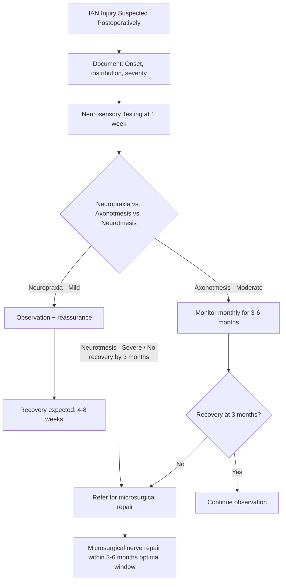

# Chapter 5: Dentoalveolar Surgery

*Simple and surgical extraction, impacted third molars, nerve injury management, dry socket, oroantral communication, alveoloplasty, pre-prosthetic surgery, coronectomy, and odontogenic infections for the OMS surgeon.*

---

## 5.1 Introduction

Dentoalveolar surgery remains the foundation of OMS clinical practice. While these procedures are the most frequently performed operations in the specialty, they are far from trivial. The management of impacted third molars, the prevention and treatment of complications (nerve injury, oroantral communication, alveolar osteitis), and the surgical management of odontogenic infections demand the same rigorous anatomical knowledge, surgical judgment, and evidence-based decision-making applied to any major surgical procedure. This chapter covers the full scope of dentoalveolar surgery as defined in AAOMS Parameters of Care (ParCare) Section 1.

---

## 5.2 Simple Extraction

### 5.2.1 Indications

- Non-restorable teeth (extensive caries, fracture below alveolar crest)
- Periodontal disease with hopeless prognosis (grade 3 mobility, furcation involvement)
- Orthodontic treatment planning (premolar extraction for crowding)
- Teeth in fracture line (when retention would compromise fracture healing)
- Pre-radiation therapy extraction of teeth with poor prognosis
- Pre-prosthetic extraction (for complete denture fabrication)

**CDT codes**:

- **D7111**: Extraction, coronal remnants -- deciduous tooth
- **D7140**: Extraction, erupted tooth or exposed root (simple extraction)

### 5.2.2 Principles and Technique

**Preoperative assessment**:

- Review radiographs (periapical or panoramic) for root morphology (number, curvature, divergence), root resorption, hypercementosis, ankylosis, proximity to vital structures (IAN canal, maxillary sinus, adjacent teeth)
- Medical history review with attention to anticoagulation, bisphosphonate use, radiation history, and immunosuppression

**Surgical principles**:

1. **Adequate anesthesia**: Confirm profound anesthesia before beginning. Supplement with infiltration if block anesthesia is incomplete.
2. **Soft tissue management**: Reflect soft tissue from the cervical region of the tooth using a periosteal elevator (Woodson, #9 Molt). Avoid excessive trauma to the gingiva.
3. **Luxation**: Use elevators (straight elevators, Cryer picks) to expand the alveolar socket and disrupt the periodontal ligament. The elevator is inserted into the PDL space and rotated to generate a wedging force. Apply force toward the path of least resistance (typically buccal, where bone is thinner).
4. **Delivery**: Use extraction forceps appropriate for the tooth and arch:
    - Upper universal (150): Upper premolars, anterior teeth
    - Lower universal (151): Lower premolars, anterior teeth
    - Upper molar (53R/53L): Upper molars (beak engages bifurcation)
    - Lower molar (17 or cowhorn 23): Lower molars
    - Upper third molar (210): Upper third molars
5. **Socket management**: Curette the socket to remove granulation tissue and confirm complete root removal. Apply direct pressure with gauze. Consider socket preservation (bone graft + membrane) if implant is planned (see Chapter 6).
6. **Closure**: Primary closure not typically needed for simple extraction. Ensure hemostasis with gauze pressure.

!!! tip "Clinical Pearl"
    **The physics of extraction**: Extraction is not about brute force. The elevator works by three mechanical principles: **wedge** (insertion into PDL space), **lever** (fulcrum on alveolar crest with force applied to root), and **wheel-and-axle** (rotation of the elevator in the socket). Understanding these mechanics allows efficient extraction with minimal bone removal and reduced fracture risk.

### 5.2.3 Root Tip Fracture Management

Root tip fractures occur in approximately 10-20% of extractions. Management depends on:

| Fragment Size | Location | Recommendation |
|---|---|---|
| **Apical third** (<5 mm), no pathology | Separated from IAN canal | Observation is acceptable if root tip is vital, not infected, and surgical retrieval would risk nerve injury or sinus communication. Document and inform patient. |
| **Middle or coronal third** | Any location | Retrieve surgically (purchase point technique, root tip picks, or surgical approach with bur) |
| **Any fragment** | Adjacent to IAN canal, within maxillary sinus, or associated with pathology (periapical lesion) | Retrieve surgically with appropriate technique and patient counseling |

---

## 5.3 Surgical Extraction

### 5.3.1 Indications

Surgical extraction is required when simple forceps extraction is not feasible:

- Teeth with unfavorable root morphology (severe curvature, dilaceration, hypercementosis)
- Teeth with inadequate crown for forceps engagement (fractured teeth, root remnants)
- Ankylosed teeth
- Roots in close proximity to vital structures requiring controlled removal
- Impacted or partially erupted teeth (see Section 5.4)

**CDT codes**:

- **D7210**: Extraction, erupted tooth requiring removal of bone and/or sectioning of tooth (surgical extraction)
- **D7220**: Removal of impacted tooth -- soft tissue
- **D7230**: Removal of impacted tooth -- partially bony
- **D7240**: Removal of impacted tooth -- completely bony
- **D7241**: Removal of impacted tooth -- completely bony, with unusual surgical complications

### 5.3.2 Surgical Technique

1. **Flap design**: Full-thickness mucoperiosteal flap with adequate exposure. Common designs:
    - **Envelope flap**: Sulcular incision extending two teeth mesial and one tooth distal to the extraction site. No vertical releasing incision. Provides adequate exposure for most surgical extractions.
    - **Three-cornered (triangular) flap**: Envelope flap plus one vertical releasing incision at the mesial extent, placed at a line angle of the adjacent tooth (not through the papilla). Provides greater flap mobility and exposure.
    - **Four-cornered flap**: Two vertical releasing incisions. Rarely needed; excessive for most dentoalveolar procedures.

2. **Bone removal**: Use a handpiece with a surgical bur (round or fissure bur, #4 or #8 round, 702 or 703 fissure) under copious irrigation to remove buccal bone overlying the roots. Remove only enough bone to expose the root structure and create a purchase point for elevators or to allow tooth sectioning.

3. **Tooth sectioning**: For multi-rooted teeth, section the tooth into individual roots using a fissure bur. This allows each root to be elevated along its own path of removal, reducing the force needed and minimizing bone loss.

4. **Root elevation**: Use elevators (Crane pick, root tip picks, Cryer elevators) to luxate and deliver individual roots.

5. **Socket management**: Debride, irrigate, and inspect the socket. Perform alveoloplasty if needed (see Section 5.8). Place hemostatic agents if indicated.

6. **Closure**: Reapproximate the mucoperiosteal flap and secure with interrupted or figure-of-eight sutures (3-0 or 4-0 chromic gut, Vicryl, or silk).

---

## 5.4 Impacted Third Molars

### 5.4.1 Epidemiology and Classification

Third molar impaction is present in approximately 73% of young adults in European-derived populations (Carter & Worthington, *Community Dent Health* 2015;32:1-5). The AAOMS defines impacted teeth as those that fail to fully erupt into a normal functional position by the expected time of eruption.

#### Classification Systems

**Pell and Gregory classification** (relationship to ramus and occlusal plane):

| Class | Relationship to Ramus |
|---|---|
| Class I | Sufficient space between ramus and distal of 2nd molar for M-D width of 3rd molar crown |
| Class II | Space between ramus and distal of 2nd molar is less than M-D width of 3rd molar crown |
| Class III | Third molar is entirely within the ramus |

| Position | Relationship to Occlusal Plane |
|---|---|
| Position A | Highest portion of crown at or above the occlusal plane |
| Position B | Highest portion of crown between the occlusal plane and cervical line of 2nd molar |
| Position C | Highest portion of crown below the cervical line of 2nd molar |

**Winter's classification** (angulation):

- **Mesioangular**: Most common (~43%); easiest to remove
- **Vertical**: Second most common (~38%)
- **Horizontal**: More difficult
- **Distoangular**: Least common; most difficult due to path of removal toward the ramus

### 5.4.2 Indications for Removal

The AAOMS (ParCare Section 1) and the 2016 AAOMS White Paper on Third Molar Management identify the following indications:

**Clear indications for removal**:

- Pericoronitis (acute or recurrent) -- ICD-10: K05.21 (aggressive periodontitis, localized)
- Non-restorable caries on the third molar
- Caries on the distal of the second molar caused by the third molar
- Periodontal disease (probing depth >= 5 mm distal to the second molar)
- Associated pathology (dentigerous cyst, odontogenic keratocyst, ameloblastoma)
- Resorption of the adjacent second molar root
- Teeth in fracture lines
- Pre-orthognathic surgery (BSSO -- removal 6 months before or at the time of surgery)
- Teeth obstructing reconstruction or interfering with prosthetic rehabilitation

**Prophylactic removal** (asymptomatic third molars):

- The AAOMS position supports removal of asymptomatic third molars when there is evidence of an inability to erupt into a functional position (true impaction) and when the risks of retention (pathology development, second molar damage) outweigh the risks of surgery.
- The NICE guidelines (UK) recommend against prophylactic removal, but this position has been criticized for not accounting for the cumulative lifetime risk of pathology associated with retained third molars (Dodson & Susarla, *J Oral Maxillofac Surg* 2010;68:155-161).

!!! tip "Clinical Pearl"
    The **Pedersen difficulty index** (Winter's classification + Pell & Gregory class/position + root morphology) provides a useful preoperative estimate of surgical difficulty. However, the single strongest predictor of surgical difficulty for mandibular third molars is **depth of impaction** (Pell & Gregory position C) and **root proximity to the IAN canal** on panoramic or CBCT imaging.

### 5.4.3 Surgical Technique for Mandibular Third Molars

1. **Flap**: Envelope or triangular flap with sulcular incision along the 2nd molar, extending posterolaterally over the retromolar area.

2. **Bone removal**: Remove buccal and distal bone overlying the crown using a bur. For deeper impactions, remove bone to expose the cervical line (CEJ). The goal is to create sufficient space for the tooth to be elevated along its path of withdrawal.

3. **Tooth sectioning**: For mesioangular impactions, section the crown from the roots at the cervical line. Remove the crown first (which creates space for the roots to be elevated mesially). For horizontal impactions, section vertically to divide mesial and distal portions.

4. **Root elevation**: Elevate roots using straight elevators, Crane picks, or root tip picks. Apply force in the direction of the path of least resistance (typically mesial and buccal for mesioangular impactions).

5. **Socket inspection and irrigation**: Ensure complete removal of all tooth structure. Irrigate with saline. Inspect for OAC (upper third molars), IAN canal exposure, and lingual plate perforation.

6. **Closure**: Primary closure with interrupted or continuous sutures.

### 5.4.4 Maxillary Third Molars

Maxillary third molar extraction is generally less difficult than mandibular due to thinner, more elastic buccal bone. Key considerations:

- **Relationship to maxillary sinus**: The roots of upper third molars frequently project into or near the maxillary sinus floor. OAC risk is approximately 5-10% for upper molar extractions.
- **Tuberosity fracture**: The maxillary tuberosity may fracture during extraction, particularly in patients with large pneumatized sinuses and thin alveolar bone. If the tuberosity fragment is mobile with the tooth, attempt to separate it; if it remains attached to periosteum, stabilize and suture in place.
- **Displacement into infratemporal fossa**: A rare but challenging complication of upper third molar extraction. If the tooth is displaced posterosuperiorly, do not attempt blind retrieval. Obtain CT imaging and plan a controlled surgical retrieval (CDT D7241).

---

## 5.5 Nerve Injury in Dentoalveolar Surgery

### 5.5.1 Inferior Alveolar Nerve (IAN) Injury

**Incidence**: Temporary IAN injury after third molar surgery: 0.4-8.4%; permanent (>6 months): 0.04-3.6% (Renton et al., *Int J Oral Maxillofac Surg* 2005;34:252-256; Pogrel, *J Oral Maxillofac Surg* 2007;65:1486-1489).

**Risk factors**:

- Close radiographic relationship between roots and IAN canal (darkening of root, deflection of canal, narrowing of canal, loss of canal cortication on panoramic; direct contact on CBCT)
- Horizontal and distoangular impaction
- Increasing age (>25 years)
- Deeper impaction (Pell & Gregory position C)
- Surgeon experience (lower complication rates with experienced surgeons)

**Prevention**:

- CBCT evaluation when panoramic signs suggest IAN proximity (AAOMS ParCare Section 1)
- Consider coronectomy for teeth with confirmed intimate root-canal contact (see Section 5.9)
- Careful surgical technique: avoid excessive force on the lingual aspect; use controlled elevation techniques

**Management algorithm**:

**Neurosensory testing** (Zuniga & Essick, *Oral Maxillofac Surg Clin North Am* 2007):

- **Static light touch** (Von Frey monofilaments)
- **Two-point discrimination** (normal: 8-12 mm for lower lip)
- **Pin-prick discrimination** (sharp/dull)
- **Directional sensitivity** (brush stroke direction)
- **Temperature discrimination** (warm/cold)

### 5.5.2 Lingual Nerve Injury

**Incidence**: Temporary: 0.5-2%; permanent: 0.1-0.6% (Renton et al., *Int J Oral Maxillofac Surg* 2005;34:252-256).

**Risk factors**:

- Lingual flap retraction (controversial -- Pichler & Beirne, *J Oral Maxillofac Surg* 2001)
- Lingual bone removal or lingual split technique
- Deeper impaction with lingual angulation
- Aberrant nerve position (submucosal, at or above the alveolar crest in 17.6% of dissections per Pogrel et al., 1995)

**Prevention**:

- Avoid routine lingual flap retraction (the evidence does not support routine lingual nerve retraction as a protective measure; it may paradoxically increase injury risk)
- Avoid lingual bone removal unless absolutely necessary
- Use extreme caution with elevators on the lingual aspect of third molar sockets
- Place incisions on the buccal aspect; avoid lingual soft tissue manipulation

**Management**: Same algorithm as IAN injury. Referral for microsurgical repair (direct neurorrhaphy or interpositional nerve graft) if no recovery by 3 months. Lingual nerve injuries have a lower rate of spontaneous recovery than IAN injuries.

!!! danger "Critical Safety"
    If a patient reports numbness/altered sensation of the **tongue** (taste or sensation) immediately postoperatively, document meticulously, including the distribution and severity of the deficit. Persistent complete anesthesia of the tongue at 4-6 weeks with no improvement is an indication for urgent referral for microsurgical evaluation. The optimal window for surgical repair is **within 3-6 months** of injury; delays beyond 12 months significantly reduce the success of microsurgical repair (Ziccardi et al., *J Oral Maxillofac Surg* 2009;67:1250-1256).

---

## 5.6 Alveolar Osteitis (Dry Socket)

### 5.6.1 Pathophysiology

Alveolar osteitis (AO) is the most common complication of tooth extraction, occurring in approximately 1-5% of routine extractions and 20-30% of mandibular third molar extractions (Blum, *J Am Dent Assoc* 2002;133:453-461). It results from premature loss or lysis of the blood clot, leaving exposed bone in the extraction socket. The exact etiology is multifactorial: bacterial fibrinolysis (predominantly anaerobic organisms), local fibrinolytic activity (tissue activators of plasminogen), and mechanical clot disruption.

### 5.6.2 Risk Factors

- **Tobacco use**: Strongest modifiable risk factor (2-4x increased risk). Nicotine causes local vasoconstriction and may have direct fibrinolytic effects (Sweet & Butler, *J Oral Maxillofac Surg* 1979;37:732-735).
- **Oral contraceptives**: Estrogen may increase fibrinolytic activity. Consider timing extraction during the low-estrogen phase (days 23-28) or using antifibrinolytic agents.
- **Surgical trauma**: More extensive bone removal, prolonged procedure time, and difficult extractions increase risk.
- **Mandibular molars**: Highest incidence site due to dense bone, reduced blood supply, and increased bacterial counts.
- **Previous dry socket**: Predisposes to recurrence.
- **Poor oral hygiene**: Increased bacterial load.

### 5.6.3 Prevention

- **Chlorhexidine** (0.12% rinse or 0.2% gel): Perioperative chlorhexidine rinse reduces AO incidence by approximately 50% (Caso et al., *Int J Oral Maxillofac Surg* 2005;34:260-266).
- **Intra-alveolar chlorhexidine gel**: Placed into the socket at the time of extraction.
- **Tranexamic acid**: Antifibrinolytic agent; 10 mL of 4.8% solution as a mouth rinse or intra-socket placement.
- **Smoking cessation counseling**: Recommend abstinence for at least 48-72 hours postoperatively.
- **Atraumatic technique**: Minimize bone removal and surgical trauma.

### 5.6.4 Treatment

AO is typically self-limiting (resolves in 7-10 days) but causes severe pain warranting treatment:

1. **Irrigation**: Gently irrigate the socket with warm saline or chlorhexidine to remove debris.
2. **Medicated dressing**: Place a eugenol-based dressing (Dry Socket Paste, Alvogyl) or iodoform gauze (Nu-Gauze) lightly into the socket. The dressing should be replaced every 1-3 days until symptoms resolve (typically 2-3 dressing changes). ICD-10: M27.3 (alveolitis of jaws).
3. **Analgesics**: NSAIDs (ibuprofen 600 mg q6h) are usually adequate. Opioids are rarely needed if the socket is properly dressed.
4. **Antibiotics**: Not routinely indicated for uncomplicated AO. Consider if signs of spreading infection are present.
5. **Do NOT curette the socket** aggressively -- this removes granulation tissue and delays healing.

---

## 5.7 Oroantral Communication and Fistula

### 5.7.1 Anatomy and Etiology

Oroantral communication (OAC) is a pathological communication between the oral cavity and the maxillary sinus. The maxillary sinus floor is intimately related to the apices of the premolars and molars, with an average bone thickness of 0.5-2 mm at the first and second molar regions.

**Incidence**: OAC occurs in approximately 0.5-5% of maxillary molar extractions (del Rey-Santamaria et al., *Med Oral Patol Oral Cir Bucal* 2006;11:E334-E338).

**Diagnosis**:

- **Intraoperative**: Visualize the perforation through the socket; observe a buccal or septal/sinus mucosal tear; gently probe the socket apex (avoid aggressive probing that could enlarge a small communication)
- **Valsalva test**: Ask the patient to attempt to blow through the nose while pinching the nostrils closed. Passage of air through the socket confirms OAC. **Use this test judiciously** -- excessive pressure can enlarge a small communication.
- **Postoperative**: Patient reports fluid passage from mouth to nose during drinking, inability to create suction (e.g., with a straw), or nasal congestion/discharge

### 5.7.2 Management

| Communication Size | Timing | Management |
|---|---|---|
| **Small** (<2 mm) | Immediate | Socket hemostasis, collagen plug or gelatin sponge in socket, figure-of-eight suture, sinus precautions x 2 weeks. Most heal spontaneously. CDT D7261 |
| **Moderate** (2-6 mm) | Immediate | Primary closure with buccal advancement flap. CDT D7261 |
| **Large** (>6 mm) | Immediate | Buccal advancement flap, buccal fat pad flap, or combination. CDT D7261 |
| **Any size** | >48 hours (established OAC or OAF) | Surgical closure required. Buccal advancement flap, palatal rotation flap, or buccal fat pad flap. CDT D7261 |

**Buccal advancement flap technique**:

1. Raise a full-thickness mucoperiosteal flap with two vertical releasing incisions
2. Make a periosteal releasing incision at the base of the flap (through periosteum only, not mucosa) to allow tension-free advancement over the defect
3. Debride the fistula tract (if chronic) and freshen the bony margins
4. Advance the flap and suture to the palatal mucosa with interrupted sutures
5. Prescribe sinus precautions: no nose blowing, no straw use, sneeze with mouth open, decongestant spray (oxymetazoline 0.05% BID x 3 days), antibiotics (amoxicillin/clavulanate 875 mg BID x 10 days)

**Sinus precautions** (standard postoperative instructions for all upper molar extractions):

- No nose blowing for 2 weeks
- Sneeze with mouth open
- No drinking through straws
- No smoking
- Decongestant if indicated

!!! warning "Surgical Caution"
    If a **root tip is displaced into the maxillary sinus** during extraction, do not attempt blind retrieval through the socket. Obtain a CBCT or CT to localize the fragment. Small root tips may be observed if asymptomatic (some will be expectorated or resorbed), but most require surgical retrieval via a Caldwell-Luc approach or endoscopic sinus surgery. ICD-10: T81.599A (other complications of foreign body accidentally left in body following other procedure).

---

## 5.8 Alveoloplasty and Pre-Prosthetic Surgery

### 5.8.1 Alveoloplasty

Alveoloplasty is the surgical reshaping of the alveolar ridge to create a smooth, well-contoured foundation for prosthetic rehabilitation.

**Indications**:

- Sharp or irregular alveolar ridge following extraction (especially multiple extractions)
- Bony undercuts interfering with denture insertion and stability
- Exostoses (tori, buccal exostoses) interfering with prosthesis fabrication or fit

**CDT codes**:

- **D7310**: Alveoloplasty in conjunction with extractions -- four or more teeth or tooth spaces, per quadrant
- **D7311**: Alveoloplasty in conjunction with extractions -- one to three teeth or tooth spaces, per quadrant
- **D7320**: Alveoloplasty not in conjunction with extractions -- four or more teeth or tooth spaces, per quadrant
- **D7321**: Alveoloplasty not in conjunction with extractions -- one to three teeth or tooth spaces, per quadrant

**Technique**:

1. Raise a mucoperiosteal flap to expose the alveolar ridge
2. Use a rongeur to remove gross bony irregularities
3. Smooth the ridge with a bone file or rotary bur under irrigation
4. Palpate through the flap to confirm a smooth contour
5. Irrigate, reapproximate the flap, and suture (excise redundant soft tissue if needed for tension-free closure)
6. Immediate or delayed denture placement per the prosthetic treatment plan

### 5.8.2 Torus Removal

**Torus palatinus**: Midline bony exostosis of the hard palate. Present in approximately 20-25% of the US population. Removal indicated when it interferes with denture fabrication, speech, or causes mucosal ulceration.

**Technique**: Midline palatal incision (or "Y" incision for large tori), raise mucoperiosteal flaps bilaterally, section the torus with a fissure bur, remove sections with osteotome and mallet, smooth with bone file, closure with interrupted sutures. CDT D7473 (removal of torus palatinus).

**Torus mandibularis**: Bilateral bony exostosis on the lingual aspect of the mandible, typically at the premolar level, above the mylohyoid line. Present in approximately 5-10% of the population. Removal indicated when interfering with denture fabrication or periodontal maintenance.

**Technique**: Lingual crestal incision, raise lingual mucoperiosteal flap (protect lingual nerve), section and remove torus, smooth with bone file, closure. CDT D7472 (removal of torus mandibularis).

!!! warning "Surgical Caution"
    When removing **mandibular tori**, the lingual nerve is at risk. It courses along the lingual cortex of the mandible and may be draped over or intimately associated with large tori. Use careful subperiosteal dissection and protect the nerve with a retractor. Additionally, aggressive osteotomy near large mandibular tori can fracture the mandible if the torus comprises a significant proportion of the cross-sectional area.

### 5.8.3 Other Pre-Prosthetic Procedures

- **Vestibuloplasty**: Surgical deepening of the vestibule to increase denture-bearing area. Techniques include mucosal advancement (Clark technique), secondary epithelialization (Kazanjian), and skin grafting (Obwegeser). CDT D7340 (vestibuloplasty -- ridge extension).
- **Frenectomy**: Excision of a high labial frenum that causes diastema, denture displacement, or gingival recession. CDT D7410 (excision of benign lesion up to 1.25 cm) or D7411 (excision >1.25 cm).
- **Ridge augmentation**: Bone grafting of deficient alveolar ridges for implant placement (covered in Chapter 6).
- **Genial tubercle reduction**: Reduction of prominent genial tubercles in severely atrophic mandibles that interfere with denture fabrication.
- **Mylohyoid ridge reduction**: Smoothing of a sharp mylohyoid ridge that causes pain under a mandibular denture.

---

## 5.9 Coronectomy

### 5.9.1 Definition and Rationale

Coronectomy (intentional partial odontectomy or deliberate partial removal) is the surgical removal of the crown of a tooth while intentionally leaving the roots in situ. The primary indication is the management of **mandibular third molars with roots in intimate contact with the IAN canal**, where complete extraction carries a high risk of permanent IAN injury.

### 5.9.2 Indications

- Mandibular third molar with radiographic evidence of direct contact with the IAN canal on CBCT (canal coursing between or through the roots; loss of canal cortication adjacent to roots)
- Patient willing to accept the risk of retained roots (which may require future removal if they migrate or become symptomatic)

### 5.9.3 Contraindications

- Active infection or pericoronitis at the time of surgery
- Horizontally impacted teeth where the crown cannot be sectioned without risk to the canal
- Teeth with root pathology (periapical lesion involving the roots)
- Teeth requiring removal for pathologic or oncologic reasons
- Tooth mobility (suggests that roots will be mobilized during crown removal, negating the protective benefit)

### 5.9.4 Technique

1. Standard surgical flap for third molar access
2. Section the crown at the CEJ using a high-speed fissure bur under copious irrigation
3. **Critical**: Ensure the root complex is NOT mobilized during crown removal. If the roots become mobile, they must be removed entirely (the protective benefit of coronectomy is lost if the roots are displaced into the canal area).
4. Reduce the root surface to 2-3 mm below the alveolar crest (to allow bone coverage and reduce infection risk)
5. Irrigate, close the flap primarily

### 5.9.5 Outcomes

- **IAN injury rate**: 0% in most coronectomy series vs. 2-8% for complete extraction of high-risk teeth (Renton et al., *Br J Oral Maxillofac Surg* 2005;43:7-12; Leung & Cheung, *J Oral Maxillofac Surg* 2009;67:1806-1815).
- **Root migration**: Roots migrate coronally an average of 2-3 mm over 1-3 years in approximately 30-80% of cases. Migration does not typically cause symptoms and moves the roots further from the IAN canal.
- **Secondary surgery** (need for root removal): 2-5% of cases, typically due to root migration to a superficial position where they are palpable or symptomatic. Second surgery is generally straightforward because the roots have migrated away from the IAN canal.
- **Infection/failure**: 2-12% (root infection, exposure, or mobilization requiring secondary removal).

!!! tip "Clinical Pearl"
    Coronectomy is a **nerve-sparing strategy**, not a "lesser" procedure. When CBCT confirms direct root-IAN contact in a symptomatic third molar, coronectomy reduces the risk of permanent IAN injury from approximately 5-8% to near zero, with an acceptable secondary surgery rate. It should be offered as the **standard of care** for high-risk third molars, with full informed consent regarding the possibility of future root removal.

---

## 5.10 Odontogenic Infections

### 5.10.1 Pathophysiology and Microbiology

Odontogenic infections arise from necrotic dental pulp (periapical abscess) or periodontal disease (periodontal abscess, pericoronitis). The infection begins as a localized periapical abscess, then perforates the cortical bone and enters the fascial spaces of the head and neck (see Chapter 1, Section 1.5.2 for fascial space anatomy).

**Microbiology**: Polymicrobial (see Chapter 4, Section 4.3.2). The S. anginosus group (formerly S. milleri) is the most pathogenic aerobic component, with a strong propensity for abscess formation. Anaerobes (Prevotella, Fusobacterium, Peptostreptococcus) dominate in mature infections.

### 5.10.2 Clinical Assessment and Staging

| Stage | Clinical Features | Management |
|---|---|---|
| **Stage 1: Periapical abscess** | Localized swelling at the affected tooth, tender to percussion, +/- fluctuance intraorally | Source control (extraction or endodontic access), +/- I&D if fluctuant, +/- oral antibiotics |
| **Stage 2: Vestibular space abscess** | Swelling in the buccal vestibule, localized fluctuance | I&D (intraoral), source control, oral antibiotics |
| **Stage 3: Single fascial space involvement** | Submandibular, sublingual, or other single space involvement. Mild-moderate trismus. Low-grade fever | I&D (intraoral or extraoral depending on space), source control, IV antibiotics (may convert to PO after 48 hr improvement) |
| **Stage 4: Multiple fascial space involvement** | Two or more spaces involved. Moderate-severe trismus. Fever, tachycardia, elevated WBC. Possible dysphagia or dyspnea. | Urgent CT with contrast, I&D under GA (intraoral and/or extraoral with drains), IV antibiotics, airway monitoring, ICU admission if airway at risk |
| **Stage 5: Ludwig angina / mediastinal extension** | Bilateral submandibular, sublingual, submental involvement. Floor of mouth elevation. Airway compromise imminent. Sepsis possible. | **Emergent**: Secure airway (awake fiberoptic intubation or surgical airway), aggressive I&D under GA, IV antibiotics, ICU admission |

### 5.10.3 Surgical Drainage Principles

**"Ubi pus, ibi evacua"** (Where there is pus, drain it):

1. **Source control**: Remove the offending tooth (or perform endodontic access if the tooth is restorable)
2. **Incision and drainage**: Incise through mucosa/skin at the most dependent point of the abscess, enter the abscess cavity bluntly (hemostat spread technique), break up loculations, irrigate with saline
3. **Drain placement**: Place a Penrose drain (1/4 inch) or vessel loop drain, secured with a suture, to maintain drainage. Drains are removed when output decreases (<10 mL/day) and clinical improvement is evident (typically 2-5 days).
4. **Culture**: Send purulent material for aerobic, anaerobic, and sensitivity testing. Adjust antibiotics based on culture results (de-escalation principle).
5. **Re-evaluation**: Daily assessment for the first 48-72 hours. If no improvement (persistent fever, spreading infection), repeat imaging (CT with contrast) and consider re-drainage.

### 5.10.4 Ludwig Angina

**Definition**: A rapidly progressive, bilateral cellulitis of the submandibular, sublingual, and submental spaces. Named by Karl Friedrich Wilhelm von Ludwig (1836). ICD-10: K12.2.

**Clinical features**:

- Bilateral firm, "woody" induration of the submandibular region (board-like swelling)
- Elevation and posterior displacement of the tongue (can obstruct the airway)
- Drooling, dysphagia, odynophagia
- Fever, toxic appearance
- Trismus is often NOT present (infection is anterior to the pterygoid muscles)

**Airway management**:

- The primary cause of death in Ludwig angina is airway obstruction
- Awake fiberoptic intubation is the preferred airway technique
- If intubation fails: surgical airway (cricothyrotomy or tracheotomy under local anesthesia)
- Blind nasotracheal intubation is contraindicated (distorted anatomy, risk of hemorrhage)

!!! danger "Critical Safety"
    **Ludwig angina is a life-threatening emergency**. The mortality rate is approximately 4-10% with modern management but can reach 50%+ if airway management is delayed. The key sequence: (1) Secure the airway, (2) IV antibiotics (ampicillin/sulbactam 3 g IV + metronidazole 500 mg IV, or clindamycin 600-900 mg IV if PCN-allergic), (3) Aggressive I&D under GA with bilateral submandibular, sublingual, and submental drainage, (4) ICU admission for monitoring. Do NOT delay airway management to obtain imaging (Costain & Marrie, *Am J Med* 2011;124:115-117).

### 5.10.5 Necrotizing Fasciitis of the Head and Neck

**Definition**: A rare but rapidly fatal soft tissue infection characterized by necrosis of the fascia and subcutaneous tissue, with or without skin involvement. Cervicofacial necrotizing fasciitis of odontogenic origin carries a mortality rate of 10-40% (Bahu et al., *Otolaryngol Head Neck Surg* 2006;134:991-996).

**Clinical features**:

- Rapidly spreading erythema, edema, and pain disproportionate to clinical appearance
- Skin changes: erythema progressing to dusky/purple discoloration, bullae, crepitus (gas-forming organisms), skin necrosis
- Systemic toxicity: high fever, tachycardia, hypotension, sepsis, multi-organ dysfunction

**Diagnosis**: Clinical suspicion is paramount. CT with contrast shows fascial thickening, gas tracking along fascial planes, and abscess. **Do not delay surgical exploration for imaging** if clinical suspicion is high.

**Management**:

1. Emergent surgical debridement under GA: wide excision of all necrotic tissue until healthy, bleeding tissue is encountered. Multiple re-explorations and debridements (every 24-48 hours) are typically needed.
2. IV antibiotics: Broad-spectrum empiric therapy (meropenem 1 g q8h + vancomycin 15 mg/kg q12h + clindamycin 600-900 mg q8h). Clindamycin is added for its anti-toxin effect (inhibits bacterial protein synthesis, reducing toxin production).
3. ICU admission with aggressive resuscitation (fluids, vasopressors, mechanical ventilation)
4. Wound management: Negative pressure wound therapy (VAC) after debridement; delayed closure or reconstruction after infection control

---

## 5.11 Postoperative Management and Complications

### 5.11.1 Standard Postoperative Instructions (Third Molar Surgery)

- **Hemostasis**: Bite on gauze for 30-60 minutes. Change gauze as needed for the first 2-4 hours. Tea bag (tannic acid promotes vasoconstriction) can be used if oozing persists.
- **Ice**: Apply ice packs to the lateral face (20 minutes on, 20 minutes off) for the first 24-48 hours to reduce edema.
- **Diet**: Soft diet for 1-2 weeks. Adequate hydration. Avoid hot foods for the first 24 hours.
- **Oral hygiene**: Gentle tooth brushing starting day 1 (avoid surgical site). Warm salt water rinses (1/2 teaspoon salt in 8 oz water) starting day 2, after each meal.
- **Activity**: Avoid strenuous activity for 48-72 hours (increases bleeding risk).
- **Medications**: As prescribed (see Chapter 4 for multimodal analgesia protocol).
- **Tobacco/alcohol**: Avoid for at least 5-7 days (smoking) and 24-48 hours (alcohol, especially if taking analgesics).

### 5.11.2 Complication Summary

| Complication | Incidence | Prevention | Treatment |
|---|---|---|---|
| **Alveolar osteitis** | 1-5% (routine); 20-30% (mandibular 3rds) | CHX rinse, atraumatic technique, smoking cessation | Irrigation, medicated dressing (see Section 5.6) |
| **Infection** | 1-5% | Prophylactic antibiotics (high-risk), aseptic technique | I&D, source control, antibiotics (see Section 5.10) |
| **IAN injury** | 0.4-8.4% (temporary); 0.04-3.6% (permanent) | CBCT, coronectomy, careful technique | Monitor, neurosensory testing, microsurgical repair if no recovery (see Section 5.5) |
| **Lingual nerve injury** | 0.5-2% (temporary); 0.1-0.6% (permanent) | Avoid lingual retraction, careful technique | Monitor, microsurgical repair if no recovery (see Section 5.5) |
| **OAC** | 0.5-5% (upper molars) | Careful technique, preop imaging | Immediate closure or observation (small), buccal flap (see Section 5.7) |
| **Hemorrhage** | 0.2-5.8% | Preop assessment (anticoagulants), local hemostasis | Pressure, packing, hemostatic agents, tranexamic acid, return to OR if persistent |
| **Mandible fracture** | <0.005% (third molar extraction) | Avoid excessive force, identify pre-existing pathology | ORIF (see Chapter 8) |
| **Root displacement (sinus)** | Rare (<0.5%) | Careful technique, avoid apical pressure | CT localization, Caldwell-Luc or endoscopic retrieval |
| **Trismus** | 10-20% (temporary) | Minimize surgical trauma, corticosteroids | Warm compresses, jaw exercises, time (resolves 1-4 weeks) |
| **Ecchymosis** | 5-15% | Corticosteroids, gentle tissue handling | Reassurance (resolves 7-14 days) |

---

## 5.12 Summary

Dentoalveolar surgery encompasses the highest-volume procedures in OMS practice, from simple extractions to complex impacted third molar management and the treatment of life-threatening odontogenic infections. Despite their frequency, these procedures demand meticulous attention to anatomy, careful preoperative planning (particularly with respect to IAN and lingual nerve proximity), evidence-based decision-making (including the strategic use of coronectomy for nerve-sparing surgery), and systematic postoperative management. Mastery of dentoalveolar surgery -- including the recognition and management of its complications -- is the foundation upon which all advanced OMS practice is built.

---

## References

1. AAOMS. Parameters of Care: Clinical Practice Guidelines for Oral and Maxillofacial Surgery (ParCare), Section 1: Dentoalveolar Surgery. 6th Edition. 2017.
2. AAOMS. White Paper on third molar data. 2016.
3. Bahu SJ, Shibuya TY, Meleca RJ, et al. Craniocervical necrotizing fasciitis: an 11-year experience. *Otolaryngol Head Neck Surg*. 2001;125(3):245-252.
4. Blum IR. Contemporary views on dry socket (alveolar osteitis): a clinical appraisal of standardization, aetiopathogenesis and management: a critical review. *Int J Oral Maxillofac Surg*. 2002;31(3):309-317.
5. Carter K, Worthington S. Predictors of third molar impaction: a systematic review and meta-analysis. *J Dent Res*. 2016;95(3):267-276.
6. Caso A, Hung LK, Beirne OR. Prevention of alveolar osteitis with chlorhexidine: a meta-analytic review. *Oral Surg Oral Med Oral Pathol Oral Radiol Endod*. 2005;99(2):155-159.
7. Costain N, Marrie TJ. Ludwig's angina. *Am J Med*. 2011;124(2):115-117.
8. del Rey-Santamaria M, Valmaseda-Castellon E, Berini-Aytes L, Gay-Escoda C. Incidence of oral sinus communications in 389 upper third molar extraction. *Med Oral Patol Oral Cir Bucal*. 2006;11(4):E334-E338.
9. Dodson TB, Susarla SM. Impacted wisdom teeth. *BMJ Clin Evid*. 2014;2014:1302.
10. Leung YY, Cheung LK. Safety of coronectomy versus excision of wisdom teeth: a randomized controlled trial. *Oral Surg Oral Med Oral Pathol Oral Radiol Endod*. 2009;108(6):821-827.
11. Pogrel MA. Permanent nerve damage from inferior alveolar nerve blocks: a current update. *J Calif Dent Assoc*. 2007;35(4):271-276.
12. Pogrel MA, Renaut A, Schmidt B, et al. The relationship of the lingual nerve to the mandibular third molar region. *J Oral Maxillofac Surg*. 1995;53(10):1178-1181.
13. Renton T, McGurk M. Evaluation of factors predictive of lingual nerve injury in third molar surgery. *Br J Oral Maxillofac Surg*. 2001;39(6):423-428.
14. Renton T, Hankins M, Sproate C, McGurk M. A randomised controlled clinical trial to compare the incidence of injury to the inferior alveolar nerve as a result of coronectomy and removal of mandibular third molars. *Br J Oral Maxillofac Surg*. 2005;43(1):7-12.
15. Sweet JB, Butler DP. The relationship of smoking to localized osteitis. *J Oral Surg*. 1979;37(10):732-735.
16. Ziccardi VB, Rivera L, Gomes J. Comparison of lingual and inferior alveolar nerve microsurgery outcomes. *Quintessence Int*. 2009;40(4):295-301.
17. Zuniga JR, Essick GK. A contemporary approach to the clinical evaluation of trigeminal nerve injuries. *Oral Maxillofac Surg Clin North Am*. 2007;19(2):149-168.
