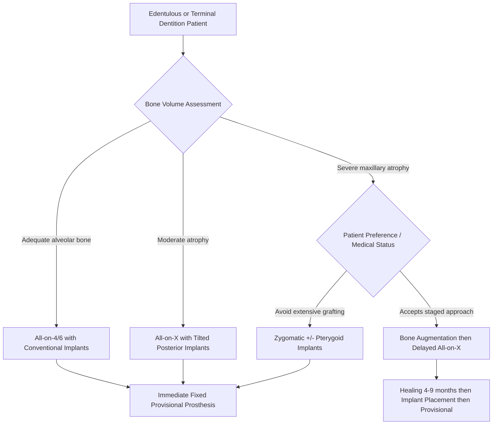

# Chapter 6: Dental Implantology

*Implant systems, surgical placement, bone augmentation, advanced protocols, and management of complications.*

---

## Introduction

Dental implantology has become the standard of care for the replacement of missing teeth, and the oral and maxillofacial surgeon occupies a central role in the surgical phase of implant therapy. The scope of OMS implant surgery extends far beyond straightforward fixture placement: it encompasses complex bone augmentation, sinus grafting, immediate loading protocols, zygomatic and pterygoid implants for the severely atrophic maxilla, computer-guided and robotic-assisted surgery, and the management of biological complications including peri-implantitis and implant failure.

This chapter addresses implantology at the level expected of a full-scope OMS practitioner, integrating current evidence with practical surgical technique.

---

## Implant Design and Systems

### Implant Macrogeometry

Modern root-form endosseous implants share a common threaded cylindrical or tapered architecture, but differ significantly in thread design, taper, connection type, and surface treatment. Key design variables include:

| Parameter | Options | Clinical Significance |
|---|---|---|
| **Body shape** | Parallel-walled vs. tapered | Tapered designs improve primary stability in soft bone (Type III/IV); parallel-walled designs distribute load more evenly in dense bone |
| **Thread design** | V-thread, buttress, reverse buttress, microthread | Buttress threads maximize compressive load transfer; microthreads at the collar reduce crestal bone loss (Hansson, *Clin Implant Dent Relat Res* 2003) |
| **Connection** | External hex, internal hex, conical (Morse taper) | Conical connections reduce microgap and bacterial colonization; superior joint stability under off-axis loading (Zipprich et al., *Int J Oral Maxillofac Implants* 2007) |
| **Platform switching** | Matched vs. switched | Platform switching shifts the inflammatory cell infiltrate inward, preserving crestal bone (Lazzara & Porter, *Int J Periodontics Restorative Dent* 2006) |

### Implant Surface Treatment

Osseointegration kinetics are heavily influenced by surface topography and chemistry. Current surface modifications include:

- **SLA (sandblasted, large-grit, acid-etched)**: Straumann standard; Sa roughness ~1.5 um. Considered the gold standard moderate-roughness surface (Buser et al., *J Biomed Mater Res* 2004).
- **SLActive (hydrophilic SLA)**: Chemically modified SLA processed under nitrogen to maintain hydroxylated surface. Accelerates early osseointegration and permits loading at 3-4 weeks (Lang et al., *Clin Oral Implants Res* 2011).
- **TiUnite (Nobel Biocare)**: Anodic oxidation producing a moderately rough, microporous TiO2 surface with increased phosphorus content.
- **Laser-Lok (BioHorizons)**: Laser-machined microchannels at the collar designed to promote connective tissue attachment and inhibit epithelial downgrowth.
- **Resorbable blasting media (RBM)**: Calcium phosphate particle blasting; surfaces are slightly less rough than SLA (~1.0-1.2 um Sa).

### Major Implant Systems in OMS Practice

The full-scope OMS surgeon should have familiarity with multiple systems:

- **Straumann BLX/BLT**: Tissue-level and bone-level options; BLX designed for immediate protocols with high primary stability in compromised sites.
- **Nobel Biocare NobelActive/NobelParallel**: Tapered, variable-thread design with aggressive self-tapping; widely used for All-on-4.
- **Zimmer Biomet (TSV/T3)**: Tapered Screw-Vent with trabecular metal technology.
- **Dentsply Sirona (Astra Tech EV)**: OsseoSpeed fluoride-modified surface with MicroThread collar.
- **BioHorizons (Tapered Internal)**: Laser-Lok collar with internal hex.

!!! tip "Clinical Pearl"
    System selection should be driven by case-specific requirements (bone quality, loading protocol, prosthetic plan) rather than brand loyalty. Maintain proficiency in at least 2-3 systems to handle the full spectrum of clinical scenarios.

---

## Treatment Planning

### Radiographic Assessment

Three-dimensional imaging with cone-beam computed tomography (CBCT) is the standard of care for implant planning (AAOMS ParCare, Parameters for Dental Implant Placement). CBCT provides:

- Accurate measurement of bone height, width, and density
- Identification of vital structures (inferior alveolar nerve canal, mental foramen, maxillary sinus floor, nasopalatine canal, lingual concavity of the mandible)
- Detection of pathology (residual cysts, foreign bodies, retained roots)

!!! danger "Critical Safety"
    The lingual concavity of the anterior mandible is a frequently underappreciated anatomic hazard. Perforation of the lingual cortex during implant placement in the interforaminal region can lacerate the sublingual artery or its branches, causing a rapidly expanding floor-of-mouth hematoma with potential airway compromise. CBCT cross-sectional analysis is mandatory for anterior mandibular implants (Kalpidis & Setayesh, *J Oral Maxillofac Surg* 2004).

### Prosthetically Driven Planning

The "restorative-first" philosophy dictates that implant position must satisfy prosthetic requirements. Key elements:

- Diagnostic wax-up or digital tooth setup defining ideal tooth position
- Virtual implant placement in planning software (e.g., coDiagnostiX, Implant Studio, BlueSkyPlan) ensuring:
    - 3D position within the prosthetic envelope
    - Adequate bone volume or planned augmentation
    - At least 1.5 mm from adjacent teeth, at least 3 mm between implants
    - At least 2 mm from the inferior alveolar canal
    - Emergence profile compatible with screw-retained or cement-retained restoration

### Bone Classification

The Lekholm and Zarb classification (1985) remains clinically useful:

| Type | Description | Location Predilection |
|---|---|---|
| **I** | Homogeneous dense cortical | Anterior mandible (symphysis) |
| **II** | Thick cortical bone surrounding dense trabecular core | Anterior mandible, premolar mandible |
| **III** | Thin cortical bone surrounding dense trabecular core | Posterior mandible, anterior maxilla |
| **IV** | Thin cortical bone surrounding sparse trabecular core | Posterior maxilla |

!!! warning "Surgical Caution"
    Type IV bone in the posterior maxilla demands modified surgical technique: undersized osteotomy, osteotome condensation, or selection of tapered implants with aggressive thread design to achieve adequate primary stability (insertion torque of 25 Ncm or greater for conventional loading, 35 Ncm or greater for immediate loading).

---

## Surgical Placement Techniques

### Conventional (Freehand) Placement

The standard two-stage protocol (Branemark) involves:

1. **Flap design**: Mid-crestal or slightly palatal/lingual incision with full-thickness mucoperiosteal flap elevation.
2. **Osteotomy**: Sequential drilling using the manufacturer's protocol at 800-1,500 rpm under copious sterile saline irrigation. Begin with a pilot drill (2.0 mm), advance through intermediate drills to the final diameter (typically 0.5-0.8 mm less than implant diameter depending on bone density).
3. **Implant insertion**: Handpiece at 20-35 rpm or manual ratchet. Target insertion torque 30-50 Ncm for standard protocols.
4. **Cover screw placement** (two-stage) or **healing abutment** (one-stage/immediate).
5. **Closure**: Tension-free primary closure for submerged healing; periosteal releasing incisions as needed.

### Computer-Guided Surgery

Static guided surgery uses a stereolithographic surgical template fabricated from the virtual plan. Key considerations:

- **Fully guided**: All drills and implant insertion through the guide; eliminates angulation/depth errors.
- **Partially guided**: Pilot drill through guide, final drills/insertion freehand.
- **Accuracy**: Mean deviation at the implant platform is 1.0-1.2 mm and 3.5 degrees angulation with static guides (Tahmaseb et al., *Int J Oral Maxillofac Implants* 2018 meta-analysis).
- **Flapless surgery**: Guides permit flapless placement when adequate keratinized tissue and bone width exist, reducing morbidity and surgical time.

!!! tip "Clinical Pearl"
    Fully guided surgery is particularly valuable for immediate full-arch protocols (All-on-4/All-on-X), where precise parallelism and prosthetic emergence are critical for same-day provisional delivery.

### Robotic-Assisted Placement (Yomi System)

The Yomi robotic system (Neocis, Inc.) represents a paradigm shift in implant placement, providing real-time haptic guidance during surgery:

- **Preoperative planning**: CBCT-based plan imported into the Yomi software.
- **Registration**: Intraoperative optical tracking of the patient's anatomy and the robotic arm.
- **Haptic guidance**: The surgeon holds the handpiece mounted on the robotic arm; the system provides physical resistance (haptic boundaries) when the drill deviates from the planned trajectory, depth, or angulation.
- **Advantages**: Maintains surgeon autonomy (the surgeon drives the handpiece); provides real-time correction rather than relying on a static template; compensates for patient movement.
- **FDA clearance**: 510(k) cleared (K171924, 2017).

Limitations include cost ($350,000-$500,000 capital investment), operating room footprint, and the learning curve for integrating the robotic workflow.

### Immediate Placement

Placement of implants into fresh extraction sockets reduces treatment time and the number of surgical interventions:

- **Type 1 (immediate)**: Implant placed at the time of extraction.
- **Type 2 (early, soft tissue healed)**: 4-8 weeks post-extraction.
- **Type 3 (early, bone healed)**: 12-16 weeks post-extraction.
- **Type 4 (late/conventional)**: 6 months or more post-extraction.

Requirements for Type 1 placement (ITI Consensus, Hammerle et al., *Clin Oral Implants Res* 2004):

- Intact buccal bone plate (or minimal dehiscence less than 2 mm)
- Absence of acute infection
- Adequate bone apical and palatal to the socket for primary stability
- Gap between implant and buccal plate greater than 2 mm should be grafted

!!! warning "Surgical Caution"
    Immediate implant placement in the esthetic zone carries a significant risk of buccal soft tissue recession, particularly when the buccal bone is thin (less than 1 mm) or the tissue biotype is thin/scalloped. Connective tissue grafting at the time of placement can mitigate this risk (Kan et al., *Int J Oral Maxillofac Implants* 2011).

---

## Bone Augmentation

### Bone Graft Materials

| Material | Examples | Properties |
|---|---|---|
| **Autogenous bone** | Ramus, symphysis, iliac crest, tibia, calvarium | Osteogenic, osteoinductive, osteoconductive; gold standard but donor-site morbidity |
| **Allograft** | FDBA (mineralized), DFDBA (demineralized) | Osteoconductive (FDBA) and weakly osteoinductive (DFDBA via residual BMPs); no donor site |
| **Xenograft** | Bio-Oss (deproteinized bovine bone), Cerabone | Osteoconductive; slow resorption maintains volume; excellent for space maintenance |
| **Alloplastic** | Hydroxyapatite (HA), beta-TCP, biphasic calcium phosphate, bioactive glass | Osteoconductive; fully synthetic; variable resorption rates |

### Autogenous Bone Harvest Sites

**Intraoral:**

- **Mandibular ramus/external oblique ridge**: Corticocancellous block; up to approximately 4 cubic centimeters; harvested via sagittal split approach or lateral cortex osteotomy. Low morbidity; risk of IAN/lingual nerve injury (Misch, *Contemporary Implant Dentistry*, 4th ed.).
- **Mandibular symphysis**: Corticocancellous block; up to approximately 5 cubic centimeters; harvested between canine roots and inferior border. Risk: mental nerve paresthesia, tooth devitalization, chin ptosis.

**Extraoral:**

- **Anterior iliac crest**: Large volume (up to 50+ cubic centimeters) of cancellous and corticocancellous bone; significant donor-site pain; gait disturbance for 2-4 weeks. Reserved for large reconstructions.
- **Posterior iliac crest**: Greater volume than anterior; less postoperative pain; requires lateral or prone positioning.
- **Proximal tibia**: Cancellous bone (approximately 20 cubic centimeters); accessed via Gerdy's tubercle. Lower morbidity than iliac crest.
- **Calvarium (parietal bone)**: Cortical bone with membranous origin; low resorption rate. Requires neurosurgical consultation at some institutions. Risk: dural tear, intracranial hemorrhage.

### Sinus Augmentation

#### Lateral Window Sinus Lift (CDT: D7953; CPT: 21248-21249)

The lateral window (Caldwell-Luc) approach remains the workhorse for significant maxillary posterior vertical augmentation:

1. **Flap**: Trapezoidal or linear incision over the lateral maxillary wall.
2. **Osteotomy**: Piezoelectric or rotary diamond bur to outline the lateral window. Piezo reduces Schneiderian membrane perforation rates from approximately 20-30% (rotary) to approximately 7-10% (Wallace et al., *Int J Periodontics Restorative Dent* 2007).
3. **Membrane elevation**: Atraumatic elevation of the Schneiderian membrane from the sinus floor, medial wall, and posterior wall using dedicated sinus curettes.
4. **Grafting**: Particulate graft material packed into the space created between the elevated membrane and the sinus floor. Autogenous bone, allograft, xenograft, or combinations are effective (Starch-Jensen et al., *J Oral Maxillofac Res* 2018).
5. **Membrane**: Collagen barrier membrane over the lateral window (optional but reduces soft tissue ingrowth).
6. **Healing**: 6-9 months for autogenous/allograft; xenograft may require longer maturation. Simultaneous implant placement is possible when residual bone height is 4-5 mm or more and primary stability is achievable.

!!! danger "Critical Safety"
    **Schneiderian membrane perforation management**: Small perforations (less than 5 mm) can be managed with collagen membrane patching or fold-over technique. Larger perforations (greater than 10 mm) may require a resorbable membrane patch (e.g., Bio-Gide), fibrin sealant, or procedure abortion. Grafting over a large unrepaired perforation risks graft displacement into the sinus with subsequent sinusitis (Pikos, *Dent Implantol Update* 1999).

#### Transcrestal (Osteotome/Hydraulic) Sinus Lift

Indicated when residual bone height is 5-8 mm and less than 3-4 mm of sinus floor elevation is needed:

- **Osteotome technique (Summers)**: Sequential osteotomes to fracture and elevate the sinus floor.
- **Hydraulic technique**: Hydrodynamic pressure via saline or graft material to elevate the membrane (e.g., CAS-KIT by Osstem).
- Simultaneous implant placement is standard.

### Ridge Augmentation

#### Guided Bone Regeneration (GBR)

GBR uses a barrier membrane to exclude non-osteogenic soft tissue cells from the defect, allowing bone progenitor cells to repopulate the graft:

- **Resorbable membranes**: Collagen (Bio-Gide, Cytoplast RTM); resorb in 8-24 weeks. Advantageous for smaller defects; no second surgery for removal.
- **Non-resorbable membranes**: d-PTFE (Cytoplast Ti-250), titanium-reinforced PTFE. Superior space maintenance for large defects; must be removed at 4-6 months.
- **Titanium mesh**: Custom-bent or CAD/CAM printed; excellent space maintenance; risk of exposure.

Simultaneous GBR with implant placement is appropriate for contained defects (e.g., buccal dehiscence less than 3 mm). Staged GBR (augment first, place implant 4-6 months later) is indicated for larger defects requiring significant volume gain.

#### Block Grafting

Onlay block grafts (autogenous or allograft) are used for horizontal and/or vertical ridge augmentation:

- **Horizontal augmentation**: Lateral onlay block with particulate graft and membrane. Mean horizontal gain of 3-4 mm achievable (Hammerle & Karring, *Periodontol 2000* 2003).
- **Vertical augmentation**: More challenging and less predictable. Options include onlay blocks, titanium mesh with particulate graft, and distraction osteogenesis.

!!! tip "Clinical Pearl"
    For significant vertical augmentation (more than 4-5 mm), consider distraction osteogenesis or a combination of block graft with titanium mesh/tent-pole technique. Pure GBR for large vertical defects has unpredictable outcomes and high complication rates.

#### Socket Preservation

Socket grafting at the time of extraction minimizes post-extraction ridge resorption:

- Standard technique: Extraction, curettage, particulate graft (allograft or xenograft), collagen plug or membrane, primary or secondary closure.
- Ridge resorption without preservation: 40-60% horizontal and 25-30% vertical loss at 6 months (Schropp et al., *Int J Periodontics Restorative Dent* 2003).
- Socket preservation reduces but does not eliminate dimensional loss; approximately 1-2 mm horizontal and less than 1 mm vertical loss typically observed.

**CDT Codes for Socket Preservation:**

- **D7953**: Bone replacement graft for ridge preservation, per site
- **D4266**: Guided tissue regeneration, resorbable barrier, per site

---

## Biologic Adjuncts

### Recombinant Human Bone Morphogenetic Protein-2 (rhBMP-2)

rhBMP-2 (Infuse Bone Graft, Medtronic) is the most potent commercially available osteoinductive agent:

- **FDA-approved indication**: Sinus augmentation and localized alveolar ridge augmentation (2007).
- **Mechanism**: Delivered on an absorbable collagen sponge (ACS) carrier. Induces mesenchymal stem cell differentiation toward osteoblast lineage.
- **Clinical application**: Effective for sinus augmentation (comparable to autogenous bone, Boyne et al., *J Oral Maxillofac Surg* 2005) and extraction socket augmentation.
- **Dosing**: 1.5 mg/mL concentration. Small kit (4.2 mL) or large kit (12.0 mL) depending on defect size.

!!! warning "Surgical Caution"
    rhBMP-2 causes significant inflammatory swelling that peaks at 48-72 hours, particularly in soft tissue sites. In the anterior mandible, excessive swelling can compromise the airway. Off-label use has been associated with complications including ectopic bone formation, osteoclastic resorption, and cyst formation. The FDA issued a Public Health Notification (2008) regarding life-threatening cervical swelling when used off-label in anterior cervical spine fusion; analogous vigilance is warranted in head and neck applications.

### Platelet-Rich Fibrin (PRF) and Platelet-Rich Plasma (PRP)

**PRF (Choukroun protocol):**

- Venous blood drawn into plain glass tubes (no anticoagulant), centrifuged at 400g for 12 minutes (low-speed centrifugation concept, LSCC, Miron et al., *Periodontol 2000* 2017).
- Produces a fibrin membrane rich in platelets, leukocytes, and growth factors (PDGF, TGF-beta, VEGF, IGF-1).
- Used as a membrane over grafted sites, mixed with particulate graft, or as a socket plug.
- Advantages: Autologous, inexpensive, no additives required.

**PRP:**

- Requires anticoagulant (citrate) and two-spin centrifugation protocol.
- Activated with calcium chloride and/or thrombin to form a gel.
- Less robust fibrin architecture than PRF; shorter growth factor release kinetics.

!!! tip "Clinical Pearl"
    A-PRF+ (advanced PRF) and i-PRF (injectable PRF) represent next-generation protocols using lower centrifugation speeds to concentrate more leukocytes and growth factors. i-PRF (liquid form) can be mixed with particulate graft as a "sticky bone" that is easier to handle and pack into defects.

---

## Advanced Implant Protocols

### Zygomatic Implants

Zygomatic implants (Branemark, 1988) provide anchorage in the zygomatic bone for patients with severe maxillary atrophy, avoiding the need for extensive bone grafting:

- **Implant design**: 30-52.5 mm length; 45-degree machined body; placed through the maxillary sinus (classical intra-sinus pathway) or along the lateral sinus wall (extra-sinus/ZAGA classification, Aparicio, *Clin Implant Dent Relat Res* 2011).
- **ZAGA (Zygomatic Anatomy-Guided Approach)**: Classification (ZAGA 0-4) based on the relationship of the zygomatic bone to the alveolar crest, guiding the optimal pathway for each patient.
- **Quad zygomatic**: Four zygomatic implants (two per side) for cases with no maxillary alveolar bone. Permits immediate fixed provisional prosthesis.
- **Complications**: Sinusitis (2-25%), oroantral communication, soft tissue recession over the implant body, infraorbital nerve paresthesia.

### Pterygoid Implants

Pterygoid implants engage the pterygoid plate and pyramidal process of the palatine bone, providing posterior anchorage in the atrophic maxilla:

- **Length**: Typically 15-20 mm; placed through the maxillary tuberosity at a 35-55 degree angulation.
- **Advantages**: Eliminates need for sinus augmentation; immediate function possible.
- **Key anatomy**: The implant passes through the tuberosity, pterygomaxillary junction, and engages the lateral pterygoid plate. Critical to avoid the descending palatine artery and pterygoid venous plexus.

### All-on-X Protocols

The "All-on-4" concept (Malo et al., *Clin Implant Dent Relat Res* 2003) uses four implants to support an immediately loaded fixed full-arch prosthesis:

- **Mandible**: Two vertical anterior implants plus two posterior implants tilted 30-45 degrees to engage anterior to the mental foramen.
- **Maxilla**: Two vertical anterior implants plus two posterior implants tilted 30-45 degrees anterior to the maxillary sinus.
- **Extended protocols (All-on-5, All-on-6)**: Additional implants increase prosthetic support and provide redundancy; particularly useful in the maxilla where bone density is lower.

**Immediate loading protocol requirements:**

- Minimum insertion torque of 35 Ncm or greater for all implants
- Rigid cross-arch splinting with the provisional prosthesis
- Passive fit of the framework
- Controlled occlusion (no cantilevered excursive contacts initially)

---

## Peri-Implant Disease

### Classification (2017 World Workshop, Berglundh et al.)

- **Peri-implant mucositis**: Inflammatory lesion of the peri-implant soft tissue without bone loss beyond initial remodeling. Reversible with treatment.
- **Peri-implantitis**: Inflammatory lesion of the peri-implant soft tissue with progressive loss of supporting bone. Defined by:
    - Bleeding on probing (BOP) and/or suppuration
    - Increased probing depths compared to baseline
    - Radiographic bone loss beyond expected crestal remodeling (greater than 0.5 mm after first year)

### Risk Factors

- History of periodontitis (strongest predictor; Karoussis et al., *Clin Oral Implants Res* 2003)
- Poor oral hygiene
- Smoking
- Diabetes mellitus
- Excess cement in the sulcus (cement-retained restorations)
- Lack of keratinized mucosa (controversial but growing evidence supporting 2 mm or more)

### Treatment

**Peri-implant mucositis:**

- Mechanical debridement (titanium curettes, ultrasonic with PEEK tip, air-polishing with glycine/erythritol powder)
- Reinforced oral hygiene
- Adjunctive local antiseptics (chlorhexidine)

**Peri-implantitis:**

Non-surgical approaches have limited long-term efficacy. Surgical treatment is typically necessary:

- **Access flap debridement** with implant surface decontamination (mechanical plus chemical: citric acid, hydrogen peroxide, chlorhexidine, Er:YAG laser, or electrolytic cleaning [GalvoSurge])
- **Resective surgery**: Apically positioned flap plus implantoplasty (smoothing of exposed implant threads with carbide/diamond burs under copious irrigation) for horizontal bone defects.
- **Regenerative surgery**: GBR with bone graft and membrane for contained intrabony defects (circumferential or 3-wall defects). Less predictable for non-contained defects.
- **Explantation**: For implants with advanced bone loss, mobility, or recurrent suppuration unresponsive to treatment.

!!! tip "Clinical Pearl"
    Implantoplasty generates significant heat and titanium particulate debris. Use copious sterile saline irrigation, sequential bur grits (coarse carbide to fine diamond to Arkansas stone), and protect surrounding tissue. Titanium particles have been detected in peri-implant tissues and regional lymph nodes, though clinical significance remains under investigation (Salgado-Peralvo et al., *J Clin Exp Dent* 2022).

---

## Coding Reference

### CDT Codes

| Code | Description |
|---|---|
| **D6010** | Surgical placement of implant body: endosteal implant |
| **D6011** | Second-stage implant surgery (cover screw removal, healing abutment placement) |
| **D6012** | Surgical placement of interim implant body for transitional prosthesis |
| **D6013** | Surgical placement of mini implant |
| **D6040** | Surgical placement: eposteal implant |
| **D6050** | Surgical placement: transosteal implant |
| **D6055** | Connecting bar -- implant supported or abutment supported |
| **D6056-D6067** | Prefabricated and custom abutment codes |
| **D7953** | Bone replacement graft for ridge preservation -- per site |

### CPT Codes

| Code | Description |
|---|---|
| **21248** | Reconstruction of mandible or maxilla, endosteal implant (partial) |
| **21249** | Reconstruction of mandible or maxilla, endosteal implant (complete) |

### ICD-10 Codes

| Code | Description |
|---|---|
| **K08.1** | Complete loss of teeth |
| **K08.4** | Partial loss of teeth |
| **M27.3** | Alveolitis of jaws (socket complications) |
| **T85.69** | Mechanical complication of other specified internal prosthetic devices, implants, and grafts |
| **K05.211-K05.219** | Aggressive periodontitis (peri-implantitis coding) |

---

## Complications and Management

| Complication | Incidence | Prevention/Management |
|---|---|---|
| **Inferior alveolar nerve injury** | 0-13% (varies by proximity) | CBCT planning; 2 mm or greater safety margin; staged drill protocol; intraoperative radiograph if questionable depth |
| **Sinus membrane perforation** | 7-35% (lateral approach) | Piezoelectric osteotomy; atraumatic elevation; repair with collagen membrane |
| **Early implant failure** | 1-3% | Adequate primary stability; appropriate loading protocol; infection control |
| **Hemorrhage (floor of mouth)** | Rare but life-threatening | CBCT assessment of lingual concavity; controlled drill depth; lingual plate integrity |
| **Implant fracture** | Less than 1% | Appropriate implant diameter for loading (3.5 mm or greater for posterior); avoid narrow-diameter implants in high-load sites |
| **Prosthetic screw loosening** | 5-12% over 5 years | Proper torque protocols; anti-rotation features; occlusal adjustment |

---

## Evidence-Based Outcomes

Long-term survival data for modern implant systems consistently demonstrates:

- **10-year implant survival**: 95-97% (Pjetursson et al., *Clin Oral Implants Res* 2012, systematic review)
- **10-year prosthetic survival** (fixed): 89-95%
- **Sinus augmentation plus implant survival**: 90-96% at 5+ years, comparable to implants in native bone (Del Fabbro et al., *J Dent Res* 2008)
- **All-on-4 survival**: 95-100% implant survival, 99% prosthesis survival at 5-10 years (Malo et al., *Clin Implant Dent Relat Res* 2019)
- **Zygomatic implant survival**: 95-98% at 5+ years (Chrcanovic & Abreu, *Int J Oral Maxillofac Surg* 2013)

---

## Key References

1. Buser D, Schenk RK, Steinemann S, et al. Influence of surface characteristics on bone integration of titanium implants. *J Biomed Mater Res*. 1991;25(7):889-902.
2. Branemark PI, Hansson BO, Adell R, et al. Osseointegrated implants in the treatment of the edentulous jaw. *Scand J Plast Reconstr Surg*. 1977;16(Suppl):1-132.
3. Malo P, Rangert B, Nobre M. "All-on-Four" immediate-function concept with Branemark system implants for completely edentulous mandibles. *Clin Implant Dent Relat Res*. 2003;5(Suppl 1):2-9.
4. Pjetursson BE, Thoma DS, Jung RE, Zwahlen M, Zembic A. A systematic review of the survival and complication rates of implant-supported fixed dental prostheses after a mean observation period of at least 5 years. *Clin Oral Implants Res*. 2012;23(Suppl 6):22-38.
5. Hammerle CH, Chen ST, Wilson TG Jr. Consensus statements and recommended clinical procedures regarding the placement of implants in extraction sockets. *Int J Oral Maxillofac Implants*. 2004;19(Suppl):26-28.
6. AAOMS Parameters of Care: Clinical Practice Guidelines for Oral and Maxillofacial Surgery (ParCare), 6th Edition.
7. Tahmaseb A, Wu V, Baldwin DL, Andreas RT. The accuracy of static computer-aided implant surgery: a systematic review and meta-analysis. *Int J Oral Maxillofac Implants*. 2018;33(2):305-318.
8. Aparicio C. A proposed classification for zygomatic implant patient based on the zygoma anatomy guided approach (ZAGA). *Clin Implant Dent Relat Res*. 2011;13(3):148-158.
