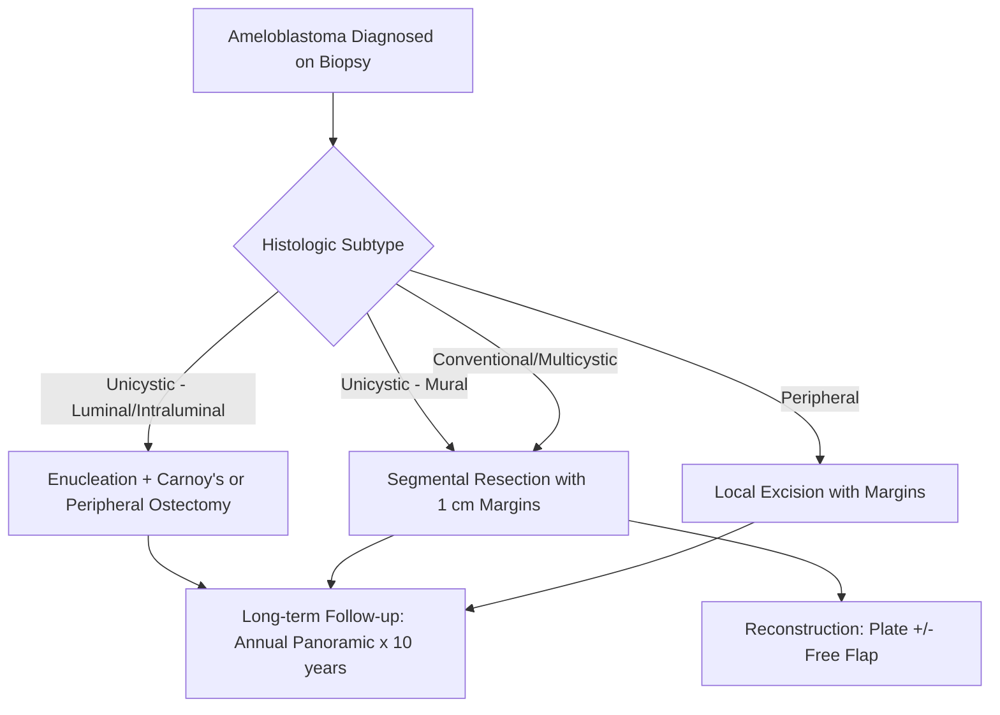

# Chapter 7: Oral Pathology and Oncologic Surgery

*Biopsy techniques, odontogenic and non-odontogenic pathology, oral malignancy staging and surgical management, reconstruction, and sequelae of oncologic therapy.*

---

## Introduction

The oral and maxillofacial surgeon serves as the primary diagnostician and surgeon for a vast spectrum of pathologic conditions affecting the jaws, oral cavity, and associated structures. This ranges from the incidental odontogenic cyst discovered on routine imaging to the management of advanced-stage oral squamous cell carcinoma requiring composite resection and microvascular free flap reconstruction.

This chapter provides a comprehensive treatment of oral and maxillofacial pathology from the surgical perspective, emphasizing diagnosis, staging, operative technique, reconstruction, and the management of oncologic treatment sequelae.

---

## Biopsy Techniques

### Indications

Any oral or maxillofacial lesion that lacks a definitive clinical diagnosis or does not resolve after removal of identifiable causative factors warrants biopsy. The AAOMS ParCare guidelines recommend biopsy for:

- Persistent mucosal lesions (greater than 2 weeks duration) without identifiable etiology
- Leukoplakia or erythroplakia
- Pigmented lesions
- Non-healing extraction sockets
- Radiolucent or radiopaque jaw lesions of uncertain etiology
- Lymphadenopathy persisting greater than 2 weeks without identifiable infectious cause

### Biopsy Methods

**Incisional Biopsy:**

- Removal of a representative portion of the lesion for histopathologic diagnosis.
- Indicated for large lesions (greater than 1 cm), lesions suspected of malignancy, and diffuse lesions.
- Technique: Elliptical or wedge incision at the periphery of the lesion including the junction of abnormal and normal tissue. Avoid necrotic centers. Minimum 5 mm tissue specimen. Orient the specimen for the pathologist when relevant.

**Excisional Biopsy:**

- Complete removal of the lesion with a margin of clinically normal tissue.
- Indicated for small lesions (less than 1 cm), clinically benign-appearing lesions (fibromas, papillomas, mucoceles), and pigmented lesions where incisional biopsy may compromise staging (melanoma concern).
- Margins: 2-3 mm for benign-appearing lesions; wider margins for suspected malignancy.

**Punch Biopsy:**

- Circular blade (4-6 mm) used to obtain a full-thickness core of mucosa/submucosa.
- Useful for vesiculobullous diseases, lichenoid lesions, and diffuse mucosal conditions.
- Perilesional biopsy (adjacent uninvolved tissue) is required for direct immunofluorescence in autoimmune vesiculobullous diseases.

**Fine-Needle Aspiration Biopsy (FNAB):**

- 22-25 gauge needle aspiration of a palpable or image-guided mass.
- Primary application: cervical lymph nodes, salivary gland masses, thyroid nodules.
- Sensitivity for malignancy in salivary gland masses: 73-92% (Schmidt et al., *Head Neck* 2001).
- Ultrasound-guided FNAB increases accuracy for non-palpable nodes.

**Core Needle Biopsy:**

- 14-18 gauge cutting needle obtains a tissue core.
- Better tissue architecture than FNAB; useful when FNAB is non-diagnostic.
- Increasingly used for salivary gland tumors and deep-seated masses.

!!! tip "Clinical Pearl"
    For pigmented oral lesions, perform excisional biopsy with 2-3 mm margins when feasible. Incisional biopsy of melanoma may theoretically compromise staging (Breslow thickness), though evidence for adverse outcomes is limited. If the lesion is too large for excision, incisional biopsy at the thickest/darkest area is acceptable (NCCN Guidelines, Melanoma).

---

## Odontogenic Cysts

### Classification (2022 WHO Classification of Head and Neck Tumours, 5th Edition)

**Developmental Odontogenic Cysts:**

- Dentigerous (follicular) cyst
- Odontogenic keratocyst (OKC)
- Lateral periodontal cyst / botryoid odontogenic cyst
- Gingival cyst of the adult
- Glandular odontogenic cyst
- Calcifying odontogenic cyst (Gorlin cyst)
- Orthokeratinized odontogenic cyst

**Inflammatory Odontogenic Cysts:**

- Radicular (periapical) cyst
- Residual cyst
- Inflammatory collateral cyst (paradental/mandibular buccal bifurcation cyst)

### Odontogenic Keratocyst (OKC)

The OKC (formerly keratocystic odontogenic tumor in the 2005 WHO classification, reclassified as a cyst in the 2017/2022 WHO edition) deserves special attention due to its aggressive behavior and high recurrence rate:

- **Histopathology**: Parakeratinized stratified squamous epithelium (6-8 cell layers), palisaded basal cells with polarized hyperchromatic nuclei, corrugated luminal surface.
- **Genetics**: Mutations in *PTCH1* (Patched 1, hedgehog signaling pathway). Germline *PTCH1* mutations cause Gorlin syndrome (nevoid basal cell carcinoma syndrome) with multiple OKCs.
- **Recurrence rate**: 25-60% with simple enucleation; reduced to 5-10% with adjunctive treatment (Blanas et al., *Int J Oral Maxillofac Surg* 2000).

**Surgical Management Options:**

| Technique | Recurrence Rate | Indication |
|---|---|---|
| Enucleation alone | 25-60% | Not recommended as definitive treatment |
| Enucleation + Carnoy's solution | 1-8% | Standard of care for most OKCs |
| Enucleation + peripheral ostectomy | 5-15% | Alternative to Carnoy's |
| Enucleation + cryotherapy (liquid nitrogen) | 0-11% | Alternative adjunct; risk of pathologic fracture |
| Marsupialization followed by delayed enucleation | 0-15% | Large cysts, pediatric patients, proximity to vital structures |
| Resection (marginal or segmental) | Approximately 0% | Recurrent OKC, very large or aggressive lesions |

!!! warning "Surgical Caution"
    **Carnoy's solution** (absolute ethanol, chloroform, glacial acetic acid, ferric chloride) is a tissue fixative applied to the bony cavity after enucleation for 3-5 minutes. It penetrates 1-2 mm into bone, destroying residual epithelial cells and satellite cysts. Protect the inferior alveolar nerve with petroleum jelly gauze or remove from the canal before application. Chloroform has been removed from some formulations (modified Carnoy's) due to carcinogenicity concerns, though efficacy appears similar (Voorsmit et al., *J Maxillofac Surg* 1981).

### Dentigerous Cyst

- Most common developmental odontogenic cyst.
- Arises from proliferation of the reduced enamel epithelium around the crown of an unerupted tooth.
- **Treatment**: Enucleation with extraction of the associated tooth. Marsupialization for large cysts in children to preserve developing teeth. Recurrence is rare (less than 3%).

### Gorlin Syndrome (Nevoid Basal Cell Carcinoma Syndrome)

Autosomal dominant, *PTCH1* mutation. Cardinal features:

- Multiple OKCs (often presenting in the first or second decade)
- Basal cell carcinomas (face, trunk)
- Skeletal anomalies (bifid ribs, spina bifida occulta)
- Calcified falx cerebri
- Palmar/plantar pits

!!! danger "Critical Safety"
    Patients with Gorlin syndrome should NOT receive radiation therapy for basal cell carcinomas due to extreme radiosensitivity with risk of radiation-induced malignancies. Jaw cysts in these patients are managed with a more conservative approach (marsupialization preferred) given the likelihood of recurrence and the need to preserve jaw structure across a lifetime of multiple surgeries.

---

## Odontogenic and Non-Odontogenic Tumors

### Ameloblastoma

The most common clinically significant odontogenic tumor. WHO 2022 classification recognizes:

- **Conventional (multicystic) ameloblastoma**: Locally aggressive; recurrence 15-25% after enucleation/curettage; less than 5% after resection with margins.
- **Unicystic ameloblastoma**: Three subtypes (luminal, intraluminal, mural). Luminal and intraluminal types treated with enucleation plus Carnoy's; mural type requires resection due to wall invasion.
- **Extraosseous/peripheral ameloblastoma**: Rare; soft tissue only; excision with margins is curative.
- **Metastasizing ameloblastoma**: Histologically benign but produces distant metastases (lung most common); extremely rare.

**Surgical Management:**

!!! tip "Clinical Pearl"
    Conventional ameloblastoma requires segmental or marginal resection with at least 1-1.5 cm bony margins beyond the radiographic extent. The tumor infiltrates cancellous bone beyond the apparent radiographic margin. Curettage alone results in unacceptable recurrence rates (50-90%). Long-term follow-up (minimum 10 years, ideally lifelong) is mandatory given reports of recurrence decades after treatment (Mendenhall et al., *Am J Clin Oncol* 2007).

### Other Notable Jaw Tumors

| Tumor | Behavior | Preferred Treatment |
|---|---|---|
| **Myxoma (odontogenic)** | Locally aggressive, infiltrative, no capsule | Resection with margins (1 cm); high recurrence with curettage |
| **Central giant cell granuloma** | Variable: peripheral (indolent) vs. central (aggressive) | Curettage plus adjuvants (calcitonin, corticosteroid injection, interferon-alpha) for aggressive; resection for recurrent |
| **Ossifying fibroma** | Well-encapsulated, benign | Enucleation (small) or resection (large/recurrent) |
| **Fibrous dysplasia** | Non-neoplastic; *GNAS* mutation; no true capsule | Surgical recontouring for function/esthetics; avoid resection unless symptomatic; ceases progression after skeletal maturity |
| **Osteosarcoma of the jaw** | Malignant; better prognosis than appendicular osteosarcoma | Wide resection with 2 cm margins plus chemotherapy; radiation for unresectable |
| **Osteoblastoma** | Benign but locally aggressive | Curettage or resection depending on size/location |

---

## Oral Squamous Cell Carcinoma (OSCC)

### Epidemiology

OSCC accounts for approximately 90% of oral malignancies. In the United States:

- Approximately 54,000 new cases of oral cavity and oropharyngeal cancer annually (ACS, *Cancer Facts and Figures 2024*)
- Risk factors: tobacco (smokeless and smoked), alcohol (synergistic effect), betel quid/areca nut, HPV (primarily oropharyngeal), chronic UV exposure (lip), immunosuppression
- Oral tongue is the most common intraoral subsite
- Male:female ratio approximately 2:1 (narrowing due to changing tobacco/alcohol patterns)

### Premalignant Lesions

- **Leukoplakia**: White patch/plaque that cannot be characterized clinically or pathologically as any other disease. Malignant transformation rate: 0.1-17% (Villa & Woo, *Oral Dis* 2017).
- **Erythroplakia**: Red patch with a much higher malignant transformation rate (14-50%); most represent carcinoma in situ or invasive carcinoma at the time of biopsy.
- **Proliferative verrucous leukoplakia (PVL)**: Multifocal, progressive, high rate of malignant transformation (40-70%); resistant to treatment; HPV association debated.

### TNM Staging (AJCC 8th Edition, 2018)

The AJCC 8th Edition introduced **depth of invasion (DOI)** as a key parameter in T-staging for oral cavity SCC:

| T Stage | Criteria |
|---|---|
| **T1** | 2 cm or less and DOI 5 mm or less |
| **T2** | 2 cm or less and DOI greater than 5 mm to 10 mm or less; OR greater than 2 cm to 4 cm or less and DOI 10 mm or less |
| **T3** | Greater than 2 cm to 4 cm or less and DOI greater than 10 mm; OR greater than 4 cm and DOI 10 mm or less |
| **T4a** | Moderately advanced: tumor invades through cortical bone of mandible/maxilla, maxillary sinus, skin of face |
| **T4b** | Very advanced: tumor invades masticator space, pterygoid plates, skull base, encases internal carotid artery |

**Nodal Staging:**

| N Stage | Criteria |
|---|---|
| **N1** | Single ipsilateral node 3 cm or less, no extranodal extension (ENE) |
| **N2a** | Single ipsilateral node greater than 3 cm to 6 cm or less, no ENE |
| **N2b** | Multiple ipsilateral nodes, none greater than 6 cm, no ENE |
| **N2c** | Bilateral or contralateral nodes, none greater than 6 cm, no ENE |
| **N3a** | Any node greater than 6 cm, no ENE |
| **N3b** | Any node with clinical ENE |

!!! danger "Critical Safety"
    **Extranodal extension (ENE)** was added to the AJCC 8th Edition as an independent upstaging factor (automatically N3b). ENE is the single strongest adverse prognostic factor in cervical metastasis and is an indication for adjuvant chemoradiation (Cooper et al., *N Engl J Med* 2004; Bernier et al., *N Engl J Med* 2004).

### Tumor Board and Multidisciplinary Care

All patients with confirmed or suspected oral malignancy should be discussed in a multidisciplinary tumor board including:

- Head and neck surgical oncologist / OMS
- Radiation oncologist
- Medical oncologist
- Pathologist (head and neck subspecialty)
- Radiologist
- Prosthodontist / maxillofacial prosthetist
- Speech-language pathologist
- Nutritionist
- Social work / palliative care

### Surgical Management of OSCC

#### Principles of Ablative Surgery

- **Margins**: Minimum 1 cm gross surgical margins in all dimensions. Frozen section analysis of margins intraoperatively. A histologically negative margin is 5 mm or greater on permanent section (NCCN Guidelines, Head and Neck Cancers).
- **Mandibulectomy types**:
    - **Marginal (rim) mandibulectomy**: Removal of the superior portion of the mandible with preservation of basilar continuity. Indicated when tumor abuts but does not invade the mandible or when cortical invasion is superficial.
    - **Segmental mandibulectomy**: Full-thickness resection of a mandibular segment. Required for medullary invasion or gross cortical destruction.
- **Maxillectomy**: Infrastructure, subtotal, or total depending on tumor extent. May include orbital exenteration for superior extension.

#### Neck Dissection

| Type | Description | Indication |
|---|---|---|
| **Selective (supraomohyoid, levels I-III)** | Removal of levels I-III lymph nodes | cN0 oral cavity SCC with DOI greater than 4 mm (elective) |
| **Selective (extended, levels I-IV)** | Levels I-IV | cN0 with high-risk features or tongue primary |
| **Modified radical (levels I-V)** | All five nodal levels; preserves one or more non-lymphatic structures (SCM, IJV, CN XI) | cN+ disease, single positive node |
| **Radical** | Levels I-V plus SCM plus IJV plus CN XI | Advanced nodal disease encasing structures |

!!! tip "Clinical Pearl"
    For oral tongue SCC with DOI greater than 4 mm, elective neck dissection (levels I-III minimum, I-IV preferred) significantly improves overall survival compared to watchful waiting, even in the clinically N0 neck. This was definitively demonstrated in the landmark randomized trial by D'Cruz et al. (*N Engl J Med* 2015).

#### Sentinel Lymph Node Biopsy (SLNB)

SLNB is emerging as an alternative to elective neck dissection for early-stage (T1-T2, cN0) oral cavity SCC:

- **Technique**: Peritumoral injection of technetium-99m nanocolloid plus or minus ICG fluorescence, then lymphoscintigraphy/SPECT-CT, then intraoperative gamma probe identification, excision, serial sectioning with immunohistochemistry.
- **SENT trial** (Schilling et al., *Br J Cancer* 2015): Sensitivity 86% for detecting occult metastasis; negative predictive value 95%.
- **Limitations**: Floor of mouth tumors have higher false-negative rates due to "shine-through" artifact from the primary injection site near level I nodes.

---

## Reconstruction

### Free Flap Reconstruction

Microvascular free tissue transfer is the standard of care for reconstruction of large composite defects after ablative surgery.

#### Fibula Free Flap

The fibula free flap (Taylor, 1975; Hidalgo, 1989 for mandibular reconstruction) is the workhorse for mandibular and maxillary reconstruction:

- **Vascular pedicle**: Peroneal artery and venae comitantes; pedicle length 6-8 cm.
- **Bone stock**: Up to 25 cm of cortical bone; can accept endosseous implants (bone height 10-14 mm).
- **Skin paddle**: Based on septocutaneous or musculocutaneous perforators; may be unreliable in some patients; thin and pliable.
- **Osteotomies**: Multiple osteotomies permit contouring to recreate mandibular curvature. Preserve the periosteum between osteotomies to maintain segmental blood supply.

**Virtual Surgical Planning (VSP) for Fibula Reconstruction:**

VSP (e.g., Materialise ProPlan CMF, Stryker, KLS Martin IPS) has become standard for fibula mandibular reconstruction:

1. CT angiography of lower extremity (confirm peroneal artery patency and absence of peronea magna variant)
2. CT of head/neck with tumor delineation
3. Virtual planning session: resection margins, osteotomy guides, fibula cutting guides, reconstruction plate pre-bending or patient-specific plate
4. 3D-printed cutting guides and pre-shaped/custom plate
5. Intraoperative execution with guides

VSP reduces operative time, improves bony union rates, and facilitates secondary implant placement (Rodby et al., *J Oral Maxillofac Surg* 2014).

#### Other Free Flaps

| Flap | Pedicle | Primary Use |
|---|---|---|
| **Radial forearm (RFFF)** | Radial artery, cephalic vein | Soft tissue defects: tongue, floor of mouth, buccal mucosa. Thin, pliable. Allen's test mandatory preoperatively. |
| **Anterolateral thigh (ALT)** | Descending branch of lateral circumflex femoral artery | Versatile soft tissue plus or minus vastus lateralis muscle. Moderate thickness. Excellent for large soft tissue defects. |
| **Scapula/parascapular** | Circumflex scapular artery (or thoracodorsal) | Bone (lateral scapular border) plus large skin paddle. Useful for combined bone/soft tissue maxillary or mandibular defects. |
| **Iliac crest (DCIA)** | Deep circumflex iliac artery | Excellent bone stock for maxillary/mandibular reconstruction. Bulky; may require de-bulking. |

### Microvascular Technique Essentials

- **Recipient vessels**: Facial artery, superior thyroid artery, or branches of the external carotid; facial vein, internal jugular vein, or external jugular vein.
- **Anastomosis**: End-to-end or end-to-side; 8-0 or 9-0 nylon microsuture; operating microscope or high-power loupes (4-6x).
- **Monitoring**: External Doppler (Cook-Swartz implantable Doppler), clinical assessment (color, turgor, capillary refill, pinprick bleeding), or tissue oximetry. Monitoring every 1-2 hours for the first 48-72 hours.
- **Free flap success rate**: 95-98% in high-volume centers (Bui et al., *Plast Reconstr Surg* 2007).
- **Salvage**: Early re-exploration (less than 6-12 hours from detection of compromise) for suspected venous or arterial thrombosis. Salvage rate approximately 50-75% if explored promptly.

!!! warning "Surgical Caution"
    Venous thrombosis is more common than arterial thrombosis in free flap failure. Clinical signs of venous congestion include rapid capillary refill (less than 1 second), dark/purple color, and rapid dark bleeding on pinprick. Arterial compromise presents with absent capillary refill, pallor, and absent pinprick bleeding. Early detection and re-exploration are critical -- every hour of delay decreases salvage rates.

---

## Sequelae of Oncologic Therapy

### Osteoradionecrosis (ORN)

ORN represents radiation-induced hypocellular, hypovascular, hypoxic bone that becomes necrotic, typically after trauma (extraction, denture irritation) or spontaneously:

- **Pathophysiology**: Radiation (greater than 50 Gy) damages osteocytes, endothelial cells, and bone marrow. Marx's 3H theory: hypoxia, hypovascularity, hypocellularity leading to tissue breakdown.
- **Incidence**: 5-15% of patients receiving therapeutic doses to the mandible (Peterson et al., *Principles of Oral and Maxillofacial Surgery*, 3rd ed.).
- **Risk factors**: Dose greater than 60 Gy, mandibular location (more cortical, less vascular than maxilla), dental extractions in irradiated field, poor oral hygiene, tobacco and alcohol use.

**Prevention:**

- Pre-radiation dental evaluation and extraction of non-restorable teeth (allow 14-21 days healing before initiating radiation).
- Lifelong fluoride therapy (custom trays, 1.1% NaF gel daily).
- Avoid extractions in irradiated fields when possible; if necessary, atraumatic technique, primary closure, perioperative antibiotics, and consider hyperbaric oxygen (HBO).

**Treatment (Marx Protocol):**

| Stage | Description | Management |
|---|---|---|
| **I** | Exposed bone, responds to HBO | HBO 30 dives (2.4 ATA, 90 min) then assess healing; if resolved, 10 additional dives |
| **II** | Does not respond to HBO Stage I | Sequestrectomy plus 30 HBO dives post-op |
| **III** | Full-thickness mandibular involvement, pathologic fracture, fistula | Resection plus reconstruction (free flap) plus HBO |

!!! tip "Clinical Pearl"
    The PENTOCLO protocol (pentoxifylline 800 mg/day plus tocopherol [vitamin E] 1000 IU/day plus clodronate 1600 mg/day) has shown promising results for ORN management, potentially reducing the need for HBO. Delanian et al. (*Clin Oncol* 2005) reported bone healing in 89% of ORN cases treated with this antifibrotic regimen. However, clodronate is not FDA-approved in the US, and the evidence base is limited to case series.

### Medication-Related Osteonecrosis of the Jaw (MRONJ)

MRONJ (formerly BRONJ) is defined by the AAOMS Position Paper (2022 Update, Ruggiero et al.):

1. Current or previous treatment with antiresorptive (bisphosphonates, denosumab) or antiangiogenic agents
2. Exposed bone or bone that can be probed through an intraoral or extraoral fistula in the maxillofacial region, persisting for greater than 8 weeks
3. No history of radiation therapy or metastatic disease to the jaws

**Staging and Management (AAOMS 2022):**

| Stage | Description | Management |
|---|---|---|
| **At Risk** | No apparent necrotic bone; patient on antiresorptive/antiangiogenic therapy | Patient education; no treatment indicated |
| **Stage 0** | No clinical evidence of necrotic bone but nonspecific symptoms or clinical/radiographic findings | Systemic antibiotics; analgesics; close follow-up |
| **Stage 1** | Exposed necrotic bone or fistula probing to bone; asymptomatic; no evidence of infection | Oral antimicrobial rinse (CHX 0.12%); clinical follow-up |
| **Stage 2** | Exposed necrotic bone with infection (pain, erythema, purulent drainage) | Oral antibiotics (PenVK plus metronidazole or amoxicillin/clavulanate); antimicrobial rinse; pain management; superficial debridement |
| **Stage 3** | Stage 2 plus pathologic fracture, extraoral fistula, osteolysis extending to inferior border or sinus | Surgical resection of necrotic bone; reconstruction as needed |

### Immunotherapy in Head and Neck Cancer

Immune checkpoint inhibitors have transformed the treatment of recurrent/metastatic head and neck SCC:

- **Pembrolizumab (Keytruda)**: Anti-PD-1; first-line for recurrent/metastatic HNSCC (KEYNOTE-048 trial, Burtness et al., *Lancet* 2019). Approved as monotherapy for PD-L1 CPS of 1 or greater or combined with chemotherapy regardless of PD-L1 status.
- **Nivolumab (Opdivo)**: Anti-PD-1; approved for platinum-refractory recurrent/metastatic HNSCC (CheckMate 141 trial, Ferris et al., *N Engl J Med* 2016).
- **Immune-related adverse events (irAEs)**: Dermatitis, colitis, hepatitis, pneumonitis, endocrinopathies. The OMS should be aware of oral irAEs including lichenoid reactions and xerostomia.

---

## Salivary Gland Pathology (Surgical Considerations)

While a complete discussion of salivary gland pathology exceeds the scope of this chapter, the OMS surgeon frequently encounters salivary gland tumors:

### Key Salivary Gland Tumors

| Tumor | Characteristics | Surgical Approach |
|---|---|---|
| **Pleomorphic adenoma** | Most common salivary gland tumor (60-70%); parotid (80%); benign but recurs if incompletely excised | Superficial parotidectomy (parotid); complete excision with margin (minor glands) |
| **Warthin's tumor** | Second most common benign parotid tumor; bilateral in 10%; male predominance | Superficial parotidectomy or excision |
| **Mucoepidermoid carcinoma** | Most common salivary malignancy; low, intermediate, and high grade | Parotidectomy plus or minus neck dissection plus or minus radiation (based on grade/stage) |
| **Adenoid cystic carcinoma** | Perineural invasion hallmark; indolent course with late distant metastases (lung); long-term survival requires extended follow-up | Wide resection with attention to nerve tracking; postoperative radiation standard; chemotherapy limited efficacy |

!!! warning "Surgical Caution"
    The facial nerve (CN VII) is the critical structure in parotid surgery. Identification and preservation of the main trunk and branches is paramount unless the nerve is directly invaded by tumor. Intraoperative facial nerve monitoring is standard of care. Key landmarks for nerve identification include the tragal pointer, tympanomastoid suture, posterior belly of the digastric, and retrograde dissection from a peripheral branch.

---

## Coding Reference

### CPT Codes -- Biopsy and Excision

| Code | Description |
|---|---|
| **40808** | Biopsy, vestibule of mouth |
| **40810** | Excision of lesion of mucosa and submucosa, vestibule of mouth, without repair |
| **41100-41108** | Biopsy of tongue (anterior, posterior) |
| **41110-41116** | Excision of lesion of tongue without closure/with closure |
| **41120** | Glossectomy, less than one-half tongue |
| **41130** | Glossectomy, hemiglossectomy |
| **41135** | Glossectomy, partial, with unilateral radical neck dissection |
| **41150** | Glossectomy, composite with resection of floor of mouth, mandibular resection |

### CPT Codes -- Mandibulectomy / Maxillectomy

| Code | Description |
|---|---|
| **21025** | Excision of bone, mandible (sequestrum) |
| **21040-21047** | Excision of benign tumor, mandible (with/without graft) |
| **21048-21049** | Excision of benign tumor, maxilla (with/without graft) |
| **21044** | Excision of malignant tumor, mandible |
| **21050** | Condylectomy |

### CPT Codes -- Neck Dissection

| Code | Description |
|---|---|
| **38720** | Cervical lymphadenectomy (radical neck dissection) |
| **38724** | Cervical lymphadenectomy (modified radical neck dissection) |

### ICD-10 Codes

| Code | Description |
|---|---|
| **C03.0-C03.9** | Malignant neoplasm of gum |
| **C04.0-C04.9** | Malignant neoplasm of floor of mouth |
| **C05.0-C06.9** | Malignant neoplasm of palate, other/unspecified parts of mouth |
| **C02.0-C02.9** | Malignant neoplasm of tongue |
| **D16.4-D16.5** | Benign neoplasm of bones of skull and face / lower jaw |
| **K09.0** | Developmental odontogenic cysts |
| **K09.1** | Developmental non-odontogenic cysts |
| **M87.180** | Osteonecrosis due to drugs, jaw |
| **M87.1** | Osteonecrosis due to drugs (MRONJ) |

---

## Key References

1. Ruggiero SL, Dodson TB, Aghaloo T, et al. American Association of Oral and Maxillofacial Surgeons' Position Paper on Medication-Related Osteonecrosis of the Jaws -- 2022 Update. *J Oral Maxillofac Surg*. 2022;80(5):920-943.
2. D'Cruz AK, Vaish R, Kapre N, et al. Elective versus therapeutic neck dissection in node-negative oral cancer. *N Engl J Med*. 2015;373(6):521-529.
3. Marx RE. Osteoradionecrosis: a new concept of its pathophysiology. *J Oral Maxillofac Surg*. 1983;41(5):283-288.
4. Blanas N, Freund B, Schwartz M, Furst IM. Systematic review of the treatment and prognosis of the odontogenic keratocyst. *Oral Surg Oral Med Oral Pathol Oral Radiol Endod*. 2000;90(5):553-558.
5. WHO Classification of Head and Neck Tumours, 5th Edition. IARC; 2022.
6. NCCN Clinical Practice Guidelines in Oncology: Head and Neck Cancers. Version 2.2024.
7. Burtness B, Harrington KJ, Greil R, et al. Pembrolizumab alone or with chemotherapy versus cetuximab with chemotherapy for recurrent or metastatic squamous cell carcinoma of the head and neck (KEYNOTE-048). *Lancet*. 2019;394(10212):1915-1928.
8. Hidalgo DA. Fibula free flap: a new method of mandible reconstruction. *Plast Reconstr Surg*. 1989;84(1):71-79.
9. AAOMS Parameters of Care: Clinical Practice Guidelines for Oral and Maxillofacial Surgery (ParCare), 6th Edition.
