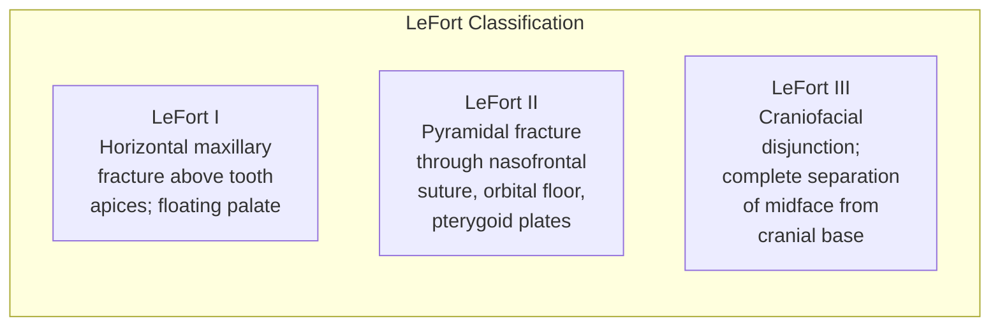

# Chapter 8: Facial Trauma

*ATLS principles, mandible and midface fracture management, panfacial injury, soft tissue repair, and navigation-guided reconstruction.*

---

## Introduction

Facial trauma constitutes a core domain of oral and maxillofacial surgery practice. The OMS surgeon must be proficient in the evaluation and management of the full spectrum of maxillofacial injuries, from isolated dentoalveolar trauma to complex panfacial fractures and ballistic injuries. This chapter addresses the systematic evaluation, classification, and surgical management of facial fractures with emphasis on current fixation techniques, timing considerations, and emerging technologies including intraoperative navigation.

---

## Initial Assessment: ATLS Principles

Facial trauma management always occurs within the framework of Advanced Trauma Life Support (ATLS). The primary survey (ABCDE) takes absolute precedence:

### Airway with Cervical Spine Protection

Maxillofacial injuries threaten the airway through multiple mechanisms:

- Posterior displacement of the tongue (bilateral mandible body/parasymphysis fractures, comminuted mandible)
- Hemorrhage and hematoma (floor of mouth, pharynx)
- Edema (burns, massive soft tissue injury)
- Foreign bodies (avulsed teeth, bone fragments, prostheses)
- LeFort-level fractures with posterior displacement of the maxilla impinging on the nasopharynx

**Airway management options:**

- Orotracheal intubation (first-line in most scenarios)
- Nasotracheal intubation (contraindicated with suspected skull base fracture / NOE fracture / CSF leak)
- Surgical airway: cricothyrotomy (emergency) or tracheostomy (controlled setting)
- Fiberoptic intubation for predicted difficult airway

!!! danger "Critical Safety"
    **Never attempt blind nasotracheal intubation in patients with suspected basilar skull fracture or midface fractures.** The tube may enter the cranial vault through a fractured cribriform plate. Signs of basilar skull fracture include Battle's sign (mastoid ecchymosis), raccoon eyes (periorbital ecchymosis), CSF rhinorrhea/otorrhea, and hemotympanum.

### Breathing and Circulation

- Assess for pneumothorax (especially with concomitant thoracic trauma)
- Facial hemorrhage can be life-threatening, particularly from branches of the internal maxillary artery, ethmoidal arteries, or the pterygoid venous plexus
- Hemorrhage control: direct pressure, anterior/posterior nasal packing, Foley catheter tamponade for posterior epistaxis, Barton bandage for gross mandibular instability, angiographic embolization for refractory hemorrhage

### Disability and Exposure

- Glasgow Coma Scale documentation
- Pupillary examination (critical for orbital injury: traumatic mydriasis vs. optic nerve compromise vs. herniation)
- Complete cranial nerve examination (CN II through XII)
- Cervical spine clearance

---

## Facial Examination and Imaging

### Clinical Examination

A systematic facial examination includes:

- **Inspection**: Symmetry, edema, ecchymosis, lacerations, step deformities, malocclusion, nasal septal deviation/hematoma, CSF leak
- **Palpation**: Orbital rims, zygomatic arches, nasal bones, mandibular borders and condyles (via preauricular and intra-aural palpation)
- **Occlusion**: The most sensitive clinical indicator of fracture displacement. Document premorbid occlusal class, contact points, and any shift.
- **Eye examination**: Visual acuity, pupil reactivity, extraocular movements (entrapment), diplopia fields, globe position (enophthalmos/exophthalmos), forced duction test
- **Sensory**: V1, V2, V3 distribution

!!! warning "Surgical Caution"
    **Nasal septal hematoma** must be identified and drained immediately. Untreated, it leads to cartilage necrosis from avascularity (cartilage is nourished by perichondrial diffusion), resulting in saddle nose deformity and potential septal perforation. Incise and drain, then pack bilaterally with antibiotic-impregnated gauze or silicone splints.

### Imaging

**CT with axial and coronal reformats** (0.5-1.0 mm slices) is the standard of care for facial fracture evaluation. Three-dimensional reconstructions provide invaluable surgical planning information, particularly for comminuted and panfacial injuries.

- **Mandible**: Axial and coronal CT; panoramic radiograph (Panorex) remains useful as a screening tool in the awake, cooperative patient but is not a substitute for CT in complex injuries.
- **Midface**: Axial and coronal fine-cut CT with 3D reconstructions.
- **Orbit**: Coronal CT is essential for evaluating orbital floor and medial wall fractures; sagittal reformats aid in assessing the posterior extent.
- **CTA (CT angiography)**: Indicated when vascular injury is suspected (e.g., penetrating trauma near the carotid sheath, expanding hematoma).

---

## Mandible Fractures

### Epidemiology and Biomechanics

The mandible is the most commonly fractured facial bone (or second, depending on the population studied). Common fracture locations reflect areas of structural weakness:

| Location | Frequency | Biomechanical Factor |
|---|---|---|
| **Condyle/subcondylar** | 25-35% | Thin condylar neck; indirect force transmission |
| **Angle** | 20-25% | Third molar weakens cross-section; transition from tooth-bearing to edentulous ramus |
| **Body** | 15-25% | Mental foramen, long root sockets |
| **Symphysis/parasymphysis** | 15-20% | Mental foramen, canine eminence |
| **Ramus** | 3-5% | Thick muscle coverage protects; less common |
| **Coronoid** | 1-2% | Rare in isolation; often associated with ZMC fractures (impingement) |
| **Alveolar** | 2-5% | Dentoalveolar segment avulsion |

### Classification

**By location**: As above.

**By favorability** (Kazanjian & Converse):

- **Favorable**: Fracture line oriented such that masticatory muscle forces resist displacement.
- **Unfavorable**: Fracture line oriented such that muscle forces promote displacement (e.g., angle fracture with posteroinferior angulation where the masseter/medial pterygoid complex displaces the proximal segment superiorly and medially).

**By dentition status**: Dentate, partially edentulous, edentulous (affects treatment options -- MMF not possible without teeth or bone screws).

### Surgical Management

#### Closed Reduction and Maxillomandibular Fixation (MMF)

Indicated for:

- Non-displaced or minimally displaced fractures in favorable orientation
- Condylar fractures (most subcondylar fractures in adults and virtually all condylar fractures in children)
- Patient factors precluding general anesthesia (as temporizing measure)

**MMF Methods:**

- **Arch bars** (Erich): Traditional; 24/26-gauge stainless steel wire on each arch; 4-6 weeks of fixation. Labor-intensive to apply and remove.
- **IMF screws** (e.g., 2.0 mm self-drilling): Faster application; placed between tooth roots in attached gingiva. Risk of root damage (approximately 2-10%); may loosen during fixation period. Typically 2 per quadrant.
- **Hybrid technique**: IMF screws for initial reduction and intraoperative fixation, supplemented by arch bars if prolonged MMF needed.

**Duration**: 4-6 weeks for most fractures; 2 weeks when supplementing ORIF; up to 6-8 weeks for edentulous fractures.

#### Open Reduction and Internal Fixation (ORIF)

ORIF is the standard of care for displaced mandible fractures in the dentate patient.

**Principles of Rigid Fixation (Champy):**

The Champy ideal osteosynthesis lines define the biomechanically optimal plate position:

- **Symphysis/parasymphysis**: Two plates -- one at the inferior border (tension band) and one at the subapical region; or a single large reconstruction plate at the inferior border. Lag screw fixation is an alternative for oblique fractures.
- **Body**: Single plate at the superior (tension) border along the external oblique ridge is adequate for simple fractures; two plates (superior plus inferior) for comminuted fractures.
- **Angle**: Single plate at the superior border (along the external oblique ridge) is the most common technique (Champy method); alternative is two plates or a single inferior border plate.
- **Subcondylar**: When ORIF is indicated, access via preauricular, retromandibular (Risdon), or endoscopic transoral approach.

**Plate and Screw Systems:**

| System | Screw Diameter | Indication |
|---|---|---|
| **Miniplate (Champy)** | 2.0 mm | Non-load-bearing fixation; favorable fractures; angle (superior border) |
| **Mandibular plates** | 2.3-2.5 mm | Load-sharing; body and parasymphysis fractures |
| **Reconstruction plates** | 2.4-2.7 mm locking | Load-bearing; comminuted fractures, continuity defects, edentulous atrophic mandible |
| **Lag screws** | 2.0-2.7 mm | Oblique symphyseal/parasymphyseal fractures with sufficient bone stock |
| **Resorbable plates** | Variable | Pediatric fractures; non-load-bearing sites; minimal displacement |

!!! tip "Clinical Pearl"
    At the mandibular angle, a single 2.0 mm miniplate at the external oblique ridge (Champy technique) with monocortical screws is biomechanically sufficient for simple, non-comminuted fractures and avoids the need for transcutaneous access. The transbuccal trocar system allows placement of the inferior border plate via an intraoral approach when two-plate fixation is desired.

### Condylar Fractures

Condylar fracture management remains one of the most debated topics in OMS:

**Indications for ORIF (Zide & Kent Criteria, updated):**

- Displacement into the middle cranial fossa
- Lateral extracapsular displacement
- Inability to obtain adequate occlusion by closed methods
- Open fracture (laceration with communication)
- Foreign body (e.g., gunshot wound)
- Bilateral condylar fractures with comminuted midface (loss of posterior vertical dimension)

**Indications favoring closed treatment:**

- Intracapsular (condylar head) fractures
- Fractures in children (risk of damage to growth center; remodeling potential)
- Non-displaced or minimally displaced fractures with stable occlusion
- Medical comorbidities precluding general anesthesia

**Endoscopic-assisted ORIF** of subcondylar fractures (via transoral approach with transbuccal trocar) has gained traction, offering improved visualization and reduced facial nerve risk compared to open transcutaneous approaches (Kellman & Cienfuegos, *Int J Oral Maxillofac Surg* 2009).

---

## Midface Fractures

### LeFort Fractures

Rene LeFort (1901) described three classic patterns of midface fracture, though clinical presentations frequently do not follow these idealized patterns:

**LeFort I** (Guerin fracture):

- Horizontal fracture through the maxilla above the tooth apices, through the lateral nasal wall, inferior nasal septum, and pterygoid plates.
- Clinical: Mobility of the maxillary dentition and hard palate ("floating palate").
- **ORIF**: Bilateral piriform rim and bilateral buttress plating. Establish occlusion first (IMF or guiding elastics), then plate both zygomatic buttresses and piriform apertures with 1.5-2.0 mm miniplates.

**LeFort II** (pyramidal):

- Fracture line from the nasofrontal suture to medial orbital wall to orbital floor to inferior orbital rim to zygomatic buttress to pterygoid plates.
- Clinical: Mobility of the central midface; periorbital edema/ecchymosis; CSF rhinorrhea possible.
- **ORIF**: Infraorbital rim, nasofrontal region, and zygomatic buttress plating. Orbital floor repair if needed.

**LeFort III** (craniofacial disjunction):

- Complete separation of the midface from the cranial base: nasofrontal suture to medial and lateral orbital walls to zygomatic arch to pterygoid plates.
- Clinical: Entire midface is mobile; dish-face deformity; massive edema; CSF leak.
- **ORIF**: Lateral orbital rim/zygomaticofrontal suture, zygomatic arch, nasofrontal region, orbital walls. Often requires coronal approach. Neurosurgical consultation for associated frontal sinus/skull base injuries.

### Zygomaticomaxillary Complex (ZMC) Fractures

The zygoma articulates at four sutures (zygomaticofrontal, zygomaticomaxillary, zygomaticotemporal, zygomaticosphenoid). ZMC fractures involve disruption at these articulations:

**Classification (Knight & North, modified):**

- Group I: No significant displacement (stable, non-operative management)
- Group II: Arch fracture (isolated)
- Group III: Unrotated body displacement (downward, inward, or outward)
- Group IV: Medially rotated
- Group V: Laterally rotated
- Group VI: Comminuted

**Surgical Approach:**

Displaced ZMC fractures require ORIF. Minimum three-point fixation for rotational stability:

1. **Zygomaticofrontal (ZF) suture**: Lateral brow incision or upper blepharoplasty incision. 1.5 mm miniplate.
2. **Infraorbital rim / zygomaticomaxillary buttress**: Transconjunctival (plus or minus lateral canthotomy) or subtarsal incision for the rim; intraoral (vestibular) incision for the buttress.
3. **Zygomatic arch**: Coronal approach if needed (rarely required with adequate reduction at ZF and buttress; Gillies temporal approach for isolated arch reduction).

!!! tip "Clinical Pearl"
    The ZF suture is the most reliable landmark for assessing adequacy of ZMC reduction. Anatomic alignment at the ZF suture with a palpable smooth contour and restoration of the lateral orbital wall alignment confirms adequate reduction. Intraoperative CT (or navigation) can further verify reduction accuracy.

### Orbital Floor Fractures

#### Pure Blowout Fracture

Isolated fracture of the orbital floor without orbital rim involvement. Two mechanisms:

- **Hydraulic theory**: Direct globe compression transmits force to the thin floor.
- **Buckling theory**: Impact to the inferior orbital rim causes inward buckling of the floor.

**Indications for Repair:**

- Diplopia with positive forced duction test (mechanical entrapment)
- Enophthalmos greater than 2 mm (or anticipated based on defect size greater than 50% of the floor or 2 cm squared or more)
- Large defect with significant herniation of orbital contents into the maxillary sinus
- "Trapdoor" fracture with muscle entrapment (surgical emergency in children -- "white-eyed blowout fracture")

!!! danger "Critical Safety"
    **Pediatric trapdoor orbital floor fracture** is a surgical emergency. The greenstick nature of pediatric bone allows the floor to fracture and spring back, trapping the inferior rectus or periorbital tissue. The child may present with minimal external signs of trauma but has severe restriction of upgaze, nausea/vomiting (oculocardiac reflex), and bradycardia. Emergent repair (within 24-48 hours) prevents irreversible ischemic muscle damage and permanent diplopia (Jordan et al., *Ophthalmology* 1998).

**Orbital Floor Reconstruction Materials:**

| Material | Properties |
|---|---|
| **Titanium mesh (preformed or custom)** | Strong, easily contoured, radiopaque (facilitates follow-up imaging); most commonly used |
| **Porous polyethylene (Medpor)** | Allows tissue ingrowth; fibrovascular integration; difficult to remove if revision needed |
| **Resorbable sheets (PDLLA, PGA/PLLA)** | Useful for small defects; eliminates permanent implant; limited structural support |
| **Autogenous bone (calvarial, iliac)** | Biocompatible; resorbs variably; donor-site morbidity; reserved for large defects or secondary reconstruction |
| **Patient-specific implants (PSI)** | Custom 3D-printed titanium based on mirrored CT of contralateral orbit; ideal for complex/revision cases |

### Naso-Orbital-Ethmoid (NOE) Fractures

NOE fractures involve the confluence of the nasal bones, medial orbital walls, and ethmoid sinuses, with the critical element being the medial canthal tendon attachment to the central fragment:

**Markowitz & Manson Classification:**

| Type | Central Fragment | Treatment |
|---|---|---|
| **Type I** | Single, large, with intact MCT attachment | Plate fixation of central fragment; restore MCT position |
| **Type II** | Comminuted but MCT still attached to identifiable fragment | ORIF of fragments; possible transnasal wire to ensure MCT position |
| **Type III** | Severely comminuted; MCT detached or on fragment too small to plate | Transnasal canthopexy with wire/suture through anterior lacrimal crest; primary bone grafting of nasal dorsum |

!!! warning "Surgical Caution"
    Inadequate management of NOE fractures results in telecanthus (increased intercanthal distance, normal 30-35 mm), nasal dorsum depression, and epiphora (lacrimal system disruption). Transnasal wiring for MCT re-attachment must be placed posterior and superior to the lacrimal crest (the anatomic MCT insertion), not simply through the anterior lacrimal crest. The wire is passed through the contralateral medial orbital wall and tightened over a small plate or bolt to re-establish the proper canthal position.

---

## Panfacial Fractures

Panfacial fractures involve simultaneous fractures of the upper face (frontal sinus/frontal bone), midface (LeFort, ZMC, NOE, orbital), and lower face (mandible).

### Surgical Principles

The classic surgical sequence debate -- "bottom-up and outside-in" vs. "top-down and inside-out" -- continues, but the fundamental principles are:

1. **Establish at least one stable reference point**: Mandibular condyle position (via condylar ORIF or IMF), cranial base (frontal bar), or zygomatic arch.
2. **Restore facial width**: Zygomatic arches.
3. **Restore facial projection**: Zygomatic eminences, nasal dorsum.
4. **Restore facial height**: Mandible ORIF, maxillary buttress plating.
5. **Restore occlusion**: IMF to establish dental relationship, then plate midface.
6. **Reconstruct orbital volumes**: Orbital floor/wall repair last.

**Approaches:**

- **Coronal (bicoronal) flap**: Workhorse for panfacial exposure. Provides access to frontal bone, frontal sinus, bilateral orbital roofs, zygomatic arches, and ZF sutures. Incision placed 4-5 cm posterior to the hairline in a zigzag (stealth) or straight pattern. Dissect in the subgaleal (loose areolar) plane to the temporal line, then transition to the subperiosteal plane over the temporal fossa.
- **Transconjunctival / subtarsal**: Orbital floor and infraorbital rim.
- **Intraoral (vestibular)**: Mandible, maxillary buttresses, LeFort reduction.
- **Existing lacerations**: Exploited for access when favorable.

---

## Soft Tissue Injuries

### Principles of Soft Tissue Repair

- **Timing**: Primary closure within 24 hours when possible. Facial soft tissue has excellent blood supply; primary repair can often be performed up to 48-72 hours post-injury with acceptable outcomes (unlike extremity wounds).
- **Debridement**: Conservative. Remove only clearly devitalized tissue. Preserve all tissue with questionable viability given the rich facial blood supply.
- **Layered closure**: Deep muscle/fascial layer repair (3-0/4-0 absorbable), subcutaneous tissue (4-0/5-0 absorbable), skin (5-0/6-0 nylon or fast-absorbing gut for skin). Meticulous eversion of skin edges.
- **Landmark alignment**: Align anatomic landmarks first (vermilion border, eyebrow, nostril rim, ear tragus). Even 1 mm of vermilion malalignment is cosmetically unacceptable.

### Special Considerations

**Lip lacerations:**

- Always align the vermilion border (white roll) as the first suture.
- Repair the orbicularis oris muscle layer to restore sphincter function.
- Through-and-through lacerations: Close the mucosa first (3-0/4-0 chromic), then muscle, then skin.

**Eyelid lacerations:**

- Lacerations involving the lid margin require meticulous alignment of the gray line (mucocutaneous junction) and tarsal plate.
- Medial canthal lacerations may involve the canalicular system -- suspect with lacerations medial to the punctum. Repair over a silicone stent by an oculoplastic surgeon or trained OMS.

**Parotid duct (Stensen's duct) injury:**

- Suspect with lacerations posterior to the anterior border of the masseter, over the masseter, in the region of a line drawn from the tragus to the midpoint of the upper lip.
- Confirm by cannulating the papilla (opposite the maxillary second molar) and irrigating.
- Primary repair over a stent (Silastic catheter) if identified acutely. Late presentation may be managed by sialodochoplasty or ligation with gland atrophy.

**Facial nerve injury:**

- Injuries posterior to a vertical line from the lateral canthus should be explored and repaired (main trunk and major branches).
- Injuries anterior to this line may be observed, as terminal branches are too small for repair and cross-innervation from the contralateral side provides some recovery.
- Primary neurorrhaphy (9-0/10-0 nylon, epineural technique) under the microscope. Cable grafting (greater auricular nerve, sural nerve) if primary repair is not tension-free.

---

## Pediatric Facial Fractures

Pediatric facial fractures differ from adult fractures in several important ways:

- **Developing dentition**: Mixed or primary dentition limits IMF options; circummandibular wires, drop wires, or bonded brackets used.
- **Growth centers**: The mandibular condyle is a critical growth center. Condylar fractures in children are managed conservatively (closed treatment plus early mobilization) in nearly all cases to avoid growth disturbance (Smartt et al., *Plast Reconstr Surg* 2005).
- **Bone biology**: More elastic (greenstick fractures common), greater osteogenic potential (rapid healing in 2-3 weeks), greater remodeling capacity.
- **Paranasal sinus development**: Sinuses are incompletely pneumatized; midface fractures are less common in young children.
- **Tooth buds**: Avoid screw placement through developing tooth follicles. Use monocortical screws when possible; consider resorbable fixation.

!!! tip "Clinical Pearl"
    In children under 12, resorbable plating systems (PDLLA or PGA/PLLA copolymer) are preferred for midface fixation when applicable, eliminating the need for hardware removal and avoiding interference with growth. However, resorbable plates have lower mechanical strength and are not appropriate for load-bearing mandibular fixation.

---

## Ballistic and High-Energy Injuries

### Classification

- **Low-velocity**: Handgun rounds (less than 2,000 ft/s); create a permanent wound cavity with limited surrounding tissue damage.
- **High-velocity**: Rifle rounds (greater than 2,000 ft/s); create a large temporary cavitation zone with extensive soft tissue and osseous damage beyond the permanent tract.
- **Shotgun**: Variable; close-range injuries are devastating with massive tissue loss.

### Management Principles

1. **Airway first**: Surgical airway often necessary; tracheostomy preferred over cricothyrotomy for extended management.
2. **Hemorrhage control**: Immediate -- packing, ligation, angiographic embolization.
3. **Staged reconstruction**:
    - **Phase 1 (acute, 0-72 hours)**: Airway management, hemorrhage control, debridement (conservative -- preserve all viable tissue), soft tissue closure when possible, external fixation of mandible if needed, tracheostomy, gastric tube for nutrition.
    - **Phase 2 (subacute, 1-3 weeks)**: Definitive osseous reduction and fixation once soft tissue edema resolves.
    - **Phase 3 (delayed, months)**: Bone grafting, free flap reconstruction of composite defects, dental rehabilitation.
4. **Antibiotic prophylaxis**: Broad-spectrum coverage; these are contaminated wounds.
5. **Tetanus prophylaxis**: Per guidelines.

---

## Navigation-Guided Fracture Repair

Intraoperative navigation (image-guided surgery) has increasingly been applied to facial fracture repair:

### Technology

- **Systems**: Stryker, Brainlab, Medtronic StealthStation.
- **Registration**: Surface matching (laser or pointer registration of facial landmarks to preoperative CT) or fiducial-based registration.
- **Application**: Real-time tracking of instruments in 3D space relative to the patient's CT anatomy displayed on the screen.

### Indications

- **Orbital reconstruction**: Navigation allows precise placement of orbital floor/wall implants with verification of posterior extent and orbital volume restoration. Reduces revision rates compared to non-navigated repair (Zimmerer et al., *J Craniomaxillofac Surg* 2017).
- **ZMC reduction**: Verification of zygomatic reduction, particularly malar projection.
- **Secondary reconstruction**: Particularly useful when normal anatomic landmarks are distorted from prior injury/surgery.
- **Foreign body localization**: Ballistic fragments, displaced teeth.

### Intraoperative CT

Some centers use intraoperative cone-beam CT (e.g., Medtronic O-arm) or portable CT scanners to verify reduction and hardware position before leaving the operating room, eliminating the need for postoperative CT and potential revision.

!!! tip "Clinical Pearl"
    For complex orbital reconstruction, mirroring the uninjured contralateral orbit in the planning software creates a virtual template for the implant. The navigation system then guides implant placement to match this template, restoring orbital volume symmetry. This technique significantly reduces residual enophthalmos and diplopia rates.

---

## Coding Reference

### CPT Codes -- Nasal Fractures

| Code | Description |
|---|---|
| **21310** | Closed treatment of nasal bone fracture without manipulation |
| **21315** | Closed treatment of nasal bone fracture with stabilization |
| **21320** | Closed treatment of nasal fracture with manipulation, with or without stabilization |

### CPT Codes -- Midface Fractures

| Code | Description |
|---|---|
| **21355** | Percutaneous treatment of fracture of malar area, including zygomatic arch |
| **21360** | Open treatment of depressed malar fracture, without internal fixation |
| **21365** | Open treatment of complicated fracture of malar area (with internal fixation and multiple approaches) |
| **21385** | Open treatment of orbital floor blowout fracture; transantral approach |
| **21386** | Open treatment of orbital floor blowout fracture; periorbital approach |
| **21390** | Open treatment of orbital floor blowout fracture; periorbital approach, with alloplastic or other implant |
| **21395** | Open treatment of orbital floor blowout fracture; periorbital approach, with bone graft |
| **21400** | Closed treatment of fracture of orbit, except blowout |
| **21401** | Open treatment of fracture of orbit, except blowout |
| **21421** | Closed treatment of palatal or maxillary fracture (LeFort I type) |
| **21422** | Open treatment of palatal or maxillary fracture (LeFort I type) |
| **21423** | Open treatment of palatal or maxillary fracture (LeFort I), complicated |
| **21431** | Closed treatment of craniofacial separation (LeFort III type) |
| **21432** | Open treatment of craniofacial separation (LeFort III type), with wiring and/or internal fixation |
| **21433** | Open treatment of craniofacial separation (LeFort III), complicated |
| **21435-21436** | Open treatment of craniofacial separation (LeFort III) with bone grafting |

### CPT Codes -- Mandible Fractures

| Code | Description |
|---|---|
| **21450** | Closed treatment of mandibular fracture, without manipulation |
| **21451** | Closed treatment of mandibular fracture with manipulation |
| **21452** | Percutaneous treatment of mandibular fracture with external fixation |
| **21453** | Closed treatment of mandibular fracture with interdental fixation |
| **21454** | Open treatment of mandibular fracture with external fixation |
| **21461** | Open treatment of mandibular fracture without interdental fixation |
| **21462** | Open treatment of mandibular fracture with interdental fixation |
| **21465** | Open treatment of mandibular condylar fracture |
| **21470** | Open treatment of complicated mandibular fracture with internal fixation and interdental fixation |
| **21497** | Interdental wiring, for condition other than fracture |

### ICD-10 Codes

| Code | Description |
|---|---|
| **S02.0** | Fracture of vault of skull |
| **S02.1** | Fracture of base of skull |
| **S02.2** | Fracture of nasal bones |
| **S02.3** | Fracture of orbital floor |
| **S02.4** | Fracture of malar, maxillary, and zygoma bones |
| **S02.5** | Fracture of tooth |
| **S02.6** | Fracture of mandible |
| **S02.8** | Fracture of other specified skull and facial bones |

---

## Key References

1. Kellman RM, Cienfuegos R. Endoscopic approaches to subcondylar fractures of the mandible. *Facial Plast Surg*. 2009;25(1):46-56.
2. Ellis E 3rd, Throckmorton GS. Treatment of mandibular condylar process fractures: biological considerations. *J Oral Maxillofac Surg*. 2005;63(1):115-134.
3. Champy M, Lodde JP, Schmitt R, et al. Mandibular osteosynthesis by miniature screwed plates via a buccal approach. *J Maxillofac Surg*. 1978;6(1):14-21.
4. Markowitz BL, Manson PN, Sargent L, et al. Management of the medial canthal tendon in nasoethmoid orbital fractures: the importance of the central fragment in classification and treatment. *Plast Reconstr Surg*. 1991;87(5):843-853.
5. Zimmerer RM, Ellis E 3rd, Aniceto GS, et al. A prospective multicenter study to compare the precision of posttraumatic internal orbital reconstruction with standard preformed and individualized orbital implants. *J Craniomaxillofac Surg*. 2016;44(9):1485-1497.
6. Zide MF, Kent JN. Indications for open reduction of mandibular condyle fractures. *J Oral Maxillofac Surg*. 1983;41(2):89-98.
7. ATLS Subcommittee, American College of Surgeons. Advanced Trauma Life Support (ATLS), 10th Edition. 2018.
8. Jordan DR, Allen LH, White J, et al. Intervention within days for some orbital floor fractures: the white-eyed blowout. *Ophthalmic Plast Reconstr Surg*. 1998;14(6):379-390.
