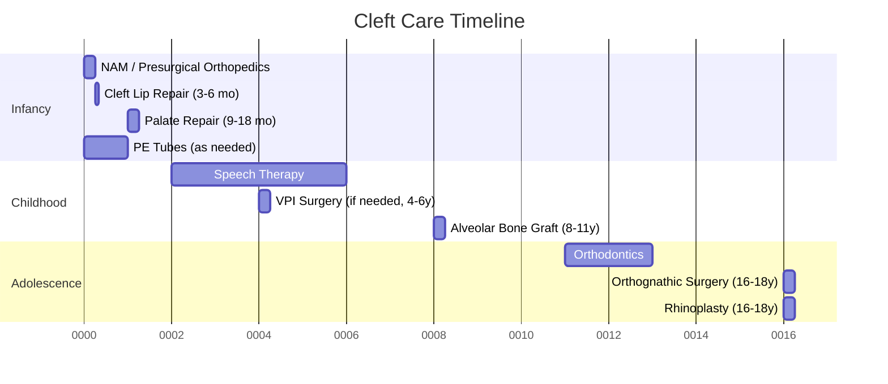

# Chapter 11: Craniofacial and Cleft Surgery

*Cleft lip and palate repair, alveolar bone grafting, distraction osteogenesis, craniosynostosis, hemifacial microsomia, and the craniofacial team model.*

---

## Introduction

Craniofacial surgery represents one of the most technically demanding and intellectually rewarding domains within oral and maxillofacial surgery. The OMS surgeon serves as a central figure on the craniofacial team, managing the bony and soft-tissue reconstruction that underpins functional rehabilitation of speech, mastication, and airway patency. This chapter covers the full spectrum of craniofacial and cleft care from the OMS perspective: primary cleft lip and palate repair, secondary revision procedures, alveolar bone grafting, velopharyngeal insufficiency management, distraction osteogenesis, craniosynostosis correction, and management of hemifacial microsomia and other craniofacial anomalies.

The AAOMS Parameters of Care (ParCare 6th edition, Section VII: Craniomaxillofacial Deformities) and the ACPA (American Cleft Palate-Craniofacial Association) guidelines provide the evidence-based framework referenced throughout this chapter.

---

## Epidemiology and Embryology

### Incidence

Orofacial clefts are the most common craniofacial birth defect, occurring in approximately 1 in 700 live births worldwide (Dixon et al., *Nat Rev Dis Primers*, 2011). Racial variation is significant:

- **Asian/Native American**: ~1:500
- **Caucasian**: ~1:700
- **African descent**: ~1:2,500

Cleft lip with or without palate (CL/P) accounts for roughly 50% of cases, isolated cleft palate (CP) for 30%, and isolated cleft lip for 20%. Males predominate in CL/P (2:1), while isolated CP is more common in females.

### Embryologic Basis

The face develops from five facial prominences (frontonasal, paired maxillary, paired mandibular) during weeks 4-10 of gestation:

- **Week 5-7**: Fusion of medial nasal prominences with maxillary prominences forms the primary palate (premaxilla, lip, and alveolus anterior to the incisive foramen)
- **Week 7-12**: Palatal shelves elevate from horizontal and fuse in the midline (anterior to posterior) to form the secondary palate
- **Failure of fusion** at any stage produces the clinical spectrum of orofacial clefting

!!! tip "Clinical Pearl"
    The junction of the primary and secondary palates at the incisive foramen is the embryologic landmark that distinguishes cleft lip/alveolus defects (primary palate) from cleft palate defects (secondary palate). This distinction is fundamental to classification and surgical planning.

### Veau Classification

| Class | Description |
|-------|------------|
| I | Soft palate only |
| II | Soft and hard palate (to incisive foramen) |
| III | Complete unilateral cleft (lip, alveolus, hard/soft palate) |
| IV | Complete bilateral cleft |

The more detailed Kernahan "Y" classification and the Lahshal notation system are widely used for documentation and research purposes.

---

## Craniofacial Team Model

The ACPA mandates that cleft and craniofacial care be delivered through a coordinated interdisciplinary team (ACPA Standards for Cleft Palate and Craniofacial Teams, revised 2018). Required team members include:

- **OMS surgeon / Plastic surgeon** (surgical reconstruction)
- **Orthodontist** (dentofacial orthopedics, presurgical orthopedics)
- **Speech-language pathologist** (VPI assessment, speech therapy)
- **Otolaryngologist** (middle ear disease, airway management)
- **Pediatric dentist** (dental home, restorative care)
- **Prosthodontist** (obturators, speech bulbs, prosthetic rehabilitation)
- **Psychologist/Social worker** (psychosocial support)
- **Geneticist** (syndromic diagnosis, recurrence counseling)
- **Audiologist** (hearing assessment)
- **Nurse coordinator** (care coordination)

!!! warning "Surgical Caution"
    Approximately 30% of cleft patients have an associated syndrome (e.g., Pierre Robin sequence, 22q11.2 deletion/velocardiofacial syndrome, Stickler syndrome). A genetics evaluation is essential before surgical planning, as syndromic patients may have cardiac anomalies, airway issues, or healing differences that affect anesthetic and surgical risk.

### Timeline of Care

---

## Presurgical Orthopedics

### Nasoalveolar Molding (NAM)

Nasoalveolar molding, developed by Grayson and Cutting at NYU, is an active presurgical orthopedic appliance that simultaneously molds the alveolar segments and nasal cartilages beginning at 1-2 weeks of age. The device consists of an acrylic palatal plate with nasal stents that apply sustained low-force pressure to reshape the nasal cartilage, approximate the alveolar segments, and lengthen the columella (in bilateral cases).

**Indications**:

- Complete unilateral or bilateral cleft lip and palate
- Wide alveolar gaps (>10 mm)
- Severely distorted nasal cartilage

**Evidence**: A prospective study by Shetty et al. (*Cleft Palate Craniofac J*, 2012) demonstrated improved nasal symmetry at 5-year follow-up in NAM-treated patients. However, the Americleft study (Russell et al., *Cleft Palate Craniofac J*, 2015) showed no significant difference in nasolabial appearance between NAM and non-NAM centers at age 6, generating ongoing debate.

!!! tip "Clinical Pearl"
    NAM is most effective when initiated within the first 2 weeks of life, before the nasal cartilages lose their estrogen-mediated plasticity (maternal circulating estrogen). Compliance requires weekly adjustments and dedicated parental commitment.

### Lip Taping and DynaCleft

For centers without NAM capability, simple lip taping or the DynaCleft device provides passive approximation of the alveolar segments and can narrow the cleft gap prior to surgery.

---

## Primary Cleft Lip Repair

### Timing

The traditional "Rule of 10s" (10 weeks, 10 pounds, hemoglobin 10 g/dL) provides a safe guideline for lip repair timing (Wilhelmsen & Musgrave, 1966). Most centers perform primary lip repair between **3-6 months** of age.

### Unilateral Cleft Lip Repair

#### Rotation-Advancement Technique (Millard)

The Millard rotation-advancement repair remains the most widely taught and performed technique worldwide (Millard, *Cleft Craft*, 1976):

- **Rotation flap**: The medial lip element is rotated inferiorly to lengthen the shortened philtral column
- **Advancement flap**: The lateral lip element is advanced medially to fill the gap created by rotation
- **C-flap**: Used for nasal sill reconstruction

**Advantages**: Preserves Cupid's bow, places the scar along the philtral column, allows incremental adjustment during surgery.

**Limitations**: Potential for short lip on the cleft side, secondary whistle deformity.

#### Fisher Technique

The Fisher anatomic subunit repair (Fisher, *Plast Reconstr Surg*, 2005) uses precise anthropometric measurements to reconstruct each anatomic subunit of the lip independently:

- Philtral column defined by precise measurements from the non-cleft side
- Small triangular flap at the vermilion-cutaneous junction corrects height discrepancy
- Places the majority of the scar along the philtral column

**Advantages**: More precise and reproducible than Millard; reduced revision rates in some series (Fisher et al., *Plast Reconstr Surg*, 2005).

#### Primary Rhinoplasty

Most centers now perform simultaneous primary nasal correction at the time of lip repair. McComb (1975) and Salyer (1986) demonstrated the safety and efficacy of primary rhinoplasty. Techniques include:

- Elevation and repositioning of the lower lateral cartilage on the cleft side
- Alar base repositioning and cinch suture
- Columellar lengthening (in bilateral cases)

### Bilateral Cleft Lip Repair

Bilateral repair presents unique challenges: a mobile premaxilla, deficient columella, and absence of the philtral dimple.

- **Mulliken technique**: Simultaneous bilateral repair with creation of a philtral column using musculocutaneous flaps from the lateral lip elements (Mulliken, *Plast Reconstr Surg*, 1999)
- **Premaxillary setback**: Historically performed (but now largely abandoned due to growth restriction); modern approach uses presurgical orthopedics (NAM, lip adhesion) to align segments
- **Columellar lengthening**: Achieved via forked flaps (Mulliken) or delayed secondary elongation

!!! danger "Critical Safety"
    Never surgically set back the premaxilla in infancy. Premaxillary setback causes severe midface growth restriction and should be reserved as an absolute last resort (Berkowitz, *Cleft Palate Craniofac J*, 1996). Modern presurgical orthopedics and staged surgical approaches have eliminated the need for this procedure.

---

## Primary Palate Repair (Palatoplasty)

### Timing

Most cleft teams perform palate repair between **9-18 months** of age, balancing two competing priorities:

- **Early repair (9-12 mo)**: Optimizes speech development by closing the palate before babbling transitions to true speech
- **Later repair (15-18 mo)**: May reduce maxillary growth impairment

The Scandcleft randomized trial (Lohmander et al., *Plast Reconstr Surg*, 2017) demonstrated that repair at 12 months produced equivalent speech outcomes to 6-month repair, supporting 10-14 months as the optimal window.

### Techniques

#### Two-Flap Palatoplasty (Bardach)

The workhorse technique for complete cleft palate repair:

1. Incisions along the cleft margin and bilateral relaxing incisions
2. Elevation of full-thickness mucoperiosteal flaps from the hard palate
3. Dissection of the tensor veli palatini tendon from the hamulus
4. Intravelar veloplasty (muscle dissection and midline reapproximation)
5. Three-layer closure: nasal mucosa, muscle, oral mucosa

#### Von Langenbeck Technique

Bipedicled mucoperiosteal flaps are raised and medially advanced without anteroposterior release. Preserves anterior attachment but provides less advancement for wide clefts.

#### Furlow Double-Opposing Z-Plasty

Specifically designed for the soft palate, the Furlow palatoplasty (Furlow, *Plast Reconstr Surg*, 1986):

- Lengthens the soft palate while reorienting the levator muscles
- Creates a Z-plasty on both the nasal and oral surfaces, with the Z-directions reversed
- Particularly effective for submucous clefts and narrow soft palate clefts

**Advantages**: Lengthens the palate without raw surface, optimal muscle reorientation.

**Limitations**: Not suitable for wide hard palate clefts as a standalone technique.

!!! tip "Clinical Pearl"
    Intravelar veloplasty (IVV) is the single most important step in palatoplasty. The levator veli palatini muscles are abnormally inserted along the posterior hard palate margin in the cleft palate. IVV detaches these muscles and reapproximates them in the midline, creating the functional levator sling essential for velopharyngeal closure (Sommerlad, *Plast Reconstr Surg*, 2003).

### Two-Stage Palate Repair

Some protocols (e.g., Schweckendiek, Zurich approach) advocate:

1. **Soft palate repair at 6-9 months** (to optimize speech)
2. **Hard palate repair at 15-18 months or later** (to minimize growth disturbance)

Evidence from the Zurich center suggests improved maxillary growth with delayed hard palate repair, but speech outcomes may be compromised (Liao & Mars, *Cleft Palate Craniofac J*, 2006).

---

## Alveolar Bone Grafting

### Rationale

Secondary alveolar bone grafting provides bone stock in the alveolar cleft for:

- Eruption of the permanent canine (or lateral incisor)
- Stabilization of the premaxilla
- Closure of oronasal fistulae
- Nasal alar base support
- Foundation for future dental implants

### Timing

Optimal timing is guided by dental development rather than chronologic age: **mixed dentition stage**, when the permanent canine root is 50-75% formed (typically **8-11 years**). This corresponds to the peak of the canine descending to the cleft site.

| Timing | Designation | Indications |
|--------|------------|-------------|
| Primary (<2 years) | Primary grafting | Largely abandoned (growth restriction) |
| Early mixed dentition (6-8y) | Early secondary | Orthodontic considerations |
| Mixed dentition (8-11y) | **Secondary (standard)** | **Standard of care** |
| Permanent dentition (>12y) | Late secondary | Delayed referral, failed primary graft |
| Adult | Tertiary | Pre-implant grafting |

### Surgical Technique

**Donor site**: Anterior iliac crest cancellous bone is the gold standard (Boyne & Sands, *J Oral Surg*, 1972). Alternatives include:

- **Posterior iliac crest**: Greater bone volume, less pain, but prone positioning required
- **Proximal tibia**: Adequate volume for unilateral clefts, lower morbidity
- **Cranial bone**: Membranous bone, lower resorption, but limited volume
- **Mandibular symphysis**: For small defects or revision grafting
- **rhBMP-2** (off-label): Used by some centers to avoid donor site morbidity; controversial due to cost and unpredictable resorption (Herford et al., *J Oral Maxillofac Surg*, 2007)

**Recipient site preparation**:

1. Raise labial and palatal mucoperiosteal flaps
2. Identify and close the nasal floor mucosa (watertight closure critical)
3. Remove any residual tooth buds or ectopic teeth in the cleft
4. Pack cancellous bone firmly into the defect
5. Close the labial mucosa without tension

### Outcomes Assessment

The Bergland scale is the standard radiographic grading system:

| Grade | Description |
|-------|------------|
| I | Normal alveolar height |
| II | At least 75% of normal height |
| III | Less than 75% height, no bony bridge |
| IV | No bone in the cleft |

Success rates (Bergland I-II) for iliac crest grafting range from 80-95% in experienced centers (Bergland et al., *Scand J Plast Reconstr Surg*, 1986).

---

## Velopharyngeal Insufficiency

### Pathophysiology

Velopharyngeal insufficiency (VPI) occurs when the velopharyngeal sphincter fails to achieve adequate closure during speech, resulting in hypernasality, nasal air emission, and compensatory articulation errors. VPI occurs in approximately **20-30%** of cleft palate patients after primary palatoplasty (Kirschner & LaRossa, *Clin Plast Surg*, 2000).

### Assessment

**Perceptual speech evaluation** by a qualified speech-language pathologist is the cornerstone of VPI assessment, supplemented by instrumental measures:

- **Nasometry**: Quantifies nasalance scores (ratio of nasal to total acoustic energy). Normal mean nasalance for oral sentences is ~15-20%; VPI patients typically exceed 30%.
- **Videofluoroscopy (multiview)**: Lateral and base views to assess velar elevation, lateral pharyngeal wall motion, and closure pattern
- **Nasoendoscopy (NNE)**: Direct visualization of the velopharyngeal port during speech using a flexible endoscope
- **Pressure-flow analysis**: Objective measurement of nasal airflow and pressure

### Closure Patterns (Skolnick Classification)

| Pattern | Description | Preferred Surgery |
|---------|-------------|------------------|
| Coronal | Good lateral wall motion, poor velar elevation | Furlow palatoplasty or pharyngeal flap |
| Sagittal | Good velar motion, poor lateral wall motion | Sphincter pharyngoplasty |
| Circular | Symmetric inadequate closure | Sphincter pharyngoplasty |
| Circular with Passavant's ridge | Near-complete closure with anterior ridge | Posterior pharyngeal flap or fat injection |

### Surgical Options

#### Furlow Palatoplasty (Revision)

For patients with a short palate and suboptimal levator muscle orientation, a Furlow double-opposing Z-plasty may be the first-line VPI surgery (Kirschner et al., *Plast Reconstr Surg*, 1999). This is particularly effective when the initial palatoplasty did not include intravelar veloplasty.

#### Posterior Pharyngeal Flap

A superiorly based myomucosal flap raised from the posterior pharyngeal wall and inset into the soft palate:

- Creates a central obturator with lateral ports for nasal breathing
- Most effective for coronal closure pattern with midline gap
- Risk of obstructive sleep apnea (10-20% incidence; Liao et al., *Plast Reconstr Surg*, 2002)

CPT: **42225** (pharyngeal flap)

#### Sphincter Pharyngoplasty (Orticochea/Jackson)

Bilateral palatopharyngeus myomucosal flaps are raised, rotated superiorly, and inset into the posterior pharyngeal wall:

- Narrows the velopharyngeal port circumferentially
- Best for sagittal or circular closure patterns
- Lower OSA risk than pharyngeal flap but may produce hyponasality

CPT: **42226** (pharyngoplasty)

#### Fat Injection (Autologous)

For small residual gaps with near-complete closure, autologous fat injection into the posterior pharyngeal wall augments the pharyngeal pad:

- Minimally invasive, can be repeated
- Unpredictable resorption (30-50% volume loss)
- Best for marginal VPI

!!! warning "Surgical Caution"
    In patients with 22q11.2 deletion (velocardiofacial syndrome), the internal carotid arteries may be medialized and pulsatile in the posterior pharyngeal wall. Preoperative MRA or CT angiography is mandatory before any pharyngeal surgery in these patients to avoid catastrophic hemorrhage (Witt et al., *Plast Reconstr Surg*, 1999).

---

## Distraction Osteogenesis

### Principles

Ilizarov's biologic principles of distraction osteogenesis (DO), applied to the craniofacial skeleton by McCarthy et al. (1992), revolutionized treatment of craniofacial skeletal deficiency:

1. **Osteotomy/Corticotomy**: Controlled bone cut preserving periosteum and endosteum
2. **Latency period**: 5-7 days to allow initial callus organization
3. **Activation/Distraction**: Gradual separation at 1 mm/day (typically 0.5 mm BID)
4. **Consolidation**: Period of immobilization (typically 2x the distraction period) for mineralization of the distraction regenerate

### Mandibular Distraction

**Indications**:

- Neonatal micrognathia with airway obstruction (Pierre Robin sequence)
- Hemifacial microsomia (Goldenhar spectrum)
- Post-traumatic or post-ablative mandibular deficiency
- Mandibular hypoplasia in Treacher Collins syndrome

**Device types**:

- **External (multidirectional)**: Allows vector adjustment during distraction; higher pin-site infection rate, psychosocial burden
- **Internal (unidirectional)**: Buried submandibularly; requires accurate vector planning; second surgery for removal
- **Internal (curvilinear)**: Follows the natural mandibular curvature; reduced need for overcorrection

**Technique for neonatal Pierre Robin sequence**:

1. Bilateral subperiosteal mandibular body exposure via submandibular approach
2. Osteotomy posterior to the mental foramen (protecting the IAN)
3. Device placement with vector directed anteriorly and inferiorly
4. Latency 3-5 days (shortened in neonates due to faster biology)
5. Distraction 1-1.5 mm/day
6. Consolidation 6-8 weeks

CPT: **21196** (mandibular distraction, internal device) or **21194** (external device)

!!! tip "Clinical Pearl"
    In neonatal distraction for Pierre Robin sequence, the goal is not simply mandibular lengthening but rather anterior advancement of the tongue base to relieve glossoptosis. Intraoperative flexible laryngoscopy before and after distraction device activation confirms improvement in the airway (Denny et al., *Cleft Palate Craniofac J*, 2004).

### Maxillary/Midface Distraction

**Indications**:

- Severe maxillary hypoplasia in cleft patients (when conventional orthognathic advancement exceeds 8-10 mm)
- Midface deficiency in Apert, Crouzon, and Pfeiffer syndromes
- Post-surgical relapse after conventional LeFort I

**Techniques**:

- **LeFort I level distraction**: Internal devices (KLS Martin or Synthes distractors) placed after a standard LeFort I osteotomy; distraction vector directed anteriorly and inferiorly
- **LeFort III distraction** (monobloc or LeFort III with RED device): The rigid external distraction (RED) device provides multivectoral control for midface advancement in craniosynostosis syndromes (Polley & Figueroa, *J Craniofac Surg*, 1997)
- **LeFort II distraction**: Less commonly performed; for central midface deficiency

**Advantages over conventional orthognathic surgery**:

- Gradual advancement reduces relapse (especially for movements >10 mm)
- Simultaneous soft tissue expansion (histogenesis)
- No need for bone grafting
- Reduced dead space, lower infection risk

**Disadvantages**:

- Extended treatment duration
- Device management burden for patient/family
- Potential for device failure, pin loosening, or infection
- Second procedure for device removal (internal devices)

---

## Craniosynostosis

### Overview

Craniosynostosis--premature fusion of one or more cranial sutures--occurs in approximately 1 in 2,000-2,500 live births. It may be isolated (non-syndromic, 85%) or syndromic (15%; Apert, Crouzon, Pfeiffer, Muenke, Saethre-Chotzen).

### Classification by Suture

| Suture | Resultant Head Shape | Frequency |
|--------|---------------------|-----------|
| Sagittal | Scaphocephaly (long/narrow) | 40-55% |
| Coronal (unilateral) | Anterior plagiocephaly | 20-25% |
| Metopic | Trigonocephaly | 10-15% |
| Lambdoid (unilateral) | Posterior plagiocephaly | 1-3% |
| Multiple sutures | Variable; often syndromic | 5-15% |

!!! warning "Surgical Caution"
    Positional (deformational) plagiocephaly must be distinguished from true lambdoid craniosynostosis. Key differentiators: positional plagiocephaly shows ipsilateral frontal bossing (parallelogram shape), while lambdoid synostosis shows ipsilateral occipitomastoid bulge and contralateral frontal bossing (trapezoid shape). CT with 3D reconstruction confirms the diagnosis.

### Surgical Approaches

**Timing**: Surgery is typically performed between **6-12 months** of age to take advantage of rapid brain growth as a natural tissue expander.

#### Endoscopic Strip Craniectomy

- Minimally invasive removal of the fused suture through two small incisions
- Performed ideally at **2-4 months** of age
- Requires postoperative helmet therapy (12-18 months)
- Shorter OR time, reduced blood loss, shorter hospital stay
- Excellent outcomes for sagittal and metopic synostosis (Jimenez & Barone, *J Neurosurg Pediatr*, 2012)

#### Open Cranial Vault Remodeling

- **Fronto-orbital advancement (FOA)**: For coronal and metopic synostosis; bandeau osteotomy with orbital bar advancement and forehead remodeling
- **Total cranial vault remodeling**: For multi-suture synostosis
- **Posterior vault distraction**: For sagittal or lambdoid synostosis; spring-mediated or distractor-driven posterior expansion

#### Spring-Mediated Cranial Expansion

Stainless steel springs are placed across the osteotomy and gradually expand the cranial vault over 3-6 months. The springs are removed in a second short procedure. Developed by Lauritzen et al., this technique has growing evidence for efficacy in sagittal synostosis (Delye et al., *J Craniofac Surg*, 2015).

### Role of the OMS Surgeon

The OMS surgeon's involvement in craniosynostosis is most prominent in:

- **Midface advancement** (LeFort III, monobloc) for syndromic patients with midface hypoplasia
- **Orbital surgery** in conjunction with neurosurgery
- **Orthognathic surgery** for secondary maxillary/mandibular deformities in adolescence
- **Distraction osteogenesis** for midface deficiency

---

## Hemifacial Microsomia

### Overview

Hemifacial microsomia (HFM), also termed craniofacial microsomia or the oculo-auriculo-vertebral (OAV) spectrum, is the second most common congenital craniofacial anomaly after cleft lip/palate, occurring in ~1:3,500-5,600 live births (Grabb, 1965). It involves hypoplasia of structures derived from the first and second branchial arches, with variable expressivity:

- **Mandible**: Ramus/condyle hypoplasia or aplasia
- **Ear**: Microtia, aural atresia, preauricular tags
- **Soft tissue**: Macrostomia, facial nerve palsy, parotid hypoplasia
- **Orbit**: Orbital dystopia, globe displacement

### Pruzansky-Kaban Classification (Mandible)

| Type | Description | Treatment Strategy |
|------|------------|-------------------|
| I | Small but normally shaped mandible and glenoid fossa | Functional appliances, possible conventional orthognathic surgery |
| IIA | Mandibular ramus short; condyle present but abnormal; TMJ functional | Distraction osteogenesis or conventional osteotomy |
| IIB | Mandibular ramus severely hypoplastic; no functional TMJ; glenoid fossa absent or hypoplastic | Costochondral graft reconstruction + distraction |
| III | Complete absence of ramus, condyle, and glenoid fossa | Total TMJ reconstruction (costochondral graft or alloplastic) |

### Surgical Management

**Early childhood (4-6 years)**: Mandibular distraction osteogenesis is the preferred approach for Types IIA and IIB to improve symmetry and function during the growth period. For Type IIB/III, costochondral rib graft reconstruction of the ramus-condyle unit may be performed with or without distraction.

**Adolescence**: Definitive orthognathic surgery (unilateral sagittal split, LeFort I, genioplasty) once growth is complete. Virtual surgical planning is essential given the asymmetric anatomy.

**Soft tissue augmentation**: Free fat grafting, dermal fat grafts, or free tissue transfer (e.g., anterolateral thigh flap) for contour correction.

**Ear reconstruction**: Staged rib cartilage framework construction (Nagata technique) or Medpor (alloplastic) framework, typically at age 8-10 years. The OMS surgeon may collaborate with the reconstructive microsurgeon or otolaryngologist for this component.

CPT codes relevant to HFM management:

- **21244**: Reconstruction of mandible, extraoral, with bone graft
- **21196**: Mandibular distraction with internal device
- **21141-21160**: LeFort I, II, III osteotomies

---

## Syndromic Craniofacial Conditions

### Apert Syndrome

- **Genetics**: FGFR2 mutations (Ser252Trp or Pro253Arg)
- **Features**: Bicoronal craniosynostosis, severe midface hypoplasia, complex syndactyly, turribrachycephaly
- **Surgical sequence**: Posterior vault expansion (6-12 mo) -> fronto-orbital advancement (if needed) -> midface advancement (LeFort III or monobloc, age 6-12) -> orthognathic surgery (adolescence)

### Crouzon Syndrome

- **Genetics**: FGFR2 mutations (multiple loci)
- **Features**: Multi-suture craniosynostosis, severe midface hypoplasia (more than Apert), shallow orbits with proptosis, no hand anomalies
- **Surgical sequence**: Similar to Apert but often requires earlier midface surgery due to severe exorbitism and airway compromise

### Treacher Collins Syndrome (Mandibulofacial Dysostosis)

- **Genetics**: TCOF1 mutations (autosomal dominant, variable expressivity)
- **Features**: Bilateral symmetric mandibular/malar hypoplasia, coloboma of lower eyelids, microtia/atresia, downslanting palpebral fissures
- **OMS role**: Mandibular distraction in infancy (for airway), costochondral graft reconstruction, orthognathic surgery, malar augmentation (autogenous or alloplastic)

!!! tip "Clinical Pearl"
    In Treacher Collins syndrome, the airway is the first priority. Neonatal mandibular distraction may obviate the need for tracheostomy. Even with successful distraction, these patients require serial airway assessment as they grow, since the mandible may not keep pace with somatic growth (Tahiri et al., *Plast Reconstr Surg*, 2014).

### Pierre Robin Sequence

Not a syndrome per se but a triad of **micrognathia, glossoptosis, and airway obstruction**, with or without a U-shaped cleft palate. Occurs in ~1:8,500 births.

**Management algorithm**:

1. **Positional therapy**: Prone positioning (first-line for mild cases)
2. **Nasopharyngeal airway**: Temporary measure for moderate obstruction
3. **Mandibular distraction osteogenesis**: For persistent moderate-severe obstruction (avoid tracheostomy)
4. **Tracheostomy**: Reserved for severe obstruction failing other measures
5. **Palate repair**: Typically at 10-14 months (may be delayed due to airway concerns)

---

## Secondary Procedures and Long-Term Follow-Up

### Lip and Nose Revision

Secondary lip revision is needed in approximately 25-50% of cleft patients. Timing varies:

- **Minor revisions**: Can be performed at the time of alveolar bone grafting (8-11 years)
- **Definitive rhinoplasty**: Deferred until nasal growth is complete (age 16-18 in females, 17-19 in males)
- **Abbe flap**: Cross-lip flap from the lower lip for reconstruction of a tight upper lip with deficient vermilion (Abbe, 1898)

### Fistula Repair

Palatal fistulae occur in 5-20% of patients after primary palatoplasty. Repair options include:

- **Local mucoperiosteal flaps**: For small fistulae
- **Tongue flap**: For large anterior palate fistulae
- **Buccal fat pad flap**: Useful interpositional layer
- **Free tissue transfer**: Radial forearm flap for recurrent or large fistulae

### Orthognathic Surgery in the Cleft Patient

Approximately 25-40% of CL/P patients require orthognathic surgery for maxillary hypoplasia in adolescence (Ross, 1987). Key considerations:

- **LeFort I advancement** is the workhorse procedure; however, relapse rates are higher in cleft patients (20-30% vs. 5-10% in non-cleft patients)
- **Distraction osteogenesis** preferred for advancements >8-10 mm to reduce relapse
- **Scarred palatal tissues** may limit maxillary advancement; the LeFort I osteotomy must be completed carefully with attention to the compromised blood supply from prior palatal surgery
- **Virtual surgical planning** is especially valuable in the asymmetric cleft maxilla

CPT: **21141** (LeFort I, single piece), **21145** (LeFort I, segmental), **21196** (distraction with internal device)

ICD-10: **Q35-Q37** (cleft palate, cleft lip), **Q75.0** (craniosynostosis), **Q67.4** (hemifacial microsomia)

---

## Coding and Reimbursement

| Procedure | CPT Code | Notes |
|-----------|----------|-------|
| Cheiloplasty (unilateral) | 40700 | Primary cleft lip repair |
| Cheiloplasty (bilateral) | 40701 | |
| Palatoplasty | 42200 | Closure of cleft palate |
| Lengthening of palate | 42226 | Pharyngoplasty for VPI |
| Pharyngeal flap | 42225 | |
| Alveolar bone graft | 21210 | Bone graft, face (iliac autograft) |
| LeFort I osteotomy | 21141-21160 | Based on complexity |
| Mandibular distraction (internal) | 21196 | |
| Mandibular distraction (external) | 21194 | |
| Cranial vault remodeling | 61556-61558 | With neurosurgery |
| LeFort III osteotomy | 21154-21160 | |

!!! tip "Clinical Pearl"
    Many craniofacial procedures in cleft patients are covered by medical insurance under mandated cleft care benefits (most states require coverage of cleft-related treatment through age 18-21). Document the functional necessity (speech, breathing, mastication) in the operative note and prior authorization request.

---

## Key References

1. Dixon MJ, Marazita ML, Beaty TH, Murray JC. Cleft lip and palate: understanding genetic and environmental influences. *Nat Rev Genet*. 2011;12(3):167-178.
2. Millard DR. *Cleft Craft: The Evolution of Its Surgery*. Boston: Little, Brown; 1976.
3. Fisher DM. Unilateral cleft lip repair: an anatomical subunit approximation technique. *Plast Reconstr Surg*. 2005;116(1):61-71.
4. Furlow LT. Cleft palate repair by double opposing Z-plasty. *Plast Reconstr Surg*. 1986;78(6):724-738.
5. Sommerlad BC. A technique for cleft palate repair. *Plast Reconstr Surg*. 2003;112(6):1542-1548.
6. Boyne PJ, Sands NR. Secondary bone grafting of residual alveolar and palatal clefts. *J Oral Surg*. 1972;30(2):87-92.
7. Bergland O, Semb G, Abyholm FE. Elimination of the residual alveolar cleft by secondary bone grafting and subsequent orthodontic treatment. *Cleft Palate J*. 1986;23(3):175-205.
8. McCarthy JG, Schreiber J, Karp N, Thorne CH, Grayson BH. Lengthening the human mandible by gradual distraction. *Plast Reconstr Surg*. 1992;89(1):1-8.
9. Polley JW, Figueroa AA. Rigid external distraction: its application in cleft maxillary deformities. *Plast Reconstr Surg*. 1998;102(5):1360-1372.
10. ACPA. Parameters for evaluation and treatment of patients with cleft lip/palate or other craniofacial differences. *Cleft Palate Craniofac J*. 2018;55(supplement).
11. AAOMS. Parameters of Care: Clinical Practice Guidelines for Oral and Maxillofacial Surgery (ParCare 6th ed). 2017; Section VII.
12. Tahiri Y, Viezel-Mathieu A, Swanson JW, et al. Distraction osteogenesis for Treacher Collins syndrome. *Plast Reconstr Surg*. 2014;133(6):1437-1444.
