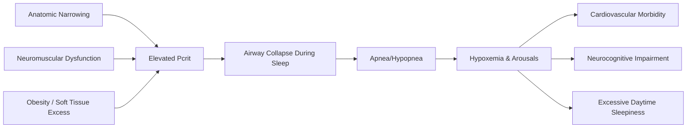

# Chapter 13: Obstructive Sleep Apnea Surgery

*OSA pathophysiology, diagnostic evaluation, maxillomandibular advancement, DOME, SARPE, genioglossus advancement, hypoglossal nerve stimulation, and the multidisciplinary sleep team.*

---

## Introduction

Obstructive sleep apnea (OSA) affects an estimated 26% of adults aged 30-70 in the United States, with the majority of moderate-to-severe cases remaining undiagnosed (Peppard et al., *Am J Epidemiol*, 2013). The oral and maxillofacial surgeon occupies a unique position in OSA management: trained in both the skeletal and soft-tissue anatomy of the upper airway, proficient in orthognathic techniques that can fundamentally alter airway dimensions, and increasingly involved in the multidisciplinary sleep team. Maxillomandibular advancement (MMA) is the most effective surgical treatment for OSA, with cure rates exceeding 85% in appropriately selected patients, rivaling or surpassing CPAP adherence-adjusted efficacy.

This chapter covers the pathophysiology and diagnosis of OSA, the role of drug-induced sleep endoscopy (DISE), the full range of surgical interventions (MMA, DOME, SARPE, genioglossus advancement, hyoid suspension), hypoglossal nerve stimulation, oral appliance therapy, and the critical importance of multidisciplinary coordination.

---

## Pathophysiology of OSA

### Anatomy of Obstruction

OSA results from repetitive partial or complete upper airway collapse during sleep. The pharynx is a collapsible muscular tube lacking rigid skeletal support, making it vulnerable to collapse during the negative intraluminal pressure generated by inspiratory effort.

**Levels of obstruction** (Friedman classification):

- **Level I (Palatal/Retropalatal)**: Soft palate, uvula, tonsillar pillars, lateral pharyngeal walls
- **Level II (Retrolingual)**: Base of tongue, lingual tonsils, epiglottis
- **Level III (Hypopharyngeal)**: Epiglottic collapse, lateral hypopharyngeal wall collapse

Most patients have multilevel obstruction, which is why single-level procedures (e.g., UPPP alone) have historically yielded disappointing results (~40% success rate; Sher et al., *Sleep*, 1996).

### Contributing Factors

| Factor | Mechanism |
|--------|-----------|
| Skeletal anatomy | Maxillary/mandibular hypoplasia narrows the skeletal framework |
| Soft tissue | Macroglossia, enlarged tonsils/adenoids, long soft palate |
| Neuromuscular | Decreased pharyngeal dilator muscle tone during sleep |
| Obesity | Parapharyngeal fat deposition, increased tongue volume |
| Fluid shifts | Nocturnal rostral fluid redistribution from legs to neck |
| Age/sex | Increased prevalence with age; male predominance (2-3:1) |

### Pcrit (Critical Closing Pressure)

Pcrit is the fundamental measure of pharyngeal collapsibility -- the pressure at which the pharynx collapses. Normal Pcrit is -15 to -5 cm H2O (resistant to collapse). OSA patients have Pcrit values approaching or exceeding 0 cm H2O (atmospheric pressure), meaning the airway collapses easily. MMA decreases Pcrit by approximately 5-6 cm H2O, moving the airway toward a non-collapsible state (Sforza et al., *Thorax*, 2011).

---

## Diagnosis

### Clinical Assessment

**History**: Witnessed apneas, snoring, excessive daytime sleepiness (Epworth Sleepiness Scale [ESS]; score >10 suggests significant sleepiness), nocturia, morning headaches, impaired concentration, irritability, decreased libido.

**Physical examination**:

- BMI (obesity is the strongest modifiable risk factor)
- Neck circumference (>17 inches male, >16 inches female correlates with increased OSA risk)
- Mallampati classification (Class III-IV associated with OSA)
- Friedman tongue position
- Tonsillar size (Brodsky grading 0-4)
- Nasal patency (septal deviation, turbinate hypertrophy, valve collapse)
- Maxillomandibular relationship (retrognathia, high arched palate, transverse maxillary deficiency)
- Dental examination (wear facets, tooth condition for oral appliance candidacy)

**STOP-BANG questionnaire** (Chung et al., *Anesthesiology*, 2008): Validated screening tool:

- **S**noring loudly
- **T**ired/fatigued during the day
- **O**bserved apneas
- **P**ressure (treated for hypertension)
- **B**MI >35
- **A**ge >50
- **N**eck circumference >40 cm
- **G**ender male

Score >= 5: High probability of moderate-to-severe OSA.

### Polysomnography (PSG)

In-laboratory attended PSG is the gold standard for OSA diagnosis (AASM Clinical Practice Guideline, Berry et al., *JCSM*, 2017):

- **EEG, EOG, EMG** (sleep staging)
- **Nasal pressure transducer and thermistor** (airflow)
- **Respiratory inductance plethysmography** (thoracic/abdominal effort)
- **Pulse oximetry** (oxygen saturation)
- **ECG** (cardiac rhythm)
- **Body position sensor**

**Key metrics**:

| Metric | Definition |
|--------|-----------|
| **AHI** (Apnea-Hypopnea Index) | Number of apneas + hypopneas per hour of sleep |
| **RDI** (Respiratory Disturbance Index) | AHI + RERAs (respiratory effort-related arousals) |
| **ODI** (Oxygen Desaturation Index) | Number of >= 3% desaturations per hour |
| **Nadir SpO2** | Lowest oxygen saturation recorded |
| **T90** | Percentage of sleep time with SpO2 <90% |

**Severity classification**:

| Severity | AHI |
|----------|-----|
| Normal | <5 |
| Mild | 5-14 |
| Moderate | 15-29 |
| Severe | >= 30 |

### Home Sleep Apnea Testing (HSAT)

HSAT (Type III or IV devices) is appropriate for uncomplicated suspected moderate-to-severe OSA in patients without significant comorbidities (AASM guidelines). HSAT underestimates AHI because it uses recording time rather than total sleep time as the denominator. A negative HSAT in a high-probability patient should be followed by in-lab PSG.

### Drug-Induced Sleep Endoscopy (DISE)

DISE provides dynamic visualization of upper airway collapse patterns during pharmacologically induced sleep, enabling site-specific surgical planning.

**Technique**:

1. Patient in supine position, unintubated
2. Propofol infusion titrated to achieve light sedation (target BIS 50-70; alternatively, midazolam + propofol TCI)
3. Flexible nasopharyngoscopy through one nostril
4. Observation of collapse at palatal, oropharyngeal, tongue base, and epiglottic levels
5. Assessment of directionality (anteroposterior, lateral, concentric)

**VOTE Classification** (Kezirian et al., *Laryngoscope*, 2011):

| Structure | Direction of Collapse |
|-----------|----------------------|
| **V**elum (palate) | AP, lateral, concentric |
| **O**ropharyngeal lateral walls | Lateral |
| **T**ongue base | AP |
| **E**piglottis | AP (trapdoor), lateral |

Each level scored as 0 (no obstruction), 1 (partial, >50%), or 2 (complete obstruction).

!!! tip "Clinical Pearl"
    DISE findings change surgical decision-making in 40-50% of cases compared to awake assessment alone (Carrasco-Llatas et al., *Laryngoscope*, 2019). For example, a patient with apparent retropalatal obstruction on awake exam may demonstrate primary tongue base or epiglottic collapse on DISE, which would not be adequately addressed by UPPP alone. DISE is strongly recommended before any targeted upper airway surgery.

---

## First-Line Therapy: CPAP

Continuous positive airway pressure (CPAP) remains the first-line treatment for moderate-to-severe OSA per AASM guidelines. CPAP acts as a pneumatic splint, maintaining positive transmural pressure to prevent airway collapse. When used consistently, CPAP is highly effective.

**The adherence problem**: Despite proven efficacy, CPAP adherence (defined as >= 4 hours/night for >= 70% of nights) ranges from only 46-83% at one year (Weaver & Grunstein, *Proc Am Thorac Soc*, 2008). Long-term adherence declines further. This adherence gap is the primary justification for surgical intervention: a treatment that works perfectly but is not used provides no benefit.

---

## Maxillomandibular Advancement (MMA)

### Rationale

MMA simultaneously advances the maxilla (LeFort I osteotomy) and mandible (bilateral sagittal split osteotomy), expanding the skeletal framework of the upper airway at all levels. This increases the retrolingual, retropalatal, and lateral pharyngeal dimensions, tensions the pharyngeal musculature (particularly the suprahyoid and velopharyngeal muscles), and decreases Pcrit.

MMA is the most effective surgical treatment for OSA, with meta-analytic success rates of 85-100% (defined as AHI <20 with >= 50% reduction) and cure rates (AHI <5) of 38-50% (Holty & Guilleminault, *Sleep*, 2010; Camacho et al., *Sleep Med Rev*, 2015).

### Indications

- **Primary MMA**: CPAP-intolerant patients with moderate-to-severe OSA with favorable skeletal anatomy (retrognathia, maxillary hypoplasia)
- **Salvage MMA**: After failure of CPAP, oral appliance therapy, and/or phase I soft-tissue surgery
- **Combined with CPAP**: MMA can reduce CPAP pressure requirements, improving tolerability

### Preoperative Planning

**Cephalometric analysis** (lateral cephalogram):

- **PAS (posterior airway space)**: Measured at multiple levels; narrowing at the tongue base level (<11 mm) and palatal level (<11 mm) identifies obstruction sites
- **SNA/SNB/ANB angles**: Quantify maxillary and mandibular position relative to the cranial base
- **Hyoid position**: Hyoid-to-mandibular plane distance (MP-H) >15 mm indicates low hyoid position contributing to tongue base collapse
- **Soft palate length**: >35 mm associated with palatal obstruction

**Virtual surgical planning (VSP)**: 3D CT-based planning is increasingly standard for MMA in OSA (see Chapter 16). VSP allows precise prediction of airway volumetric changes and optimization of advancement vectors.

**Orthodontic considerations**: Unlike traditional orthognathic surgery, MMA for OSA often employs a "surgery-first" approach without preoperative orthodontics, since the goal is airway enlargement rather than occlusal correction. Minor malocclusion resulting from differential advancement can be accepted or addressed with postoperative orthodontics.

### Surgical Technique

**Standard MMA protocol**:

1. **Nasotracheal intubation** (or submental intubation if simultaneous nasal surgery planned)
2. **LeFort I osteotomy**: Standard down-fracture with 10-12 mm advancement (OSA advancement exceeds typical orthognathic advancement of 4-6 mm). Counter-clockwise rotation of the maxillomandibular complex is preferred, as it maximizes airway opening at the retrolingual level.
3. **BSSO**: Sagittal split osteotomies with mandibular advancement to match the maxillary advancement. Rigid fixation with bicortical screws or plates.
4. **Counter-clockwise rotation**: The occlusal plane is rotated counter-clockwise (posterior maxillary impaction with anterior downgraft), advancing the pogonion further than the maxilla relative to the vertical dimension. This maximizes the airway effect.
5. **Genioplasty** (optional adjunct): Advancement genioplasty increases the genial tubercle attachment, pulling the genioglossus and geniohyoid muscles anteriorly.
6. **Fixation**: Bone plates and screws; intermaxillary fixation with guiding elastics for 2-4 weeks.

!!! warning "Surgical Caution"
    The inferior alveolar nerve is at higher risk in MMA than in standard orthognathic surgery because of the larger advancement distances. Meticulous technique during the sagittal split, with protection of the neurovascular bundle, is essential. Despite this, temporary IAN paresthesia occurs in 30-50% of patients, with permanent neurosensory deficit in 5-10% (Abrahamsson et al., *Int J Oral Maxillofac Surg*, 2015).

### Adjunctive Procedures with MMA

| Procedure | Indication | Benefit |
|-----------|-----------|---------|
| Genioglossus advancement (GGA) | Retrolingual obstruction | Advances genial tubercle, tensions tongue base |
| Septoplasty/turbinate reduction | Nasal obstruction | Improves nasal breathing, CPAP tolerance |
| UPPP / tonsillectomy | Palatine tonsil hypertrophy | Reduces retropalatal soft tissue bulk |
| Hyoid suspension | Low hyoid, hypopharyngeal collapse | Advances and stabilizes hyoid |

### Outcomes

**Meta-analysis data** (Holty & Guilleminault, *Sleep*, 2010; 627 patients):

- Mean AHI reduction: 87.9% (from 63.9 to 9.5)
- Surgical success rate (AHI <20, >= 50% reduction): 86%
- Surgical cure rate (AHI <5): 43.2%
- Mean ESS improvement: 13.4 to 4.5
- Lowest SpO2 improvement: 73.5% to 87.7%

**Long-term stability**: Riley et al. (*Sleep*, 2010) reported stable outcomes at 4+ years post-MMA with no significant relapse in AHI. Weight gain remains the primary cause of late surgical failure.

CPT: **21141** (LeFort I, single piece -- used for maxillary component), **21196** (mandibular osteotomy with distraction, if applicable), **21198-21199** (osteotomy, mandible, segmental), **21193** (BSSO). Note: MMA for OSA is typically billed as **21141** + **21196** or using the orthognathic codes appropriate to the specific osteotomies performed. Prior authorization with PSG documentation of OSA severity is required by most payers.

ICD-10: **G47.33** (obstructive sleep apnea)

---

## Distraction Osteogenesis Maxillary Expansion (DOME)

### Rationale

DOME combines surgically assisted rapid palatal expansion (SARPE) with subsequent distraction of the maxilla to address transverse maxillary deficiency, a frequently overlooked contributor to nasal and pharyngeal obstruction in OSA patients. Transverse maxillary deficiency narrows the nasal floor, increases nasal resistance, and forces mouth breathing, lowering tongue posture and contributing to retrolingual obstruction.

### Technique

1. **SARPE procedure**: LeFort I osteotomy (with or without pterygomaxillary disjunction, depending on technique) combined with midpalatal osteotomy to allow transverse expansion
2. **Distraction device**: Bone-borne (e.g., MSE -- maxillary skeletal expander) or tooth-borne (Hyrax) distractor activated 0.25-0.5 mm twice daily
3. **Expansion target**: 5-12 mm of transverse expansion; monitored clinically and with CBCT
4. **Consolidation**: 3-6 months of retention

### Evidence

A systematic review by Camacho et al. (*Laryngoscope*, 2017) found that SARPE/DOME produced:

- Mean AHI reduction of 55% (from ~20 to ~9)
- Significant nasal volume increase on acoustic rhinometry
- Improved nasal breathing as measured by NOSE (Nasal Obstruction Symptom Evaluation) scores

!!! tip "Clinical Pearl"
    DOME is particularly valuable in the non-obese OSA patient with transverse maxillary deficiency, high arched palate, and nasal obstruction. Consider DOME as a staged approach: first expand the maxilla (improving nasal breathing and tongue posture), then reassess OSA severity before proceeding to MMA if needed. In select patients, DOME alone may be sufficient.

---

## Surgically Assisted Rapid Palatal Expansion (SARPE)

### Indications in OSA

SARPE is indicated when transverse maxillary deficiency contributes to nasal obstruction and OSA, particularly in skeletally mature patients (after mid-palatal suture fusion, typically >16-18 years in females and >18-20 years in males):

- **Transverse maxillary deficiency** (intercanine width <33 mm, interpremolar width <37 mm)
- **High arched palate**
- **Bilateral posterior crossbite**
- **Nasal floor narrowing** on CBCT

### Technique

**Classic SARPE** involves:

1. Bilateral LeFort I-level osteotomies (lateral maxillary walls)
2. Midpalatal osteotomy (or pterygomaxillary disjunction in some protocols)
3. Placement of bone-borne or tooth-borne expansion device
4. Activation protocol: latency 5-7 days, then 0.25 mm BID

**Miniscrew-Assisted Rapid Palatal Expansion (MARPE)** using the MSE (Moon et al., *Am J Orthod Dentofacial Orthop*, 2015) achieves skeletal expansion through palatal bicortical miniscrews without a formal osteotomy in younger adults (18-30 years). Success depends on suture maturation status.

### Comparison: DOME vs. SARPE

| Feature | DOME | SARPE |
|---------|------|-------|
| Osteotomy | Full LeFort I + midpalatal | Lateral walls + midpalatal (no down-fracture) |
| Expansion potential | Greater (10-15 mm) | Moderate (5-10 mm) |
| Airway effect | Nasal + pharyngeal | Primarily nasal |
| Complexity | Higher | Lower |
| Can combine with MMA | Staged (expand then advance) | Staged or simultaneous |

---

## Genioglossus Advancement

### Anatomy

The genioglossus muscle originates from the superior genial tubercle on the lingual surface of the mandibular symphysis. As the primary tongue protruder, it plays a critical role in maintaining airway patency during sleep.

### Technique

A rectangular osteotomy of the anterior mandible captures the genial tubercle and its muscular attachment:

1. Degloving of the anterior mandible via a sublabial incision
2. Identification of the genial tubercle (CBCT planning confirms its exact location)
3. Rectangular osteotomy (approximately 10 mm x 10 mm) centered on the genial tubercle, using a reciprocating saw or piezotome
4. The bony window is advanced anteriorly (10-12 mm) and rotated 90 degrees to prevent retrodisplacement
5. Fixation with a miniplate or lag screw

**Alternative: Mortised genioplasty** -- a horizontal sliding genioplasty also advances the genial tubercle while improving chin projection (Riley et al., *Otolaryngol Head Neck Surg*, 1984).

### Outcomes

GGA as a standalone procedure has limited efficacy (success rate ~35-60%). It is most effective as an adjunct to MMA, UPPP, or hyoid suspension as part of a multilevel surgical protocol.

CPT: **21199** (osteotomy, mandible, unilateral or bilateral, segmental -- may be used for GGA)

---

## Hyoid Suspension

### Rationale

The hyoid bone serves as an anchor point for the tongue base (genioglossus, hyoglossus) and pharyngeal constrictors. In OSA patients, the hyoid is often positioned inferiorly (>15 mm below the mandibular plane), contributing to tongue base and hypopharyngeal collapse.

### Techniques

- **Hyothyroidopexy**: Suture fixation of the hyoid to the superior border of the thyroid cartilage (Riley et al., *Otolaryngol Head Neck Surg*, 1994)
- **Hyomandibular suspension**: Suture or titanium screw suspension of the hyoid to the inferior mandibular border (more common in current practice)

### Evidence

Hyoid suspension as an isolated procedure has modest efficacy. Song et al. (*Laryngoscope*, 2016) reported AHI reduction from 42 to 24 (43% reduction) with hyoid suspension alone. It is most valuable as an adjunct to other procedures.

---

## Hypoglossal Nerve Stimulation

### Inspire System (Inspire Medical Systems)

The Inspire Upper Airway Stimulation (UAS) system received FDA approval in 2014 and represents a paradigm shift in OSA treatment for CPAP-intolerant patients with moderate-to-severe OSA.

**Mechanism**: A neurostimulator implanted in the right infraclavicular region delivers electrical impulses via a cuff electrode on the medial branch (protrusor fibers) of the hypoglossal nerve, timed to inspiration (detected by a sensing lead on the intercostal muscles). Stimulation causes tongue protrusion and stiffening, opening the retrolingual airway.

**Indications** (FDA-approved):

- Age >= 18 years
- AHI 15-100 (updated from initial 15-65)
- BMI <= 40 kg/m^2^ (updated from initial <= 32)
- CPAP failure or intolerance
- Absence of complete concentric collapse at the palatal level on DISE (this is the critical selection criterion; concentric collapse predicts poor response)

**Implantation procedure**:

1. Three incisions: infraclavicular (pulse generator pocket), submandibular (hypoglossal nerve dissection and cuff electrode placement), lateral chest wall (sensing lead on intercostal muscles between ribs 4-5)
2. Hypoglossal nerve identified deep to the posterior belly of the digastric muscle; the medial (protrusor) branches are isolated and the stimulating cuff is placed selectively
3. Tunneling of leads and connection to pulse generator
4. Intraoperative testing confirms tongue protrusion with stimulation

**Activation**: Device is activated 1 month postoperatively, with titration PSG to optimize settings.

**Outcomes** (STAR trial, 5-year data; Woodson et al., *Otolaryngol Head Neck Surg*, 2018):

- Mean AHI: 29 to 6.2 (78% reduction)
- Surgical success (AHI <20, >= 50% reduction): 75%
- Surgical cure (AHI <5): 44%
- ESS: 11.6 to 6.0
- Stable outcomes at 5 years with high patient satisfaction

!!! tip "Clinical Pearl"
    The DISE finding of complete concentric collapse (CCC) at the velum is the primary contraindication to Inspire therapy, as the device does not address palatal obstruction. However, partial concentric collapse or anteroposterior palatal collapse does not preclude success. Recent data suggest that concurrent palatal procedures (expansion sphincter pharyngoplasty) combined with Inspire may address this limitation (Mahmoud et al., *Sleep*, 2023).

### Role of OMS in Hypoglossal Nerve Stimulation

While Inspire implantation has been primarily performed by otolaryngologists, OMS surgeons with appropriate training and credentialing are increasingly performing this procedure. The OMS familiarity with the submandibular space, hypoglossal nerve anatomy, and perioperative management of the upper airway makes this a natural extension of practice.

CPT: **64568** (implantation of cranial nerve neurostimulator electrode array -- hypoglossal nerve), **64590** (insertion of peripheral/gastric neurostimulator pulse generator)

---

## Oral Appliance Therapy

### Mandibular Advancement Devices (MADs)

Oral appliances that advance the mandible anteriorly during sleep represent the primary alternative to CPAP for mild-to-moderate OSA and as a CPAP adjunct or alternative for severe OSA (AASM Practice Parameters, Ramar et al., *JCSM*, 2015).

**Mechanism**: Mandibular protrusion increases retrolingual airway space, tensions the genioglossus and lateral pharyngeal walls, and reduces pharyngeal collapsibility.

**Device types**:

- **Custom, titratable** (standard of care): Fabricated from dental impressions or digital scans; allow progressive mandibular advancement via titration mechanism. Examples: SomnoDent (SomnoMed), Herbst-style devices, TAP (Thornton Adjustable Positioner), EMA (Myerson).
- **Thermoplastic "boil-and-bite"**: OTC devices; inferior retention, comfort, and efficacy. Not recommended for definitive therapy.

**Titration protocol**:

1. Initial setting: 50-60% of maximum protrusion
2. Advance 0.25-0.5 mm per week until symptoms resolve or maximum tolerable protrusion is reached
3. Confirm efficacy with follow-up PSG or HSAT at therapeutic position
4. Annual dental/TMJ follow-up to monitor for bite changes

**Efficacy**: MADs reduce AHI by approximately 50% on average, with complete response rates (AHI <5) of 30-40% for mild-moderate OSA (Sutherland et al., *Sleep Med Rev*, 2014). They are less effective than CPAP on a per-night basis but have higher adherence, making the effective clinical efficacy comparable for mild-moderate disease.

**Side effects**:

- Temporomandibular joint discomfort (10-30%, usually temporary)
- Excessive salivation or dry mouth
- **Dental side effects**: Progressive mandibular incisor proclination, reduction in overjet and overbite, development of posterior open bite. These changes are slow and cumulative; long-term follow-up is mandatory.
- Morning jaw stiffness

!!! warning "Surgical Caution"
    OMS surgeons are ideally positioned to screen for TMJ pathology before prescribing oral appliance therapy. Patients with active TMJ internal derangement (Wilkes III-V), severe degenerative joint disease, or limited mandibular range of motion are poor candidates for MAD therapy and may experience worsening of TMJ symptoms with forced protrusion.

**CDT Codes**:

- **D5999** (unspecified maxillofacial prosthesis, by report) or
- **E0486** (oral device/appliance used to reduce upper airway collapsibility, custom fabricated) -- HCPCS for medical billing

---

## Multilevel and Staged Surgical Approaches

### Riley-Powell-Stanford Protocol

The original staged surgical approach (Riley, Powell, Guilleminault, *Otolaryngol Head Neck Surg*, 1993):

**Phase I** (soft tissue):

- UPPP (uvulopalatopharyngoplasty) or lateral pharyngoplasty
- Genioglossus advancement
- Hyoid suspension
- Radiofrequency tongue base reduction

**Phase II** (skeletal -- if Phase I fails):

- MMA

Success rates: Phase I alone ~60%; Phase I + Phase II combined ~95% (Riley et al., 1993).

### Contemporary Approach

The trend has shifted away from staged protocols toward **primary MMA** in appropriate candidates, recognizing that:

1. Staged approaches subject patients to multiple surgeries with cumulative morbidity
2. Phase I procedures have modest individual efficacy
3. MMA addresses the fundamental skeletal etiology
4. Outcomes are superior with primary MMA compared to Phase I salvage scenarios

The 2022 AASM Position Statement acknowledges MMA as a viable first-line surgical option for CPAP-intolerant patients with skeletal deficiency.

---

## Special Considerations

### Pediatric OSA

Adenotonsillectomy is the first-line surgical treatment for pediatric OSA (Marcus et al., *Pediatrics*, 2012). When adenotonsillectomy fails (residual OSA in 20-40% of cases), the OMS surgeon may contribute:

- **Rapid maxillary expansion** (orthodontic or surgically assisted in older children)
- **Distraction osteogenesis** for micrognathic children (e.g., Pierre Robin sequence; see Chapter 11)
- **MMA** in adolescents with skeletal deficiency

### Obesity and OSA Surgery

BMI is the strongest modifiable predictor of surgical failure. Patients with BMI >35 have lower MMA success rates. Bariatric surgery referral should be considered for morbidly obese OSA patients, with MMA reserved for those who achieve meaningful weight loss or who have significant skeletal deficiency independent of obesity.

### OSA and Orthognathic Surgery

Every patient undergoing orthognathic surgery should be screened for OSA, particularly those with mandibular setback procedures planned. Mandibular setback reduces the posterior airway space and can precipitate or worsen OSA. If mandibular setback is necessary (Class III correction), consider maxillary advancement rather than mandibular setback whenever possible to preserve airway dimensions.

!!! danger "Critical Safety"
    Mandibular setback procedures have been clearly documented to reduce posterior airway space by 25-30% on average and can precipitate new-onset OSA. Preoperative sleep screening (minimum: STOP-BANG questionnaire; ideally: PSG) is mandatory before any planned mandibular setback. If the patient already has OSA or borderline AHI, alternative surgical plans (maxillary advancement only, or differential advancement) must be considered (Gokce et al., *J Oral Maxillofac Surg*, 2012).

---

## Postoperative Management

### MMA-Specific Postoperative Care

- **Airway monitoring**: ICU or step-down unit observation for 24-48 hours. Nasal trumpets, head-of-bed elevation, and avoidance of sedatives
- **Edema management**: Dexamethasone 8-10 mg IV perioperatively, ice packs, head elevation
- **Diet**: Liquid diet for 2 weeks, soft diet for 6 weeks
- **Elastics**: Light guiding elastics for 2-4 weeks; no rigid IMF (airway safety)
- **Follow-up PSG**: At 3-6 months postoperatively (once edema has resolved and the patient has returned to baseline weight) to document surgical efficacy

### Outcome Measures

| Measure | Definition of Success |
|---------|----------------------|
| **Sher criteria** | AHI <20 AND >= 50% reduction from baseline |
| **Surgical cure** | AHI <5 |
| **ESS normalization** | ESS <10 |
| **Quality of life** | FOSQ (Functional Outcomes of Sleep Questionnaire) improvement |
| **Partner outcomes** | Snoring resolution, bed partner sleep quality |

---

## Coding and Reimbursement

| Procedure | CPT Code | Notes |
|-----------|----------|-------|
| LeFort I osteotomy (MMA maxillary component) | 21141-21160 | Based on complexity |
| BSSO (MMA mandibular component) | 21196 | With or without distraction |
| Genioglossus advancement | 21199 | Segmental mandibular osteotomy |
| SARPE | 21141 + 21196 (varies) | May require unlisted code |
| Hyoid suspension | 21685 | Hyoid myotomy and suspension |
| Hypoglossal nerve stimulator implantation | 64568 + 64590 | Electrode + generator |
| Polysomnography | 95810 | In-lab, attended |
| Home sleep apnea test | 95800-95801 | Unattended |
| DISE | 42975 | Drug-induced sleep endoscopy |
| Oral appliance (medical billing) | E0486 | HCPCS code |

!!! tip "Clinical Pearl"
    Medical necessity documentation for MMA in OSA requires: (1) diagnostic PSG with AHI >= 15, (2) documented CPAP failure or intolerance (>= 90 days of attempted use with adherence data from the CPAP device), (3) BMI documentation, (4) cephalometric analysis demonstrating skeletal contribution to airway obstruction. Including DISE findings strengthens the authorization request. Use ICD-10 **G47.33** as the primary diagnosis.

---

## Key References

1. Peppard PE, Young T, Barnet JH, et al. Increased prevalence of sleep-disordered breathing in adults. *Am J Epidemiol*. 2013;177(9):1006-1014.
2. Holty JE, Guilleminault C. Maxillomandibular advancement for the treatment of obstructive sleep apnea: a systematic review and meta-analysis. *Sleep Med Rev*. 2010;14(5):287-297.
3. Camacho M, Teixeira J, Zaghi S, et al. Maxillomandibular advancement and tracheostomy for morbidly obese obstructive sleep apnea: a systematic review and meta-analysis. *Otolaryngol Head Neck Surg*. 2015;152(4):619-630.
4. Sher AE, Schechtman KB, Piccirillo JF. The efficacy of surgical modifications of the upper airway in adults with obstructive sleep apnea syndrome. *Sleep*. 1996;19(2):156-177.
5. Woodson BT, Strohl KP, Soose RJ, et al. Upper airway stimulation for obstructive sleep apnea: 5-year outcomes. *Otolaryngol Head Neck Surg*. 2018;159(1):194-202.
6. Kezirian EJ, Hohenhorst W, de Vries N. Drug-induced sleep endoscopy: the VOTE classification. *Eur Arch Otorhinolaryngol*. 2011;268(8):1233-1236.
7. Riley RW, Powell NB, Guilleminault C. Maxillomandibular advancement for treatment of obstructive sleep apnea: a review of 306 consecutively treated patients. *J Oral Maxillofac Surg*. 2000;58(2):320-324.
8. Ramar K, Dort LC, Katz SG, et al. Clinical practice guideline for the treatment of obstructive sleep apnea and snoring with oral appliance therapy. *JCSM*. 2015;11(7):773-827.
9. Camacho M, Certal V, Abdullatif J, et al. Myofunctional therapy to treat obstructive sleep apnea: a systematic review and meta-analysis. *Sleep*. 2015;38(5):669-675.
10. Chung F, Yegneswaran B, Liao P, et al. STOP questionnaire: a tool to screen patients for obstructive sleep apnea. *Anesthesiology*. 2008;108(5):812-821.
11. AAOMS. Parameters of Care: Clinical Practice Guidelines for Oral and Maxillofacial Surgery (ParCare 6th ed). 2017; Section VII.
12. Moon W, Wu KW, MacGinnis M, et al. The efficacy of maxillary protraction protocols with the micro-implant-assisted rapid palatal expander (MARPE) and the novel N2 mini-implant. *Angle Orthod*. 2015;85(1):164-174.
