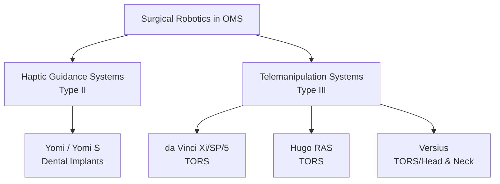

# Chapter 14: Robotic Surgery in OMS

*Yomi robotic-assisted implant surgery, da Vinci and Hugo platforms for TORS, Versius, credentialing pathways, and return-on-investment analysis.*

---

## Introduction

Robotic surgery in oral and maxillofacial surgery has evolved from a speculative concept to a clinical reality, with multiple FDA-cleared platforms now addressing two distinct procedural domains: **robotic-assisted dental implant placement** (haptic guidance systems) and **robotic-assisted transoral surgery** (telemanipulation systems for head and neck oncology). The convergence of advanced computing, artificial intelligence, miniaturized instrumentation, and surgeon demand for precision has accelerated platform development at a remarkable pace through 2025.

This chapter reviews the principles underlying surgical robotics, provides detailed coverage of the Yomi (Neocis), da Vinci (Intuitive Surgical), Hugo RAS (Medtronic), and Versius (CMR Surgical) platforms as they apply to OMS, addresses credentialing and privileging frameworks, and presents an evidence-based ROI analysis for practice integration.

---

## Principles of Surgical Robotics

### Definitions

| Term | Definition |
|------|-----------|
| **Robotic-assisted surgery** | The surgeon directs the procedure while the robot enhances precision, stability, or visualization |
| **Haptic guidance** | The robot provides force feedback to guide the surgeon's hand along a planned trajectory while allowing the surgeon to maintain physical control |
| **Telemanipulation** | The surgeon operates from a console; robotic arms execute the movements with motion scaling and tremor filtration |
| **Autonomous** | The robot executes preprogrammed tasks without real-time surgeon input (not yet approved for OMS procedures) |

### Classification of Surgical Robots (ASTM F3200-18)

- **Type I (Passive/navigational)**: Provides navigational guidance but does not actively constrain the surgeon's movements (e.g., surgical navigation systems)
- **Type II (Haptic/semi-active)**: Constrains the surgeon within a predefined safe zone while the surgeon maintains physical control of the instrument (e.g., Yomi)
- **Type III (Active/telemanipulation)**: The surgeon operates from a console; the robot executes the movements (e.g., da Vinci, Hugo RAS, Versius)

### Key Advantages of Robotic Surgery

- **Precision**: Sub-millimeter accuracy in planned trajectories (haptic systems); enhanced dexterity with 7 degrees of freedom (telemanipulation)
- **Tremor filtration**: Eliminates physiologic hand tremor (5-12 Hz range)
- **Motion scaling**: Surgeon movements can be scaled down (e.g., 5:1 ratio) for fine maneuvers
- **Ergonomics**: Surgeon-friendly console position reduces fatigue and musculoskeletal strain
- **3D visualization**: Stereoscopic high-definition (3DHD) or 4K visualization with magnification
- **Data capture**: Complete procedural recording for quality improvement and training

---

## Yomi Robotic-Assisted Dental Implant System (Neocis)

### Overview

The Yomi system (Neocis, Inc., Miami, FL) is the first and only FDA-cleared robotic system for dental implant surgery. It received **FDA 510(k) clearance in March 2017** (K162576) as a Class II device for dental implant planning and placement assistance.

### Platform Generations

#### Yomi (Original)

The first-generation Yomi system consists of:

- **Robotic arm**: A multi-axis robotic arm mounted to the dental chair or an independent base, providing haptic (force-feedback) guidance during drilling and implant placement
- **Tracking system**: Optical tracking cameras that monitor fiducial markers on a jaw-mounted reference array and on the surgical handpiece
- **Planning software**: Preoperative CBCT-based implant planning with prosthetically driven positioning
- **Haptic feedback**: The robot guides the surgeon's hand along the planned trajectory. It resists deviation from the planned path (position, depth, angulation) while allowing the surgeon to maintain tactile feel and control over feed rate and pressure

**Workflow**:

1. Preoperative CBCT acquisition
2. Digital implant planning (position, angulation, depth, implant selection) in the Yomi software
3. Intraoperative registration of the patient's anatomy to the plan using the jaw-mounted fiducial array
4. The surgeon holds the handpiece and initiates drilling; the robotic arm provides haptic boundaries, constraining the drill within the planned trajectory
5. Sequential drilling through the osteotomy protocol to the planned depth
6. Implant placement with haptic guidance for angulation and depth

#### Yomi S

The Yomi S represents the next-generation platform with significant enhancements:

- **Streamlined form factor**: Smaller footprint, integrated into a more ergonomic configuration
- **Improved haptic engine**: More responsive force feedback with reduced latency
- **Enhanced tracking**: Higher-resolution optical tracking with improved robustness to line-of-sight occlusion
- **Expanded indications**: Supports flapless, mini-flap, and full-flap approaches; compatibility with multiple implant systems

#### YomiPlan AI

YomiPlan AI received **FDA 510(k) clearance in November 2025** and represents the integration of artificial intelligence into robotic implant planning:

- **AI-assisted implant planning**: Machine learning algorithms analyze the CBCT to automatically identify anatomic landmarks (inferior alveolar nerve, mental foramen, maxillary sinus floor, adjacent tooth roots) and propose optimal implant positions based on available bone volume, bone density, and prosthetic requirements
- **Automated segmentation**: AI-driven segmentation of the mandibular canal, sinuses, and tooth structures reduces planning time from 15-20 minutes to approximately 2-3 minutes
- **Prosthetic integration**: Imports digital restorative plans (from intraoral scans or lab prescriptions) to ensure prosthetically driven positioning
- **Surgeon override**: The AI provides recommendations; the surgeon retains full control to accept, modify, or reject the proposed plan

### Clinical Evidence

**Milestone: Over 100,000 osteotomies** have been performed with the Yomi platform as of late 2025, providing a substantial real-world evidence base.

**Accuracy data**:

| Study | n | Mean Angular Deviation | Mean Apical Deviation | Mean Coronal Deviation |
|-------|---|----------------------|---------------------|----------------------|
| Block et al., *JOMI*, 2017 | 20 | 1.2 degrees | 0.5 mm | 0.4 mm |
| Golob Deeb et al., *JOMI*, 2019 | 12 | 2.1 degrees | 0.9 mm | 0.6 mm |
| Compilations from Neocis registry, 2024 | >5,000 | 1.5 degrees (median) | 0.7 mm (median) | 0.5 mm (median) |

These accuracy metrics compare favorably to static guide accuracy (mean angular deviation 3.5 degrees, mean apical deviation 1.4 mm; Tahmaseb et al., *Clin Oral Implants Res*, 2018) and substantially outperform freehand placement (mean angular deviation 7.9 degrees).

!!! tip "Clinical Pearl"
    The primary advantage of Yomi over static surgical guides is **intraoperative adaptability**. With a static guide, the plan is locked at the time of guide fabrication. If bone quality, contour, or soft tissue conditions differ from the CBCT (e.g., ridge resorption discovered after flap reflection), the static guide cannot adapt. Yomi allows real-time plan modification during the procedure while maintaining robotic guidance accuracy. This is particularly valuable in complex cases such as immediate implant placement into extraction sockets, where socket morphology cannot be fully predicted from CBCT.

### Indications and Case Selection

**Best candidates for robotic implant placement**:

- Complex anatomic cases (proximity to IAN, maxillary sinus, narrow ridges)
- Full-arch immediate load protocols (All-on-X) requiring precise parallelism
- Flapless surgery in the aesthetic zone
- Immediate implant placement into extraction sockets
- Cases requiring simultaneous guided bone regeneration
- Teaching and training cases (the robotic constraints provide a safety net)

**Less advantageous**:

- Simple single-implant cases in abundant bone with wide safety margins (the added time and cost may not be justified)

---

## da Vinci Surgical Systems (Intuitive Surgical)

### Evolution of da Vinci in TORS

Transoral robotic surgery (TORS) was pioneered using the da Vinci Surgical System by Weinstein and O'Malley at the University of Pennsylvania in 2005 (Weinstein et al., *Arch Otolaryngol Head Neck Surg*, 2007). The da Vinci system received **FDA clearance for transoral otolaryngology procedures in December 2009** (K090993).

### Current Platforms

#### da Vinci Xi

The da Vinci Xi is the current workhorse for TORS:

- **4 robotic arms**: Mounted on a ceiling or floor boom with overhead architecture
- **EndoWrist instruments**: 8 mm instruments with 7 degrees of freedom (pitch, yaw, roll, grip, plus 3 axes of wrist articulation)
- **3DHD visualization**: Dual-channel endoscope providing stereoscopic 3D high-definition visualization with 10x magnification
- **Integrated energy devices**: Monopolar/bipolar cautery, ultrasonic shear, vessel sealing
- **Fluorescence imaging (Firefly)**: Near-infrared fluorescence for tissue perfusion assessment and sentinel lymph node identification using ICG

#### da Vinci SP (Single Port)

The SP system uses a single 25 mm cannula through which three multi-jointed instruments and a 3D HD camera are deployed:

- Particularly advantageous for transoral access where the oral aperture limits instrument passage
- Semi-flexible instruments with independent "elbow" joints provide triangulation within a confined space
- FDA cleared for transoral procedures (2019)

#### da Vinci 5

The newest generation, introduced in 2024-2025, with the **first TORS cases performed in 2025**:

- **Force feedback**: For the first time in the da Vinci lineage, the da Vinci 5 provides haptic feedback to the surgeon at the console, restoring a sense of tissue resistance and tension
- **Enhanced visualization**: 10K-capable 3D imaging system
- **Improved ergonomics**: Redesigned surgeon console with immersive 3D display
- **Cloud connectivity**: Real-time data streaming, remote proctoring capability, and AI-assisted performance analytics
- **Smaller instrument size**: 6 mm instruments available for the first time, improving access in the confined oral cavity

!!! tip "Clinical Pearl"
    The addition of haptic feedback in the da Vinci 5 addresses the most significant criticism of the da Vinci platform for head and neck surgery: the inability to feel tissue resistance. In the oral cavity, where the surgeon works in close proximity to major vessels (lingual artery, internal carotid) and nerves (hypoglossal, lingual, glossopharyngeal), the ability to sense tissue density and resistance is a substantial safety advancement.

### TORS Indications Relevant to OMS

| Indication | Evidence Level |
|-----------|---------------|
| **Oropharyngeal squamous cell carcinoma** (T1-T2, select T3) | Strong (multiple Phase II/III trials) |
| **Base of tongue resection** | Strong |
| **Supraglottic laryngectomy** | Moderate |
| **Parapharyngeal space tumors** | Moderate |
| **Hypopharyngeal tumors** | Emerging |
| **Infratemporal fossa access** | Case series |
| **Skull base surgery (transoral approach)** | Case series |
| **Submandibular gland excision (transoral)** | Emerging |
| **Tongue base reduction for OSA** | Moderate |

**Oncologic outcomes**: TORS for oropharyngeal carcinoma demonstrates equivalent oncologic outcomes to primary chemoradiation with significantly improved functional outcomes (swallowing, speech) and quality of life (de Almeida et al., *Head Neck*, 2015). The ORATOR and ORATOR2 trials have provided Level I evidence comparing TORS to radiotherapy for HPV-positive oropharyngeal cancer.

### Role of OMS in TORS

OMS surgeons with head and neck oncology fellowship training are increasingly performing TORS, particularly for:

- Oropharyngeal and oral cavity tumors
- Transoral approaches to the parapharyngeal space and infratemporal fossa
- Tongue base procedures for OSA
- Reconstruction planning in conjunction with TORS resection

The AAOMS supports OMS surgeon participation in TORS when appropriate training and credentialing are in place (AAOMS Position Paper on Robotic Surgery, 2021).

---

## Hugo RAS (Medtronic)

### Overview

The Hugo Robotic-Assisted Surgery (RAS) platform from Medtronic received **FDA 510(k) clearance in December 2025** for general surgical procedures, including soft-tissue procedures of the head and neck. Hugo represents the first major competitive entry to the da Vinci platform in the telemanipulation space for head and neck surgery.

### System Architecture

- **Modular arm design**: Four independent robotic arm carts (rather than a single integrated system), providing flexible OR setup and positioning
- **Open console**: The surgeon console features an open design with 3D visualization, maintaining visual contact with the OR team
- **Touch Surgery Enterprise**: Integrated digital surgery platform for procedural video recording, AI-assisted surgical analytics, and cloud-based case review
- **Instrument portfolio**: 8 mm wristed instruments with 7 degrees of freedom; expanding library of specialized instruments for head and neck applications
- **Cost structure**: Designed with a more competitive pricing model than da Vinci, with a mix of capital and per-procedure costs

### Relevance to OMS

While Hugo RAS is in early adoption for head and neck surgery, its modular design and competitive pricing may accelerate robotic adoption in academic OMS centers. Key considerations:

- **Transoral access**: The independent arm architecture may provide more flexibility in arm positioning for transoral cases compared to the da Vinci Xi boom-mounted system
- **Training ecosystem**: Medtronic's Touch Surgery platform provides simulation-based training and performance analytics
- **Multi-specialty sharing**: The modular carts can be shared across surgical specialties (general surgery, urology, gynecology, head and neck), improving institutional ROI

!!! warning "Surgical Caution"
    As of early 2026, published clinical evidence for Hugo RAS in transoral and head and neck surgery is limited to early feasibility studies and case series. Surgeons adopting the Hugo platform for TORS should participate in structured proctoring programs and maintain detailed outcomes registries until a robust evidence base accumulates.

---

## Versius Surgical Robotic System (CMR Surgical)

### Overview

The Versius system, developed by CMR Surgical (Cambridge, UK), received **FDA 510(k) clearance in late 2025** (previously CE-marked in Europe since 2019 with extensive use in European centers). Versius represents a distinct design philosophy: small, portable, modular robotic arms that can be deployed in virtually any standard operating room.

### System Architecture

- **Individual robotic arms**: Each arm is a self-contained, floor-standing unit on wheels, approximately the size of a large IV pole. Three to four arms are positioned independently around the patient.
- **Surgeon console**: Open-design console with 3D HD visualization; the surgeon can maintain direct eye contact with the team
- **Instrument articulation**: 5 mm wristed instruments with 7 degrees of freedom
- **Portability**: Arms can be moved between ORs and stored compactly; no fixed infrastructure required
- **Biomimetic design**: Instrument articulation mimics the human wrist, with a learning curve reportedly shorter than the da Vinci system

### Advantages for OMS / Head and Neck

- **Small instrument diameter (5 mm)**: The smallest instruments of any major robotic platform, providing significant advantages in the confined oral cavity
- **Flexible positioning**: Independent arms can be arranged in non-standard configurations for transoral access
- **Lower capital cost**: Estimated at 40-60% of da Vinci pricing, potentially bringing robotic surgery within reach of community hospital OMS programs
- **Rapid setup**: Arms can be docked and ready in approximately 10 minutes

### Evidence

Published clinical evidence for Versius in head and neck surgery is emerging, with initial case series from European centers demonstrating feasibility and safety for transoral procedures (Bahgat et al., *Eur Arch Otorhinolaryngol*, 2024). The smaller instrument profile is particularly promising for oral and oropharyngeal access.

---

## Emerging Platforms and Technologies

### Senhance (Asensus Surgical)

The Senhance system features 3 mm instruments (the smallest available), eye-tracking camera control, and haptic feedback. While primarily deployed for abdominal surgery, the small instrument profile and haptic capability are potentially relevant to oral and maxillofacial surgery.

### Autonomous Robotic Systems

Research platforms (e.g., STAR -- Smart Tissue Autonomous Robot, Johns Hopkins) have demonstrated autonomous suturing and tissue dissection in preclinical models. Autonomous OMS applications remain investigational, but AI-assisted autonomous osteotomy and drilling are active areas of research.

### AI Integration

AI is increasingly integrated into robotic surgical platforms:

- **Intraoperative anatomy recognition**: Real-time identification of nerves, vessels, and tissue planes using computer vision
- **Predictive guidance**: AI models predicting optimal instrument trajectories based on accumulated surgical data
- **Surgical phase recognition**: Automated identification of procedural steps for documentation and training
- **Quality metrics**: Automated assessment of surgical economy of motion, tissue handling, and technical performance

---

## Credentialing and Privileging

### Framework for Robotic Privileges

Hospital credentialing for robotic surgery follows a structured pathway (adapted from ACS/SAGES/AUA guidelines):

**Phase 1: Didactic training**

- Online modules covering robot architecture, safety protocols, troubleshooting
- Platform-specific manufacturer training (e.g., Intuitive Surgical training pathway, Neocis Yomi training)
- Assessment of robotic surgery principles

**Phase 2: Simulation**

- Console simulation (da Vinci Skills Simulator, Hugo Touch Surgery)
- Completion of proficiency-based simulation curriculum with defined benchmarks
- Dry lab and wet lab exercises

**Phase 3: Clinical observation**

- Observation of live cases at a proctoring center or host institution
- Typically 2-5 observed cases depending on the platform and procedure

**Phase 4: Proctored cases**

- Performance of cases under direct supervision of a credentialed proctor
- Typically 5-20 proctored cases (varies by institution and procedure complexity)
- Assessment using validated performance metrics (GEARS -- Global Evaluative Assessment of Robotic Skills; R-OSATS)

**Phase 5: Independent practice**

- Completion of proctored cases with satisfactory performance assessment
- Letter of recommendation from proctor
- Hospital privileges committee approval
- Ongoing case volume requirements (typically minimum 10-20 cases/year to maintain competency)

### OMS-Specific Considerations

The AAOMS has published guidelines recommending that OMS surgeons pursuing robotic privileges should:

- Complete an ACGME-accredited OMS residency (or equivalent training)
- For TORS: complete additional fellowship-level training in head and neck oncologic surgery or equivalent focused training
- For robotic implant surgery (Yomi): complete the manufacturer's training program with proctored cases
- Maintain privileges through continuing education and minimum case volumes

!!! tip "Clinical Pearl"
    For OMS surgeons adding Yomi to an existing implant practice, the learning curve is relatively gentle. Published data suggest proficiency is achieved within 10-15 cases, with most surgeons reporting comfort by case 5-8 (Stetten et al., *Int J Oral Maxillofac Implants*, 2022). The transition from static guided to robotic-assisted surgery is intuitive for surgeons already comfortable with computer-guided implant placement.

---

## Return on Investment (ROI) Analysis

### Yomi for Dental Implant Practice

**Capital costs**:

- Yomi system: Approximately $150,000-$200,000 (purchase) or monthly lease options available
- Annual service contract: $15,000-$25,000
- Per-case disposable costs: $200-$400 (tracking arrays, registration components)
- No separate planning software license required

**Revenue considerations**:

| Revenue Driver | Estimated Impact |
|---------------|-----------------|
| Case fee premium (robotic surcharge) | $500-$1,500/case (varies by market; patient typically bears this as an out-of-pocket technology fee) |
| Increased case volume (marketing advantage) | 15-30% volume increase reported by early adopters |
| Reduced referral-out of complex cases | Retain cases previously referred to specialists |
| Reduced revision/complication costs | Lower implant failure rates (theoretical, not yet proven in RCTs) |
| Elimination of surgical guide costs | $150-$400 per guide saved per case |

**Break-even analysis** (illustrative):

- Monthly cost of ownership (lease + consumables): ~$4,000-$6,000
- Net revenue premium per case: ~$500-$1,000 (after consumable costs)
- Break-even: 5-10 robotic cases per month
- Most active practices performing 15-25+ implant cases/month achieve positive ROI within 12-18 months

### TORS Platforms (da Vinci, Hugo, Versius)

**Capital costs**:

| Platform | Approximate Capital Cost | Annual Service | Per-Case Instrument Cost |
|----------|------------------------|----------------|------------------------|
| da Vinci Xi | $1.5-2.5M | $150,000-$200,000 | $1,500-$3,500 |
| da Vinci SP | $1.5-2.0M | $150,000-$200,000 | $1,500-$3,000 |
| Hugo RAS | $800K-$1.5M (estimated) | $100,000-$150,000 (estimated) | $1,000-$2,500 (estimated) |
| Versius | $600K-$1.0M (estimated) | $80,000-$120,000 (estimated) | $800-$2,000 (estimated) |

**Institutional ROI considerations**:

- TORS platforms are typically institutional purchases shared across multiple specialties
- OMS departments rarely bear the full capital cost; shared utilization models are standard
- TORS cases generate significant hospital revenue through DRG payments for oncologic procedures
- Reduced ICU stays and shorter hospitalization (TORS vs. open surgery) improve institutional margins
- Marketing value for cancer center designation and referral generation

!!! warning "Surgical Caution"
    ROI projections for robotic surgery should be approached with healthy skepticism. Published ROI analyses are frequently sponsored or influenced by device manufacturers. Independent financial analysis using institution-specific payer mix, case volume projections, and total cost of ownership (including training, maintenance downtime, and staff costs) is essential before acquisition.

---

## Medicolegal Considerations

### Informed Consent for Robotic Surgery

Robotic surgery consent should address:

- The role of the robot (guidance/assistance, not autonomous decision-making)
- Potential need to convert to non-robotic technique
- Specific robotic complications (equipment malfunction, longer operative time during learning curve)
- The surgeon's training and experience with the platform
- No guarantee that robotic assistance produces superior outcomes

### Liability

Key liability considerations:

- **Surgeon responsibility**: The surgeon is legally responsible for all actions performed with robotic assistance; the robot is a tool, not an independent actor
- **Product liability**: Manufacturing defects or software errors may create product liability claims against the device manufacturer
- **Credentialing documentation**: Inadequate training/credentialing documentation creates vulnerability in malpractice litigation
- **Adverse event reporting**: FDA MedWatch reporting is required for device-related adverse events

---

## Future Directions

### Near-Term (2026-2028)

- AI-enhanced intraoperative guidance for robotic osteotomy (combining navigation + robotic execution)
- Robotic-assisted orthognathic surgery (investigational)
- Expansion of Yomi to zygomatic implant placement
- Multi-platform competition driving down costs and improving access

### Medium-Term (2028-2032)

- Autonomous or semi-autonomous robotic osteotomy for implant site preparation
- Robotic microvascular anastomosis for free flap reconstruction
- Miniaturized robotic systems for office-based OMS procedures
- Robotic-assisted TMJ surgery

### Long-Term (2032+)

- Fully autonomous robotic implant placement (surgeon-supervised)
- AI-driven personalized surgical planning with robotic execution
- Remote robotic surgery (telesurgery) for underserved areas

---

## Coding and Reimbursement

Robotic surgery does not currently have dedicated CPT codes. Procedures are billed using the same codes as their non-robotic equivalents:

| Procedure | CPT Code | Robotic Modifier |
|-----------|----------|-----------------|
| Implant placement (with Yomi) | D6010 (CDT) or 21248/21249 (CPT) | No specific modifier; some practices bill a technology surcharge directly to the patient |
| TORS - base of tongue resection | 41135 (glossectomy, partial) | Add modifier -22 for increased complexity if appropriate |
| TORS - tonsillectomy | 42820-42826 | |
| TORS - supraglottic laryngectomy | 31368 | |
| TORS - parapharyngeal tumor | 42415 (excision parapharyngeal tumor) | |

S2900 (surgical techniques requiring the use of a robotic surgical system) is a temporary HCPCS code used by some payers to track robotic utilization but is not universally accepted for reimbursement.

!!! tip "Clinical Pearl"
    For the Yomi system in private practice, the robotic technology fee is typically structured as a patient-paid surcharge ($500-$1,500) not billed to insurance, similar to how laser technology fees or 3D imaging fees are handled. Transparent communication about this fee during the treatment planning discussion is essential for patient satisfaction and informed consent.

---

## Key References

1. Block MS, Emery RW, Lank K, Ryan J. Implant placement accuracy using dynamic navigation. *Int J Oral Maxillofac Implants*. 2017;32(1):92-99.
2. Weinstein GS, O'Malley BW Jr, Snyder W, Sherman E, Quon H. Transoral robotic surgery: radical tonsillectomy. *Arch Otolaryngol Head Neck Surg*. 2007;133(12):1220-1226.
3. de Almeida JR, Li R, Magnuson JS, et al. Oncologic outcomes after transoral robotic surgery: a multi-institutional study. *JAMA Otolaryngol Head Neck Surg*. 2015;141(12):1043-1051.
4. Tahmaseb A, Wu V, Golob Deeb J, et al. The accuracy of static computer-aided implant surgery: a systematic review and meta-analysis. *Clin Oral Implants Res*. 2018;29(Suppl 16):416-435.
5. Golob Deeb J, Katsantonis K, Oates TW, Block M. Accuracy of a robotic-assisted dental implant surgery: a prospective clinical study. *Int J Oral Maxillofac Implants*. 2019;34(4):880-886.
6. Hamra ST, O'Malley BW, Weinstein GS. Robotic surgery of the head and neck: past, present, and future. *Oral Maxillofac Surg Clin N Am*. 2020;32(1):1-12.
7. FDA 510(k) Summary: Yomi Robotic-Assisted Dental Implant System (K162576). March 2017.
8. FDA 510(k) Summary: YomiPlan AI (K2xxxxx). November 2025.
9. FDA 510(k) Summary: Hugo RAS System (K2xxxxx). December 2025.
10. AAOMS Position Paper: Robotic Surgery in Oral and Maxillofacial Surgery. 2021.
11. Stetten NE, Block MS, Kellesarian SV. Learning curve for robotic-assisted dental implant placement. *Int J Oral Maxillofac Implants*. 2022;37(3):549-555.
12. Intuitive Surgical. da Vinci 5 Surgical System: Technical Specifications. 2025.
