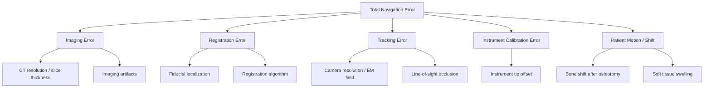
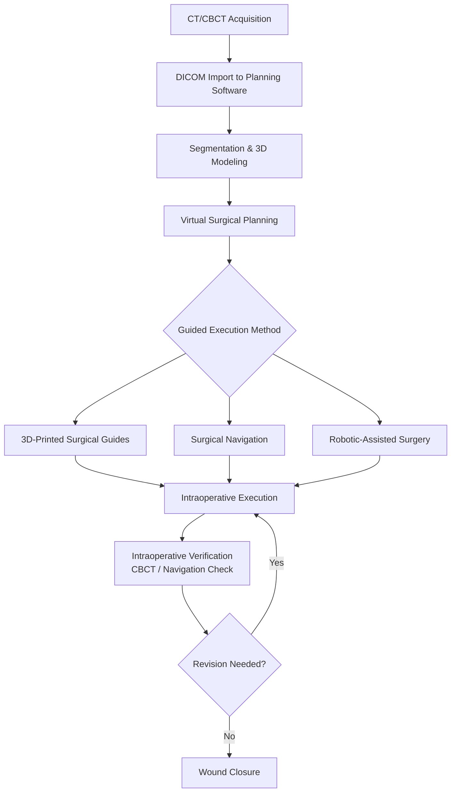

# Chapter 15: Surgical Navigation and Digital Workflow

*Computer-assisted surgery principles, optical and electromagnetic tracking, Brainlab, Stryker, KLS Martin, X-Guide, Navident EVO, registration techniques, intraoperative CT, accuracy metrics, and AR/VR in CMF surgery.*

---

## Introduction

Computer-assisted surgery (CAS) has transformed craniomaxillofacial (CMF) surgery from a discipline reliant on visual estimation and manual measurement to one driven by quantitative, real-time intraoperative guidance. Surgical navigation -- often described as "GPS for surgery" -- enables the surgeon to visualize the position of instruments relative to the patient's anatomy in three dimensions, in real time, on preoperative or intraoperative imaging datasets. The clinical benefits are measurable: reduced operative times in complex cases, improved accuracy of osteotomies and hardware placement, decreased rates of unplanned orbital or intracranial entry, and enhanced confidence in anatomically challenging regions (Bell, *J Oral Maxillofac Surg*, 2010).

This chapter covers the physics and engineering principles underlying surgical navigation, surveys the major commercial platforms relevant to OMS, reviews registration techniques and accuracy metrics, and explores the emerging roles of augmented reality (AR) and virtual reality (VR) in CMF surgery.

---

## Principles of Computer-Assisted Surgery

### System Components

Every surgical navigation system consists of four fundamental components:

1. **Imaging dataset**: Preoperative CT, CBCT, or MRI; or intraoperative imaging (CT, O-arm, or CBCT)
2. **Tracking system**: Hardware that determines the real-time position and orientation of instruments and patient reference
3. **Registration**: The mathematical process that aligns the imaging dataset to the physical patient in the operating room
4. **Visualization**: Software display showing the instrument position overlaid on the imaging dataset in real time

### Tracking Technologies

#### Optical Tracking

**Principle**: Infrared cameras detect passive (reflective spheres) or active (LED) markers attached to instruments and a patient reference frame. Triangulation of marker positions from multiple camera angles yields 3D coordinates.

**Advantages**:

- High accuracy (0.1-0.3 mm positional accuracy in the tracking volume)
- Well-established, mature technology
- No interference from metallic instruments

**Limitations**:

- **Line-of-sight requirement**: The cameras must have an unobstructed view of the markers at all times. Surgical drapes, the surgeon's hands, or OR staff can occlude markers and cause tracking loss.
- Camera positioning requires planning and may limit OR workflow
- Markers must be rigid and firmly attached; any flex or loosening degrades accuracy

**Systems using optical tracking**: Brainlab Curve/Kick, Stryker ENT Navigation, KLS Martin IPS, X-Guide (X-Nav Technologies)

#### Electromagnetic (EM) Tracking

**Principle**: A magnetic field generator creates a known electromagnetic field in the operative space. Sensors (small coils) embedded in instruments detect field changes and compute their 3D position and orientation within the field.

**Advantages**:

- **No line-of-sight requirement**: Tracking works through tissue, drapes, and even within body cavities
- Smaller, more flexible instruments possible
- Patient reference can be smaller and less obtrusive

**Limitations**:

- **Accuracy**: Typically 1-3 mm positional accuracy -- lower than optical systems
- **Metal interference**: Ferromagnetic instruments, the surgical table, and OR equipment can distort the electromagnetic field, introducing error
- Reduced accuracy at the periphery of the field generator's range
- Not suitable for procedures requiring sub-millimeter precision

**Systems using EM tracking**: Medtronic StealthStation EM, Navident EVO (ClaroNav), some Stryker configurations

#### Hybrid Tracking

Some systems offer both optical and EM tracking (e.g., Stryker), allowing the surgeon to select the appropriate modality based on the clinical scenario.

| Feature | Optical | Electromagnetic |
|---------|---------|-----------------|
| Accuracy | 0.1-0.3 mm | 1-3 mm |
| Line of sight | Required | Not required |
| Metal interference | Minimal | Significant |
| Instrument flexibility | Rigid only | Flexible possible |
| Best suited for | CMF, skull base, implants | Sinus, endoscopic, dental |

---

## Registration Techniques

Registration is the critical step that mathematically links the patient's physical anatomy to the imaging dataset. Registration accuracy directly determines the overall accuracy of the navigation system. An error in registration propagates to every navigated measurement.

### Point-Based (Fiducial) Registration

**Technique**: Discrete corresponding points are identified on both the imaging dataset and the physical patient. A minimum of three non-collinear points is required; accuracy improves with more points (typically 4-8).

**Fiducial types**:

- **Anatomic landmarks**: Easily identified points (e.g., infraorbital rim, nasion, lateral canthus). Convenient but limited accuracy due to soft tissue deformability and imprecise identification (~2-4 mm accuracy).
- **Bone-anchored fiducial markers (screws or pins)**: Small titanium screws placed before the imaging study. The screws are precisely identified on imaging and then physically touched with the navigated pointer. This provides the highest registration accuracy (0.3-0.8 mm) but requires an additional minor procedure for screw placement.
- **Adhesive skin markers**: Radiopaque markers adhered to the skin before imaging. Moderate accuracy (1-2 mm) but subject to skin shift between imaging and surgery.

### Surface (Contour) Registration

**Technique**: A navigated pointer or laser scanner traces the surface of exposed anatomy (e.g., the forehead, maxilla, or orbital rim). The collected point cloud is matched to the surface of the 3D model derived from CT using an iterative closest point (ICP) algorithm.

**Advantages**:

- No fiducial markers needed (no pre-imaging preparation)
- Can acquire hundreds to thousands of points, providing robust matching
- Suitable for mid-face and forehead surfaces

**Limitations**:

- Requires exposed bony or skin surface for scanning
- Accuracy dependent on the uniqueness of the surface geometry (flat surfaces match poorly)
- Soft tissue deformability introduces error if scanning skin rather than bone
- Typical accuracy: 0.8-1.5 mm

### Automatic/Image-Based Registration

Some systems use intraoperative imaging (CT or CBCT) for registration, eliminating the need for any separate registration step:

- **Intraoperative CT with navigation**: The patient is scanned in the operative position; the navigation system automatically registers the imaging to the tracking reference frame attached to the patient. This is the most accurate registration method (0.3-0.5 mm) as it eliminates any temporal mismatch between imaging and patient position.
- **Intraoperative CBCT**: Cone-beam CT (e.g., Medtronic O-arm, Brainlab Airo) acquired in the OR; automatic registration to the patient reference array.

!!! tip "Clinical Pearl"
    For maxillofacial trauma reconstruction, surface registration on the intact contralateral side combined with mirroring of the intact anatomy provides a target for reconstruction of the comminuted side. This "mirror image" technique is particularly valuable for orbital and zygomatic reconstruction, where the goal is restoration of preinjury symmetry (Hohlweg-Majert et al., *J Oral Maxillofac Surg*, 2005).

---

## Major Navigation Platforms for OMS

### Brainlab (Munich, Germany)

Brainlab is the market leader in cranial and craniomaxillofacial navigation, with the broadest portfolio of CMF-specific tools.

#### Brainlab Kick

- **Form factor**: Compact, mobile cart-based system designed for outpatient or small-OR settings
- **Tracking**: Optical (infrared camera array integrated into the display)
- **Imaging compatibility**: DICOM import from CT, CBCT, MRI
- **Planning software**: Integrated surgical planning with segmentation, measurement, and virtual osteotomy tools
- **Key applications**: Implant navigation, trauma reconstruction, foreign body localization, cyst/tumor localization
- **Footprint**: Small enough for ambulatory surgery centers and private OMS offices

#### Brainlab Curve

The flagship platform for hospital-based CMF navigation:

- **Tracking**: High-resolution optical tracking with extended tracking volume
- **Instrument library**: Extensive library of navigated CMF instruments (drills, saws, plates, screws)
- **Planning integration**: Full integration with Brainlab iPlan CMF planning software for virtual osteotomy planning, orthognathic simulation, and hardware pre-positioning
- **Cranial integration**: Seamless integration with neurosurgical navigation for combined craniofacial cases

#### Brainlab Mixed Reality Viewer for CMF

Introduced in 2024-2025, the Mixed Reality Viewer uses Microsoft HoloLens 2 or equivalent head-mounted displays to project 3D holographic models of the patient's anatomy and surgical plan directly into the surgeon's field of view:

- **Overlay**: Virtual surgical plan (planned osteotomy lines, screw positions, implant positions) projected as holograms registered to the patient's anatomy
- **Interaction**: Gesture and voice control for manipulating the holographic display
- **Applications**: Intraoperative visualization of surgical plan during execution; educational visualization for surgical trainees; preoperative surgical rehearsal
- **Registration**: Uses the Brainlab navigation system for spatial registration between the holographic model and the patient

!!! tip "Clinical Pearl"
    The Brainlab Mixed Reality Viewer is particularly valuable for complex midface reconstruction, where the surgeon must simultaneously appreciate the 3D relationships between multiple bony segments, implants, and soft tissue. Rather than repeatedly turning to a remote screen, the surgeon visualizes the plan directly overlaid on the operative field, reducing cognitive load and improving spatial orientation.

### Stryker (Kalamazoo, MI)

#### Stryker ENT Navigation System

- **Platform**: Cart-based system with integrated display and optical or EM tracking
- **Strengths**: Dominant market share in functional endoscopic sinus surgery (FESS); extensive instrument library for sinus and skull base surgery
- **CMF applications**: Orbital surgery, midface trauma, sinus-related pathology, skull base approaches
- **EM tracking option**: Advantageous for endoscopic sinus and skull base procedures where line-of-sight is limited
- **Fusion capability**: Can fuse CT and MRI datasets for soft tissue and bony visualization

#### Stryker Scopis (Acquired from Scopis GmbH)

The Scopis system integrates augmented reality into the surgical microscope, projecting navigation data directly into the microscope's field of view. Applicable to microsurgical CMF and skull base procedures.

### KLS Martin IPS (Tuttlingen, Germany)

#### IPS (Intraoperative Positioning System)

- **Design**: A CMF-specific navigation system integrated with the KLS Martin CMF implant portfolio
- **Key feature**: Real-time navigation of KLS Martin pre-bent plates, patient-specific implants, and cutting guides
- **Planning**: Integrated with IPS Case Designer software for virtual surgery planning and custom implant/guide design
- **Tracking**: Optical tracking with CMF-optimized instrument adapters
- **Unique capability**: Navigated plate bending -- the system displays the planned plate position and guides the surgeon in real time as the plate is bent and positioned

**Applications**:

- Mandibular reconstruction with free fibula flap (navigated fibula positioning)
- Orbital floor and wall reconstruction (navigated implant positioning)
- LeFort I, II, III osteotomies with real-time validation of planned movements
- Craniosynostosis correction with navigated osteotomies

### X-Guide (X-Nav Technologies)

#### System Overview

X-Guide is a dynamic, real-time navigation system specifically designed for dental implant placement:

- **Tracking**: Optical (dual infrared cameras mounted on an articulating arm)
- **Planning**: Integrated planning software using CBCT data; prosthetically driven implant positioning
- **Real-time guidance**: The surgeon views a live 3D navigation display showing the drill position, angulation, and depth relative to the planned trajectory -- in real time
- **No surgical guide required**: Eliminates the need for physical surgical guides while maintaining guided accuracy
- **FDA cleared**: 510(k) clearance for dental implant placement guidance

**Accuracy data**: Mean angular deviation of 2.2 degrees, mean apical deviation of 0.85 mm, mean coronal deviation of 0.59 mm (Campos et al., *Int J Oral Maxillofac Implants*, 2021). This places X-Guide accuracy between static guides and freehand placement.

**Comparison with Yomi**: Both X-Guide and Yomi provide real-time implant navigation without physical guides. The key difference is that Yomi provides haptic (physical) guidance through a robotic arm, while X-Guide provides visual-only guidance on a screen. The surgeon must translate the visual information into hand movements, which introduces a human error component.

| Feature | X-Guide | Yomi |
|---------|---------|------|
| Guidance type | Visual (screen-based) | Haptic (robotic arm) |
| Tracking | Optical | Optical |
| Robotic arm | No | Yes |
| Physical constraint | None | Haptic boundaries |
| Approximate cost | $70,000-$100,000 | $150,000-$200,000 |
| Learning curve | Moderate | Shorter (haptic is intuitive) |
| Intraoperative plan changes | Yes | Yes |

### Navident EVO (ClaroNav, Toronto, Canada)

#### System Overview

Navident EVO is a dental-specific navigation system using **electromagnetic tracking**:

- **Tracking**: EM tracking with a small field generator positioned near the patient; sensor-embedded handpieces
- **No line-of-sight requirement**: Eliminates the most significant limitation of optical systems in dental surgery, where the surgeon's hands, cheek retractors, and suction frequently occlude optical markers
- **Trace registration**: A proprietary "trace and place" registration technique using CBCT data -- the surgeon traces the occlusal surface of teeth with a navigated pointer, and the system matches this surface to the CBCT scan
- **Real-time 3D display**: Shows drill position relative to planned implant trajectory on a chairside monitor
- **Compact**: Designed for private practice dental operatories; small footprint

**Accuracy data**: Mean positional deviation of 0.46-0.71 mm at the entry point and 0.83-1.58 mm at the apex; mean angular deviation of 1.6-3.0 degrees (Jiang et al., *Int J Implant Dent*, 2023). The range reflects variation across studies and clinical conditions.

!!! tip "Clinical Pearl"
    Navident's electromagnetic tracking eliminates the frustrating line-of-sight interruptions that plague optical systems during dental implant navigation. For posterior mandibular implants, where the surgeon's hand and suction often block the camera view, EM tracking maintains continuous navigation without interruption. The trade-off is slightly lower accuracy compared to optical systems, but the clinical workflow improvement may outweigh this for routine implant cases.

---

## Accuracy Metrics in Surgical Navigation

### Terminology

| Term | Definition |
|------|-----------|
| **Target registration error (TRE)** | The distance between the navigated position and the true position at a target point; the most clinically meaningful accuracy metric |
| **Fiducial registration error (FRE)** | The RMS distance between corresponding fiducial pairs after registration; lower FRE does not always predict lower TRE |
| **Fiducial localization error (FLE)** | The error in identifying individual fiducial positions on imaging and on the patient |
| **Application accuracy** | The overall system accuracy in a clinical task (e.g., implant placement deviation); combines all error sources |

### Published Accuracy Data for CMF Navigation

| Application | Platform(s) | Mean Deviation | Source |
|-------------|------------|----------------|--------|
| Orbital reconstruction | Brainlab, Stryker | 0.8-1.5 mm | Hohlweg-Majert et al., 2005 |
| Zygomatic osteotomy | Brainlab Curve | 1.0-1.8 mm | Yu et al., *JOMS*, 2013 |
| Mandibular reconstruction (fibula) | KLS Martin IPS | 0.9-2.1 mm | Wilde et al., *IJOMS*, 2015 |
| Dental implants (dynamic navigation) | X-Guide, Navident | 0.46-1.58 mm (coronal) | Multiple studies, 2019-2025 |
| Dental implants (robotic, Yomi) | Yomi | 0.4-0.9 mm (coronal) | Block et al., 2017; Golob Deeb et al., 2019 |
| Dental implants (static guides) | Various | 1.0-1.4 mm (coronal) | Tahmaseb et al., 2018 |
| LeFort I osteotomy validation | Brainlab, KLS Martin | 0.8-1.5 mm | Zieliński et al., *JCMS*, 2019 |
| Foreign body localization | Brainlab Kick | 0.5-1.0 mm | Bell, 2010 |

### Sources of Error

!!! warning "Surgical Caution"
    **After a bone cut (osteotomy), the registration of the mobilized segment is no longer valid.** The navigation data reflects the pre-osteotomy anatomy. In orthognathic surgery, the maxillary segment after a LeFort I down-fracture is no longer registered. If navigation is needed for the mobilized segment (e.g., to verify the new position), re-registration or intraoperative imaging (CBCT) is required. Surgeons must understand this fundamental limitation to avoid navigation-induced errors.

---

## Intraoperative Imaging

### Intraoperative CT / CBCT

The integration of intraoperative imaging with navigation addresses several limitations of conventional navigation:

- **Eliminates registration error**: Intraoperative imaging acquires the anatomy in the surgical position; automatic registration to the tracking reference eliminates the fiducial/surface registration step
- **Real-time verification**: The surgeon can verify the position of hardware (plates, screws, implants, reconstructive segments) before wound closure
- **Updated anatomy**: After osteotomy, a new intraoperative scan provides an updated dataset that reflects the current surgical state

**Available systems**:

| System | Type | Resolution | OR Footprint |
|--------|------|-----------|-------------|
| Brainlab Airo | Mobile CT | ~0.5 mm | Moderate (ceiling-mounted or mobile) |
| Medtronic O-arm | Cone-beam CT (intraoperative) | ~0.8 mm | Large (mobile gantry) |
| Ziehm Vision RFD 3D | Mobile C-arm with 3D reconstruction | ~1.0 mm | Moderate |
| Xoran xCAT (Carestream) | Point-of-care CBCT | ~0.3 mm (isotropic) | Compact |

**Clinical impact**: Studies have demonstrated that intraoperative CBCT changes surgical management in 15-25% of CMF cases (Stuck et al., *Int J CARS*, 2012). The most common revision is adjustment of orbital floor/wall implant position or detection of inadequately reduced fractures.

---

## Clinical Applications in OMS

### Orbital Reconstruction

Navigation is arguably most valuable in orbital surgery, where:

- Anatomy is complex and 3D
- Small errors in implant position produce significant functional deficits (enophthalmos, diplopia)
- The surgeon's visual assessment of orbital volume and implant contour is limited
- The uninjured contralateral orbit provides a target template (mirror imaging)

**Navigated orbital workflow**:

1. Preoperative CT with contralateral mirroring to create the reconstruction target
2. Intraoperative registration (surface or fiducial)
3. Navigated dissection to identify orbital landmarks (posterior ledge, inferomedial strut, orbital apex)
4. Navigated implant positioning using the contralateral template as the target
5. Intraoperative CBCT to verify implant position before closure

**Published outcomes**: Yu et al. (*J Oral Maxillofac Surg*, 2013) demonstrated significantly improved orbital volume restoration with navigated reconstruction compared to non-navigated (mean volume difference from contralateral: 0.8 cm^3^ navigated vs. 1.6 cm^3^ non-navigated, p<0.01).

### Midface and Zygomatic Fractures

Navigation aids in:

- Precise reduction of comminuted zygomaticomaxillary complex (ZMC) fractures
- Verification of malar projection and width restoration
- Zygomatic arch reduction with real-time position feedback

### Mandibular Reconstruction

Navigated fibula free flap reconstruction combines VSP with intraoperative navigation:

- Planned osteotomy positions on the fibula are verified with navigation
- Fibula segment positioning in the mandibular defect is guided in real time
- KLS Martin IPS and Brainlab both offer dedicated mandibular reconstruction navigation workflows

### Dental Implant Placement

Dynamic navigation (X-Guide, Navident) and robotic systems (Yomi) have been discussed in detail in Chapter 14 and the platform sections above.

### Foreign Body Removal

Navigation enables precise localization and retrieval of displaced root tips, broken instruments, and projectiles in the craniomaxillofacial region with minimal surgical access.

### Skull Base Surgery

Navigation is considered standard of care for anterior skull base surgery, providing real-time proximity alerts for critical structures (optic nerve, internal carotid artery, brain).

---

## Augmented Reality (AR) in CMF Surgery

### Current State

Augmented reality projects computer-generated information (3D models, navigation data, planned osteotomy lines) directly into the surgeon's field of view, eliminating the need to look away from the operative field to a remote monitor.

**Current AR implementations**:

- **Brainlab Mixed Reality Viewer** (see above): Head-mounted display with holographic overlay registered to patient navigation
- **Surgical microscope integration (Stryker Scopis, Zeiss KINEVO)**: Navigation data overlaid on the microscope field
- **Head-up display (HUD) integration**: Navigation data displayed on transparent screens at eye level in the OR

### Advantages of AR Over Screen-Based Navigation

| Feature | Conventional Navigation | AR Navigation |
|---------|------------------------|---------------|
| Surgeon's gaze | Must shift between patient and screen | Remains on patient |
| Spatial orientation | Must mentally map 2D screen to 3D anatomy | Direct 3D overlay on anatomy |
| Hand-eye coordination | Indirect (screen → patient translation) | Direct (overlay guides hands) |
| Cognitive load | Higher (mental transformation required) | Lower (intuitive visualization) |
| Depth perception | Limited on 2D screen | Preserved with stereoscopic HMD |

### Limitations

- **Registration accuracy**: Current AR overlays have registration accuracy of 1-3 mm, which may be insufficient for some precision applications
- **Display technology**: Current HMDs (HoloLens 2) have limited field of view (~52 degrees) and may introduce visual fatigue during long procedures
- **Latency**: Any lag between head movement and display update produces disorientation
- **Cost and workflow integration**: Significant cost and OR workflow disruption during the adoption phase

### Future Directions

- **Real-time tracking integration**: Tighter coupling between AR displays and navigation tracking for sub-millimeter overlay accuracy
- **AI-enhanced anatomy identification**: Computer vision algorithms identifying and labeling anatomic structures in real time through the AR display
- **Haptic AR**: Combined visual AR overlay with haptic feedback devices for guided tissue interaction
- **5G-enabled remote consultation**: Remote experts viewing the AR feed and providing real-time guidance during complex cases

---

## Virtual Reality (VR) in CMF Surgery

### Surgical Planning

VR provides immersive 3D visualization of patient-specific anatomy for preoperative planning:

- **Virtual osteotomy simulation**: The surgeon can perform the planned osteotomies in a VR environment, evaluating segment mobility, interference, and fixation strategies
- **Tumor resection planning**: Visualize the tumor in relation to surrounding vital structures with depth perception not available on 2D screens
- **Patient communication**: VR walkthrough of the planned surgery aids informed consent discussion

### Surgical Training

VR surgical simulators allow trainees to practice CMF procedures in a risk-free environment:

- **Haptic feedback**: Advanced VR simulators (e.g., FundamentalVR) provide force feedback to simulate tissue resistance
- **Procedure-specific modules**: Available for orthognathic osteotomies, orbital reconstruction, mandibular fracture fixation
- **Objective metrics**: Instrument economy of motion, force application, accuracy, and time are recorded for performance assessment

### Rehabilitation

VR-based rehabilitation for patients with craniofacial conditions:

- TMJ mobilization exercises in a VR environment
- Facial nerve rehabilitation with visual biofeedback
- Cognitive rehabilitation for TBI patients with craniofacial trauma

---

## Digital Workflow Integration

### The Complete Digital CMF Workflow

The full digital workflow from imaging to the operating room represents the integration of multiple technologies:

### Interoperability Challenges

- **DICOM compatibility**: Most systems accept standard DICOM files, but proprietary planning file formats may not transfer between platforms
- **STL/OBJ exchange**: 3D models can typically be exported in universal formats (STL, OBJ) for cross-platform use
- **Regulatory barriers**: Patient data (DICOM, planning files) must be transmitted via HIPAA-compliant channels
- **Vendor lock-in**: Some navigation systems only work with same-vendor planning software, limiting flexibility

### Cost Considerations

| Component | Approximate Cost | Annual Cost |
|-----------|-----------------|-------------|
| Navigation system (Brainlab Kick) | $100,000-$150,000 | $15,000-$25,000 service |
| Navigation system (Brainlab Curve) | $200,000-$350,000 | $25,000-$40,000 service |
| X-Guide (implant navigation) | $70,000-$100,000 | $10,000-$15,000 service |
| Navident EVO | $50,000-$70,000 | $8,000-$12,000 service |
| Intraoperative CBCT (e.g., xCAT) | $150,000-$300,000 | $15,000-$30,000 service |
| Disposables per case | $200-$800 | Varies with volume |
| AR head-mounted display | $3,500-$5,000 per unit | Minimal |

---

## Coding and Reimbursement

Navigation does not have a dedicated CPT code for most applications. It is considered part of the surgical procedure and is not separately reimbursable in most payer scenarios. However:

- **CPT 61781-61783** (stereotactic computer-assisted volumetric navigational procedure guidance, cranial/spinal/intracranial): May be applicable for skull base and cranial procedures performed with neurosurgery
- **CPT 0054T-0055T** (computer-assisted musculoskeletal surgical navigational orthopedic procedure): Category III codes; limited payer recognition
- **Facility charges**: Hospitals may recover navigation costs through facility fees and DRG payments for complex procedures
- **Practice integration**: In private practice, navigation costs are typically absorbed as a practice expense that improves outcomes and reduces complications (indirect ROI)

!!! tip "Clinical Pearl"
    While navigation is not directly reimbursable in most OMS settings, the investment is justified by reduced revision surgery rates, shorter operative times in complex cases (once the learning curve is passed), and marketing differentiation. For trauma reconstruction, orbital surgery, and complex implant cases, navigation has become the standard of care at academic centers, and the liability risk of not using available technology when complications occur should be factored into the cost-benefit analysis.

---

## Key References

1. Bell RB. Computer planning and intraoperative navigation in cranio-maxillofacial surgery. *Oral Maxillofac Surg Clin North Am*. 2010;22(1):135-156.
2. Hohlweg-Majert B, Metzger MC, Klock T, Jost B, Ziesling M. Navigational maxillofacial surgery using virtual models. *World J Surg*. 2005;29(12):1530-1538.
3. Yu H, Shen SG, Wang X, Zhang L, Zhang S. The indication and application of computer-assisted navigation in oral and maxillofacial surgery--Shanghai's experience based on 104 cases. *J Craniomaxillofac Surg*. 2013;41(8):770-774.
4. Wilde F, Hanken H, Gellrich NC, Schmid A, Zimmerer R. Navigated mandibular reconstruction with free fibula flap. *Int J Oral Maxillofac Surg*. 2015;44(supplement):e37.
5. Tahmaseb A, Wu V, Golob Deeb J, et al. The accuracy of static computer-aided implant surgery: a systematic review and meta-analysis. *Clin Oral Implants Res*. 2018;29(Suppl 16):416-435.
6. Block MS, Emery RW, Lank K, Ryan J. Implant placement accuracy using dynamic navigation. *Int J Oral Maxillofac Implants*. 2017;32(1):92-99.
7. Jiang W, Ma L, Zhang B, Fan Z, Zeng Y. Evaluation of the 3D accuracy of Navident EVO navigation system for dental implant surgery. *Int J Implant Dent*. 2023;9(1):12.
8. Campos FEB, Marciano MA, Javed F, Subjective and objective. Accuracy and time analysis of computer-aided dynamic navigation for implant placement. *Int J Oral Maxillofac Implants*. 2021;36(2):305-313.
9. Stuck BA, Teymoortash A, Genzwürker H, et al. Intraoperative cone-beam computed tomography in the management of facial fractures: a preliminary study. *Int J Comput Assist Radiol Surg*. 2012;7(1):133-139.
10. Zieliński R, Kozakiewicz M, Okulski J. Accuracy of surgical navigation in cranio-maxillofacial surgery. *J Craniomaxillofac Surg*. 2019;47(12):1994-2000.
11. Brainlab AG. Mixed Reality Viewer for CMF: Technical Specifications and Clinical Applications. 2025.
12. AAOMS. Parameters of Care: Clinical Practice Guidelines for Oral and Maxillofacial Surgery (ParCare 6th ed). 2017.
