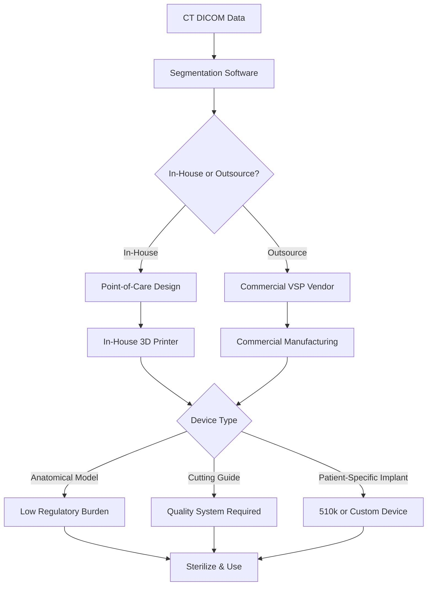

# Chapter 16: 3D Printing, VSP, and Patient-Specific Devices

*Virtual surgical planning platforms, additive manufacturing technologies, patient-specific implants, and the regulatory landscape for point-of-care fabrication.*

---

## Introduction

The convergence of advanced imaging, computational design, and additive manufacturing has fundamentally altered the practice of oral and maxillofacial surgery. Virtual surgical planning (VSP) transforms two-dimensional CT data into interactive three-dimensional models that allow the surgeon to rehearse osteotomies, position hardware, and predict soft-tissue outcomes before the first incision. When combined with 3D-printed cutting guides, patient-specific implants (PSIs), and anatomical models, VSP compresses operative time, reduces intraoperative improvisation, and improves spatial accuracy of bony reconstruction.

The global market for 3D printing in healthcare exceeded **$2 billion in 2024** and is projected to surpass **$4 billion by 2034**, driven by declining printer costs, expanded material libraries, and increasing FDA regulatory clarity (Grand View Research, 2024). For the OMS surgeon, this chapter provides a working knowledge of the major VSP platforms, the physics of relevant 3D printing technologies, the regulatory pathway for patient-specific devices, and the cost-benefit calculus of in-house versus outsourced fabrication.

---

## Virtual Surgical Planning Platforms

### Overview of VSP Workflow

Regardless of vendor, the core VSP workflow follows a predictable sequence:

1. **Image acquisition** -- High-resolution CT (slice thickness <=1.0 mm, preferably 0.625 mm) with DICOM export.
2. **Segmentation** -- Separation of bone from soft tissue, vessels, and airway using threshold-based and manual refinement algorithms.
3. **Virtual osteotomy design** -- Surgeon-directed placement of cutting planes, segment repositioning, and gap analysis.
4. **Hardware planning** -- Selection and virtual bending of reconstruction plates, positioning of fixation screws, design of cutting guides.
5. **Design review** -- Real-time web conference between the surgeon and biomedical engineer to finalize the plan.
6. **Manufacturing** -- 3D printing of guides, models, and/or PSIs; pre-bending of stock plates on stereolithographic (SLA) models.
7. **Sterilization and intraoperative use** -- Delivery of sterile-packaged components to the OR.

!!! tip "Clinical Pearl"
    Request CT acquisition with the patient in the same head position as the planned surgery (e.g., neutral head position for mandibular reconstruction). Motion artifact from swallowing or breathing degrades segmentation quality and can introduce >1 mm of error in guide fit (Tarsitano et al., *Int J Oral Maxillofac Surg*, 2015).

### Major Commercial VSP Platforms

#### Materialise ProPlan CMF

Materialise (Leuven, Belgium) pioneered medical 3D printing and remains the dominant VSP vendor in CMF surgery globally. The ProPlan CMF platform, powered by **Mimics Enlight 7.0** (the latest iteration of their segmentation engine), offers:

- Semi-automated mandible, maxilla, and midface segmentation with AI-assisted landmark detection
- Fibula, scapula, and iliac crest harvest planning with integrated perforator vessel mapping (CT angiography overlay)
- Virtual plate bending with clash detection
- Design of polyamide (nylon) cutting guides and SLA anatomical models
- Integration with Materialise custom titanium implants (patient-specific plates, mesh, and orbital floor implants)

Materialise processes over **100,000 cases per year** across all surgical specialties. Typical turnaround for a standard mandibular reconstruction VSP case is 7--10 business days from CT upload to guide delivery, though expedited 48-hour service is available at premium cost.

#### Stryker CMF VSP (formerly Leibinger)

Stryker's VSP platform, acquired through the 2020 purchase of Mobius Imaging assets and expanded through internal R&D, offers end-to-end planning integrated with their MatrixMandible and MatrixMidface plating systems. Key developments include:

- **Titanium + nylon hybrid cutting guides (2025 release)** -- These guides incorporate a titanium rail bonded to a nylon body, providing the rigidity of metal at the cutting interface while reducing weight and cost compared to fully titanium guides
- Direct integration with Stryker's locking plate inventory for virtual plate selection and screw trajectory planning
- On-screen simulation of plate adaptation with stress analysis
- Cloud-based collaboration portal for asynchronous surgeon review

!!! warning "Surgical Caution"
    When using any vendor's hybrid guides, confirm that the metallic component does not interfere with reciprocating saw blades at steep angulations. Bench-test the guide on the SLA model before the OR to verify clearance.

#### KLS Martin IPS CaseDesigner

KLS Martin (Tuttlingen, Germany) entered the VSP market with IPS (Individual Patient Solutions) CaseDesigner, which differentiates itself through:

- Tight integration with KLS Martin's titanium mesh and patient-specific plate manufacturing (in-house CNC milling and electron beam melting)
- Comprehensive orthognathic planning module with intermediate and final splint design
- Midface and orbital reconstruction planning with thin-wall titanium mesh PSIs
- European CE marking and FDA 510(k) clearance for surgical guides

| Feature | Materialise ProPlan CMF | Stryker CMF VSP | KLS Martin IPS |
|---|---|---|---|
| Segmentation engine | Mimics Enlight 7.0 | Proprietary cloud | IPS CaseDesigner |
| Custom titanium PSI | Yes (EBM/DMLS) | Yes (SLM) | Yes (EBM/CNC) |
| Cutting guide material | Nylon (SLS) | Titanium-nylon hybrid (2025) | Nylon / Titanium |
| Orthognathic module | Yes | Yes | Yes |
| Typical turnaround | 7--10 days | 7--14 days | 10--14 days |
| Approximate case cost (guides + models) | $2,500--$5,000 | $2,500--$5,500 | $3,000--$5,500 |

---

## 3D Printing Technologies in OMS

### Stereolithography (SLA)

SLA was the first commercial 3D printing technology (Chuck Hull, 1986) and remains the gold standard for high-resolution anatomical models and surgical guides.

**Principle:** A UV laser selectively cures a liquid photopolymer resin layer by layer. Each layer is typically 25--100 microns thick.

**Advantages:**

- Excellent surface finish and dimensional accuracy (+-0.1 mm)
- Biocompatible resins available (Class I and Class IIa medical devices)
- Transparent resins allow visualization of internal anatomy (e.g., IAN canal within a mandible model)

**Limitations:**

- Photopolymer parts are brittle and degrade with UV exposure over time
- Post-processing requires solvent wash and UV post-cure
- Material cost is higher than FDM

**OMS Applications:** Anatomical models for preoperative planning and patient education, surgical guides (when biocompatible resin is used), orthodontic splints.

### Selective Laser Sintering (SLS)

SLS fuses powdered material (most commonly nylon/polyamide PA12) using a CO2 laser.

**Principle:** A thin layer of powder is deposited and selectively sintered. Unfused powder acts as a support structure, eliminating the need for separate supports.

**Advantages:**

- Durable, autoclavable nylon parts suitable for intraoperative use
- No support structures needed -- allows complex geometries (e.g., cutting guides with internal channels)
- Biocompatible polyamide (PA12) is widely used for FDA-cleared surgical guides

**Limitations:**

- Surface finish is rougher than SLA (powder grain texture)
- Minimum feature size is larger (~0.8 mm walls vs. 0.3 mm for SLA)
- Equipment cost is significantly higher than desktop SLA

**OMS Applications:** Cutting guides (the dominant technology for commercial VSP guides), drill guides, anatomical models for plate pre-bending.

### Fused Deposition Modeling (FDM) / Fused Filament Fabrication (FFF)

FDM extrudes thermoplastic filament through a heated nozzle, depositing material layer by layer.

**Principle:** A spool of filament (PLA, ABS, PETG, nylon, or medical-grade polymers) is melted and deposited along toolpaths generated from the STL file.

**Advantages:**

- Lowest equipment and material cost of any 3D printing technology
- Wide range of materials, including autoclavable PETG and nylon
- Desktop printers adequate for anatomical models ($300--$5,000)

**Limitations:**

- Visible layer lines and inferior surface finish
- Dimensional accuracy is lower than SLA/SLS (+-0.2--0.5 mm)
- Anisotropic strength -- parts are weakest between layers

**OMS Applications:** In-house anatomical models for preoperative visualization, patient education models, teaching aids. Generally **not recommended** for cutting guides due to dimensional variability.

### Metal 3D Printing: Direct Metal Laser Sintering (DMLS) and Electron Beam Melting (EBM)

Metal additive manufacturing is the enabling technology for patient-specific titanium implants.

**DMLS (also called SLM -- Selective Laser Melting):** Uses a high-power fiber laser to fully melt titanium alloy powder (Ti-6Al-4V) layer by layer in an inert argon atmosphere. Produces fully dense parts with mechanical properties comparable to wrought titanium.

**EBM (Electron Beam Melting):** Uses an electron beam in a vacuum chamber to melt titanium powder. The elevated build temperature (~700 C) reduces residual stress compared to DMLS, but surface finish is rougher.

| Parameter | DMLS/SLM | EBM |
|---|---|---|
| Energy source | Fiber laser | Electron beam |
| Atmosphere | Argon | Vacuum |
| Build temperature | ~200 C | ~700 C |
| Surface finish (Ra) | 6--12 microns | 20--35 microns |
| Residual stress | Higher | Lower |
| Post-processing | Stress relief + HIP | HIP optional |
| Typical OMS use | PSI plates, orbital meshes | Large cranial implants |

!!! danger "Critical Safety"
    All metal 3D-printed implants intended for permanent implantation require rigorous post-processing: stress relief heat treatment, hot isostatic pressing (HIP), CNC finishing of mating surfaces, and validated cleaning/passivation protocols per ASTM F3301 (Standard for Additive Manufacturing of Titanium Alloys). Failure to complete these steps risks fatigue fracture or adverse tissue reaction from entrapped powder particles.

---

## Patient-Specific Implants

### Regulatory Framework

Patient-specific implants in the United States are regulated under FDA 21 CFR 820 (Quality System Regulation). The regulatory pathway depends on the implant classification:

- **510(k) clearance**: Most patient-specific titanium reconstruction plates and orbital floor implants are cleared via 510(k), with the predicate device being a standard reconstruction plate of the same material and anatomical location
- **De Novo classification**: Novel PSI designs without a clear predicate may require De Novo review
- **Custom Device Exemption (21 CFR 812.3(b))**: Limited to 5 units/year per device type; rarely used for PSIs given the volume of modern practices

The manufacturer (Materialise, Stryker, KLS Martin, DePuy Synthes, Zimmer Biomet) holds the 510(k) and is responsible for design controls, manufacturing validation, and biocompatibility testing. The surgeon serves as the "prescriber" who specifies the clinical requirements, not the device manufacturer.

### PEEK Patient-Specific Implants

Polyether ether ketone (PEEK) has emerged as an important alternative to titanium for craniofacial reconstruction due to its:

- Radiolucency (no CT/MRI artifact)
- Elastic modulus closer to cortical bone (~3.5 GPa vs. 110 GPa for titanium), theoretically reducing stress shielding
- Biocompatibility and chemical inertness
- Machinability via CNC milling from solid blocks

**3D Systems** produced the **first FDA-cleared PEEK cranial implant** manufactured via additive methods, expanding the design freedom beyond what CNC milling alone can achieve (allowing lattice structures for osseointegration and vascularized tissue ingrowth).

!!! tip "Clinical Pearl"
    In **March 2025**, the University Hospital Basel reported the **world's first point-of-care PEEK facial implant** -- a patient-specific zygomaticomaxillary reconstruction designed and manufactured entirely within the hospital's in-house 3D printing facility. This milestone demonstrates that point-of-care PSI fabrication is technically feasible, though regulatory and quality assurance frameworks for hospital-based implant manufacturing remain under development (University Hospital Basel, Press Release, March 2025).

### Custom Cutting Guides

Custom cutting guides are the most commonly used VSP output in OMS practice. Their clinical impact has been best documented in:

**Mandibular reconstruction with free fibula flap:**

- Reduction of ischemia time by 40--60 minutes compared to freehand osteotomy (Tarsitano et al., *J Craniomaxillofac Surg*, 2016)
- Improved accuracy of fibular segment positioning: mean deviation <1.5 mm at osteotomy sites (Rodby et al., *J Oral Maxillofac Surg*, 2014)
- Reduced operative time by 60--90 minutes in segmental mandibular reconstruction (Hanasono & Skoracki, *Plast Reconstr Surg*, 2013)

**Orthognathic surgery:**

- Accuracy of maxillary repositioning within 1 mm of planned position in 85--90% of cases using patient-specific cutting guides versus 70--75% with conventional techniques (Stokbro et al., *J Oral Maxillofac Surg*, 2014)
- Wafer-free orthognathic workflows using cutting/positioning guides are gaining traction, with comparable accuracy to splint-based techniques

---

## In-House vs. Outsourced 3D Printing

### The Case for In-House Fabrication

The proliferation of affordable, medical-grade 3D printers has made in-house ("point-of-care") fabrication increasingly practical for OMS practices and hospital-based programs.

**Advantages:**

- **Speed**: Same-day or next-day anatomical models; 24--48 hour cutting guide turnaround vs. 7--14 days from commercial vendors
- **Cost per unit**: Material cost for an SLA mandible model is $15--$50 vs. $300--$800 from a commercial vendor
- **Iterative design**: Ability to reprint if the surgical plan changes
- **Educational value**: Resident training in segmentation, surgical planning, and CAD/CAM workflows
- **Emergency cases**: Trauma cases requiring urgent VSP cannot wait 7--14 days

**Equipment investment for a basic in-house lab:**

| Item | Approximate Cost |
|---|---|
| Medical-grade SLA printer (e.g., Formlabs Form 3B+) | $4,000--$6,000 |
| Post-processing (wash + cure station) | $1,000--$1,500 |
| Segmentation software (Mimics, 3D Slicer, ITK-SNAP) | $0--$20,000/yr |
| Desktop FDM printer (backup/models) | $300--$2,000 |
| Biocompatible resin (per liter) | $200--$400 |
| Dedicated workstation | $2,000--$4,000 |
| **Total startup** | **$7,500--$34,000** |

### The Case for Outsourced VSP

**Advantages:**

- Biomedical engineering expertise -- commercial vendors employ experienced engineers who refine surgical plans
- Validated manufacturing processes with FDA 510(k) coverage
- Quality management systems (ISO 13485) already in place
- Metal PSI fabrication (titanium, PEEK) is beyond the capability of most in-house labs
- Medicolegal liability for guide accuracy rests with the manufacturer

**Costs:**

- Standard VSP case (mandibular reconstruction with fibula): $3,000--$7,000 for planning, guides, and models
- Patient-specific titanium reconstruction plate: $5,000--$15,000 additional
- Orthognathic VSP with splints: $1,500--$3,000

!!! warning "Surgical Caution"
    In-house fabrication of cutting guides for intraoperative use requires a quality management system, validated printing and sterilization protocols, and ideally institutional review. The RSNA 3D Printing Special Interest Group has published guidelines for point-of-care 3D printing that recommend ISO 13485 compliance or equivalent quality frameworks (Chepelev et al., *3D Printing in Medicine*, 2018). Simply printing a guide on a desktop printer without validation is legally and ethically hazardous.

### Regulatory Considerations for Point-of-Care Manufacturing

The FDA has provided increasing guidance on hospital-based ("point-of-care") 3D printing:

- **December 2017**: FDA issued draft guidance on "Technical Considerations for Additive Manufactured Medical Devices"
- **September 2023**: FDA finalized guidance on 3D printing of medical devices, clarifying that anatomical models used solely for preoperative visualization are generally considered low-risk and may not require 510(k) clearance
- **Point-of-care guides**: If a hospital manufactures cutting guides or drill guides for intraoperative use, the institution effectively becomes a "manufacturer" under FDA regulations and should maintain design controls, process validation, and complaint handling

---

## Bioprinting Frontiers

Bioprinting -- the additive deposition of living cells, growth factors, and biomaterial scaffolds -- represents the next frontier for craniofacial reconstruction. While not yet in routine clinical use, several developments are relevant to the OMS surgeon's awareness:

### Current State of Bioprinting Research

- **Bioinks**: Hydrogel-based formulations (alginate, gelatin methacrylate, hyaluronic acid) loaded with mesenchymal stem cells (MSCs) or osteoprogenitor cells
- **Printing modalities**: Extrusion-based bioprinting (most common), inkjet bioprinting (high resolution, low cell density), laser-assisted bioprinting (LIFT -- highest precision)
- **Vascularization**: The critical bottleneck. Constructs thicker than ~200 microns require vascular channels for nutrient diffusion. Sacrificial ink strategies (Pluronic F127) and co-culture with endothelial cells are under active investigation

### Bone Bioprinting

Bioprinted bone constructs using calcium phosphate-based inks combined with BMP-2 and MSCs have demonstrated bone formation in critical-size calvarial defects in animal models. Clinical translation timeline is estimated at 5--10 years for simple defects, though complex load-bearing mandibular reconstruction via bioprinting remains further out.

### Cartilage and TMJ Bioprinting

TMJ disc bioprinting using region-specific cell seeding (fibrochondrocytes in the intermediate zone, fibrocytes in the anterior/posterior bands) has shown promising results in preclinical studies. The mechanical heterogeneity of the native disc remains a challenge for replication.

!!! tip "Clinical Pearl"
    While bioprinting is not yet clinically available, surgeons should understand the technology's trajectory. The integration of patient-specific CT/MRI data with bioprinting will likely allow fabrication of anatomically customized, biologically active grafts. Early adopters who are familiar with digital planning workflows will be best positioned to integrate bioprinting when it reaches clinical readiness.

---

## Cost-Benefit Analysis

### Quantifying the Value of VSP

The cost of VSP must be weighed against measurable clinical benefits:

**Documented benefits:**

- Operative time savings of 60--90 minutes in fibula free flap reconstruction translate to $3,000--$6,000 in OR cost savings (assuming $50--$65/minute OR cost)
- Reduced ischemia time is associated with lower flap failure rates (though RCT data specifically isolating VSP's contribution are limited)
- Improved accuracy reduces the need for revision surgery (estimated at 5--10% revision rate reduction)
- Enhanced patient communication with 3D models may reduce medicolegal risk

**Cost considerations:**

- VSP vendor fees are typically **not separately reimbursable** under current CPT coding; they are bundled into the surgical procedure fee
- CPT 21299 (unlisted musculoskeletal procedure, head) may be used to report VSP-related professional services, but reimbursement is inconsistent
- Some insurers will reimburse for patient-specific implants under the same codes used for stock implants (e.g., CPT 21244 for mandibular reconstruction with plate)

| Scenario | VSP Cost | OR Time Saved | OR Cost Saved | Net Cost/Savings |
|---|---|---|---|---|
| Mandible reconstruction (fibula) | $5,000--$7,000 | 60--90 min | $3,000--$5,850 | -$1,150 to +$850 |
| Mandible reconstruction + PSI plate | $10,000--$20,000 | 90--120 min | $4,500--$7,800 | -$12,200 to -$2,200 |
| Orthognathic (bimaxillary) | $1,500--$3,000 | 20--40 min | $1,000--$2,600 | -$400 to +$1,100 |
| In-house model only | $50--$100 | 15--30 min | $750--$1,950 | +$650 to +$1,900 |

!!! tip "Clinical Pearl"
    The strongest cost-benefit case for VSP exists in complex segmental mandibular reconstruction, where the OR time savings alone often offset the VSP cost. For straightforward cases (e.g., single-segment mandibulectomy with fibula), the cost-benefit is marginal. Consider the complexity of the case, the patient's comorbidities (longer anesthesia risk), and the availability of in-house alternatives when deciding whether to order commercial VSP.

---

## Coding and Reimbursement

Relevant CPT and CDT codes for VSP-associated procedures:

| Code | Description | Context |
|---|---|---|
| CPT 21244 | Reconstruction of mandible, with bone graft and internal rigid fixation | Primary code for mandibular reconstruction |
| CPT 21299 | Unlisted musculoskeletal procedure, head | May be used for VSP planning services |
| CPT 21263 | Reconstruction of mandible with PSI (not standard plate) | Some payers accept for custom implants |
| CPT 76376/76377 | 3D rendering with/without concurrent physician supervision | Applicable if surgeon performs segmentation |
| ICD-10 M27.8 | Other specified diseases of jaws | Supporting diagnosis for reconstruction |
| ICD-10 C41.1 | Malignant neoplasm of mandible | Primary diagnosis for oncologic reconstruction |

---

## Future Directions

The trajectory of 3D printing and VSP in OMS points toward several near-term developments:

- **AI-automated segmentation**: Deep learning algorithms are approaching radiologist-level accuracy for mandible and midface segmentation (Dice coefficients >0.95), which will reduce planning time from hours to minutes
- **Intraoperative 3D printing**: Printers capable of producing sterile guides within the OR suite during the procedure, enabling real-time plan modifications
- **Biodegradable PSIs**: Resorbable polymer implants (PCL, PLGA) that provide temporary mechanical support and are gradually replaced by native bone, eliminating the need for hardware removal
- **Integration with navigation**: Real-time tracking of cutting guide placement using electromagnetic or optical navigation, confirming guide position before osteotomy
- **Multi-material printing**: Single-build fabrication of guides with rigid cutting slots and compliant tissue-contacting surfaces

---

## Key Points

- VSP converts 2D CT data into interactive 3D models for surgical rehearsal, guide design, and PSI fabrication
- Three major commercial VSP platforms serve the CMF market: Materialise ProPlan CMF, Stryker CMF VSP, and KLS Martin IPS CaseDesigner
- SLA and SLS are the dominant printing technologies for surgical guides; DMLS/EBM enable titanium PSI fabrication
- In-house 3D printing is cost-effective for anatomical models but requires quality systems for intraoperative guides
- The global market exceeds $2B and is projected to reach $4B by 2034
- Point-of-care PEEK implant fabrication has been demonstrated (Basel, March 2025) but regulatory frameworks are still evolving
- VSP is most cost-effective in complex mandibular reconstruction where OR time savings offset vendor fees

---

## References

1. Tarsitano A, et al. Accuracy of virtual surgical planning for mandibular reconstruction with microvascular fibula free flap. *Int J Oral Maxillofac Surg*. 2015;44(11):1399-1404.
2. Tarsitano A, et al. The influence of cutting guides on operating time in mandibular reconstruction. *J Craniomaxillofac Surg*. 2016;44(9):1233-1237.
3. Hanasono MM, Skoracki RJ. Computer-assisted design and rapid prototype modeling in microvascular mandible reconstruction. *Laryngoscope*. 2013;123(3):597-604.
4. Rodby KA, et al. Advances in oncologic head and neck reconstruction: systematic review and future considerations of virtual surgical planning and computer aided design/computer aided modeling. *J Plast Reconstr Aesthet Surg*. 2014;67(9):1171-1185.
5. Stokbro K, et al. Virtual planning in orthognathic surgery. *Int J Oral Maxillofac Surg*. 2014;43(8):957-965.
6. Chepelev L, et al. Radiological Society of North America (RSNA) 3D printing Special Interest Group (SIG): guidelines for medical 3D printing and appropriateness for clinical scenarios. *3D Printing in Medicine*. 2018;4:11.
7. Grand View Research. 3D Printing in Healthcare Market Size Report, 2024-2034. 2024.
8. FDA. Technical Considerations for Additive Manufactured Medical Devices: Final Guidance. September 2023.
9. University Hospital Basel. Press release: World's first point-of-care PEEK facial implant. March 2025.
10. ASTM F3301-18a. Standard for Additive Manufacturing -- Post Processing Methods -- Standard Specification for Thermal Post-Processing Metal Parts Made Via Powder Bed Fusion.
