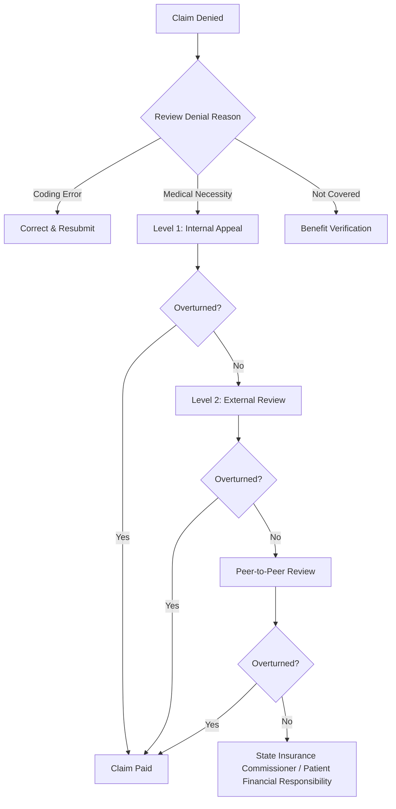

# Chapter 17: Billing, Coding, and Revenue Cycle Management

*CDT and CPT code systems, cross-coding strategy, ICD-10 diagnosis coding, prior authorization, payer navigation, and revenue cycle optimization for the OMS practice.*

---

## Introduction

Oral and maxillofacial surgery occupies a unique position at the intersection of dentistry and medicine, and this duality is nowhere more consequential than in billing and coding. The OMS surgeon must fluently navigate two parallel code systems -- the CDT (Current Dental Terminology) maintained by the ADA and the CPT (Current Procedural Terminology) maintained by the AMA -- and understand when, why, and how to cross-code between them. Errors in code selection, modifier use, or diagnosis linkage directly reduce revenue, trigger audits, and delay patient care through unnecessary denials.

This chapter provides a practical, code-level reference for the procedures most commonly performed in OMS practice, organized by code system and clinical category. It also addresses the mechanics of prior authorization, the appeals process, payer-specific nuances (Medicare, Medicaid, commercial), and the key performance indicators (KPIs) that define a healthy revenue cycle.

---

## The CDT Coding System

The CDT code set, published annually by the American Dental Association, is the mandated code system for dental benefit plans. CDT codes use the format **D + 4 digits** (e.g., D7210). For OMS, the most relevant CDT code ranges are:

### Extractions (D7111--D7251)

| CDT Code | Description | Clinical Notes |
|---|---|---|
| D7111 | Extraction, coronal remnants -- primary tooth | Retained primary root tips |
| D7140 | Extraction, erupted tooth or exposed root | Simple forceps extraction; does not require flap or bone removal |
| D7210 | Extraction, erupted tooth requiring mucoperiosteal flap, bone removal, and/or sectioning | Surgical extraction with flap; the most commonly billed OMS extraction code |
| D7220 | Removal of impacted tooth -- soft tissue | Tooth covered by soft tissue only |
| D7230 | Removal of impacted tooth -- partially bony | Partial bony impaction; portion of crown covered by bone |
| D7240 | Removal of impacted tooth -- completely bony | Full bony impaction; includes unusual surgical complications |
| D7241 | Removal of impacted tooth -- completely bony with unusual surgical complications | Requires narrative describing complications (e.g., nerve proximity, ankylosis, aberrant root morphology) |
| D7250 | Removal of residual tooth roots | Surgical removal of retained root tips |
| D7251 | Coronectomy -- intentional partial tooth removal | Deliberate retention of roots to protect IAN |

!!! tip "Clinical Pearl"
    D7241 requires documentation of **specific** unusual complications. "Completely bony" alone does not justify D7241 over D7240. Document proximity to the IAN canal (<2 mm on CBCT), dilacerated roots, ankylosis, or other objective findings that increased surgical difficulty. Payers routinely downcode D7241 to D7240 without supporting narrative.

### Other Surgical CDT Codes (D7260--D7320)

| CDT Code | Description | Clinical Notes |
|---|---|---|
| D7260 | Oroantral fistula closure | Buccal fat pad or flap closure |
| D7261 | Primary closure of sinus perforation | Immediate repair of Schneiderian membrane perforation |
| D7270 | Tooth reimplantation and/or stabilization | Avulsed tooth replantation |
| D7280 | Exposure of unerupted tooth (surgical) | For orthodontic bracket placement |
| D7282 | Mobilization of erupted/malpositioned tooth for forced eruption | Luxation for orthodontic purposes |
| D7283 | Placement of device to facilitate eruption | Bracket/chain placement |
| D7285 | Incisional biopsy of oral tissue -- hard | Bone biopsy |
| D7286 | Incisional biopsy of oral tissue -- soft | Soft tissue biopsy |
| D7287 | Exfoliative cytological sample collection | Brush biopsy |
| D7288 | Brush biopsy -- transepithelial sample | OralCDx-type sampling |
| D7290 | Surgical repositioning of teeth | Intentional repositioning |
| D7291 | Transseptal fiberotomy/supra crestal fiberotomy | Circumferential supracrestal fiberotomy |
| D7310 | Alveoloplasty in conjunction with extractions -- per quadrant | Alveolar ridge recontouring |
| D7311 | Alveoloplasty in conjunction with extractions -- one to three teeth | Per-tooth alveoloplasty |
| D7320 | Alveoloplasty not in conjunction with extractions -- per quadrant | Standalone ridge smoothing |

### Implant Codes (D6010--D6067)

| CDT Code | Description | Clinical Notes |
|---|---|---|
| D6010 | Surgical placement of implant body -- endosteal | Standard root-form implant placement |
| D6011 | Second stage implant surgery | Uncovering/healing abutment placement |
| D6012 | Surgical placement of interim implant body | Transitional/temporary implant |
| D6013 | Surgical placement of mini implant | Diameter <3.0 mm |
| D6040 | Surgical placement -- eposteal implant | Subperiosteal implant (rarely used) |
| D6050 | Surgical placement -- transosteal implant | Transmandibular implant (historical) |
| D6055 | Connecting bar -- implant supported/retained | Bar overdenture framework |
| D6056 | Prefabricated abutment | Stock abutment |
| D6057 | Custom fabricated abutment | CAD/CAM or cast abutment |
| D6058--D6067 | Abutment-supported crowns/prosthetics | Restorative codes (typically billed by restoring dentist) |

### Bone Grafting (D7953)

| CDT Code | Description | Clinical Notes |
|---|---|---|
| D7943 | Osseous coagulum -- Loss of blood clot stabilization | Not commonly used in OMS |
| D7950 | Osseous, osteoperiosteal, or cartilage graft of mandible or maxilla -- autogenous or nonautogenous -- by report | Block graft, particulate graft; requires narrative |
| D7951 | Sinus augmentation with bone or bone substitutes via lateral open approach | Lateral window sinus lift |
| D7952 | Sinus augmentation via vertical approach | Osteotome/crestal sinus lift |
| D7953 | Bone replacement graft for ridge preservation -- per site | Socket grafting; most commonly used bone graft code in OMS |
| D7955 | Repair of maxillofacial soft and/or hard tissue defect | Soft tissue graft, GBR membrane |

### Anesthesia Codes (D9222--D9248)

| CDT Code | Description | Notes |
|---|---|---|
| D9222 | Deep sedation/general anesthesia -- first 15 minutes | Base unit for office-based GA/deep sedation |
| D9223 | Deep sedation/general anesthesia -- each subsequent 15 minutes | Add-on to D9222 |
| D9239 | Intravenous moderate (conscious) sedation -- first 15 minutes | IV sedation base unit |
| D9243 | Intravenous moderate (conscious) sedation -- each subsequent 15 minutes | Add-on to D9239 |
| D9248 | Non-intravenous conscious sedation | Oral/intranasal sedation |

!!! warning "Surgical Caution"
    Time-based anesthesia codes (D9222/D9223, D9239/D9243) require documentation of **start and stop times** in the medical record. The 15-minute increment begins when the sedative agent is administered and ends when the patient meets discharge criteria. Rounding up to the next increment without meeting the time threshold constitutes upcoding.

---

## The CPT Coding System

CPT codes are required for medical insurance billing. OMS procedures that are medically necessary (trauma, pathology, reconstruction, TMJ, sleep surgery) are typically billed under CPT. Key ranges include:

### Facial Bones and Skull (CPT 21000--21499)

#### Fracture Management

| CPT Code | Description | Typical Use |
|---|---|---|
| 21310 | Closed treatment of nasal bone fracture without stabilization | Simple nasal fracture |
| 21315 | Closed treatment of nasal bone fracture with stabilization | Nasal fracture with splinting |
| 21320 | Closed treatment of nasal bone fracture with manipulation and stabilization | Closed reduction |
| 21325 | Open treatment of nasal fracture, uncomplicated | ORIF nasal fracture |
| 21330 | Open treatment of nasal fracture, complicated | With septoplasty/graft |
| 21340 | Percutaneous treatment of nasoethmoid fracture | NOE fracture |
| 21345 | Closed treatment of nasomaxillary complex fracture with manipulation | Le Fort I level closed |
| 21346 | Open treatment of nasomaxillary complex fracture with bone grafting | Le Fort I ORIF + graft |
| 21360 | Open treatment of depressed malar fracture | ZMC fracture |
| 21365 | Open treatment of complicated depressed malar fracture | ZMC with orbital floor |
| 21385 | Open treatment of orbital floor blowout fracture -- transantral approach | Caldwell-Luc approach |
| 21386 | Open treatment of orbital floor blowout fracture -- periorbital approach | Subciliary/transconjunctival |
| 21387 | Open treatment of orbital floor blowout fracture -- combined approach | Combined transantral + periorbital |
| 21390 | Open treatment of orbital floor fracture -- periorbital approach with implant | Floor reconstruction with mesh/plate |
| 21400 | Closed treatment of mandible fracture without manipulation | Non-displaced condyle |
| 21421 | Closed treatment of palatal or maxillary fracture with fixation/immobilization | Arch bars, MMF |
| 21422 | Open treatment of palatal or maxillary fracture (Le Fort I) | Le Fort I ORIF |
| 21423 | Open treatment of palatal or maxillary fracture (Le Fort II) | Le Fort II ORIF |
| 21431 | Closed treatment of craniofacial separation (Le Fort III) with MMF | Le Fort III closed |
| 21432 | Open treatment of craniofacial separation (Le Fort III) with bone grafting | Le Fort III ORIF |
| 21440 | Closed treatment of mandible fracture without manipulation | Non-displaced fx |
| 21445 | Closed treatment of mandible fracture with manipulation | Closed reduction + MMF |
| 21453 | Closed treatment of mandible fracture with interdental fixation | Arch bars/MMF |
| 21461 | Open treatment of mandible fracture without interdental fixation | ORIF without MMF |
| 21462 | Open treatment of mandible fracture with interdental fixation | ORIF with arch bars |
| 21470 | Open treatment of complicated mandible fracture | Comminuted/multiple |

!!! tip "Clinical Pearl"
    For mandible fractures, code selection depends on the **treatment method**, not the fracture location. A subcondylar fracture treated with ORIF via retromandibular approach is coded the same as a body fracture treated with ORIF (21461 or 21462). For bilateral mandible fractures requiring separate operative approaches, append modifier **-50** or report the code twice with **-59** modifier, depending on payer policy. Document each fracture site and its treatment separately.

#### Reconstruction and Orthognathic

| CPT Code | Description | Typical Use |
|---|---|---|
| 21141 | Le Fort I, single piece, segment movement any direction | Standard Le Fort I osteotomy |
| 21142 | Le Fort I, 2 pieces | 2-piece Le Fort I |
| 21143 | Le Fort I, 3 or more pieces | Multi-piece Le Fort I |
| 21145 | Le Fort I with bone grafts | Le Fort I + interpositional graft |
| 21188 | Reconstruction of midface, Le Fort III | Le Fort III advancement |
| 21193 | Reconstruction of mandible, lateral osteotomy (BSSO) | Bilateral sagittal split osteotomy |
| 21194 | Reconstruction of mandible, with bone graft | BSSO with graft |
| 21195 | Reconstruction of mandible with genioplasty | Osseous genioplasty |
| 21196 | Reconstruction of mandible with genioplasty plus bone graft | Genioplasty + graft |
| 21244 | Reconstruction of mandible with bone graft and rigid fixation | Segmental mandibulectomy reconstruction |
| 21247 | Reconstruction of mandibular condyle with bone graft | Condylar reconstruction |

### Vestibule of Mouth and Oral Cavity (CPT 40490--42999)

| CPT Code | Description | Typical Use |
|---|---|---|
| 40800 | Drainage of abscess, cyst, or hematoma of vestibule of mouth -- simple | I&D vestibular abscess |
| 40801 | Drainage of abscess, cyst, or hematoma of vestibule of mouth -- complicated | Deep space I&D |
| 40808 | Biopsy, vestibule of mouth | Soft tissue biopsy |
| 40810 | Excision of lesion of mucosa and submucosa, vestibule of mouth -- without repair | Simple excision |
| 40812 | Excision of lesion of mucosa and submucosa, vestibule of mouth -- with simple repair | Excision + primary closure |
| 40814 | Excision of lesion of mucosa and submucosa, vestibule of mouth -- with complex repair | Excision + advancement flap |
| 40820 | Destruction of lesion, vestibule of mouth by physical methods | Laser ablation, cryotherapy |
| 41000 | Intraoral incision and drainage of abscess, sublingual space | Sublingual I&D |
| 41005--41018 | I&D of abscess, various deep spaces | Submental, submandibular, masticator spaces |
| 41100--41116 | Biopsy of tongue | Incisional/excisional |
| 41120 | Glossectomy, less than one-half of tongue | Partial glossectomy |
| 41130 | Glossectomy, hemiglossectomy | Hemiglossectomy |
| 41135 | Glossectomy, partial, with unilateral radical neck dissection | Composite resection |
| 41800 | Drainage of abscess, dentoalveolar structure | Dentoalveolar abscess I&D |
| 41825 | Excision of lesion or tumor of dentoalveolar structures -- without repair | Excisional biopsy |
| 41826 | Excision of lesion or tumor of dentoalveolar structures -- with simple repair | Excision + closure |
| 41827 | Excision of lesion or tumor of dentoalveolar structures -- with complex repair | Excision + flap |
| 41899 | Unlisted procedure, dentoalveolar structures | Cross-coding catch-all |

### Anesthesia Codes (CPT)

| CPT Code | Description | Typical Use |
|---|---|---|
| 00100 | Anesthesia for procedures on salivary glands, including biopsy | Salivary gland surgery |
| 00170 | Anesthesia for intraoral procedures, including biopsy | Most OMS procedures under GA |
| 00190 | Anesthesia for procedures on facial bones or skull | Trauma, orthognathic |

!!! warning "Surgical Caution"
    When the OMS surgeon personally administers deep sedation or general anesthesia and simultaneously performs the surgery, anesthesia is reported with **modifier -47** appended to the surgical procedure code (surgeon-administered GA). Do **not** separately report 00170 when the surgeon is both the anesthetist and the operator -- that code is for a separate anesthesia provider. Incorrect reporting is a common audit trigger.

---

## ICD-10 Diagnosis Coding

Accurate ICD-10 coding establishes medical necessity and directly determines whether a claim will be paid. The following categories are most relevant to OMS:

### Mandible and Facial Fractures (S02.x)

| ICD-10 Code | Description | Notes |
|---|---|---|
| S02.600A | Fracture of mandible, unspecified, initial encounter | Avoid; use site-specific codes |
| S02.601A | Fracture of mandibular condylar process, unspecified side, initial encounter | Condylar fracture |
| S02.602A | Fracture of mandibular subcondylar process | Subcondylar fracture |
| S02.609A | Fracture of mandible, unspecified, initial encounter | Non-specific; use more specific code |
| S02.61XA | Fracture of condylar process of mandible | Specify left (S02.61) or right |
| S02.62XA | Fracture of subcondylar process of mandible | Subcondylar |
| S02.63XA | Fracture of coronoid process of mandible | Coronoid fracture |
| S02.64XA | Fracture of ramus of mandible | Ramus fracture |
| S02.65XA | Fracture of angle of mandible | Angle fracture |
| S02.66XA | Fracture of symphysis of mandible | Symphysis/parasymphysis |
| S02.67XA | Fracture of alveolus of mandible | Dentoalveolar fracture |
| S02.69XA | Fracture of mandible of other specified site | Body fracture |

!!! danger "Critical Safety"
    The 7th character of ICD-10 trauma codes indicates the **episode of care**: A = initial encounter, D = subsequent encounter, S = sequela. Using "A" for a follow-up visit or "D" for the initial operative repair will result in denial. Map the 7th character correctly to the clinical scenario.

### TMJ and Dentofacial Anomalies (M26.x)

| ICD-10 Code | Description | Clinical Application |
|---|---|---|
| M26.00 | Unspecified anomaly of jaw size | Avoid; be specific |
| M26.01 | Maxillary hyperplasia | Orthognathic -- Le Fort I impaction |
| M26.02 | Mandibular hyperplasia | Prognathism |
| M26.03 | Maxillary hypoplasia | Le Fort I advancement |
| M26.04 | Mandibular hypoplasia | Retrognathia |
| M26.10 | Unspecified anomaly of jaw-cranial base relationship | Avoid |
| M26.11 | Maxillary asymmetry | Cant correction |
| M26.12 | Other jaw asymmetry | Mandibular asymmetry |
| M26.60 | TMJ disorder, unspecified | General TMJ |
| M26.601 | Right TMJ disorder | |
| M26.602 | Left TMJ disorder | |
| M26.603 | Bilateral TMJ disorder | |
| M26.61 | Adhesions and ankylosis of TMJ | TMJ ankylosis |
| M26.62 | Arthralgia of TMJ | TMJ pain |
| M26.63 | Articular disc disorder of TMJ | Internal derangement |
| M26.69 | Other specified disorders of TMJ | |

### Cysts and Pathology (K09.x, C03.x, C41.x)

| ICD-10 Code | Description | Clinical Application |
|---|---|---|
| K09.0 | Developmental odontogenic cysts | Dentigerous cyst, OKC/KCOT |
| K09.1 | Developmental nonodontogenic cysts | Nasopalatine duct cyst |
| K09.8 | Other cysts of oral region | Residual cyst |
| K09.9 | Cyst of oral region, unspecified | Avoid |
| K04.7 | Periapical abscess without sinus | Acute periapical infection |
| K04.8 | Radicular cyst | Periapical cyst |
| D16.4 | Benign neoplasm of bones of skull and face | Ameloblastoma, odontoma |
| D16.5 | Benign neoplasm of lower jaw bone | Mandibular benign tumor |
| C03.0 | Malignant neoplasm of upper gum | Maxillary gingival SCC |
| C03.1 | Malignant neoplasm of lower gum | Mandibular gingival SCC |
| C41.0 | Malignant neoplasm of bones of skull and face | Maxillary osteosarcoma |
| C41.1 | Malignant neoplasm of mandible | Mandibular primary malignancy |

### Obstructive Sleep Apnea (G47.33)

| ICD-10 Code | Description | Clinical Application |
|---|---|---|
| G47.33 | Obstructive sleep apnea | Primary diagnosis for MMA, GGA |
| G47.30 | Sleep apnea, unspecified | Avoid; use G47.33 |
| E66.01 | Morbid obesity due to excess calories | Comorbidity documentation |
| R06.83 | Snoring | Symptom code; insufficient alone |

---

## Cross-Coding: CDT to CPT

Cross-coding is the process of billing a procedure under CPT (to medical insurance) that would otherwise be billed under CDT (to dental insurance). This is legitimate and appropriate when the procedure is performed for a **medical indication** and is covered under the patient's medical benefit.

### When to Cross-Code

Cross-coding is indicated when:

- The procedure treats a medical condition (trauma, pathology, infection, sleep apnea, congenital anomaly)
- The patient has medical insurance but no dental insurance
- The dental plan excludes the procedure but the medical plan covers it
- The procedure is inherently medical in nature (e.g., mandible fracture ORIF)

### Common Cross-Coding Pairs

| Clinical Scenario | CDT Code | CPT Code | Notes |
|---|---|---|---|
| Surgical extraction (medical indication) | D7210 | 41899 | Unlisted; submit with op note |
| Impacted tooth removal (pathology) | D7240 | 41899 | Unlisted; requires narrative |
| Biopsy of oral soft tissue | D7286 | 40808 or 41108 | Direct CPT equivalent exists |
| I&D of abscess | D7510 | 41800 or 40800 | Direct CPT equivalent exists |
| Sinus lift (medical indication) | D7951 | 31267 + 21210 | Endoscopic maxillary + bone graft |
| Bone graft (ridge augmentation) | D7953 | 21210 | Graft of mandible/maxilla |
| Implant placement (medical indication) | D6010 | 21248 or 21249 | Mandible/maxilla reconstruction |
| Coronectomy | D7251 | 41899 | No direct CPT equivalent |

!!! tip "Clinical Pearl"
    **CPT 41899** (unlisted procedure, dentoalveolar structures) is the workhorse cross-code for dental surgical procedures billed to medical insurance. When using 41899, you **must** submit an operative report and a cover letter explaining the medical necessity, the procedure performed, and a comparable CPT code with its fee as a pricing reference. Without this documentation, 41899 claims will be denied or priced at $0.

### Cross-Coding Documentation Requirements

For any cross-coded claim, maintain:

1. **Medical necessity documentation** -- Chief complaint, history of present illness, exam findings, imaging results, and diagnosis supporting medical (not dental) indication
2. **Operative report** -- Detailed surgical description using medical terminology
3. **Comparable code reference** -- When billing unlisted codes, reference the most analogous listed CPT code and its Medicare physician fee
4. **ICD-10 linkage** -- The primary diagnosis must be a medical condition (S02.x for trauma, K09.x for cysts, C03/C41 for malignancy, G47.33 for OSA)

---

## Prior Authorization and Appeals

### Prior Authorization

Prior authorization (PA) is required by many payers before elective OMS procedures, particularly:

- Orthognathic surgery (nearly universally requires PA for medical insurance)
- TMJ surgery (arthroscopy, arthroplasty, total joint replacement)
- Dental implants (when billed to medical insurance)
- Sleep surgery (MMA requires polysomnography documentation and CPAP failure)

**PA submission should include:**

- Letter of medical necessity with specific ICD-10 codes
- Clinical photographs and imaging (CBCT, cephalometric analysis for orthognathic)
- Cephalometric analysis with measurements documenting skeletal discrepancy
- Sleep study results for OSA cases (AHI, O2 nadir, RDI)
- Documentation of conservative treatment failure
- Relevant AAOMS Parameters of Care references

### The Appeals Process

**82% of denied OMS claims are overturned on appeal** when properly documented and pursued (AAOMS Practice Management Conference data). This statistic underscores the importance of a systematic appeals workflow.

**Level 1 -- Internal Appeal:**

- Submit within 30--60 days of denial (varies by payer)
- Include all original documentation plus a detailed appeal letter citing clinical guidelines (AAOMS ParCare, peer-reviewed literature)
- Request peer-to-peer review with a board-certified OMS or comparable specialist

**Level 2 -- External Review:**

- Available under the ACA for all non-grandfathered health plans
- Conducted by an independent review organization (IRO)
- Payer is bound by the IRO decision
- Must be requested within 4 months of exhausting internal appeals

!!! tip "Clinical Pearl"
    For orthognathic surgery denials, cite **AAOMS Parameters of Care** Section VII (Dentofacial Deformities) and include cephalometric measurements demonstrating skeletal discrepancy beyond 2 standard deviations from norm. Reference the AAOMS criteria for surgical vs. orthodontic treatment and document functional impairment (mastication, speech, airway) -- not just aesthetic concerns.

---

## Medicare Billing for OMS

### Medicare Coverage of OMS Services

Medicare Part A covers hospital-based OMS services (inpatient trauma, oncologic surgery). Medicare Part B covers outpatient physician services for medically necessary procedures. Medicare **does not cover** dental procedures, with narrow exceptions:

- Extraction of teeth in the field of radiation therapy for head and neck cancer
- Dental examination and treatment prior to organ transplant (kidney, heart)
- Dental services integral to a covered medical procedure (e.g., extraction to treat osteonecrosis of the jaw)

### Medicare Reimbursement Trends

Medicare physician fee schedule reimbursement for OMS procedures has experienced a **13.4% real decline from 2003 to 2020** when adjusted for inflation (AMA Physician Practice Information Survey; CMS Physician Fee Schedule data). Key factors driving this decline:

- Budget neutrality requirements for the Medicare physician fee schedule
- Relative Value Unit (RVU) redistribution to E/M codes
- Conversion factor stagnation (2025 conversion factor: $32.35)
- Sequestration (2% automatic reduction since 2013)

| Year | Medicare Conversion Factor | CPI-Adjusted Value (2003 $) |
|---|---|---|
| 2003 | $36.79 | $36.79 |
| 2010 | $36.87 | $30.12 |
| 2015 | $35.80 | $27.50 |
| 2020 | $36.09 | $25.81 |
| 2025 | $32.35 | ~$21.50 |

!!! warning "Surgical Caution"
    Medicare participation decisions have significant practice implications. Non-participating (non-par) providers may charge up to 115% of the Medicare fee schedule (limiting charge) but must still submit claims to Medicare. Opted-out providers sign private contracts with patients and cannot bill Medicare at all. Evaluate your patient population and payer mix before changing Medicare participation status.

---

## Medicaid Considerations

Medicaid coverage of OMS services varies dramatically by state. Key considerations:

- **Adult dental benefits**: Only ~35 states offer comprehensive adult dental Medicaid benefits; the remainder cover emergency-only or no dental services
- **Fee schedules**: Medicaid reimbursement is typically 30--60% of commercial insurance rates and 40--70% of Medicare rates
- **Prior authorization**: More extensive PA requirements than commercial insurance
- **Managed care**: Most states have transitioned Medicaid to managed care organizations (MCOs), adding another administrative layer

For trauma and medically necessary procedures (fracture management, pathology, infections), Medicaid medical coverage is generally available regardless of the state's dental benefit status.

---

## Revenue Cycle Key Performance Indicators

A well-managed OMS revenue cycle is measurable. The following KPIs should be tracked monthly:

| KPI | Target | Red Flag |
|---|---|---|
| Days in Accounts Receivable (A/R) | <35 days | >45 days |
| Clean Claim Rate | >95% | <90% |
| Denial Rate | <5% | >8% |
| Collection Rate (net) | >95% of allowed | <90% |
| First-Pass Resolution Rate | >85% | <75% |
| A/R >120 days (% of total) | <10% | >15% |
| Cost to Collect | <5% of revenue | >8% |
| Prior Authorization Turnaround | <5 business days | >10 business days |

### A/R Aging Analysis

| Aging Bucket | Healthy Distribution | Action Required |
|---|---|---|
| 0--30 days | 60--70% | Routine follow-up |
| 31--60 days | 15--20% | Secondary claim filing, patient statements |
| 61--90 days | 5--10% | Active payer follow-up, appeal initiation |
| 91--120 days | 3--5% | Escalated follow-up, peer-to-peer requests |
| >120 days | <5% | Collection agency referral consideration |

---

## Practice Management Software

### OMS-Specific Software Platforms

| Platform | Key Features | Market Position |
|---|---|---|
| **OMSVision** (Henry Schein) | AAOMS-preferred EHR since 2002; integrated scheduling, charting, imaging, billing; CDT and CPT dual coding; anesthesia record module; referral tracking | Market leader in US OMS; ~60% market share |
| **DSN Cloud** (DSN Software) | Cloud-native architecture; mobile access; integrated imaging; real-time analytics dashboard; CDT/CPT billing | Growing cloud-based alternative; strong in group practices |
| **WinOMS / Sensei Cloud** (Carestream/formerly Kodak) | Legacy Windows-based (WinOMS) transitioning to cloud (Sensei Cloud); imaging integration; surgical scheduling; anesthesia documentation | Established user base transitioning to cloud |
| **Maxillosoft** | Academic-focused; research data collection; residency program management; integration with hospital EMR systems | Niche academic market |

### Software Selection Criteria

When evaluating practice management software, prioritize:

- **Dual coding capability** -- Ability to generate both CDT (dental) and CPT (medical) claims from a single encounter
- **Anesthesia documentation** -- Integrated vital signs recording, drug administration log, and time-based billing support
- **Imaging integration** -- DICOM viewer for CBCT/panoramic, clinical photo management
- **Referral management** -- Automated referral acknowledgment, treatment summaries to referring providers
- **Reporting** -- Customizable financial reports, A/R aging, production by provider/procedure
- **Interoperability** -- HL7/FHIR integration with hospital EMRs for surgeons with hospital privileges

---

## Compliance and Audit Prevention

### OIG Risk Areas for OMS

The Office of Inspector General (OIG) identifies the following as high-risk areas for OMS:

- **Upcoding** -- Reporting D7241 (completely bony with complications) when D7240 (completely bony) is appropriate
- **Unbundling** -- Separately billing components of a procedure that should be reported as a single code (e.g., billing bone graft separately when included in the primary procedure code)
- **Duplicate billing** -- Billing both CDT and CPT for the same procedure to different payers for the same date of service (this is permissible only when one payer is primary and the other is secondary, with proper coordination of benefits)
- **Modifier misuse** -- Incorrect use of -50 (bilateral), -59 (distinct procedural service), or -47 (surgeon-administered anesthesia)

### Documentation Standards

Every operative encounter should include:

- Pre-operative diagnosis with ICD-10 code
- Procedure performed with CPT/CDT code
- Operative findings
- Specimens submitted (if applicable)
- Estimated blood loss
- Complications (or "none")
- Post-operative diagnosis
- Anesthesia start/stop times
- Medications administered with doses and routes

---

## No Surprises Act Implications

The No Surprises Act (effective January 2022) affects OMS practices in several ways:

- **Good faith estimates** -- Required for uninsured/self-pay patients; must be provided within specific timeframes (1--3 business days of scheduling or request)
- **Balance billing protections** -- Out-of-network providers treating patients at in-network facilities cannot balance bill beyond in-network cost-sharing amounts for emergency services
- **Independent dispute resolution (IDR)** -- OMS practices can dispute inadequate out-of-network payments through federal IDR process; the qualifying payment amount (QPA, based on median in-network rate) is the primary consideration

!!! tip "Clinical Pearl"
    For OMS practices that are frequently out-of-network, the IDR process is a critical tool. Track your IDR outcomes and success rates. Gather data on commercial payer QPAs in your geographic area to inform your fee schedule and IDR submissions. AAOMS provides IDR resources and template letters through the member practice management portal.

---

## Key Points

- OMS billing requires fluency in both CDT (dental) and CPT (medical) code systems
- Cross-coding to CPT is appropriate when procedures treat medical conditions and are billed to medical insurance
- CPT 41899 (unlisted dentoalveolar procedure) is the primary cross-coding vehicle, requiring operative notes and comparable code reference
- ICD-10 diagnosis codes must precisely match the clinical scenario, including correct 7th character for trauma encounters
- 82% of denied claims are overturned on appeal -- invest in a systematic appeals process
- Medicare reimbursement has declined 13.4% in real terms from 2003--2020
- Revenue cycle KPIs: A/R <35 days, clean claim rate >95%, denial rate <5%
- OMSVision remains the AAOMS-preferred EHR with approximately 60% US OMS market share
- The No Surprises Act requires good faith estimates and provides IDR for out-of-network payment disputes

---

## References

1. American Dental Association. CDT 2025: Current Dental Terminology. Chicago: ADA; 2025.
2. American Medical Association. CPT 2025: Professional Edition. Chicago: AMA; 2025.
3. AAOMS. Parameters of Care: Clinical Practice Guidelines for Oral and Maxillofacial Surgery (ParCare). 6th ed. Rosemont, IL: AAOMS; 2017.
4. Centers for Medicare & Medicaid Services. Medicare Physician Fee Schedule, 2025 Final Rule. *Federal Register*. 2024.
5. AAOMS Practice Management Conference. Revenue cycle benchmarking data and appeals outcomes. Annual reports, 2020--2025.
6. Office of Inspector General. OIG Work Plan: Dental Services Under Medicaid. Washington, DC: HHS OIG; updated annually.
7. No Surprises Act. Public Law 116-260, Division BB, Title I. December 2020.
8. World Health Organization. ICD-10-CM 2025 Official Guidelines for Coding and Reporting. Geneva: WHO; 2025.
9. Henry Schein Practice Solutions. OMSVision product documentation. 2025.
10. DSN Software. DSN Cloud platform specifications. 2025.
