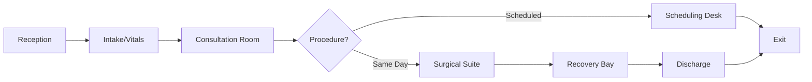
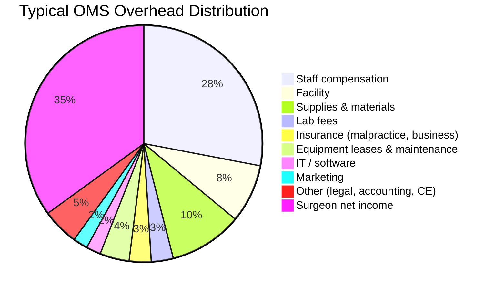

# Chapter 18: Practice Management and Operations

*Practice models, office design, EHR systems, staffing, financial benchmarks, regulatory compliance, and the evolving DSO/private equity landscape.*

---

## Introduction

The clinical excellence of an OMS surgeon is necessary but insufficient for a thriving practice. The business of oral and maxillofacial surgery demands fluency in practice model selection, staffing strategy, regulatory compliance, financial management, and operational systems. A surgeon who can reconstruct a mandible with microsurgical precision but cannot manage overhead, navigate OSHA requirements, or retain skilled staff will find that clinical talent alone does not sustain a practice.

This chapter addresses the operational infrastructure of OMS practice -- from solo practice to the expanding DSO/private equity model -- with attention to the specific regulatory, financial, and human resource challenges unique to the specialty.

---

## Practice Models

### Solo Practice

The solo OMS practice remains the most common model in the United States, though its prevalence is declining as consolidation accelerates.

**Advantages:**

- Complete clinical and business autonomy
- Direct control over patient care philosophy, case selection, and referral relationships
- All profit accrues to the single owner
- Simpler governance and decision-making

**Challenges:**

- No coverage partner for call, vacations, or illness
- Limited negotiating leverage with payers and suppliers
- Higher per-surgeon overhead (no economies of scale)
- Succession planning and practice sale are more complex
- Emergency and trauma call burden falls entirely on one surgeon

**Financial profile:** Solo OMS practices typically operate with overhead of 58--65% and net income of $400,000--$800,000, depending on scope of practice, geography, and payer mix (AAOMS Practice Economics Survey, 2024).

### Group Practice (Multi-Surgeon)

Group OMS practices (2--8+ surgeons) offer operational and clinical advantages:

- **Shared call coverage** -- The single most cited reason surgeons join groups
- **Economies of scale** -- Shared staff, equipment, facility costs, and supply purchasing power
- **Subspecialization** -- Surgeons within the group can develop depth in specific areas (implants, orthognathic, trauma, pathology)
- **Referral continuity** -- Group identity survives individual surgeon departure
- **Mentorship** -- Junior associates benefit from senior partner experience

**Governance structures:**

- **Equal partnership** -- All partners share equally in profits and losses; requires alignment on practice philosophy
- **Eat-what-you-kill** -- Individual surgeon production drives individual compensation; shared overhead is allocated proportionally
- **Hybrid** -- Base salary plus production bonus; common for new associates transitioning to partnership

!!! tip "Clinical Pearl"
    Associate-to-partner track agreements should specify: duration (typically 2--3 years), production expectations, buy-in formula (typically 1--3x annual collections minus accounts receivable), call obligations, non-compete terms (radius and duration), and dispute resolution mechanism. Have these terms reviewed by a healthcare attorney before signing.

### Dental Service Organization / Management Service Organization (DSO/MSO)

The DSO/MSO model, in which a corporate entity provides business services (staffing, billing, marketing, compliance, purchasing) while the surgeon retains clinical autonomy, has expanded rapidly in OMS.

**Key characteristics:**

- Corporate entity owns the non-clinical assets (equipment, leases, staff employment)
- Surgeon maintains professional corporation that employs the surgeon and holds the clinical licenses
- Management fee (typically 15--30% of collections) paid to the DSO/MSO
- Many transactions involve upfront capital payment to the selling surgeon (typically 5--8x EBITDA for OMS practices as of 2024--2025)

**Current landscape:** Approximately **130 private equity-backed dental service organizations** were operating in the US as of mid-2025 (Bain & Company Dental Industry Report, 2025). Several PE-backed platforms specifically target OMS, including:

- U.S. Oral Surgery Management (USOSM)
- OMS360
- Oral Surgery Partners
- MB2 Dental (includes OMS practices)

**Considerations for the surgeon:**

- **Upfront liquidity** -- PE transactions provide immediate capital that would take decades to accumulate through practice income alone
- **Second bite** -- If the platform is resold to another PE firm ("recap"), the surgeon may participate in additional upside
- **Loss of autonomy** -- Despite contractual "clinical autonomy," corporate pressure on volume, supply chain choices, and staffing levels is common
- **Non-compete enforcement** -- Departing surgeon-partners face restrictive covenants that may limit practice within a geographic radius for 2--5 years
- **Cultural change** -- Corporate culture may conflict with traditional practice culture

!!! warning "Surgical Caution"
    Before entering a DSO/PE transaction, retain independent legal counsel (not the DSO's recommended attorney) and an independent valuation professional. Understand the specific terms of the management agreement, the non-compete, the equity rollover structure, and the conditions under which clinical autonomy can be overridden. The AAOMS has published guidance on evaluating DSO/MSO arrangements.

### Academic Practice

Academic OMS surgeons (employed by universities or teaching hospitals) operate under a fundamentally different model:

- **Compensation** -- Typically lower than private practice ($250,000--$500,000 base salary plus academic incentives), offset by benefits, retirement, malpractice coverage, and sabbatical
- **Mission** -- Teaching, research, and complex case management are the primary professional priorities
- **Scope** -- Academic centers attract the most complex cases (craniofacial, head and neck oncology, microsurgery, trauma)
- **Resources** -- Access to multidisciplinary teams, research infrastructure, and residents
- **Tenure** -- Academic appointment tracks with promotion expectations (publications, grants, teaching evaluations)

### Hospital-Employed Practice

Hospital employment of OMS surgeons has increased, driven by:

- Hospital need for trauma and emergency coverage
- Declining interest in practice ownership among younger surgeons
- Access to hospital resources, call pay, and benefits
- Integration with hospital-based multidisciplinary teams (oncology, neurosurgery, plastic surgery)

**Typical structure:** Employed surgeon receives base salary ($350,000--$600,000) plus wRVU-based productivity bonus, with the hospital providing facilities, staff, billing, malpractice, and benefits. Call stipends are common ($1,000--$3,000/day for trauma call).

---

## Office Design

### Clinical Space Requirements

An efficient OMS office design optimizes patient flow, infection control, and surgical safety. Key design considerations:

**Operatory configuration:**

- Minimum 2--3 operatories per surgeon for efficient scheduling (one patient in the chair, one recovering, one being prepared)
- Operatory size: minimum 120 sq ft per surgical operatory; 100 sq ft for consult/exam rooms
- Dedicated surgical suite(s) for IV sedation/GA cases: minimum 150 sq ft with separate recovery area
- Operating room-grade ventilation (minimum 15 air exchanges/hour) for surgical suites

**Support spaces:**

- Dedicated sterilization/instrument processing area with unidirectional workflow (dirty-to-clean)
- CBCT/panoramic imaging room with appropriate radiation shielding
- Recovery area with direct visualization from nursing station (minimum 3--4 recovery bays per surgical suite)
- Medication storage with controlled substance safe (DEA-compliant)
- Emergency equipment alcove (crash cart, defibrillator, suction, oxygen)

**Patient flow:**

!!! tip "Clinical Pearl"
    Design surgical suites with wall-mounted gas outlets (O2, N2O if used, suction, compressed air) rather than portable tanks. This reduces tripping hazards, frees floor space, and ensures continuous gas supply during prolonged cases. Piped medical gas systems require state licensure inspection and ongoing maintenance per NFPA 99 (Health Care Facilities Code).

---

## Electronic Health Record Systems

### OMS-Specific EHR Platforms

The OMS specialty has unique EHR requirements that general dental or medical EHRs typically do not address: dual CDT/CPT coding, anesthesia documentation, surgical consent management, panoramic/CBCT integration, and referral tracking.

#### OMSVision (Henry Schein One)

OMSVision has been the **AAOMS-preferred practice management and EHR system since 2002** and holds approximately 60% market share among US OMS practices.

**Key capabilities:**

- Integrated scheduling, charting, imaging (DICOM), and billing modules
- Dual CDT and CPT claim generation from a single encounter
- Electronic anesthesia record with vital signs, drug administration, and time stamps
- Treatment plan presentation with patient-facing cost estimates
- Referral management with automated acknowledgment letters
- MIPS/MACRA quality reporting integration
- Imaging integration: direct CBCT, panoramic, and clinical photo capture

**Limitations:**

- Legacy client-server architecture (not cloud-native; requires local server infrastructure)
- User interface reflects 2000s-era design conventions
- Customization options are limited compared to newer platforms
- Pricing is per-provider licensing with annual maintenance fees ($15,000--$25,000 initial plus $3,000--$6,000/year)

#### DSN Cloud

DSN Cloud represents the cloud-native alternative gaining market share, particularly among group practices and DSOs.

**Key capabilities:**

- True cloud architecture (browser-based; no local server required)
- Mobile access via tablet/smartphone for charting and schedule management
- Real-time analytics dashboard with production, collections, and A/R metrics
- Multi-location management with centralized reporting
- CDT/CPT dual coding
- API integrations with third-party imaging, billing, and communication platforms

**Limitations:**

- Newer platform with a smaller user base and less OMS-specific feature maturity
- Internet dependency (offline access is limited)
- Migration from legacy systems requires dedicated data conversion project

#### WinOMS / Sensei Cloud

WinOMS, now transitioning to **Sensei Cloud** under Carestream, represents the legacy-to-cloud migration path:

- WinOMS: Established Windows-based system with loyal user base
- Sensei Cloud: Cloud-native successor with modern UI, mobile access, and enhanced imaging integration
- Transition timeline has been extended multiple times, creating uncertainty for practices deciding whether to migrate or switch platforms

#### Maxillosoft

Maxillosoft serves a niche market in **academic OMS programs**, offering:

- Research data collection and outcomes tracking
- Residency case log integration
- Hospital EMR interface (Epic, Cerner)
- Limited adoption outside academic settings

### EHR Selection Framework

| Criterion | Weight | OMSVision | DSN Cloud | Sensei Cloud |
|---|---|---|---|---|
| OMS-specific features | High | Excellent | Good | Good |
| Cloud / remote access | High | Limited | Excellent | Excellent |
| Imaging integration | High | Excellent | Good | Good |
| Dual coding (CDT/CPT) | High | Excellent | Excellent | Good |
| Multi-location support | Medium | Good | Excellent | Good |
| Anesthesia documentation | High | Excellent | Good | Good |
| Cost | Medium | $$$ | $$ | $$ |
| User community size | Medium | Large | Growing | Moderate |

---

## Staffing Models and Benchmarks

### Staffing Ratios

The OMS practice requires a higher staff-to-surgeon ratio than general dental practice due to anesthesia support, surgical assisting, and the complexity of dual dental/medical billing.

**Benchmark: 4--7 FTE staff per surgeon**, distributed approximately as follows:

| Role | FTE per Surgeon | Key Responsibilities |
|---|---|---|
| Surgical assistant(s) | 1.5--2.5 | Chairside assisting, instrument processing, room turnover |
| Front desk / scheduling | 1.0--1.5 | Patient intake, scheduling, phone management, referral coordination |
| Insurance / billing coordinator | 0.5--1.0 | Claim submission, prior authorization, appeals, A/R follow-up |
| Registered nurse or LPN | 0.5--1.0 | Pre-op assessment, IV access, anesthesia monitoring, recovery |
| Office manager | 0.25--0.5 | HR, payroll, vendor management, compliance oversight |
| CBCT/imaging technician | 0.25--0.5 | Image acquisition, file management |
| **Total** | **4.0--7.0** | |

!!! tip "Clinical Pearl"
    The most common staffing deficiency in OMS practices is in billing/insurance coordination. A single undertrained billing clerk attempting to manage both dental and medical claims, prior authorizations, and appeals across multiple payer types is a recipe for revenue leakage. Consider hiring a dedicated medical biller with CPT coding experience, or outsource medical billing to a specialty billing service. The investment typically yields 10--15% revenue improvement from reduced denials and faster collections.

### Compensation Benchmarks (2024--2025)

| Position | Annual Compensation Range | Notes |
|---|---|---|
| Surgical assistant (certified) | $40,000--$65,000 | DAANCE-certified command premium |
| Registered nurse | $55,000--$85,000 | Varies significantly by region |
| Office manager | $50,000--$80,000 | Higher in large group practices |
| Insurance coordinator | $38,000--$55,000 | CDT + CPT dual-coding skill premium |
| Front desk coordinator | $32,000--$48,000 | |
| CBCT technician | $35,000--$50,000 | Often combined with other roles |

---

## Financial Benchmarks

### Key Financial Metrics

| Metric | Healthy Range | Source |
|---|---|---|
| Total collections per surgeon | $800,000--$1,500,000/year | AAOMS Practice Economics Survey |
| Overhead percentage | 55--65% | Includes staff, facility, supplies, insurance |
| Net profit margin | 35--45% | Before surgeon compensation in professional corp |
| Production per operatory day | $3,500--$7,000 | Varies by case mix |
| Collections per new patient | $1,200--$2,500 | Higher for implant-focused practices |
| Staff cost as % of collections | 25--32% | Largest single overhead category |
| Facility cost as % of collections | 5--10% | Rent/lease/mortgage |
| Supply cost as % of collections | 8--12% | Implants, bone graft, hardware |
| Lab fees as % of collections | 2--5% | Prosthetics, splints |
| Malpractice insurance | 1--3% of collections | $8,000--$30,000/year depending on state |

### Overhead Breakdown

!!! warning "Surgical Caution"
    Overhead creep is the silent threat to OMS profitability. Monitor overhead percentage monthly, not annually. A 5% increase in overhead on $1.2M in collections represents $60,000 in lost income. The most common sources of overhead creep are: (1) staff additions without corresponding revenue growth, (2) implant/supply cost increases passed through without fee adjustments, (3) facility expansion without volume to support it.

---

## Implant and Inventory Tracking

Implant inventory represents a significant capital investment for OMS practices. Effective tracking requires:

### Inventory Management Principles

- **Consignment vs. purchase**: Negotiate consignment arrangements with implant manufacturers for slow-moving inventory. Purchase only high-volume, predictable items outright
- **PAR levels**: Establish minimum and maximum stock levels for each implant type and size; reorder when minimum is reached
- **Lot tracking**: Maintain records linking specific implant lot numbers to specific patients (required by FDA for implantable devices; enables recall notification)
- **Expiration monitoring**: Bone graft materials, membranes, and some biologics have expiration dates; rotate stock using FIFO (first in, first out)

### Integration with EHR

Modern practice management systems allow implant inventory to be decremented automatically when an implant is logged in the patient's surgical record. This creates an audit trail linking:

- Patient name and date of service
- Implant manufacturer, type, diameter, length, and lot number
- Ordering surgeon
- Remaining inventory quantity

!!! tip "Clinical Pearl"
    Annually audit your implant inventory against your EHR records. Discrepancies indicate either documentation failures (implants placed but not logged) or inventory control issues (theft, miscounting). A 5--10% discrepancy rate is common in practices without systematic tracking, representing thousands of dollars in unaccounted inventory.

---

## Referral Management

The OMS practice depends on referrals from general dentists, orthodontists, ENT surgeons, oncologists, and emergency departments. Systematic referral management protects this pipeline:

### Key Referral Management Practices

- **Same-day acknowledgment**: Send automated or manual acknowledgment to the referring provider the day the referral is received
- **Timely consultation reports**: Provide a written consultation summary within 24--48 hours of the patient visit, including findings, treatment plan, and timeline
- **Post-operative updates**: Send brief updates after surgical procedures, especially for complex cases
- **Referrer portal**: Some EHR systems offer referring provider portals where dentists can track their patients' status
- **Quarterly outreach**: Regular communication (newsletters, lunch-and-learns, CE events) to maintain top-of-mind awareness with referral sources
- **Referral source tracking**: Monitor referral volume by source monthly; investigate declines promptly

---

## Regulatory Compliance

### OSHA Requirements

OMS practices are subject to OSHA's Bloodborne Pathogens Standard (29 CFR 1910.1030) and other workplace safety regulations.

**Required elements:**

- **Written Exposure Control Plan (ECP)** -- Must be reviewed and updated annually; identifies job classifications with exposure risk, schedules of implementation, and procedures for evaluation of exposure incidents
- **Annual bloodborne pathogens training** -- All employees with potential exposure must receive initial training at hire and annual refresher training
- **Hepatitis B vaccination** -- Must be offered to all employees with potential occupational exposure at no cost; declination must be documented on the OSHA declination form
- **Sharps injury log** -- Maintain a confidential log of all needlestick and sharps injuries; review annually to identify patterns
- **Engineering controls** -- Safety-engineered sharps devices (self-sheathing needles, safety scalpels) must be evaluated and implemented where feasible
- **Personal protective equipment (PPE)** -- Employer must provide and maintain gloves, gowns, face shields, and eyewear at no cost to employees
- **Post-exposure evaluation** -- Protocol for exposure incidents including source patient testing (with consent), exposed employee testing, and PEP (post-exposure prophylaxis) when indicated

### HIPAA Compliance

OMS practices are covered entities under HIPAA and must maintain:

- **Privacy Officer** designation (may be the office manager or practice administrator)
- **Written policies and procedures** for use and disclosure of protected health information (PHI)
- **Notice of Privacy Practices (NPP)** -- Provided to all patients at first visit; updated as policies change
- **Business Associate Agreements (BAAs)** -- Required with all vendors who handle PHI (EHR vendors, billing services, cloud storage, IT support, shredding companies)
- **Annual workforce training** on HIPAA policies and breach notification procedures
- **Risk assessment** -- At least annually; identify vulnerabilities in physical, technical, and administrative safeguards
- **Breach notification** -- Notify affected individuals within 60 days of discovering a breach of unsecured PHI; breaches affecting >500 individuals require HHS notification and media notification

!!! danger "Critical Safety"
    HIPAA penalties range from $100 to $50,000 per violation, with annual maximums of $1.5 million per violation category. Criminal penalties (up to $250,000 fine and 10 years imprisonment) apply to knowing violations. The most common HIPAA violations in OMS practices are: (1) unencrypted laptops/devices containing PHI, (2) failure to execute BAAs with all vendors, (3) improper disposal of paper records, and (4) social media posts containing identifiable patient information (even with "consent").

### Infection Control

OMS practices must comply with CDC Guidelines for Infection Control in Dental Health-Care Settings (2003, updated 2016) and applicable state regulations:

- **Instrument processing**: All critical instruments (those penetrating soft tissue or bone) must be heat-sterilized (autoclave). Semi-critical instruments (contacting mucous membranes) must be sterilized or receive high-level disinfection
- **Sterilizer monitoring**: Biological indicators (spore tests) at least weekly; chemical indicators with every load; mechanical monitoring of time, temperature, and pressure every cycle
- **Surface disinfection**: EPA-registered hospital-grade disinfectant on all clinical contact surfaces between patients
- **Water quality**: Dental unit waterline testing (CDC recommends <=500 CFU/mL); independent water delivery systems for surgical procedures
- **Waste management**: Regulated medical waste (blood-soaked materials, sharps, pathologic waste) must be segregated, stored, and disposed through licensed medical waste haulers

### State Anesthesia Permits

Office-based anesthesia in OMS is regulated at the **state level**, with significant variation:

- **Most states** require a specific office anesthesia permit for administration of deep sedation or general anesthesia
- **Permit requirements typically include**: facility inspection, emergency equipment and drug inventory, staff certification (BLS, ACLS, PALS), mock emergency drills, malpractice insurance documentation
- **Inspection frequency**: Annual to triennial, depending on the state
- **Some states** (e.g., California, Florida, Ohio) have particularly prescriptive requirements including specific monitor types, equipment lists, and staff-to-patient ratios
- **AAOMS Office Anesthesia Evaluation (OAE)** process may be accepted by some states in lieu of independent state inspection

| Requirement | Typical State Mandate | AAOMS Recommendation |
|---|---|---|
| Permit renewal | Annual or biennial | -- |
| Facility inspection | Required | OAE every 5 years |
| Emergency drugs | Specified list | AAOMS ParCare list |
| Emergency equipment | Specified list | AED, O2, suction, airway management |
| Staff certifications | BLS minimum; ACLS for surgeon | ACLS for surgeon, BLS for all staff |
| Mock emergency drills | Annual or semiannual | Quarterly recommended |
| Patient monitoring | Pulse ox, ETCO2, ECG, BP | Same |
| Recovery monitoring | Until discharge criteria met | Aldrete score >=9 |

---

## Credentialing and Privileging

### Hospital Credentialing

OMS surgeons seeking hospital privileges undergo credentialing through the hospital's medical staff office:

**Required documentation:**

- Medical and/or dental degree (DMD/DDS, and MD if dual degree)
- OMS residency completion (certificate of training)
- Board certification (ABOMS) or board eligibility
- State medical and/or dental license (requirements vary; some states require medical license for hospital-based surgery)
- DEA registration
- Malpractice insurance certificate (minimum coverage varies by hospital, typically $1M/$3M)
- Peer references (typically 3--5 from physicians or surgeons who have directly observed the applicant's clinical work)
- Case logs demonstrating volume in requested privilege categories
- Query of the National Practitioner Data Bank (NPDB)

**Privilege delineation** for OMS typically includes categories such as:

- Dentoalveolar surgery
- Implant surgery
- Trauma (mandible, midface, orbit, NOE, frontal sinus, pan-facial)
- Orthognathic surgery
- TMJ surgery
- Pathology and reconstructive surgery
- Microvascular surgery (requires specific training documentation)
- Cosmetic/aesthetic procedures

### Reappointment

Hospital reappointment (typically every 2 years) requires:

- Updated case volumes by privilege category
- Quality data (complication rates, infection rates, readmission rates)
- Current licensure, DEA, and malpractice insurance
- Completion of required CME
- Peer evaluation
- NPDB re-query

---

## Malpractice Considerations

### OMS Malpractice Landscape

OMS malpractice premiums are moderate compared to other surgical specialties but vary significantly by state:

- **Annual premium range**: $8,000--$30,000 (occurrence-based policies)
- **Highest-premium states**: New York, Florida, Illinois, Pennsylvania
- **Lowest-premium states**: Nebraska, Indiana, Wisconsin, Minnesota
- **Claims-made vs. occurrence**: Occurrence policies cover incidents during the policy period regardless of when the claim is filed; claims-made policies require an active policy at the time the claim is filed (tail coverage is needed when switching or retiring)

### Most Common OMS Malpractice Claims

| Claim Category | Approximate % of Claims | Common Allegations |
|---|---|---|
| Nerve injury (IAN, lingual) | 25--30% | Failure to warn, negligent technique |
| Infection/complications from extractions | 15--20% | Delayed treatment, failure to diagnose |
| Implant complications | 10--15% | Nerve injury, sinus perforation, failure |
| Anesthesia complications | 10--15% | Aspiration, airway loss, overdose |
| Wrong tooth/wrong site | 5--10% | Consent error, lack of verification |
| Fracture complications | 5--10% | Malunion, nonunion, hardware failure |
| Failure to diagnose pathology | 5--10% | Delayed cancer diagnosis |

!!! tip "Clinical Pearl"
    **Informed consent** is the most effective malpractice risk reduction tool. Document a specific, patient-individualized consent discussion that includes: the diagnosis, the proposed treatment and alternatives (including no treatment), the material risks (nerve injury, infection, bleeding, failure, need for additional surgery), and the patient's questions and understanding. Generic consent forms without documented discussion are inadequate legal protection.

---

## Practice Valuation

### Valuation Methods

OMS practice valuations are relevant for:

- Partnership buy-in/buy-out
- DSO/PE transaction pricing
- Divorce proceedings
- Estate planning
- Retirement transition

**Common valuation approaches:**

1. **Income approach (most common)**: Discounted cash flow (DCF) or capitalization of earnings; values the practice based on its expected future income stream
2. **Market approach**: Comparable transaction analysis; based on recent sales of similar OMS practices in the region
3. **Asset approach**: Fair market value of tangible assets (equipment, leasehold improvements, inventory) plus intangible assets (goodwill)

**Typical OMS practice valuation multiples:**

| Metric | Multiple Range | Notes |
|---|---|---|
| Annual collections | 0.6--0.9x | Solo practice; traditional sale |
| Annual collections | 0.8--1.2x | Group practice; traditional sale |
| EBITDA | 5--8x | DSO/PE transaction |
| EBITDA | 8--12x | Premium DSO/PE platforms |
| SDE (seller's discretionary earnings) | 2.5--4.0x | Small practice; buyer-operator |

!!! warning "Surgical Caution"
    PE-backed DSO valuations (5--12x EBITDA) are significantly higher than traditional practice-to-practice sales (0.6--1.2x collections). This premium reflects the PE firm's ability to achieve economies of scale, centralize overhead, and arbitrage the multiple at exit. Individual surgeons should understand that the high upfront multiple often comes with equity rollover requirements (typically 20--40% of the sale price must be reinvested in the platform) and earnout provisions tied to post-sale performance.

---

## The No Surprises Act and Price Transparency

The No Surprises Act (effective January 1, 2022) imposes specific obligations on OMS practices:

### Good Faith Estimates

- Required for **all uninsured and self-pay patients**
- Must be provided within 1 business day for services scheduled 3--9 days in advance, and within 3 business days for services scheduled 10+ days in advance
- Must include expected charges for all items and services reasonably expected to be provided (including anesthesia, imaging, pathology)
- Patients may dispute bills exceeding the good faith estimate by $400 or more through a patient-provider dispute resolution process

### Price Transparency

CMS hospital price transparency rules (effective January 2021, enforcement strengthened 2024) require hospitals where OMS surgeons hold privileges to publish machine-readable files of negotiated rates. While this does not directly apply to private OMS offices, it increases patient awareness of pricing variability and creates downward pressure on fees.

---

## Key Points

- OMS practice models span solo practice to PE-backed DSOs; approximately 130 PE-backed DSOs operated in the US as of mid-2025
- Staffing benchmark: 4--7 FTE per surgeon, with billing/insurance coordination as the most common deficiency
- Financial benchmarks: overhead 55--65%, net margin 35--45%, collections $800K--$1.5M per surgeon
- OMSVision holds approximately 60% US OMS market share as the AAOMS-preferred EHR since 2002; cloud-native alternatives are gaining traction
- OSHA, HIPAA, and infection control compliance are non-negotiable operational requirements
- State anesthesia permit requirements vary significantly; maintain current awareness of your state's regulations
- Malpractice risk is highest for nerve injury claims; informed consent documentation is the most effective risk mitigation
- Practice valuations for DSO/PE transactions (5--12x EBITDA) significantly exceed traditional sales (0.6--1.2x collections)
- The No Surprises Act requires good faith estimates for all uninsured/self-pay patients

---

## References

1. AAOMS. Practice Economics Survey. Rosemont, IL: AAOMS; 2024.
2. AAOMS. Parameters of Care: Clinical Practice Guidelines for Oral and Maxillofacial Surgery (ParCare). 6th ed. Rosemont, IL: AAOMS; 2017.
3. AAOMS. Office Anesthesia Evaluation Manual. Rosemont, IL: AAOMS; updated 2024.
4. AAOMS. Guidance on DSO/MSO Arrangements for OMS Practices. Rosemont, IL: AAOMS; 2023.
5. Bain & Company. Global Dental Industry Report: Private Equity in Dentistry. 2025.
6. OSHA. Bloodborne Pathogens Standard, 29 CFR 1910.1030. Washington, DC: US Department of Labor.
7. US Department of Health and Human Services. HIPAA Privacy, Security, and Breach Notification Rules. 45 CFR Parts 160 and 164.
8. CDC. Guidelines for Infection Control in Dental Health-Care Settings -- 2003. *MMWR*. 2003;52(RR-17):1-61. Updated 2016.
9. No Surprises Act. Public Law 116-260, Division BB, Title I. December 2020.
10. CMS. Hospital Price Transparency Final Rule. 85 FR 65524. November 2019; enforcement update 2024.
11. Henry Schein One. OMSVision Product Specifications. 2025.
12. American Board of Oral and Maxillofacial Surgery (ABOMS). Certification and Recertification Requirements. 2025.
