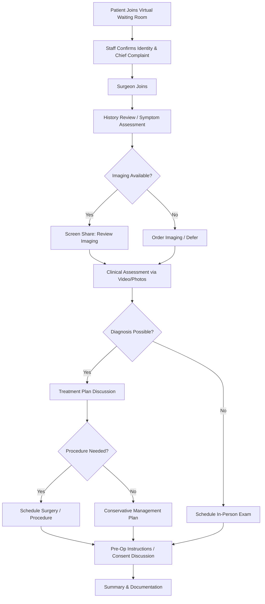

# Chapter 19: Telemedicine and Remote Patient Management

*Virtual consultation workflows, HIPAA-compliant platforms, remote postoperative monitoring, telehealth billing, and the evidence base for telemedicine in OMS.*

---

## Introduction

Telemedicine in oral and maxillofacial surgery evolved from a niche curiosity to a clinical necessity during the COVID-19 pandemic (2020--2021) and has since matured into a durable component of practice operations. The AAOMS telemedicine guidelines recognize virtual encounters as appropriate for triage, nonemergent consultations, preoperative history and physical examination, and postoperative follow-up -- activities that collectively represent 30--40% of a typical OMS practice's patient encounters.

For the board-certified OMS surgeon, the question is no longer whether to offer telemedicine but how to implement it effectively: selecting a compliant platform, designing efficient workflows, documenting encounters to meet medicolegal and billing requirements, and integrating remote monitoring into the postoperative care pathway. This chapter provides the operational and clinical framework for telemedicine in OMS practice.

---

## AAOMS Telemedicine Guidelines

The AAOMS has identified four primary clinical categories appropriate for telemedicine encounters in OMS:

### 1. Triage

Virtual triage allows the surgeon or trained staff to assess the urgency of a patient's condition and determine the appropriate clinical pathway:

- **Emergency vs. urgent vs. elective** classification
- Facial swelling assessment (spreading infection vs. localized postoperative edema)
- Trauma triage (need for immediate ED evaluation vs. scheduled office visit)
- Postoperative concern evaluation (expected healing vs. complication requiring in-person visit)

!!! tip "Clinical Pearl"
    Triage encounters should follow a structured decision algorithm. A patient reporting progressive facial swelling with trismus, fever, and dysphagia after extraction requires same-day in-person evaluation or ED referral -- this should not be managed via ongoing telemedicine. Document the triage decision and rationale in the patient's record, even if the encounter is brief.

### 2. Nonemergent Consultations

Initial consultations for elective procedures are well-suited to telemedicine:

- **Third molar consultations**: Review of panoramic radiograph or CBCT (transmitted electronically), discussion of findings, treatment options, risks, and scheduling
- **Implant consultations**: Discussion of treatment plan, review of imaging, coordination with restorative dentist
- **Pathology consultations**: Review of imaging and referral information, determination of biopsy need
- **TMJ consultations**: History taking, symptom assessment, preliminary management recommendations
- **Orthognathic consultations**: Discussion of concerns, preliminary assessment, determination of records appointment need

### 3. Preoperative History and Physical Examination

The preoperative H&P can be partially completed via telemedicine:

- Medical history review and medication reconciliation
- Review of systems
- Anesthesia risk assessment (ASA classification)
- Preoperative instruction delivery and informed consent discussion
- Identification of patients requiring additional medical clearance

!!! warning "Surgical Caution"
    The physical examination component of a preoperative H&P cannot be fully replicated via telemedicine. While the history, medication review, and anesthesia discussion can be completed virtually, an in-person examination is required before surgery to assess airway (Mallampati classification, thyromental distance, neck mobility), oral opening, and relevant intraoral findings. State and facility requirements for preoperative physical examinations vary; confirm compliance with your jurisdiction's standards.

### 4. Postoperative Follow-Up

Postoperative telemedicine visits are the most evidence-supported application of virtual care in OMS:

- Wound healing assessment via patient-submitted photographs or live video
- Symptom review (pain level, swelling, functional recovery)
- Medication management (analgesic adjustment, antibiotic assessment)
- Diet advancement guidance
- Activity restriction counseling
- Identification of complications requiring in-person evaluation

---

## Evidence Base for Telemedicine in OMS

### Diagnostic Accuracy

A landmark study evaluating telemedicine diagnostic accuracy in oral and maxillofacial conditions demonstrated **98.7% diagnostic concordance** (149 of 151 cases) between telemedicine-based diagnosis and in-person diagnosis (Aziz et al., *Br J Oral Maxillofac Surg*, 2020). The two discordant cases involved subtle mucosal lesions that required tactile examination for definitive assessment.

Key findings supporting telemedicine diagnostic reliability:

- High concordance for traumatic injuries when adequate imaging is available
- High concordance for postoperative assessment when standardized photographs are obtained
- Lower reliability for intraoral soft tissue lesions requiring palpation (induration, fixation, submucosal extent)
- Imaging review (panoramic, CBCT, CT) can be performed with equivalent accuracy via screen-sharing during a virtual consultation

### Patient Satisfaction

A randomized controlled trial of 69 patients comparing telemedicine versus in-person postoperative follow-up after dentoalveolar surgery found **no significant difference in patient satisfaction** between the two modalities (Giudice et al., *Int J Environ Res Public Health*, 2020).

Additional satisfaction data:

- Patients consistently rate convenience (no travel, no waiting room time) as the primary advantage
- Patients over age 65 report lower comfort with video technology but similar satisfaction when successfully connected
- Parent/guardian satisfaction for pediatric OMS telemedicine visits is comparable to in-person visits
- The primary patient dissatisfaction factor is technical difficulty (poor video quality, connection drops)

### Postoperative Outcomes

Studies evaluating telemedicine-based postoperative management have demonstrated:

- No increase in complication rates compared to in-person follow-up for routine dentoalveolar surgery (Tanguay et al., *J Oral Maxillofac Surg*, 2021)
- Earlier identification of postoperative complications when patients have a low-barrier virtual access point
- Reduction in unnecessary in-person visits (estimated 25--40% of routine postoperative visits can be replaced by telemedicine without adverse outcomes)
- Improved patient compliance with postoperative instructions when reinforced via virtual check-ins

---

## Platform Selection and HIPAA Compliance

### Technical Requirements

A telemedicine platform for OMS must meet the following minimum requirements:

| Requirement | Specification | Rationale |
|---|---|---|
| HIPAA compliance | BAA executed with vendor; encryption at rest and in transit (AES-256 or equivalent) | Legal mandate for PHI protection |
| Video quality | Minimum 720p resolution; adaptive bitrate | Clinical assessment of wounds, swelling |
| Screen sharing | Surgeon can share radiographs, CT images, treatment plans | Essential for consultation encounters |
| Patient photo upload | Secure image upload before or during visit | Standardized wound assessment |
| EHR integration | Direct or via API with OMS-specific EHR (OMSVision, DSN Cloud) | Documentation efficiency |
| Recording capability | Optional encrypted recording with patient consent | Documentation; medicolegal protection |
| Accessibility | Web browser access (no app install required) | Reduce technical barriers |
| Waiting room | Virtual waiting room with estimated wait time | Patient experience |
| Multi-party | Ability to include interpreter, family member, referring provider | Complex consultations |

### Platform Options

| Platform | HIPAA Compliant | EHR Integration | OMS-Specific Features | Cost Model |
|---|---|---|---|---|
| **Doxy.me** | Yes (BAA available) | Limited | None | Free tier available; paid plans from $35/mo |
| **Zoom for Healthcare** | Yes (BAA available) | Via API | None | $200--$300/mo per provider |
| **Teladoc Health** | Yes | Yes (broad) | None | Enterprise pricing |
| **OMSVision Telehealth** | Yes | Native | OMS-specific templates | Add-on to OMSVision license |
| **DSN Cloud Telehealth** | Yes | Native | OMS-specific templates | Included in platform |
| **SimplePractice** | Yes (BAA available) | Limited | None | $69--$99/mo |

!!! danger "Critical Safety"
    **Standard consumer video platforms** (FaceTime, WhatsApp video, Google Meet free tier, standard Zoom) are **not HIPAA-compliant** for routine use. While the HHS Office for Civil Rights issued enforcement discretion during the COVID-19 public health emergency (March 2020), this flexibility was rescinded after the end of the public health emergency (May 2023). All telemedicine encounters must now use HIPAA-compliant platforms with executed BAAs. Violations are subject to standard HIPAA penalties ($100--$50,000 per violation).

---

## Virtual Consultation Workflow

### Pre-Visit Preparation

An efficient telemedicine workflow begins before the virtual encounter:

1. **Scheduling**: Patient or staff schedules virtual visit through practice portal or phone; visit type (new consult, postop follow-up, triage) determines time allocation
2. **Intake forms**: Patient completes medical history, medication list, and chief complaint electronically before the visit
3. **Imaging upload**: Referring provider or patient uploads panoramic radiograph, CBCT, or CT via secure portal
4. **Pre-visit photo protocol**: For postoperative or pathology visits, patient receives standardized photo instructions:
    - Frontal face photo (mouth closed, at rest)
    - Frontal face photo (mouth open, maximum opening)
    - Intraoral photos (if possible): surgical site, occlusion
    - Profile photo (if relevant to consultation)
5. **Technology check**: Automated text/email with platform link and instructions sent 24 hours and 1 hour before the visit

### During the Visit

### Post-Visit Documentation

Telemedicine encounter documentation must include all elements of a standard clinical note plus:

- **Mode of encounter**: Synchronous video, audio-only, or store-and-forward
- **Location of patient**: Physical location (home, office, etc.) and state -- this determines which state's licensure and telehealth regulations apply
- **Location of provider**: Physical location and state
- **Technology platform used**: Name of HIPAA-compliant platform
- **Participants**: Patient, family members, interpreters, referring providers present
- **Consent for telemedicine**: Verbal or written consent documented
- **Clinical limitations acknowledged**: Any aspects of the examination that could not be completed virtually

---

## Remote Postoperative Monitoring

### Structured Postoperative Protocols

Remote monitoring transforms postoperative care from episodic office visits to continuous patient engagement:

**Day 0--1 (Day of surgery):**

- Automated text/portal message checking on patient status
- Patient-reported pain score (NRS 0--10)
- Photo submission if bleeding, swelling, or concern

**Day 2--3:**

- Virtual check-in (video or asynchronous photo submission)
- Assessment of swelling trajectory (improving vs. worsening)
- Medication compliance verification
- Diet advancement guidance

**Day 7 (typical postop visit replacement):**

- Synchronous video visit with surgeon
- Photo review: wound healing, swelling, bruising, occlusion
- Functional assessment: mouth opening (patient self-measures with ruler), diet consistency, pain level
- Decision: continue virtual monitoring vs. in-person visit

**Day 14--21 (if applicable):**

- Final virtual check or in-person visit for suture removal (if non-resorbable)
- Return to full activity clearance
- Referral back to referring provider if appropriate

### Patient-Reported Outcome Measures (PROMs)

PROMs integrate structured patient self-assessment into the postoperative monitoring protocol:

| PROM Instrument | Domain | Application in OMS |
|---|---|---|
| **OHIP-14** (Oral Health Impact Profile) | Oral health-related quality of life | Dentoalveolar surgery, implants |
| **FACE-Q** | Facial appearance, quality of life | Orthognathic surgery, cosmetic procedures |
| **TMD-QoL** | TMJ-specific quality of life | TMJ surgery |
| **PROMIS Pain Interference** | Pain impact on daily function | All surgical procedures |
| **EQ-5D-5L** | General health status | Complex reconstruction, oncology |
| **MDADI** (MD Anderson Dysphagia Inventory) | Swallowing function | Head and neck oncology |

!!! tip "Clinical Pearl"
    Collecting PROMs at baseline (preoperative), 1 month, 3 months, and 12 months postoperatively creates a longitudinal dataset that serves three purposes: (1) individual patient outcome tracking, (2) practice-level quality benchmarking, and (3) defensible documentation of treatment effectiveness for payer appeals and malpractice defense. Several PROM instruments are available at no cost and can be administered electronically through patient portals.

---

## Telehealth Billing and Reimbursement

### Place of Service Codes

Telemedicine encounters require specific Place of Service (POS) codes on the claim:

| POS Code | Description | When to Use |
|---|---|---|
| **02** | Telehealth -- provided other than in the patient's home | Patient at a distant site (clinic, hospital) |
| **10** | Telehealth -- provided in patient's home | Patient at home (most common for OMS) |

### Modifiers

| Modifier | Description | Application |
|---|---|---|
| **95** | Synchronous telemedicine service via real-time audio-video | Append to CPT E/M code for live video visits |
| **GT** | Via interactive audio and video telecommunications system | Some payers require GT instead of 95; check payer policy |
| **GQ** | Via asynchronous telecommunications system | Store-and-forward (limited acceptance outside Alaska and Hawaii) |
| **93** | Audio-only synchronous telehealth | Telephone-only evaluation (limited coverage post-PHE) |

### CPT Codes for Telemedicine in OMS

| CPT Code | Description | Telemedicine Application |
|---|---|---|
| **99201--99215** | Office/outpatient E/M (established hierarchy) | Primary codes for telemedicine consultations and follow-ups |
| **99421--99423** | Online digital E/M (asynchronous) | Patient portal messaging requiring medical decision-making; 5--10 min, 11--20 min, 21+ min cumulative time |
| **99441--99443** | Telephone E/M | Audio-only visits; 5--10 min, 11--20 min, 21--30 min |
| **99451** | Interprofessional telephone/internet/EHR assessment | Surgeon consulted by referring dentist/physician (no direct patient contact) |
| **99452** | Interprofessional referral | Referring provider requesting interprofessional consultation |
| **G2012** | Brief communication technology-based service (virtual check-in) | 5--10 minute video or phone check-in; initiated by patient |
| **G2010** | Remote evaluation of recorded video/images | Store-and-forward assessment of patient-submitted photos |

### Reimbursement Landscape

Post-pandemic telemedicine reimbursement has stabilized but remains in flux:

- **Medicare**: CMS has extended telehealth flexibilities through December 2025 (Consolidated Appropriations Act, 2023). Geographic and originating site restrictions are temporarily waived. Post-2025 coverage is uncertain and dependent on congressional action
- **Commercial payers**: Most major commercial insurers now cover synchronous video visits at parity with in-person visits for E/M codes. Audio-only coverage varies
- **Medicaid**: Coverage varies by state; most states cover synchronous video telehealth; fewer cover audio-only or store-and-forward
- **Dental insurance**: CDT does not include telemedicine-specific codes. The ADA has recommended reporting telemedicine visits using D0140 (limited oral evaluation) or D0170 (re-evaluation) with a telemedicine narrative note. Reimbursement is inconsistent

!!! warning "Surgical Caution"
    Bill telemedicine encounters accurately. Coding an in-person E/M level for a telemedicine encounter that did not include the corresponding examination elements constitutes upcoding. Use the appropriate POS code, modifier, and E/M level supported by the documented history, examination (as feasible via telemedicine), and medical decision-making complexity.

---

## Interstate Licensure

### The Challenge

Telemedicine encounters are governed by the laws of the state where the **patient** is physically located at the time of the encounter, not where the surgeon's office is located. This means:

- A surgeon licensed in State A providing telemedicine to a patient in State B must hold a license in State B (or qualify for an exemption)
- Licensure requirements are determined by the patient's location, even for a single follow-up visit

### Solutions

**Interstate Medical Licensure Compact (IMLC):**

- Expedited pathway for physicians to obtain licenses in multiple compact states
- As of 2025, 42 states, DC, and Guam participate
- Requires MD/DO degree (does not apply to DDS/DMD-only OMS surgeons)

**State dental board reciprocity:**

- Some states offer special telehealth permits or limited licenses for out-of-state providers
- Requirements vary widely; some states have no telehealth-specific provisions
- DDS/DMD-only OMS surgeons must check each state's dental board telehealth policy

**Practical approaches:**

- Limit telemedicine to patients located in states where the surgeon holds an active license
- For multi-state practices (near borders), maintain licenses in all relevant states
- Use telemedicine for established patients (some states allow follow-up but not new patient consultations across state lines)
- Document patient location at the start of every telemedicine encounter

---

## Documentation Requirements

### Minimum Documentation Standards

Every telemedicine encounter in OMS should document:

1. **Patient identification verification** -- Confirmed by visual identification via video and date of birth
2. **Informed consent for telemedicine** -- Patient's verbal or written agreement to receive care via telemedicine, including understanding of limitations, privacy considerations, and right to request in-person visit
3. **Patient location** -- City and state where the patient is physically located
4. **Provider location** -- City and state where the provider is physically located
5. **Technology used** -- Platform name and modality (synchronous video, audio-only, store-and-forward)
6. **Clinical encounter elements** -- History, review of systems, examination (limited by modality), assessment, and plan
7. **Limitations of virtual assessment** -- Specific examination components that could not be performed and impact on clinical decision-making
8. **Follow-up plan** -- Next steps including whether in-person evaluation is needed
9. **Time documentation** -- Start time, end time, and total time (if billing time-based codes)
10. **Attendees** -- All participants in the encounter (patient, family, interpreter, other providers)

### Medicolegal Considerations

- **Standard of care**: The standard of care for telemedicine is the same as for in-person encounters. A surgeon cannot claim reduced liability because the visit was virtual
- **Informed consent**: Must include telemedicine-specific elements (technology risks, privacy limitations, possibility of technology failure)
- **Emergency protocols**: The surgeon must have a plan for emergencies identified during a telemedicine visit (direct the patient to the nearest ED, call 911, contact the local provider)
- **Malpractice coverage**: Verify with your malpractice carrier that telemedicine encounters are covered under your existing policy. Some carriers require a telemedicine rider or specific documentation protocols

---

## Practice Implementation

### Operational Considerations

**Staffing for telemedicine:**

- Designate a staff member as the "virtual visit coordinator" responsible for scheduling, patient onboarding, technology troubleshooting, and pre-visit preparation
- Surgical assistants or nurses can conduct pre-visit intake (vitals assessment via patient self-report, medication reconciliation) before the surgeon joins
- Billing staff must understand telemedicine-specific coding requirements

**Scheduling:**

- Block dedicated telemedicine time slots (e.g., 8:00--9:00 AM or 4:00--5:00 PM) or integrate virtual visits between in-person patients
- Allocate 10--15 minutes for new patient consultations (with imaging review), 5--10 minutes for postoperative follow-up
- Allow 5-minute buffer between virtual visits for documentation

**Physical setup for the provider:**

- Quiet, private room with professional background
- Ring light or natural lighting (face illumination; no backlighting)
- External camera positioned at eye level
- Dual monitors: one for video platform, one for EHR and imaging
- Reliable high-speed internet (minimum 25 Mbps upload/download)

### Measuring Telemedicine Program Success

| Metric | Target | Measurement |
|---|---|---|
| Patient satisfaction score | >=4.5/5.0 | Post-visit survey |
| Technical success rate (connection without failure) | >95% | Platform analytics |
| No-show rate for virtual visits | <10% | Scheduling system |
| Conversion to in-person visit rate | 10--25% | Outcome tracking |
| Time from referral to virtual consultation | <5 business days | Scheduling analysis |
| Documentation compliance | 100% | Audit of required elements |
| Billing accuracy (correct POS, modifier) | >98% | Claim audit |

---

## Special Applications in OMS Telemedicine

### Multidisciplinary Tumor Board Participation

Telemedicine enables OMS surgeon participation in head and neck tumor boards without physical travel to the hospital:

- Screen-sharing of imaging (CT, MRI, PET) and pathology slides
- Real-time discussion of surgical planning with oncology, radiation oncology, and radiology
- Documentation of tumor board recommendations in the patient's record
- Billing via CPT 99451 (interprofessional consultation) when the surgeon provides input without direct patient contact

### Pre-Surgical Orthodontic Coordination

Virtual three-way conferences between the OMS surgeon, orthodontist, and patient for orthognathic surgery planning:

- Review of cephalometric analysis and surgical treatment objectives
- Discussion of presurgical orthodontic goals and timeline
- Shared screen review of digital treatment simulations
- Documented agreement on surgical plan before presurgical orthodontics begin

### Postoperative Jaw Fracture Monitoring

Patients with mandible fractures managed with MMF (maxillomandibular fixation) can be monitored via telemedicine for:

- Elastic compliance assessment (video demonstration by patient)
- Occlusion check (patient self-photo or video)
- Nutritional status assessment
- Wire/elastic loosening or breakage evaluation
- Decision to remove MMF can be made based on virtual assessment combined with imaging, though hardware removal requires an in-person visit

---

## Key Points

- AAOMS guidelines support telemedicine for triage, nonemergent consultations, preoperative H&P (partial), and postoperative follow-up
- Diagnostic accuracy of telemedicine in OMS is 98.7% (149/151 cases) when adequate imaging is available
- Patient satisfaction for telemedicine postoperative visits is comparable to in-person visits (69-patient RCT)
- HIPAA-compliant platforms with executed BAAs are mandatory; consumer video apps are not acceptable post-PHE
- Bill telemedicine using appropriate POS codes (02 or 10), modifiers (95 or GT), and E/M levels supported by documentation
- Patient physical location determines which state's licensure and telehealth regulations apply
- Standard of care for telemedicine is identical to in-person encounters; document limitations explicitly
- Remote postoperative monitoring with standardized photo protocols and PROMs can replace 25--40% of routine in-person follow-up visits
- Medicare telehealth flexibilities are extended through December 2025; post-2025 coverage depends on legislative action

---

## References

1. AAOMS. Telemedicine Guidelines for Oral and Maxillofacial Surgery. Rosemont, IL: AAOMS; 2021. Updated 2024.
2. Aziz SR, et al. Telemedicine in oral and maxillofacial surgery: diagnostic accuracy and patient satisfaction. *Br J Oral Maxillofac Surg*. 2020;58(9):1068-1072.
3. Giudice A, et al. Telemedicine versus in-person postoperative follow-up after dentoalveolar surgery: a randomized controlled trial. *Int J Environ Res Public Health*. 2020;17(24):9449.
4. Tanguay P, et al. Virtual postoperative follow-up after oral surgery: patient satisfaction and clinical outcomes. *J Oral Maxillofac Surg*. 2021;79(5):985-992.
5. HHS Office for Civil Rights. Notification of enforcement discretion for telehealth remote communications during the COVID-19 nationwide public health emergency. March 2020; rescinded May 2023.
6. Centers for Medicare & Medicaid Services. CY2025 Medicare Physician Fee Schedule Final Rule: Telehealth Provisions. *Federal Register*. 2024.
7. Consolidated Appropriations Act, 2023. Public Law 117-328. December 2022. (Telehealth extension provisions.)
8. Interstate Medical Licensure Compact. https://www.imlcc.org. Accessed 2025.
9. American Dental Association. Telemedicine and Teledentistry Guidance. ADA Standards Committee. 2023.
10. US Department of Health and Human Services. HIPAA Privacy, Security, and Breach Notification Rules. 45 CFR Parts 160 and 164.
