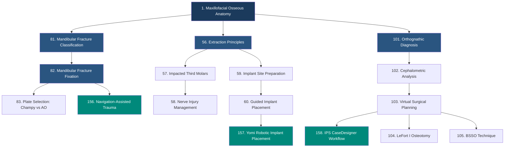

# Learning Graph

A dependency map of 200+ concepts across clinical surgery, technology, and practice operations. Each concept is tagged with its Bloom's Taxonomy level and prerequisite concepts.

---

!!! info "Content Status"
    Full learning graph with 200+ concepts will be generated from the course description using the learning-graph-generator skill. Initial framework below.

---

## Concept Categories

| Category | Scope | Concept Range |
|----------|-------|---------------|
| **Anatomy & Physiology** | Surgical anatomy, neurovascular, biomechanics | 1-25 |
| **Imaging & Diagnostics** | CBCT, CT, MRI, AI-assisted analysis | 26-40 |
| **Anesthesia & Pharmacology** | Sedation, airway, pain management, ERAS | 41-55 |
| **Dentoalveolar & Implants** | Extractions, implant systems, bone grafting | 56-80 |
| **Trauma** | Mandibular, midface, panfacial, soft tissue | 81-100 |
| **Orthognathic & TMJ** | VSP, osteotomies, joint surgery, total joint | 101-120 |
| **Pathology & Oncology** | Cysts, tumors, SCC, reconstruction | 121-140 |
| **Advanced Clinical** | Craniofacial, cosmetic, sleep apnea | 141-155 |
| **Surgical Technology** | Robotics, navigation, 3D printing, AR/VR | 156-175 |
| **Practice Operations** | Billing, coding, compliance, financials | 176-195 |
| **Frontiers** | Regenerative medicine, AI, stem cells, MOC | 196-210 |

---

## Bloom's Taxonomy Distribution

| Level | Target Count | Description |
|-------|-------------|-------------|
| **Remember** | 30 concepts | Recall facts, terminology, classifications |
| **Understand** | 40 concepts | Explain mechanisms, interpret data |
| **Apply** | 50 concepts | Execute procedures, select approaches |
| **Analyze** | 40 concepts | Compare techniques, evaluate evidence |
| **Evaluate** | 30 concepts | Judge appropriateness, assess outcomes |
| **Create** | 20 concepts | Design treatment plans, develop protocols |

---

## Sample Concept Dependencies

---

## Full Concept Table

| ID | Concept | Category | Bloom's Level | Prerequisites | Chapter |
|----|---------|----------|---------------|---------------|---------|
| 1 | Maxillofacial Osseous Anatomy | Anatomy | Remember | None | 1 |
| 2 | Neurovascular Anatomy of the Face | Anatomy | Remember | None | 1 |
| 3 | Fascial Planes and Spaces | Anatomy | Remember | 1, 2 | 1 |
| 4 | Surgical Approaches to the Facial Skeleton | Anatomy | Understand | 1, 2, 3 | 1 |
| 5 | Vascular Territories for Flap Planning | Anatomy | Understand | 2 | 1 |
| ... | ... | ... | ... | ... | ... |

!!! note "Generation Pending"
    The complete 200+ concept table will be generated using the learning-graph-generator skill after the course description is finalized.
